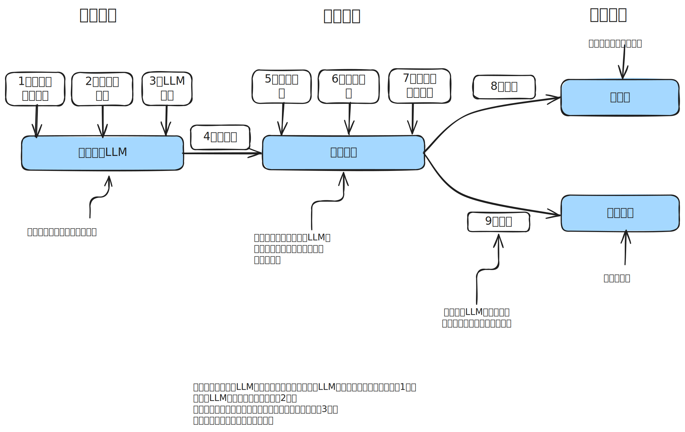

# 前言

我一直对语言模型充满兴趣。十多年前，我通过一门统计模式分类课程开始了我的AI之旅，这促使我完成了第一个独立项目：开发一个模型和网络应用程序，通过歌词来检测歌曲的情绪。

时间来到2022年，随着ChatGPT的发布，大语言模型（LLM）席卷全球，彻底改变了我们许多人的工作方式。这些模型具有极强的通用性，能够帮助完成诸如检查语法、撰写电子邮件、总结冗长文档等任务。这得益于它们解析和生成类人文本的能力，这种能力在从客户服务到内容创作，甚至编程和数据分析等技术领域中都非常重要。

正如它们的名字所暗示的那样，大语言模型（LLM）的一个显著特点是它们“大”——非常大，包含数百万到数十亿的参数。（作为对比，使用更传统的机器学习或统计方法，鸢尾花数据集可以通过仅有两个参数的小模型以超过90%的准确率进行分类。）然而，尽管与更传统的方法相比，LLM的规模庞大，但它们并不一定是一个黑箱。

在这本书中，你将逐步学习如何构建一个大语言模型（LLM）。到最后，你将从根本上理解像ChatGPT中使用的LLM是如何工作的。我相信，对每个基本概念和底层代码的熟练掌握是成功的关键。这不仅有助于修复错误和提高性能，还能让你尝试新的想法。

几年前，当我开始研究LLM时，我不得不通过艰苦的方式学习如何实现它们，翻阅了许多研究论文和不完整的代码库，才逐渐形成了全面的理解。通过这本书，我希望通过开发和分享一个逐步实现的教程，详细介绍LLM的所有主要组件和开发阶段，让LLM变得更加易于理解。

我坚信，理解LLM的最佳方式是从零开始编写一个模型——而且你会发现，这个过程也可以很有趣！

祝你阅读和编码愉快！

# 关于本书

《从零开始构建大语言模型》这本书旨在帮助你从基础开始理解并创建自己的类GPT大语言模型（LLM）。它首先聚焦于处理文本数据的基本原理和编码注意力机制，然后逐步指导你从零开始实现一个完整的GPT模型。书中还涵盖了预训练机制以及针对特定任务（如文本分类和指令跟随）的微调。通过阅读本书，你将深入理解LLM的工作原理，并掌握构建自己模型的技能。虽然你将创建的模型在规模上比大型基础模型小，但它们使用相同的概念，是理解构建最先进LLM的核心机制和技术的强大教育工具。

## 谁应该读本书

《从零开始构建大语言模型》适合机器学习爱好者、工程师、研究人员、学生和从业者阅读，他们希望深入理解大语言模型（LLM）的工作原理，并学习如何从零开始构建自己的模型。无论是初学者还是经验丰富的开发者，都可以利用他们现有的技能和知识来掌握创建LLM所使用的概念和技术。

这本书的独特之处在于它全面涵盖了构建大语言模型（LLM）的整个过程，从处理数据集到实现模型架构、在未标注数据上进行预训练，以及针对特定任务进行微调。截至本书撰写时，还没有其他资源提供如此完整且实践性强的从零开始构建LLM的方法。

要理解本书中的代码示例，你需要扎实掌握Python编程。虽然对机器学习、深度学习和人工智能的一些了解可能有所帮助，但这些领域的深厚背景并非必需。LLM是人工智能中的一个独特子集，因此即使你是该领域的新手，也能够跟上书中的内容。

如果你对深度神经网络有一定经验，可能会发现某些概念更加熟悉，因为LLM正是基于这些架构构建的。然而，熟练使用PyTorch并不是前提条件。附录A提供了PyTorch的简明介绍，帮助你掌握理解本书代码示例所需的技能。

高中水平的数学知识，特别是向量和矩阵的运算，在探索LLM内部工作原理时会有所帮助。然而，掌握本书中呈现的关键概念和思想并不需要高深的数学知识。

最重要的前提条件是扎实的Python编程基础。有了这些知识，你将充分准备好探索LLM的迷人世界，并理解本书中呈现的概念和代码示例。

## 本书是如何组织的：一份路线图

本书的设计是循序渐进的，每一章都建立在前一章介绍的概念和技术之上。全书分为七章，涵盖了大语言模型（LLM）及其实现的关键方面。

第1章对LLM背后的基本概念进行了高层次介绍。它探讨了Transformer架构，这是诸如ChatGPT平台上使用的LLM的基础。

第2章制定了从零开始构建LLM的计划。它涵盖了为LLM训练准备文本的过程，包括将文本分割为单词和子词标记、使用字节对编码进行高级标记化、通过滑动窗口方法采样训练示例，以及将标记转换为输入LLM的向量。

第3章重点介绍LLM中使用的注意力机制。它引入了一个基本的自注意力框架，并逐步发展到增强的自注意力机制。本章还涵盖了因果注意力模块的实现，使LLM能够一次生成一个标记，通过随机丢弃注意力权重来减少过拟合，并将多个因果注意力模块堆叠成多头注意力模块。

第4章专注于编写一个类似GPT的LLM，可以训练其生成类人文本。它涵盖了诸如归一化层激活以稳定神经网络训练、在深度神经网络中添加快捷连接以更有效地训练模型、实现Transformer块以创建不同大小的GPT模型，以及计算GPT模型的参数数量和存储需求等技术。

第5章实现了LLM的预训练过程。它涵盖了计算训练和验证集损失以评估LLM生成文本的质量、实现训练函数并预训练LLM、保存和加载模型权重以继续训练LLM，以及从OpenAI加载预训练权重。

第6章介绍了不同的LLM微调方法。它涵盖了为文本分类准备数据集、修改预训练的LLM以进行微调、微调LLM以识别垃圾邮件，以及评估微调后的LLM分类器的准确性。

第7章探讨了LLM的指令微调过程。它涵盖了为监督指令微调准备数据集、在训练批次中组织指令数据、加载预训练的LLM并微调它以遵循人类指令、提取LLM生成的指令响应以进行评估，以及评估指令微调后的LLM。

## 有关代码

为了方便读者跟随学习，本书中的所有代码示例都可以在Manning网站上找到，网址为[链接](https://www.manning.com/books/build-a-large-language-model-from-scratch)，同时也可以在GitHub上以Jupyter笔记本格式获取，网址为[链接](https://github.com/rasbt/LLM-from-scratch)。不用担心遇到困难——所有代码练习的解答都可以在附录C中找到。

本书包含了许多源代码示例，既有编号的代码清单，也有与正文混合的代码片段。在这两种情况下，源代码都以固定宽度的字体显示，以便与普通文本区分开来。

在许多情况下，原始源代码已经进行了重新格式化；我们添加了换行符并调整了缩进，以适应书中可用的页面空间。在极少数情况下，即使这样也不够，代码清单中会包含行续接标记（➥）。此外，当代码在正文中描述时，源代码中的注释通常会被移除。许多代码清单都附有代码注释，突出显示重要概念。

本书的一个关键目标是易于理解，因此代码示例经过精心设计，可以在普通笔记本电脑上高效运行，无需任何特殊硬件。但如果你有GPU，某些部分会提供有用的提示，帮助你扩展数据集和模型以利用额外的计算能力。

在整本书中，我们将使用PyTorch作为我们的首选张量和深度学习库，从零开始实现LLM。如果你对PyTorch不熟悉，我建议你从附录A开始，它提供了深入的介绍，并包含设置建议。

## liveBook讨论论坛

购买《从零开始构建大语言模型》一书将免费获得访问liveBook的权限，liveBook是Manning的在线阅读平台。通过liveBook的独家讨论功能，你可以在全局范围内或针对特定章节或段落附加评论。你可以轻松地为自己做笔记、提出并回答技术问题，并从作者和其他用户那里获得帮助。要访问论坛，请前往[链接](https://livebook.manning.com/book/build-a-large-language-model-from-scratch/discussion)。你还可以在[链接](https://livebook.manning.com/discussion)了解更多关于Manning论坛及其行为准则的信息。

Manning对读者的承诺是提供一个平台，让个别读者之间以及读者与作者之间能够进行有意义的对话。这并不代表作者会承诺任何特定的参与程度，作者对论坛的贡献仍然是自愿的（且无报酬的）。我们建议你尝试向作者提出一些具有挑战性的问题，以免他的兴趣分散！只要本书仍在印刷中，论坛和以往讨论的存档都可以从出版商的网站上访问。

# 第一章 理解大语言模型

> [!TIP]
> 本章内容包括
>
> - 对大语言模型（LLM）背后基本概念的高层次解释  
> - 对LLM所基于的Transformer架构的深入解析  
> - 从零开始构建LLM的计划

大语言模型（LLM），例如OpenAI的ChatGPT所提供的模型，是过去几年中发展起来的深度神经网络模型。它们为自然语言处理（NLP）开辟了一个新时代。在LLM出现之前，传统方法在分类任务（如电子邮件垃圾邮件分类）和可以通过手工规则或更简单模型捕捉的简单模式识别任务上表现出色。然而，它们在需要复杂理解和生成能力的语言任务中通常表现不佳，例如解析详细指令、进行上下文分析以及创建连贯且上下文适当的原创文本。例如，前几代语言模型无法根据关键词列表写一封电子邮件——这对于当代LLM来说是一项轻而易举的任务。

大语言模型（LLM）在理解、生成和解释人类语言方面具有显著的能力。然而，需要澄清的是，当我们说语言模型“理解”时，我们指的是它们能够以连贯且上下文相关的方式处理和生成文本，而不是它们具有类似人类的意识或理解能力。

得益于深度学习的进步，LLM在大量文本数据上进行了训练。深度学习是机器学习和人工智能（AI）的一个子集，专注于神经网络。与以前的方法相比，这种大规模训练使LLM能够捕捉更深层次的上下文信息和人类语言的微妙之处。因此，LLM在广泛的自然语言处理（NLP）任务中表现出显著提升的性能，包括文本翻译、情感分析、问答等。

当代LLM与早期NLP模型的另一个重要区别在于，早期的NLP模型通常是为特定任务设计的，例如文本分类、语言翻译等。虽然这些早期的NLP模型在它们的狭窄应用中表现出色，但LLM在广泛的NLP任务中展示了更广泛的熟练度。

LLM的成功可以归功于支撑许多LLM的Transformer架构以及LLM训练所使用的大量数据，这使得它们能够捕捉各种语言细微差别、上下文和模式，而这些如果手动编码将会非常具有挑战性。

这种向基于Transformer架构的模型转变，并使用大规模训练数据集来训练LLM的做法，从根本上改变了NLP，为理解和与人类语言交互提供了更强大的工具。

接下来的讨论为实现本书的主要目标奠定了基础：通过逐步编写代码，基于Transformer架构实现一个类似ChatGPT的LLM，从而理解LLM。

## 1.1 什么是LLM？

大语言模型（LLM）是一种神经网络，旨在理解、生成并回应类人文本。这些模型是在大量文本数据上训练的深度神经网络，有时甚至涵盖了互联网上大部分公开可用的文本。

“大语言模型”中的“大”既指模型的参数量，也指其训练所使用的庞大数据集。这类模型通常拥有数百亿甚至数千亿个参数，这些参数是网络中的可调权重，在训练过程中通过优化来预测序列中的下一个词。下一个词的预测是合理的，因为它利用了语言固有的序列性质来训练模型理解上下文、结构以及文本中的关系。然而，这是一个非常简单的任务，因此许多研究人员惊讶于它能产生如此强大的模型。在后续章节中，我们将逐步讨论并实现下一个词的训练过程。

LLM采用了一种称为Transformer的架构，这使得它们在做出预测时能够选择性地关注输入的不同部分，从而使它们特别擅长处理人类语言的细微差别和复杂性。

由于LLM能够生成文本，它们也常被称为生成式人工智能的一种形式，通常缩写为生成式AI或GenAI。如图1.1所示，AI涵盖了更广泛的领域，旨在创建能够执行需要类人智能的任务的机器，包括理解语言、识别模式和做出决策，并包含机器学习和深度学习等子领域。

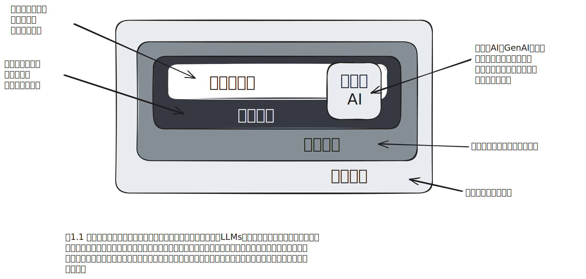

用于实现人工智能的算法是机器学习领域的核心。具体来说，机器学习涉及开发能够从数据中学习并根据数据做出预测或决策的算法，而无需显式编程。为了说明这一点，可以想象垃圾邮件过滤器作为机器学习的一个实际应用。与手动编写规则来识别垃圾邮件不同，机器学习算法被输入标记为垃圾邮件和合法邮件的示例。通过在训练数据集上最小化预测误差，模型学会识别指示垃圾邮件的模式和特征，从而能够将新邮件分类为垃圾邮件或非垃圾邮件。

如图1.1所示，深度学习是机器学习的一个子集，专注于利用三层或更多层的神经网络（也称为深度神经网络）来建模数据中的复杂模式和抽象。与深度学习相比，传统机器学习需要手动特征提取。这意味着人类专家需要识别并选择对模型最相关的特征。

虽然人工智能领域现在主要由机器学习和深度学习主导，但它也包括其他方法——例如，使用基于规则的系统、遗传算法、专家系统、模糊逻辑或符号推理。

回到垃圾邮件分类的例子，在传统机器学习中，人类专家可能会从电子邮件文本中手动提取特征，例如某些触发词（例如“奖品”、“赢”、“免费”）的频率、感叹号的数量、全大写单词的使用或可疑链接的存在。然后，基于这些专家定义的特征创建的数据集将用于训练模型。与传统机器学习不同，深度学习不需要手动特征提取。这意味着人类专家不需要为深度学习模型识别和选择最相关的特征。（然而，无论是传统机器学习还是深度学习的垃圾邮件分类，仍然需要收集标签，例如垃圾邮件或非垃圾邮件，这些标签需要由专家或用户收集。）

接下来，让我们看看LLM如今可以解决哪些问题，LLM应对的挑战，以及我们稍后将实现的一般LLM架构。

## 1.2 LLM的应用

由于其解析和理解非结构化文本数据的高级能力，LLM在各个领域具有广泛的应用。如今，LLM被用于机器翻译、生成新颖文本（见图1.2）、情感分析、文本摘要以及许多其他任务。最近，LLM还被用于内容创作，例如撰写小说、文章，甚至计算机代码。

LLM还可以为复杂的聊天机器人和虚拟助手提供支持，例如OpenAI的ChatGPT或Google的Gemini（以前称为Bard），它们可以回答用户查询并增强传统搜索引擎，如Google搜索或Microsoft Bing。此外，LLM可用于从医学或法律等专业领域的大量文本中进行有效的知识检索。这包括筛选文档、总结冗长的段落以及回答技术问题。

简而言之，LLM对于自动化几乎任何涉及解析和生成文本的任务都是无价的。它们的应用几乎是无限的，随着我们不断创新和探索使用这些模型的新方法，很明显，LLM有潜力重新定义我们与技术的关系，使其更具对话性、直观性和可访问性。

我们将专注于从基础开始理解LLM的工作原理，编写一个能够生成文本的LLM。你还将学习使LLM能够执行查询的技术，包括回答问题、总结文本、将文本翻译成不同语言等。换句话说，你将通过逐步构建一个复杂的LLM助手（如ChatGPT）来了解它们的工作原理。

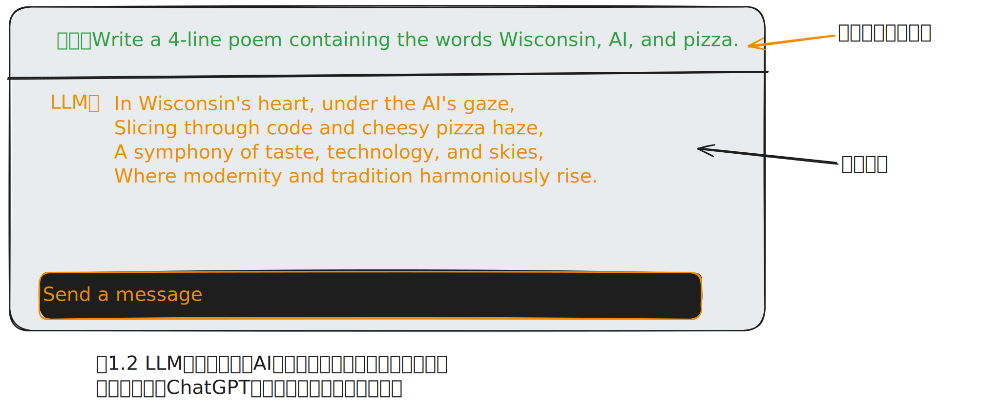

## 1.3 构建和使用LLM的各个阶段

为什么我们应该构建自己的LLM？从零开始编写LLM是理解其机制和局限性的绝佳练习。此外，它还为我们提供了预训练或微调现有开源LLM架构以适应我们自己的领域特定数据集或任务所需的知识。

> [!NOTE]
> 如今，大多数LLM都是使用PyTorch深度学习库实现的，这也是我们将要使用的工具。读者可以在附录A中找到关于PyTorch的全面介绍。

研究表明，在建模性能方面，定制构建的LLM——即为特定任务或领域量身定制的模型——可以超越通用LLM，例如ChatGPT提供的那些设计用于广泛应用的模型。这些例子包括专门用于金融的BloombergGPT和针对医学问答量身定制的LLM（更多细节见附录B）。

使用定制构建的LLM具有多个优势，尤其是在数据隐私方面。例如，出于保密考虑，公司可能更倾向于不与OpenAI等第三方LLM提供商共享敏感数据。此外，开发较小的定制LLM能够直接在客户设备（如笔记本电脑和智能手机）上部署，这正是苹果等公司目前正在探索的方向。这种本地实现可以显著降低延迟并减少与服务器相关的成本。此外，定制LLM为开发者提供了完全的自主权，使他们能够根据需要控制模型的更新和修改。

创建LLM的一般过程包括预训练和微调。“预训练”中的“预”指的是初始阶段，在这个阶段中，像LLM这样的模型在大型多样化的数据集上进行训练，以形成对语言的广泛理解。然后，这个预训练模型作为基础资源，可以通过微调进一步优化。微调是一个过程，模型在更窄的、更特定于特定任务或领域的数据集上进行专门训练。这种由预训练和微调组成的两阶段训练方法如图1.3所示。

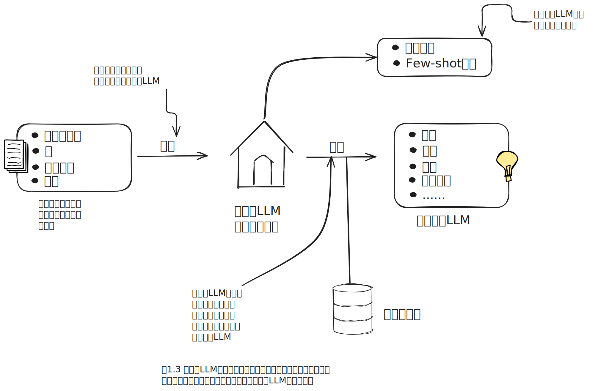

创建LLM的第一步是在大型文本数据语料库（有时称为原始文本）上对其进行训练。这里的“原始”指的是这些数据只是常规文本，没有任何标签信息。（可能会进行过滤，例如删除格式字符或未知语言的文档。）

> [!NOTE]
> 具有机器学习背景的读者可能会注意到，传统机器学习模型和通过传统监督学习范式训练的深度神经网络通常需要标签信息。然而，对于LLM的预训练阶段来说，情况并非如此。在这个阶段，LLM使用自监督学习，模型从输入数据中生成自己的标签。

LLM的第一个训练阶段也称为预训练，生成初始的预训练LLM，通常称为基础或基础模型。此类模型的一个典型例子是GPT-3模型（ChatGPT提供的原始模型的前身）。该模型能够进行文本补全——即完成用户提供的半写句子。它还具有有限的少样本能力，这意味着它可以基于仅有的几个示例学习执行新任务，而不需要大量的训练数据。

在通过大型文本数据集训练获得预训练的LLM（其中LLM被训练为预测文本中的下一个单词）后，我们可以在标注数据上进一步训练LLM，也称为微调。

微调LLM的两大流行类别是指令微调和分类微调。在指令微调中，标注数据集由指令和答案对组成，例如伴随正确翻译文本的翻译文本查询。在分类微调中，标注数据集由文本和相关的类别标签组成——例如，与“垃圾邮件”和“非垃圾邮件”标签相关的电子邮件。

我们将涵盖预训练和微调LLM的代码实现，并将在预训练基础LLM后深入探讨指令微调和分类微调的具体细节。

## 1.4 Transformer架构简介

大多数现代LLM依赖于transformer架构，这是一种在2017年论文[Attention Is All You Need](https://arxiv.org/abs/1706.03762)中提出的深度神经网络架构。要理解LLM，我们必须理解最初的transformer，它是为机器翻译开发的，将英语文本翻译成德语和法语。图1.4展示了transformer架构的简化版本。

transformer架构由两个子模块组成：编码器和解码器。编码器模块处理输入文本并将其编码为一系列捕捉输入上下文信息的数值表示或向量。然后，解码器模块接收这些编码向量并生成输出文本。例如，在翻译任务中，编码器会将源语言的文本编码为向量，而解码器会将这些向量解码以生成目标语言的文本。编码器和解码器都由许多层组成，这些层通过所谓的自注意力机制连接。你可能对输入如何预处理和编码有许多疑问。这些将在后续章节的逐步实现中得到解答。

transformer和LLM的一个关键组成部分是自注意力机制（未显示），它允许模型权衡序列中不同单词或标记的相对重要性。这种机制使模型能够捕捉输入数据中的长距离依赖关系和上下文关系，增强其生成连贯且上下文相关的输出的能力。然而，由于其复杂性，我们将进一步的解释推迟到第3章，在那里我们将逐步讨论和实现它。

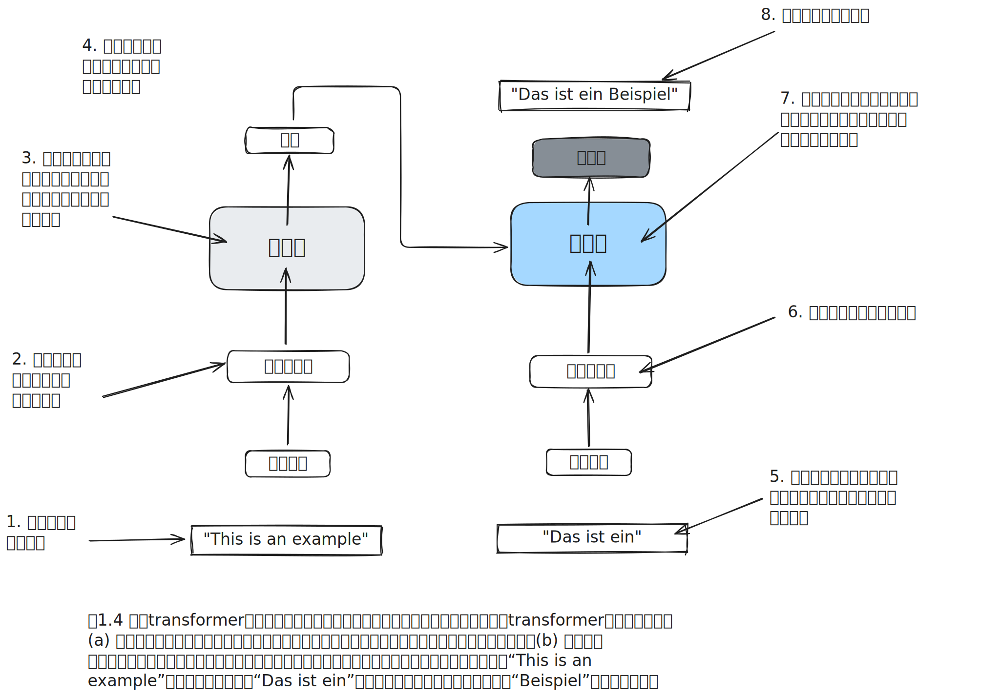

后来的transformer架构变体，如BERT（来自transformer的双向编码器表示的缩写）和各种GPT模型（生成式预训练transformer的缩写），基于这一概念对该架构进行了调整，以适用于不同的任务。如果有兴趣，请参阅附录B以获取进一步的阅读建议。

BERT基于原始transformer的编码器子模块构建，其训练方法与GPT不同。虽然GPT设计用于生成任务，但BERT及其变体专注于掩码词预测，即模型预测给定句子中被掩码或隐藏的单词，如图1.5所示。这种独特的训练策略使BERT在文本分类任务（包括情感预测和文档分类）中表现出色。作为其能力的应用，截至撰写本文时，X（前身为Twitter）使用BERT来检测有毒内容。

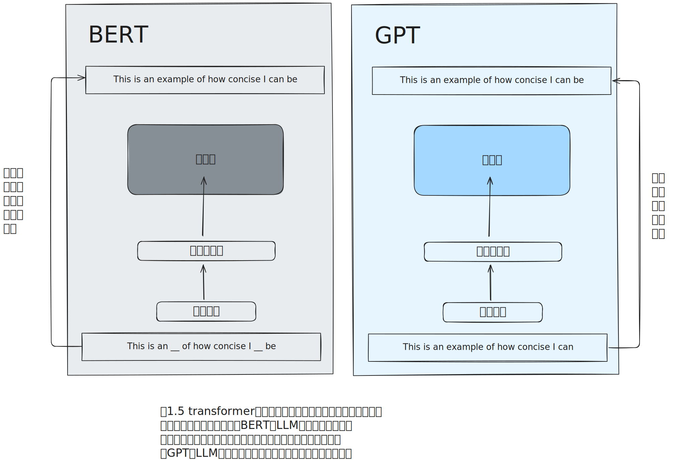

另一方面，GPT专注于原始transformer架构的解码器部分，设计用于需要生成文本的任务。这包括机器翻译、文本摘要、小说创作、编写计算机代码等。

GPT模型主要设计和训练用于执行文本补全任务，同时也展示了其能力的显著多样性。这些模型擅长执行零样本学习和少样本学习任务。零样本学习指的是能够泛化到完全未见过的任务，而无需任何先前的具体示例。另一方面，少样本学习涉及从用户提供的最小数量的示例中学习，如图1.6所示。

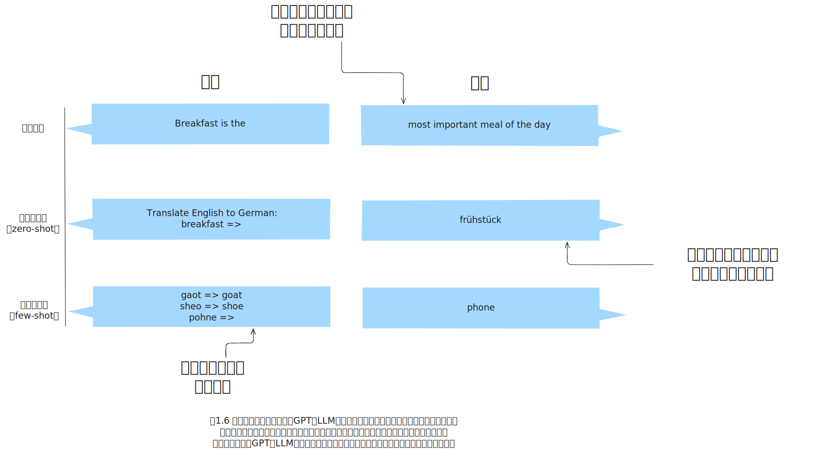

> [!NOTE]
> Transformers vs. LLM
>
> 当今的LLM基于transformer架构。因此，在文献中，transformers和LLM这两个术语经常被用作同义词。然而，需要注意的是，并非所有的transformer都是LLM，因为transformer也可以用于计算机视觉。此外，并非所有的LLM都是transformer，因为有些LLM基于循环和卷积架构。这些替代方法的主要动机是提高LLM的计算效率。这些替代的LLM架构是否能够与基于transformer的LLM的能力相媲美，以及它们是否会在实践中被采用，仍有待观察。为简单起见，我使用术语“LLM”来指代类似于GPT的基于transformer的LLM。（感兴趣的读者可以在附录B中找到描述这些架构的文献参考。）

## 1.5 使用大型数据集

流行的类似GPT和BERT模型的大型训练数据集代表了多样且全面的文本语料库，包含数十亿单词，涵盖了广泛的主题以及自然语言和计算机语言。为了提供一个具体的例子，表1.1总结了用于预训练GPT-3的数据集，该数据集是ChatGPT第一版本的基础模型。

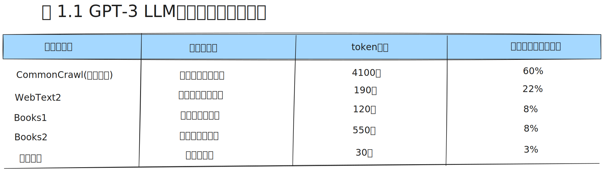

表1.1报告了token的数量，其中token是模型读取的文本单位，数据集中的token数量大致相当于文本中的单词和标点符号的数量。第2章将讨论tokenization，即将文本转换为token的过程。

主要结论是，这种训练数据集的规模和多样性使这些模型能够在各种任务上表现良好，包括语言语法、语义和上下文，甚至是一些需要常识的任务。

> [!NOTE]
> GPT-3数据集详情
>
> 表1.1展示了用于GPT-3的数据集。表中的比例列汇总了采样数据的100%，并针对四舍五入误差进行了调整。尽管“token数量”列中的子集总计为4990亿token，但模型仅训练了3000亿token。GPT-3论文的作者未说明为何未对所有4990亿token进行训练。
>
> 作为背景，可以参考CommonCrawl数据集的规模，该数据集单独包含4100亿token，需要约570 GB的存储空间。相比之下，GPT-3的后续迭代模型（如Meta的LLaMA）扩展了其训练范围，增加了额外的数据源，如Arxiv研究论文（92 GB）和StackExchange的代码相关问答（78 GB）。
>
> GPT-3论文的作者未公开训练数据集，但一个可公开获得的类似数据集是Dolma：一个包含3万亿token的开放语料库，用于LLM预训练研究，由[Soldaini等人（2024）](https://arxiv.org/abs/2402.00159)发布。然而，该集合可能包含受版权保护的作品，具体使用条款可能取决于预期用途和国家。

这些模型的预训练性质使其在下游任务的进一步微调中表现出极强的通用性，这也是它们被称为基础或基础模型的原因。预训练LLM需要访问大量资源，并且非常昂贵。例如，GPT-3的预训练成本估计为460万美元，[以云计算信用额度计算](https://mng.bz/VxEW)。

好消息是，许多预训练的LLM作为开源模型可用，可以用作通用工具来编写、提取和编辑未包含在训练数据中的文本。此外，LLM可以在特定任务上使用相对较小的数据集进行微调，从而减少所需的计算资源并提高性能。

我们将实现预训练代码，并用于教育目的预训练一个LLM。所有计算均可在消费级硬件上执行。在实现预训练代码后，我们将学习如何重用公开可用的模型权重并将其加载到我们将实现的架构中，从而在微调LLM时跳过昂贵的预训练阶段。

## 1.6 近距离看一下GPT架构

GPT最初由OpenAI的Radford等人在论文[《通过生成式预训练提高语言理解能力》](https://mng.bz/x2qg)中提出。GPT-3是该模型的扩展版本，具有更多参数，并在更大的数据集上进行了训练。此外，ChatGPT中提供的原始模型是通过在大型指令数据集上使用[OpenAI的InstructGPT论文](https://arxiv.org/abs/2203.02155)中的方法对GPT-3进行微调而创建的。如图1.6所示，这些模型是强大的文本补全模型，并且可以执行其他任务，如拼写纠正、分类或语言翻译。考虑到GPT模型是在相对简单的下一个单词预测任务上进行预训练的（如图1.7所示），这一点实际上非常引人注目。

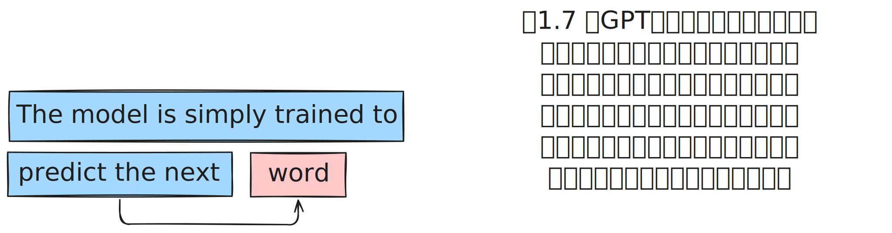

下一个单词预测任务是一种自监督学习形式，属于自我标注的一种。这意味着我们不需要为训练数据显式地收集标签，而是可以利用数据本身的结构：我们可以使用句子或文档中的下一个单词作为模型需要预测的标签。由于这种下一个单词预测任务允许我们“动态”创建标签，因此可以使用大规模未标注的文本数据集来训练LLM。

与我们在1.4节中介绍的原始transformer架构相比，GPT的通用架构相对简单。本质上，它只是没有编码器的解码器部分（图1.8）。由于像GPT这样的解码器模型通过逐个单词预测文本来生成文本，因此它们被视为一种自回归模型。自回归模型将之前的输出作为未来预测的输入。因此，在GPT中，每个新单词的选择都基于其前面的序列，这提高了生成文本的连贯性。

GPT-3等架构也比原始transformer模型大得多。例如，原始transformer重复了编码器和解码器块六次，而GPT-3共有96个transformer层和1750亿个参数。

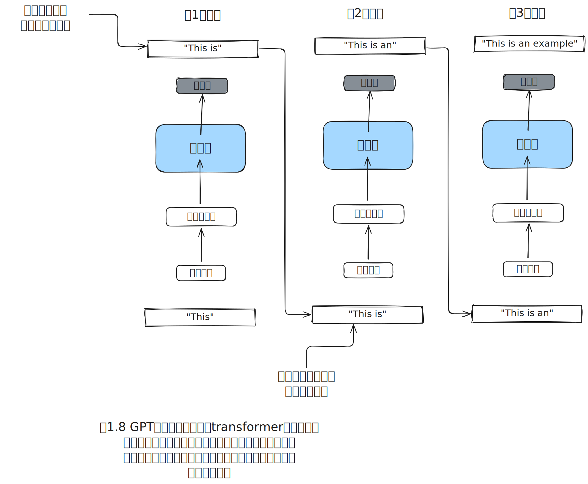

GPT-3于2020年发布，按照深度学习和大语言模型发展的标准，这已经是很久以前的事情了。然而，更新的架构，如Meta的Llama模型，仍然基于相同的核心概念，仅引入了少量修改。因此，理解GPT仍然至关重要，所以我专注于实现GPT背后的重要架构，同时提供其他LLM采用的特定调整的指引。

尽管由编码器和解码器块组成的原始transformer模型是专门为语言翻译设计的，但GPT模型——尽管其更大但更简单的仅解码器架构旨在进行下一个单词预测——也能够执行翻译任务。这种能力最初出乎研究人员的意料，因为它来自一个主要训练于下一个单词预测任务的模型，而该任务并未专门针对翻译。

执行模型未明确训练过的任务的能力被称为涌现行为。这种能力在训练期间并未明确教授，而是作为模型在多样化语境中接触大量多语言数据的自然结果而涌现。GPT模型能够“学习”语言之间的翻译模式并执行翻译任务，尽管它们并未专门为此进行训练，这展示了这些大规模生成式语言模型的优势和能力。我们可以在不使用多个不同模型的情况下执行多样化的任务。

## 1.7 构建一个大语言模型

既然我们已经为理解LLM奠定了基础，接下来让我们从头开始编写一个LLM。我们将以GPT背后的核心理念为蓝图，并按照图1.9中概述的三个阶段来完成这一任务。

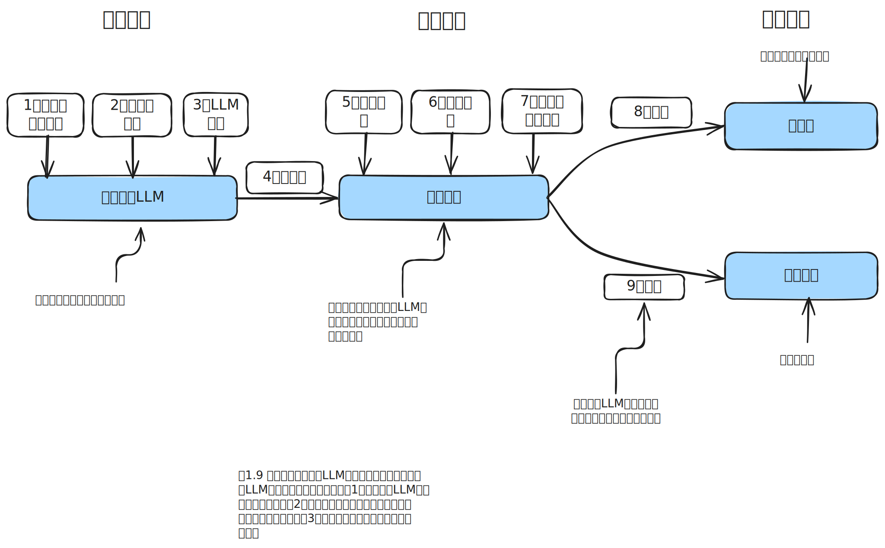

在阶段1中，我们将学习基本的数据预处理步骤，并编写每个LLM核心的注意力机制代码。接下来，在阶段2中，我们将学习如何编写和预训练一个类似GPT的LLM，使其能够生成新文本。我们还将讨论评估LLM的基础知识，这对于开发强大的NLP系统至关重要。

从头开始预训练一个LLM是一项艰巨的任务，对于类似GPT的模型来说，可能需要花费数十万到数百万美元的计算成本。因此，阶段2的重点是使用小型数据集实现教育目的的训练。此外，我还提供了加载公开可用模型权重的代码示例。

最后，在阶段3中，我们将采用一个预训练的LLM，并对其进行微调，以执行诸如回答问题或分类文本等指令——这是许多实际应用和研究中最常见的任务。

希望您期待踏上这段激动人心的旅程！

## 总结

- LLM彻底改变了自然语言处理领域，该领域以前主要依赖显式的基于规则的系统和更简单的统计方法。LLM的出现引入了新的深度学习方法，推动了人类语言理解、生成和翻译的进步。  
- 现代LLM的训练分为两个主要步骤：
    - 首先，它们通过预测句子中的下一个单词作为标签，在大量未标注文本上进行预训练。  
    - 然后，它们在较小的标注目标数据集上进行微调，以遵循指令或执行分类任务。  
- LLM基于transformer架构。transformer架构的核心思想是注意力机制，它使LLM在逐字生成输出时能够选择性地访问整个输入序列。  
- 原始transformer架构由用于解析文本的编码器和用于生成文本的解码器组成。  
- 用于生成文本和遵循指令的LLM（如GPT-3和ChatGPT）仅实现了解码器模块，从而简化了架构。  
- 由数十亿单词组成的大型数据集对于LLM的预训练至关重要。  
- 虽然类似GPT模型的通用预训练任务是预测句子中的下一个单词，但这些LLM表现出涌现特性，例如分类、翻译或总结文本的能力。  
- 一旦LLM完成预训练，所得的基础模型可以更高效地针对各种下游任务进行微调。  
- 在自定义数据集上微调的LLM在特定任务上可以优于通用LLM。

# 第二章 处理文本数据

> [!TIP]
> 本章包含以下内容
>
> - 为大语言模型的训练准备文本数据
> - 将文本分割成单词token和子单词token
> - 字节对编码（Byte pair encoding, bpe）作为对文本分词的更高级的方法
> - 使用滑动窗口对训练数据进行采样
> - 将token转换成向量，然后输入到大语言模型中！

到目前为止，我们已经介绍了大语言模型（LLM）的通用结构，并了解到它们是在大量文本上进行预训练的。具体来说，我们的重点是基于transformer架构的仅解码器LLM，这是ChatGPT和其他类似GPT的LLM模型的基础。

在预训练阶段，LLM逐字处理文本。通过使用下一个单词预测任务训练具有数百万到数十亿参数的LLM，可以生成具有强大能力的模型。这些模型可以进一步微调以遵循通用指令或执行特定的目标任务。但在我们实现和训练LLM之前，我们需要准备训练数据集，如图2.1所示。

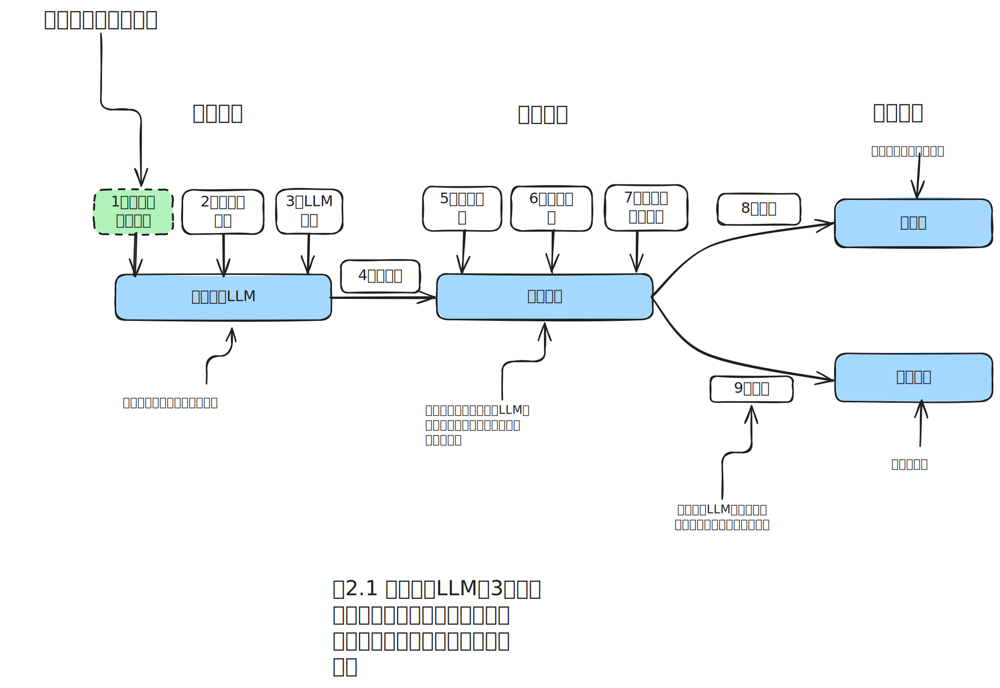

你将学习如何为训练LLM准备输入文本。这包括将文本拆分为单个单词和子词标记，然后将它们编码为LLM的向量表示。你还将学习高级的分词方案，例如字节对编码（BPE），这种方案被GPT等流行的LLM所采用。最后，我们将实现一种采样和数据加载策略，以生成训练LLM所需的输入-输出对。

## 2.1 理解词嵌入（word embeddings）

深度神经网络模型（包括LLM）无法直接处理原始文本。由于文本是类别数据，它与用于实现和训练神经网络的数学运算不兼容。因此，我们需要一种将单词表示为连续值向量的方法。

> [!NOTE]
> 不熟悉计算环境中向量和张量的读者可以在附录A的A.2.2节中了解更多相关内容。

将数据转换为向量格式的概念通常被称为嵌入（embedding）。通过使用特定的神经网络层或其他预训练的神经网络模型，我们可以嵌入不同类型的数据——例如视频、音频和文本，如图2.2所示。然而，需要注意的是，不同的数据格式需要不同的嵌入模型。例如，为文本设计的嵌入模型并不适合嵌入音频或视频数据。

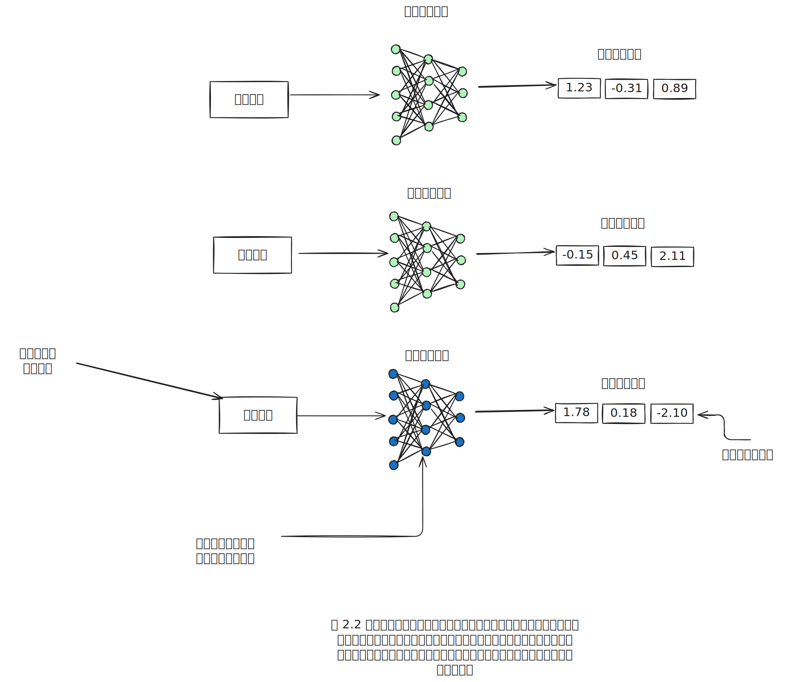

嵌入的核心是将离散对象（如单词、图像甚至整个文档）映射到连续向量空间中的点——嵌入的主要目的是将非数值数据转换为神经网络可以处理的格式。

虽然词嵌入是文本嵌入最常见的形式，但也有针对句子、段落或整个文档的嵌入。句子或段落嵌入是检索增强生成的流行选择。检索增强生成将生成（如生成文本）与检索（如搜索外部知识库）结合起来，在生成文本时提取相关信息，这是一种超出本书范围的技术。由于我们的目标是训练类似 GPT 的LLMs，它学会逐字生成文本，因此我们将专注于词嵌入。

已开发出多种算法和框架用于生成词嵌入。较早且最流行的例子之一是 Word2Vec 方法。Word2Vec 通过训练神经网络架构，在给定目标词的情况下预测上下文或反之，来生成词嵌入。Word2Vec 背后的主要思想是，出现在相似上下文中的词往往具有相似的含义。因此，当将词嵌入投影到二维空间以进行可视化时，相似的词汇会聚集在一起，如图 2.3 所示。

词嵌入可以具有不同的维度，从一到数千。更高的维度可能捕捉到更细微的关系，但会以计算效率为代价。

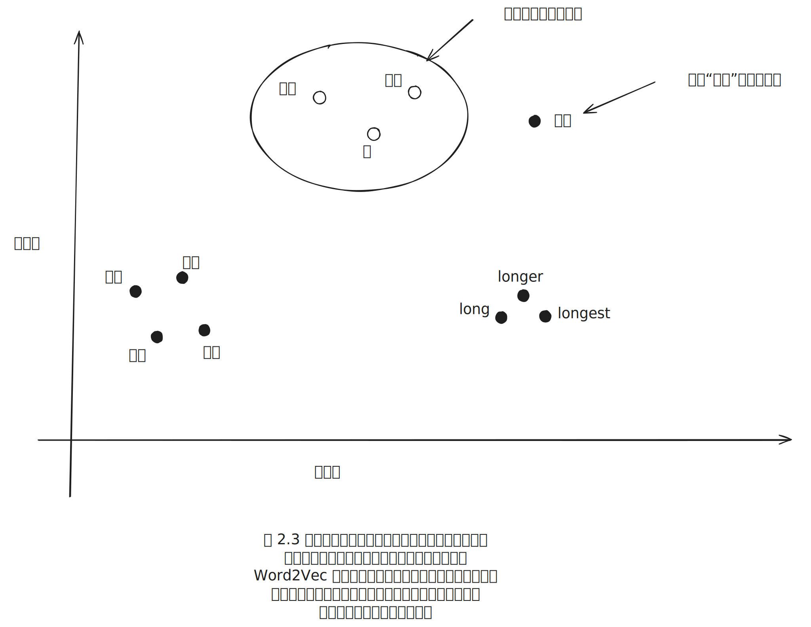

虽然我们可以使用诸如 Word2Vec 这样的预训练模型来为机器学习模型生成嵌入，但LLM通常会生成自己的嵌入，这些嵌入是输入层的一部分，并在训练过程中更新。与使用 Word2Vec 相比，将嵌入作为LLM训练的一部分进行优化的优势在于，嵌入是针对特定任务和手头的数据进行优化的。我们将在本章后面实现这样的嵌入层。（LLM也可以创建上下文相关的输出嵌入，正如我们在第 3 章中讨论的那样。）

不幸的是，高维嵌入对可视化提出了挑战，因为我们的感官感知和常见的图形表示本质上仅限于三维或更少，这就是为什么图 2.3 展示了二维散点图中的二维嵌入。然而，在处理LLM时，我们通常使用维度更高的嵌入。对于 GPT-2 和 GPT-3，嵌入大小（通常称为模型隐藏状态的维度）根据具体模型变体和大小而变化。这是在性能和效率之间的权衡。最小的 GPT-2 模型（117M 和 125M 参数）使用 768 维的嵌入大小作为具体示例。最大的 GPT-3 模型（175B 参数）使用 12,288 维的嵌入大小。

接下来，我们将逐步介绍准备LLM所用嵌入所需的步骤，包括将文本拆分为单词、将单词转换为标记，以及将标记转化为嵌入向量。

## 2.2 对文本进行分词

让我们讨论如何将输入文本分割成单独的标记，这是为LLM创建嵌入所需的预处理步骤。这些标记可以是单个单词或特殊字符，包括标点符号，如图 2.4 所示。

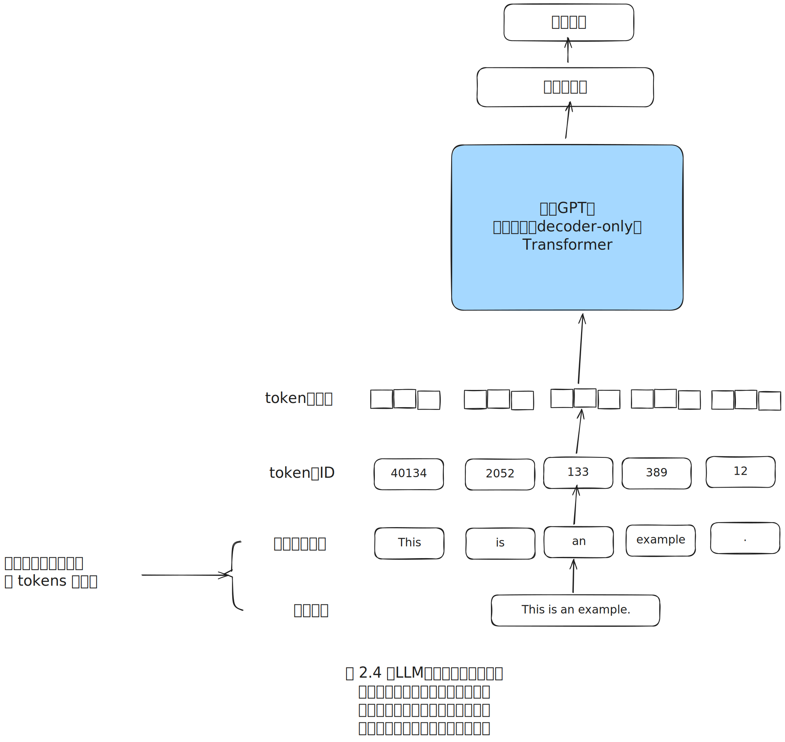

我们将为LLM训练进行分词的文本是 Edith Wharton 的短篇小说《The Verdict》，该作品已进入公共领域，因此可以用于LLM训练任务。文本可在 Wikisource 上获取，网址为[链接](https://en.wikisource.org/wiki/The_Verdict)，您可以将其复制并粘贴到文本文件中，我已复制并将文本保存到名为“the-verdict.txt”的文本文件中。

或者，您可以在本书的 GitHub 仓库中找到“the-verdict.txt”文件，地址为 https://mng.bz/Adng。您可以使用以下 Python 代码下载该文件：

```py
import urllib.request
utl = ("https://raw.githubusercontent.com/rasbt/"
       "LLM-from-scratch/main/ch02/01_main-chapter-code/"
       "the-verdict.txt")
file_path = "the-verdict.txt"
urllib.request.urlretrieve(url, file_path)
```

接下来，我们可以使用 Python 的标准文件读取工具加载 the-verdict.txt 文件。

> [!NOTE]
> **代码清单 2.1** 将短篇小说作为文本样本读入 Python
> ```py
> with open("the-verdict.txt", "r", encoding="utf-8") as f:
>     raw_text = f.read()
> print("Total number of character:", len(raw_text))
> print(raw_text[:99])
> ```

print 命令打印出字符总数，接着为了说明目的输出该文件的前 100 个字符：

> Total number of character: 20479
> I HAD always thought Jack Gisburn rather a cheap genius--though a good fellow enough--so it was no


我们的目标是将这篇 20,479 字符的短篇小说标记化为单独的单词和特殊字符，以便我们可以将其转换为LLM训练的嵌入。

> [!NOTE]
> 注意 在使用LLMs时，通常会处理数百万篇文章和数十万本书——总计许多 GB 的文本。然而，出于教育目的，使用较小的文本样本（如单本书）足以展示文本处理步骤背后的主要思想，并使其在消费者硬件上能够在合理的时间内运行。

我们如何最好地分割这段文本以获得一个标记列表？为此，我们进行一个小探索，并使用 Python 的正则表达式库 re 进行说明。（你不需要学习或记忆任何正则表达式语法，因为我们稍后将转向使用预构建的分词器。）

使用一些简单的示例文本，我们可以使用 `re.split` 命令和以下语法来根据空白字符拆分文本：

```py
import re
text = "Hello, world. This, is a test."
result = re.split(r'(\s)', text)
print(result)
```

结果是一个由单独单词、空白字符和标点符号组成的列表：

```py
['Hello,', ' ', 'world.', ' ', 'This,', ' ', 'is', ' ', 'a', ' ', 'test.']
```

这种简单的分词方案大体上能将示例文本分割成单个单词；然而，有些单词仍与标点符号相连，我们希望它们作为独立的列表项。我们还避免将所有文本转为小写，因为大写有助于LLMs区分专有名词和普通名词，理解句子结构，并学会生成正确大小写的文本。

让我们修改正则表达式，使其在空白字符（\s）、逗号和句点（[,.]）处进行分割：

```py
result = re.split(r'([,.]|\s)', text)
print(result)
```

我们可以看到单词和标点符号现在已按我们的意愿分开为列表条目：

```py
['Hello', ',', '', ' ', 'world', '.', '', ' ', 'This', ',', '', ' ', 'is', ' ', 'a', ' ', 'test', '.', '']
```

剩下的小问题是列表中仍包含空白字符。可选地，我们可以安全地移除这些冗余字符，如下所示：

```py
result = [item for item in result if item.strip()]
print(result)
```

生成的去空格输出如下所示：

```py
['Hello', ',', 'world', '.', 'This', ',', 'is', 'a', 'test', '.']
```

> [!NOTE]
> 在开发简单的分词器时，是否将空白字符编码为单独的字符还是直接删除它们，取决于我们的应用及其需求。删除空白字符可以减少内存和计算需求。然而，如果我们训练的模型对文本的精确结构敏感（例如，对缩进和间距敏感的 Python 代码），保留空白字符可能是有用的。在这里，为了简化并使分词的输出更简洁，我们删除了空白字符。稍后，我们将切换到包含空白字符的分词方案。

我们在此设计的标记化方案在简单样本文本上表现良好。让我们进一步修改它，使其还能处理其他类型的标点符号，如问号、引号，以及我们在伊迪丝·华顿短篇小说的前 100 个字符中见过的双破折号，以及更多特殊字符：

```py
text = "Hello, world. Is this-- a test?"
result = re.split(r'([,.:;?_!"()\']|--|\s)', text)
result = [item.strip() for item in result if item.strip()]
print(result)
```

结果是：

```py
['Hello', ',', 'world', '.', 'Is', 'this', '--', 'a', 'test', '?']
```

正如我们基于图 2.5 总结的结果所见，我们的分词方案现在能够成功处理文本中的各种特殊字符。

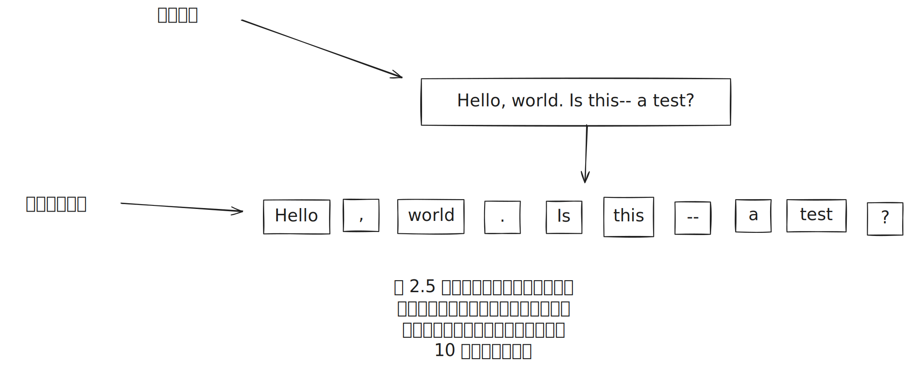

既然我们有了一个基础的分词器，就让我们将其应用于伊迪丝·沃顿的整个短篇小说吧：

```py
preprocessed = re.split(r'([,.:;?_!"()\']|--|\s)', raw_text)
preprocessed = [item.strip() for item in preprocessed if item.strip()]
print(len(preprocessed))
```

此打印语句输出 4690，即此文本中的 token 数量（不含空格）。让我们打印前 30 个 token 以便快速视觉检查：

```py
print(preprocessed[:30])
```

结果表明，我们的分词器似乎很好地处理了文本，因为所有单词和特殊字符都被整齐地分开了：

```py
['I', 'HAD', 'always', 'thought', 'Jack', 'Gisburn', 'rather', 'a',
'cheap', 'genius', '--', 'though', 'a', 'good', 'fellow', 'enough',
'--', 'so', 'it', 'was', 'no', 'great', 'surprise', 'to', 'me', 'to',
'hear', 'that', ',', 'in']
```

## 2.3 将 token 转换为 token ID

接下来，让我们将这些标记从 Python 字符串转换为整数表示，以生成标记 ID。在将标记 ID 转换为嵌入向量之前，此转换是一个中间步骤。

要将先前生成的 tokens 映射为 token ID，我们首先需要构建一个词汇表。该词汇表定义了如何将每个独特的单词和特殊字符映射到一个唯一的整数，如图 2.6 所示。

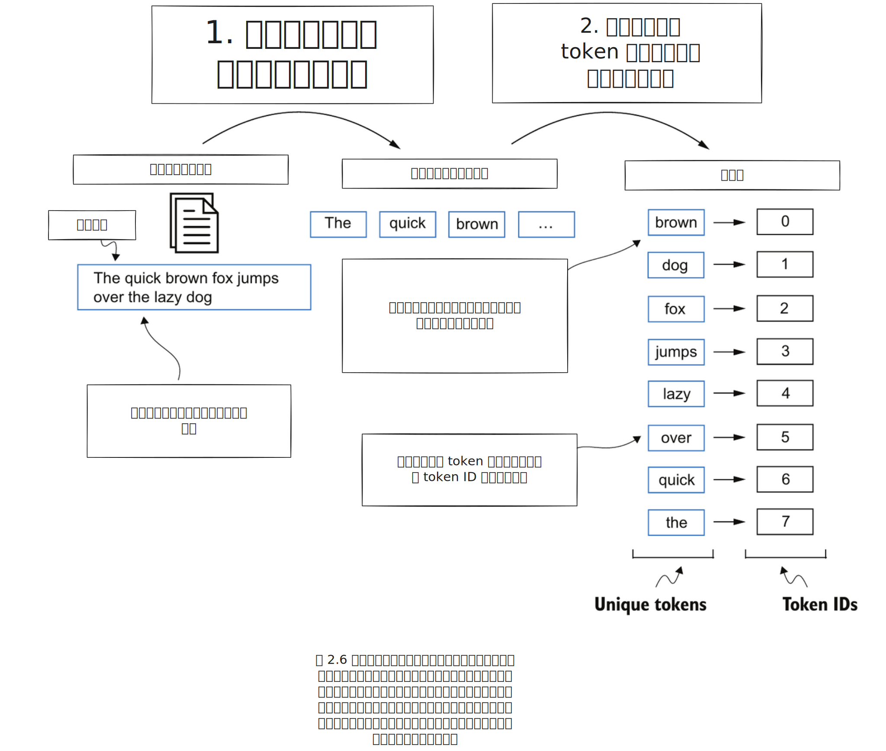

现在我们已经将伊迪丝·华顿的短篇小说进行了分词，并将其赋值给一个名为 `preprocessed` 的 Python 变量，接下来让我们创建一个包含所有唯一标记的列表，并按字母顺序排序，以确定词汇量：

```py
all_words = sorted(set(preprocessed))
vocab_size = len(all_words)
print(vocab_size)
```

通过这段代码确定词汇表大小为 1,130 后，我们创建了词汇表并打印了前 51 个条目作为示例。

> [!NOTE]
> **代码清单 2.2** 创建词汇表
> ```py
> vocab = {token:integer for integer,token in enumerate(all_words)}
> for i, item in enumerate(vocab.items()):
>     print(item)
>     if i >= 50:
>        break
> ```

输出是

```
('!', 0)
('"', 1)
("'", 2)
...
('Her', 49)
('Hermia', 50)
```

我们可以看到，字典中包含与唯一整数标签相关联的单个标记。我们的下一个目标是应用这个词汇表将新文本转换为标记 ID（图 2.7）。

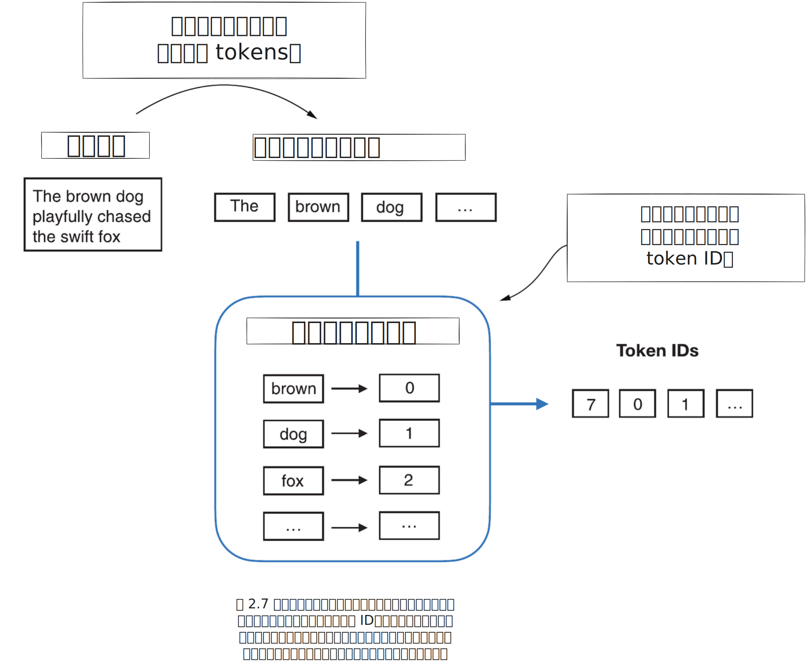

当我们想要将LLM的输出从数字转换回文本时，需要一种将标记 ID 转换为文本的方法。为此，我们可以创建一个词汇表的逆版本，将标记 ID 映射回相应的文本标记。

让我们在 Python 中实现一个完整的 tokenizer 类，其中包含一个 encode 方法，该方法将文本分割成 tokens，并通过词汇表执行字符串到整数的映射以生成 token ID。此外，我们还将实现一个 decode 方法，该方法执行反向的整数到字符串映射，将 token ID 转换回文本。以下代码展示了这个 tokenizer 的实现。

> [!NOTE]
> **代码清单 2.3** 实现一个简单的文本分词器
> ```py
> class SimpleTokenizerV1:
>     def __init__(self, vocab):
>         # 将词汇表存储为类属性，以便在编码和解码方法中访问
>         self.str_to_int = vocab
>         # 创建一个反向词汇表，将标记 ID 映射回原始文本标记
>         self.int_to_str = {i:s for s,i in vocab.items()}
> 
>     # 将输入文本转换成token IDs
>     def encode(self, text):
>         preprocessed = re.split(r'([,.?_!"()\']|--|\s)', text)
>         preprocessed = [item.strip() for item in preprocessed if item.strip()]
>         ids = [self.str_to_int[s] for s in preprocessed]
>         return ids
> 
>     # 将token IDs转换回文本
>     def decode(self, ids):
>         text = " ".join([self.int_to_str[i] for i in ids])
>         # 去除一些特殊分隔符前面的空格
>         text = re.sub(r'\s+([,.?!"()\'])', r'\1', text)
>         return text
> ```

使用 SimpleTokenizerV1 Python 类，我们现在可以通过现有的词汇表实例化新的分词器对象，然后可以使用这些对象来编码和解码文本，如图 2.8 所示。

让我们从 SimpleTokenizerV1 类实例化一个新的分词器对象，并使用伊迪丝·华顿的短篇故事中的一段文本来进行实际测试：

```py
tokenizer = SimpleTokenizerV1(vocab)
text = """"It's the last he painted, you know,"
       Mrs. Gisburn said with pardonable pride."""
ids = tokenizer.encode(text)
print(ids)
```

前面的代码打印了以下 token ID：

```py
[1, 56, 2, 850, 988, 602, 533, 746, 5, 1126, 596, 5, 1, 67, 7, 38, 851, 1108,
754, 793, 7]
```

接下来，我们看看是否可以使用`decode`方法将这些 token ID 转换回文本：

```py
print(tokenizer.decode(ids))
```

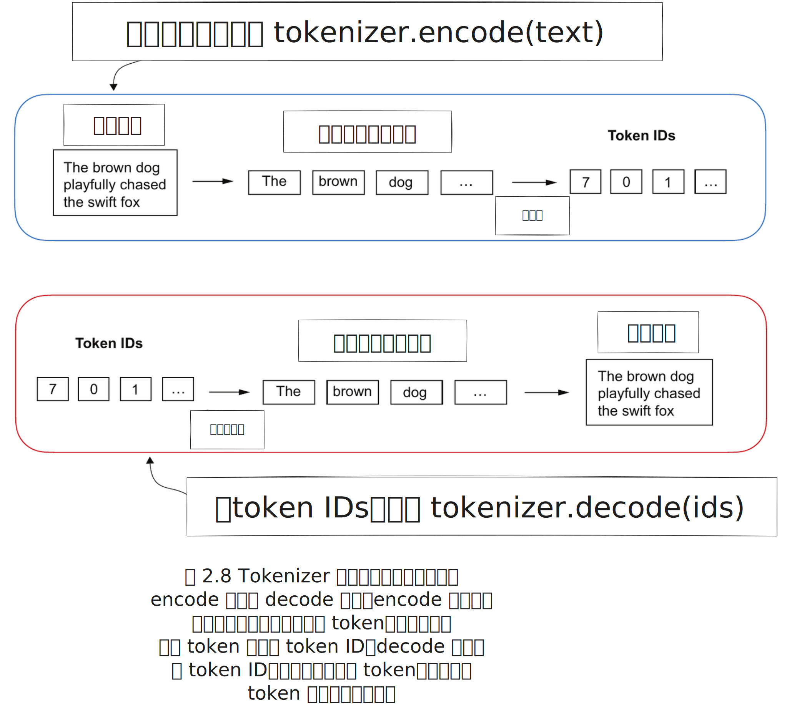

这将输出：

```py
'" It\' s the last he painted, you know," Mrs. Gisburn said with pardonable pride.'
```

根据此输出，我们可以看到 decode 方法成功将 token ID 转换回了原始文本。

目前为止，一切顺利。我们已经实现了一个能够根据训练集片段对文本进行分词和去分词的 tokenizer。现在，让我们将其应用于一个未包含在训练集中的新文本样本：

```py
text = "Hello, do you like tea?"
print(tokenizer.encode(text))
```

执行此代码将导致以下错误：

```py
KeyError: 'Hello'
```

问题在于“The Verdict”短篇小说中并未使用“Hello”一词。因此，它不在词汇表中。这突显了在处理LLMs时，需要考虑使用大型且多样化的训练集来扩展词汇的必要性。

接下来，我们将在包含未知词汇的文本上进一步测试分词器，并讨论可用于在训练过程中为LLM提供额外上下文的其他特殊标记。

## 2.4 添加特殊上下文标记

我们需要修改分词器以处理未知词汇。同时，我们还需解决特殊上下文标记的使用与添加问题，这些标记能够增强模型对文本中上下文或其他相关信息理解的能力。例如，这些特殊标记可以包括未知词标记和文档边界标记。具体而言，我们将修改词汇表和分词器 SimpleTokenizerV2，以支持两个新标记`<|unk|>`和`<|endoftext|>`，如图 2.9 所示。

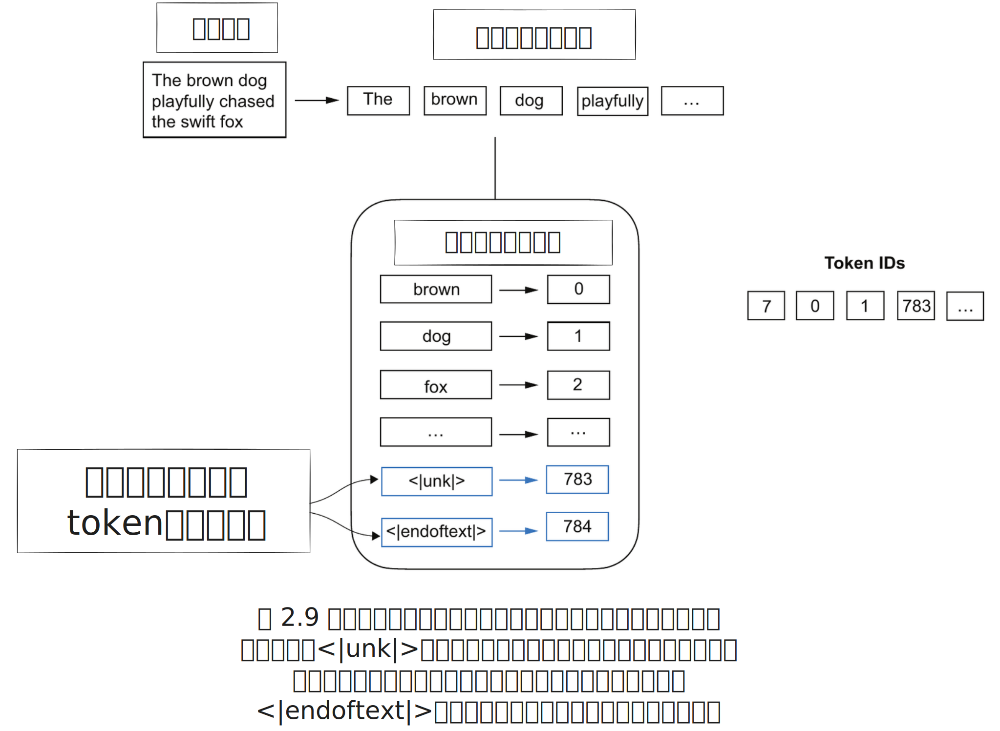

我们可以修改分词器，使其在遇到不属于词汇表的单词时使用一个`<|unk|>`标记。此外，我们在不相关的文本之间添加一个标记。例如，在训练类似 GPT 的LLMs模型时，针对多个独立的文档或书籍，通常会在每个文档或书籍之前，紧接在前一个文本源之后插入一个标记，如图 2.10 所示。这有助于LLM理解，尽管这些文本源在训练时是串联起来的，但它们实际上是不相关的。

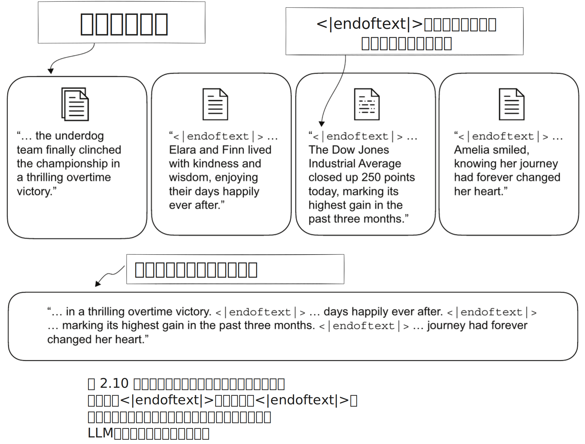

现在，让我们修改词汇表，以包含这两个特殊标记： `<unk>`和`<|endoftext|>`，将它们添加到我们的所有唯一单词列表中：

```py
all_tokens = sorted(list(set(preprocessed)))
all_tokens.extend(["<|endoftext|>", "<|unk|>"])
vocab = {token:integer for integer,token in enumerate(all_tokens)}

print(len(vocab.items()))
```

根据此打印语句的输出，新的词汇量为 1,132（之前的词汇量为 1,130）。

```py
for i, item in enumerate(list(vocab.items())[-5:]):
    print(item)
```

代码打印

```py
('younger', 1127)
('your', 1128)
('yourself', 1129)
('<|endoftext|>', 1130)
('<|unk|>', 1131)
```

根据代码输出，我们可以确认这两个新的特殊标记确实已成功加入词汇表中。接下来，我们相应地调整代码清单 2.3 中的分词器，如下列清单所示。

> [!NOTE]
> **代码清单 2.4** 一个处理未知单词的简单文本分词器
> ```py
> class SimpleTokenizerV2:
>     def __init__(self, vocab):
>         self.str_to_int = vocab
>         self.int_to_str = { i:s for s,i in vocab.items()}
> 
>     def encode(self, text):
>         preprocessed = re.split(r'([,.:;?_!"()\']|--|\s)', text)
>         preprocessed = [
>             item.strip() for item in preprocessed if item.strip()
>         ]
>         # 将未知单词替换为`<|unk|>`
>         preprocessed = [item if item in self.str_to_int
>                         else "<|unk|>" for item in preprocessed]
>         ids = [self.str_to_int[s] for s in preprocessed]
>         return ids
> 
>     def decode(self, ids):
>         text = " ".join([self.int_to_str[i] for i in ids])
>         # 替换掉特殊分隔符之前的空格
>         text = re.sub(r'\s+([,.:;?!"()\'])', r'\1', text)
>         return text
> ```

与我们清单 2.3 中实现的 SimpleTokenizerV1 相比，新的 SimpleTokenizerV2 将未知词替换为<|unk|>标记。

现在让我们在实践中尝试这个新的分词器。为此，我们将使用一个简单的文本样本，该样本由两个独立且不相关的句子连接而成：

```py
text1 = "Hello, do you like tea?"
text2 = "In the sunlit terraces of the palace."
text = " <|endoftext|> ".join((text1, text2))
print(text)
```

输出为

```
Hello, do you like tea? <|endoftext|> In the sunlit terraces of
the palace.
```

接下来，我们使用 SimpleTokenizerV2 对之前在第 2.2 节创建的词汇表进行样本文本的分词：

```py
tokenizer = SimpleTokenizerV2(vocab)
print(tokenizer.encode(text))
```

这将打印以下token ID：

```py
[1131, 5, 355, 1126, 628, 975, 10, 1130, 55, 988, 956, 984, 722, 988, 1131, 7]
```

我们可以看到，token ID 列表包含用于 <|endoftext|> 分隔符的 1130，以及用于未知词的两个 1131。

让我们对文本进行去标记化以快速进行健全性检查：

```py
print(tokenizer.decode(tokenizer.encode(text)))
```

输出为

```
<|unk|>, do you like tea? <|endoftext|> In the sunlit terraces of
the <|unk|>.
```

通过将这段去标记化文本与原始输入文本进行比较，我们了解到训练数据集，即伊迪丝·华顿的短篇小说《判决》，不包含“Hello”和“palace”这两个词。

根据LLM，一些研究者还考虑了如下的额外特殊标记：

- [BOS] (beginning of sequence)--此标记表示文本的开始。它向LLM指示一段内容的起始位置。
- [EOS] (end of sequence)--此标记位于文本末尾，在连接多个不相关的文本时特别有用，类似于<|endoftext|>。例如，在合并两篇不同的维基百科文章或书籍时，[EOS]标记指示一个文本的结束和下一个文本的开始。
- [PAD] (padding)--当以大于一的批量大小训练LLMs时，批量中可能包含长度不一的文本。为确保所有文本长度相同，较短的文本会使用[PAD]标记进行扩展或“填充”，直至达到批量中最长文本的长度。

用于 GPT 模型的分词器不需要这些标记；为简化起见，它仅使用`<|endoftext|>`标记。`<|endoftext|>`类似于`[EOS]`标记。`<|endoftext|>`也用于填充。然而，正如我们将在后续章节中探讨的那样，在对批量输入进行训练时，我们通常使用掩码，意味着我们不会关注填充的标记。因此，选择用于填充的特定标记变得无关紧要。

此外，用于 GPT 模型的分词器也不使用`<|unk|>`标记来表示词汇表外的单词。相反，GPT 模型采用字节对编码分词器，将单词分解为子词单元，我们接下来将讨论这一点。

## 2.5 字节对编码（Byte pair encoding）

让我们来看一个基于字节对编码（BPE）概念的更复杂的分词方案。BPE 分词器被用于训练诸如 GPT-2、GPT-3 以及 ChatGPT 中使用的原始模型LLM。

由于实现 BPE 可能相对复杂，我们将使用一个名为 [tiktoken](https://github.com/openai/tiktoken) 的现有 Python 开源库，它基于 Rust 源代码非常高效地实现了 BPE 算法。与其他 Python 库类似，我们可以通过终端使用 Python 的 pip 安装程序安装 tiktoken 库：

```sh
pip install tiktoken
```

我们将使用的代码基于 tiktoken 0.7.0。你可以使用以下代码检查当前安装的版本：

```py
from importlib.metadata import version
import tiktoken
print("tiktoken version:", version("tiktoken"))
```

安装完成后，我们可以按如下方式从 tiktoken 实例化 BPE 分词器：

```py
tokenizer = tiktoken.get_encoding("gpt2")
```

该分词器的使用方式类似于我们之前通过 encode 方法实现的 SimpleTokenizerV2：

```py
text = (
"Hello, do you like tea? <|endoftext|> In the sunlit terraces"
"of someunknownPlace."
)
integers = tokenizer.encode(text, allowed_special={"<|endoftext|>"})
print(integers)
```

代码打印以下 token ID：

```py
[15496, 11, 466, 345, 588, 8887, 30, 220, 50256, 554, 262, 4252, 18250,
8812, 2114, 286, 617, 34680, 27271, 13]
```

然后我们可以使用 decode 方法将 token ID 转换回文本，类似于 `SimpleTokenizerV2`:

```py
strings = tokenizer.decode(integers)
print(strings)
```

代码会打印

```
Hello, do you like tea? <|endoftext|> In the sunlit terraces of
someunknownPlace.
```

根据 token ID 和解码后的文本，我们可以得出两个值得注意的观察结果。首先，`<|endoftext|>` token 被分配了一个相对较大的 token ID，即 50256。实际上，用于训练 GPT-2、GPT-3 以及 ChatGPT 原始模型的 BPE tokenizer，其总词汇量为 50,257，而`<|endoftext|>`被赋予了最大的 token ID。

其次，BPE 分词器能够正确编码和解码未知词汇，例如 someunknownPlace。BPE 分词器能够处理任何未知词汇。它如何在不使用`<|unk|>`标记的情况下实现这一点？

BPE 算法将不在其预定义词汇表中的单词分解为更小的子词单元甚至单个字符，从而使其能够处理词汇表外的单词。因此，得益于 BPE 算法，如果分词器在分词过程中遇到不熟悉的单词，它可以将其表示为子词标记或字符的序列，如图 2.11 所示。

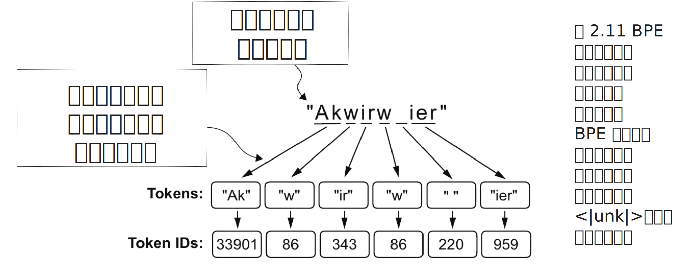

将未知词汇分解为单个字符的能力确保了分词器以及随之训练的LLM能够处理任何文本，即使其中包含未出现在其训练数据中的词汇。

> [!TIP]
> 练习 2.1 未知词的字节对编码
> 尝试使用 tiktoken 库中的 BPE 分词器对未知单词“Akwirw ier”进行分词，并打印各个 token ID。然后，对此列表中的每个整数调用解码函数，以重现图 2.11 中所示的映射。最后，对 token ID 调用解码方法，检查其是否能够重建原始输入“Akwirw ier”。

BPE 的详细讨论和实现超出了本书的范围，但简而言之，它通过迭代地将频繁出现的字符合并为子词，再将频繁出现的子词合并为单词来构建其词汇表。例如，BPE 首先将所有单个字符添加到其词汇表中（“a”、“b”等）。在下一阶段，它将频繁一起出现的字符组合合并为子词。例如，“d”和“e”可能被合并为子词“de”，这在许多英语中很常见。de 单词如“define”、“depend”、“made”和“hidden”。合并由频率截止值决定。

## 2.6 使用滑动窗口对数据进行采样

创建LLM嵌入的下一步是生成训练LLM所需的输入-目标对。这些输入-目标对是什么样的？正如我们已经了解到的，LLMs通过预测文本中的下一个单词进行预训练，如图 2.12 所示。

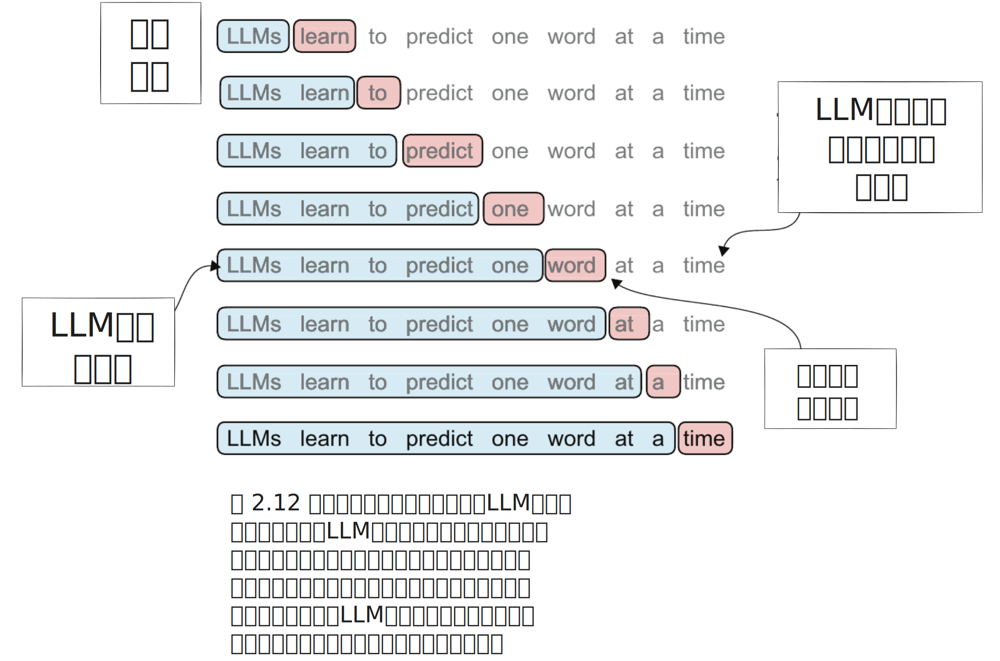

让我们实现一个数据加载器，使用滑动窗口方法从训练数据集中获取图 2.12 中的输入-目标对。首先，我们将使用 BPE 分词器对整个《判决》短篇故事进行分词：

```py
with open("the-verdict.txt", "r", encoding="utf-8") as f:
    raw_text = f.read()

enc_text = tokenizer.encode(raw_text)
print(len(enc_text))
```

执行此代码将返回 5145，这是在应用 BPE 分词器后训练集中 token 的总数。

接下来，为了演示目的，我们从数据集中移除前 50 个标记，因为这样可以在后续步骤中得到稍微更有趣的文本段落：

```py
enc_sample = enc_text[50:]
```

为下一个词预测任务创建输入-目标对的最简单直观方法之一是创建两个变量 x 和 y，其中 x 包含输入标记，y 包含目标，即输入向后移动 1 位的结果：

```py
context_size = 4
x = enc_sample[:context_size]
y = enc_sample[1:context_size+1]
print(f"x: {x}")
print(f"y:     {y}")
```

运行前面的代码会打印以下输出：

```
x: [290, 4920, 2241, 287]
y:      [4920, 2241, 287, 257]
```

通过处理输入以及目标（即输入向后移动一个位置的结果），我们可以创建下一词预测任务（见图 2.12），如下所示：

```py
for i in range(1, context_size+1):
    context = enc_sample[:i]
    desired = enc_sample[i]
    print(context, "---->", desired)
```

代码打印

```
[290] ----> 4920
[290, 4920] ----> 2241
[290, 4920, 2241] ----> 287
[290, 4920, 2241, 287] ----> 257
```

箭头左侧 (`---->`) 的所有内容指的是 LLM 会接收的输入，箭头右侧的 token ID 表示 LLM 应该预测的目标 token ID。让我们重复之前的代码，但将 token ID 转换为文本：

```py
for i in range(1, context_size+1):
    context = enc_sample[:i]
    desired = enc_sample[i]
    print(tokenizer.decode(context), "---->", tokenizer.decode([desired]))
```

以下输出展示了输入和输出在文本格式中的呈现方式：

```
and ----> established
and established ----> himself
and established himself ----> in
and established himself in ----> a
```

我们现在已经创建了可以用于LLM训练的输入-目标对。

在我们将词元转换为嵌入之前，还有一项任务：实现一个高效的数据加载器，它能遍历输入数据集并返回结果输入和目标作为 PyTorch 张量，可以视为多维数组。特别地，我们关注的是返回两个张量：一个包含LLM看到的文本的输入张量，以及一个包含LLM预测目标的目标张量，如图 2.13 所示。虽然图中以字符串格式展示标记以作说明，但代码实现将直接操作标记 ID，因为 BPE 分词器的编码方法将分词和转换为标记 ID 作为一步完成。

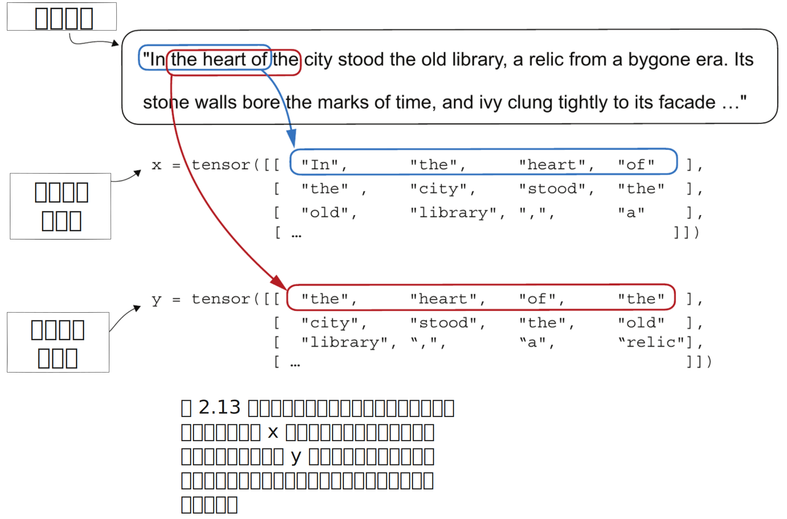

> [!NOTE]
> 注意 为了实现高效的数据加载器，我们将使用 PyTorch 内置的 Dataset 和 DataLoader 类。有关安装 PyTorc 的更多信息和指导，请参阅附录 A 中的 A.2.1.3 节。

数据集类的代码如以下列表所示。

> [!NOTE]
> **代码清单 2.5** 批量输入和目标的数据集
```py
import torch
from torch.utils.data import Dataset, DataLoader
class GPTDatasetV1(Dataset):
    def __init__(self, txt, tokenizer, max_length, stride):
        self.input_ids = []
        self.target_ids = []
        # 将整个文本进行分词
        token_ids = tokenizer.encode(txt)

        # 使用滑动窗口将书分块为重叠的序列，序列长度为`max_length`
        for i in range(0, len(token_ids) - max_length, stride):
            input_chunk = token_ids[i:i + max_length]
            target_chunk = token_ids[i + 1: i + max_length + 1]
            self.input_ids.append(torch.tensor(input_chunk))
            self.target_ids.append(torch.tensor(target_chunk))

    # 返回数据集的行数量
    def __len__(self):
        return len(self.input_ids)

    # 返回数据集中的某一行
    def __getitem__(self, idx):
        return self.input_ids[idx], self.target_ids[idx]
```

GPTDatasetV1 类基于 PyTorch 的 Dataset 类，定义了如何从数据集中获取单行数据，其中每行由分配给 input_chunk 张量的多个 token ID（基于 max_length）组成。target_chunk tensor 包含相应的目标。我建议继续阅读，以了解当我们将此数据集与 PyTorch 的 DataLoader 结合时，返回的数据是什么样子的——这将带来额外的直观理解和清晰度。

> [!NOTE]
> 如果你对 PyTorch Dataset 类的结构不熟悉，比如代码清单 2.5 中所示的情况，请参考附录 A 中的 A.6 节，该节解释了 PyTorch Dataset 和 DataLoader 类的一般结构和用法。

以下代码使用 GPTDatasetV1 通过 PyTorch 批量加载输入DataLoader。

```py
def create_dataloader_v1(txt, batch_size=4, max_length=256,
                         stride=128, shuffle=True, drop_last=True,
                         num_workers=0):
    # 初始化分词器
    tokenizer = tiktoken.get_encoding("gpt2")
    # 创建数据集
    dataset = GPTDatasetV1(txt, tokenizer, max_length, stride)
    dataloader = DataLoader(
        dataset,
        batch_size=batch_size,
        shuffle=shuffle,
        # drop_last=True 在最后一个批次小于指定的 batch_size 时将其丢弃，以防止训练期间出现损失峰值。
        drop_last=drop_last,
        # 用于预处理的 CPU 进程数量
        num_workers=num_workers
    )

    return dataloader
```


让我们用批大小为 1 的LLM和上下文大小为 4 来测试数据加载器，以直观了解清单 2.5 中的 GPTDatasetV1 类和 create_dataloader_v1 来自 listing 2.6 的函数协同工作：

```py
with open("the-verdict.txt", "r", encoding="utf-8") as f:
    raw_text = f.read()

dataloader = create_dataloader_v1(
    raw_text, batch_size=1, max_length=4, stride=1, shuffle=False)

# 将 dataloader 转换为 Python 迭代器，以便通过 Python 内置的 next()函数获取下一个条目
data_iter = iter(dataloader)
first_batch = next(data_iter)
print(first_batch)
```

执行前面的代码将输出以下内容：

```py
[tensor([[40, 367, 2885, 1464]]), tensor([[367, 2885, 1464, 1807]])]
```

first_batch 变量包含两个张量：第一个张量存储输入token ID，第二个张量存储目标token ID。由于 max_length 设置为 4，两个张量各包含四个token ID。请注意，输入大小为 4 是非常小的，仅为了简化而选择。通常使用至少 256 的输入大小来训练 LLM。

要理解 stride=1 的含义，让我们从这个数据集中再取一个批次：

```py
second_batch = next(data_iter)
print(second_batch)
```

第二批内容包括：

```py
[tensor([[367, 2885, 1464, 1807]]), tensor([[2885, 1464, 1807, 3619]])]
```

如果我们比较第一批和第二批，可以看到第二批的 token ID 位置偏移了一位（例如，第一批输入中的第二个 ID 是 367，它在第二批输入中变成了第一个 ID）。stride 设置决定了输入在批次间移动的位置数量，模拟了滑动窗口的方法，如图 2.14 所示。

> [!TIP]
> 练习 2.2 具有不同步幅和上下文大小的数据加载器
> 为了更直观地理解数据加载器的工作原理，尝试使用不同的设置来运行它设置如 max_length=2 和 stride=2，以及 max_length=8 和 stride=2。


## 2.7 创建token的嵌入

## 总结

- LLM 需要将文本数据转换为数值向量，即所谓的嵌入，因为它们无法处理原始文本。嵌入将离散数据（如单词或图像）转换为连续向量空间，使其与神经网络操作兼容。
- 作为第一步，原始文本被分解为标记，这些标记可以是单词或字符。然后，将 token 转换为整数表示，称为 token ID。
- 特殊标记，如`<|unk|>`和`<|endoftext|>`，可以添加到模型中，以增强其理解能力并处理各种上下文，例如未知词汇或标记不相关文本之间的边界。
- 用于 GPT-2 和 GPT-3 等模型的字节对编码（BPE）分词器能够通过将未知词分解为子词单元或单个字符来高效处理它们。
- 我们在分词数据上使用滑动窗口方法来生成训练用的输入-目标对。
- PyTorch 中的嵌入层作为查找操作，检索与 token ID 对应的向量。生成的嵌入向量提供了 token 的连续表示，这对于训练深度学习模型至关重要。
- 虽然 token 嵌入为每个 token 提供了一致的向量表示，但它们缺乏 token 在序列中的位置感。为了解决这个问题，存在两种主要类型的位置嵌入：绝对位置嵌入和相对位置嵌入。OpenAI 的 GPT 模型使用绝对位置嵌入，这些嵌入被添加到 token 嵌入向量中，并在模型训练期间进行优化。