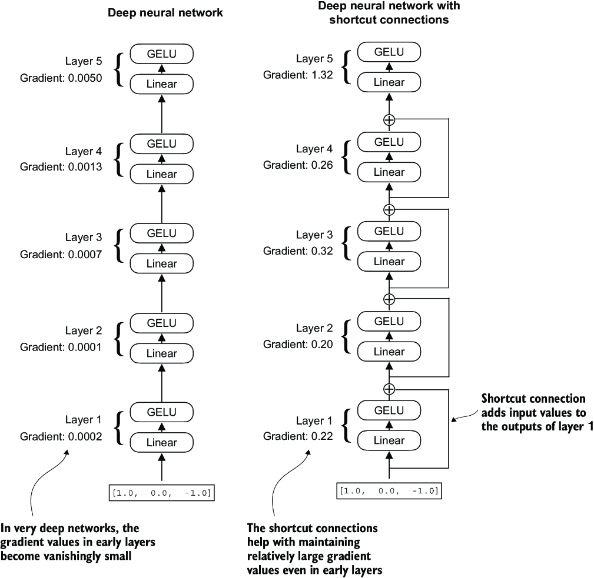
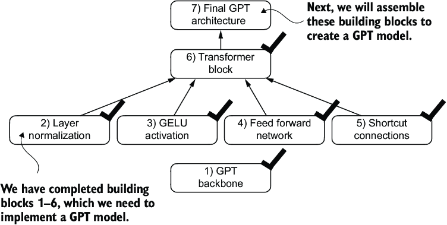
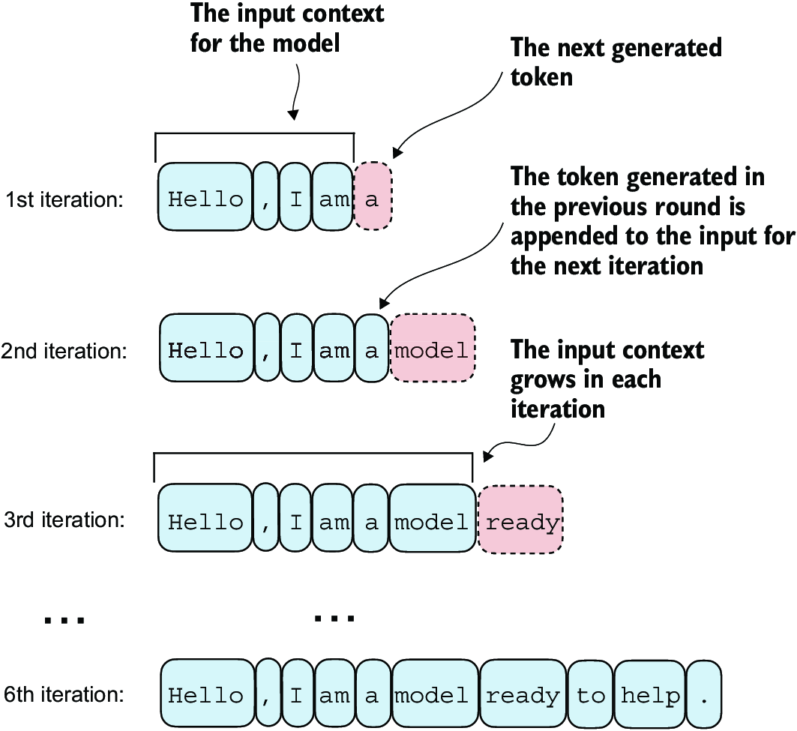
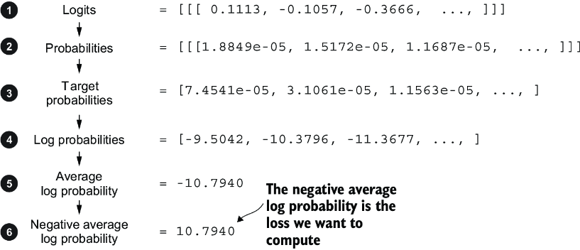

# 从零构建大语言模型

## 1 理解大语言模型

> [!NOTE]
> 本章涵盖
> 
> - 大语言模型（LLM）背后基本概念的高层次解释
> - 深入了解衍生出 LLM 的 Transformer 架构
> - 从零开始构建 LLM 的计划

大语言模型（LLM），例如 OpenAI 的 ChatGPT 所提供的那些，是过去几年发展起来的深度神经网络模型。它们为自然语言处理（NLP）开启了一个新时代。在 LLM 出现之前，传统方法在分类任务上表现出色，如电子邮件垃圾邮件分类和可以通过手工规则或更简单模型捕捉的简单模式识别。然而，在需要复杂理解和生成能力的语言任务中，它们通常表现不佳，例如解析详细指令、进行上下文分析以及创建连贯且上下文适当的原始文本。例如，前几代语言模型无法根据关键词列表写一封电子邮件——这对当代的 LLM 来说是轻而易举的任务。

LLM 具备理解和生成人类语言的显著能力。不过，需要明确的是，当我们说语言模型“理解”时，指的是它们能够以连贯且上下文相关的方式处理和生成文本，而非意味着它们拥有类似人类的意识或理解力。

得益于深度学习的进步，LLM 通过大量的文本数据进行训练。深度学习是机器学习和人工智能（AI）的一个子集，专注于神经网络。这种大规模的训练使得 LLM 能够捕捉到更深层次的上下文信息和人类语言的微妙之处，与以往的方法相比有了显著提升。因此，在广泛的自然语言处理（NLP）任务中，包括文本翻译、情感分析、问答系统等，LLM 表现出了显著提升的性能。

当代 LLM 与早期 NLP 模型之间的另一个重要区别在于，早期的 NLP 模型通常是为特定任务设计的，例如文本分类、语言翻译等。虽然这些早期的 NLP 模型在各自狭窄的应用领域表现出色，但 LLM 则展现出在多种 NLP 任务上更为广泛的熟练度。

LLM 的成功可归功于支撑许多 LLM 的 Transformer 架构，以及 LLM 训练所依赖的大量数据，这使得它们能够捕捉到广泛的语言细微差别、上下文和模式，而这些若手动编码将极具挑战性。

向基于 Transformer 架构的模型转变以及使用大型训练数据集来训练 LLM，从根本上改变了 NLP，为理解人类语言以及和人类语言进行交互提供了更强大的工具。

以下讨论为达成本书的主要目标奠定了基础：通过逐步实现基于 Transformer 架构的类似 ChatGPT 的 LLM 来理解 LLM 。

### 1.1 什么是 LLM ？

LLM 是一个旨在理解、生成并回复类似人类写的文本的神经网络。这些模型是基于海量文本数据训练的深度神经网络，有时涵盖了互联网上全部公开文本的很大一部分。

“大规模”在“大规模语言模型”中既指模型的参数量，也指其训练所基于的巨大数据集。这类模型通常拥有数百亿甚至数千亿个参数，这些参数是网络中的可调权重，在训练过程中优化以预测序列中的下一个词。预测下一个词之所以合理，是因为它利用了语言固有的序列性来训练模型理解文本中的上下文、结构和关系。然而，这是一项非常简单的任务，因此许多研究人员惊讶于它能产生如此强大的模型。在后续章节中，我们将逐步讨论并实现下一个词的训练过程。

LLM 采用了一种名为 Transformer 的架构，这使得它们在做出预测时能够选择性地关注输入的不同部分，使它们特别擅长处理人类语言的细微差别和复杂性。

由于 LLM 能够生成文本，LLM 也常被称为一种生成式人工智能，通常简称为生成式 AI 或 GenAI 。如图 1.1 所示，人工智能涵盖了创造能够执行需要人类智能的任务的机器的广泛领域，包括理解语言、识别模式和做出决策，并包括机器学习和深度学习等子领域。


==图 1.1== 正如这一层次化的图示所展示的不同领域之间的关系，LLM 代表了深度学习技术的一个具体应用，利用其处理和生成类人文本的能力。深度学习是机器学习的一个专门分支，专注于使用多层神经网络。机器学习和深度学习是旨在实现算法的领域，这些算法使计算机能够从数据中学习，并执行通常需要人类智能的任务。


实现人工智能的算法是机器学习领域的重点。具体来说，机器学习涉及开发能够从数据中学习并基于数据做出预测或决策的算法，而无需显式的进行编程。为了说明这一点，可以将垃圾邮件过滤器视为机器学习的一个实际应用。与手动编写规则来识别垃圾邮件不同，机器学习算法被提供标注为垃圾邮件和合法邮件的示例。通过在训练数据集上最小化预测误差，模型学会识别指示垃圾邮件的模式和特征，从而能够将新邮件分类为垃圾邮件或非垃圾邮件。

如图 1.1 所示，深度学习是机器学习的一个子集，专注于利用 3 层或更多层的神经网络（也称为深度神经网络）来建模数据中的复杂模式和抽象。与深度学习相比，传统机器学习需要手动特征提取，这意味着人类专家需要识别并选择模型中最相关的特征。

尽管 AI 领域如今由机器学习和深度学习主导，但它也包含了其他方法——例如，使用基于规则的系统、遗传算法、专家系统、模糊逻辑或符号推理。

回到垃圾邮件分类的例子，在传统机器学习中，人类专家可能需要从邮件文本中手动提取特征，如某些触发词（例如，“奖品”、“赢”、“免费”）的出现频率、感叹号的数量、全大写单词的使用，或是可疑链接的存在。基于这些专家定义的特征创建的数据集随后将用于训练模型。与传统机器学习不同，深度学习无需手动特征提取。这意味着人类专家无需为深度学习模型识别和挑选最相关的特征。（然而，无论是传统机器学习还是深度学习的垃圾邮件分类，仍然需要收集标签，如垃圾邮件或非垃圾邮件，这些标签需要由专家或用户来收集。）

让我们看看 LLM 如今能解决的一些问题，LLM 所应对的挑战，以及我们稍后将编程实现的通用 LLM 架构。

### 1.2 LLM 的应用

凭借 LLM 解析和理解非结构化文本数据的高级能力，LLM 在多个领域拥有广泛的应用。如今，LLM 被用于机器翻译、生成创作的文本（见图 1.2）、情感分析、文本摘要以及许多其他任务。LLM 最近被用于内容创作，如撰写小说、文章，甚至计算机代码。


==图 1.2== LLM 接口实现了用户与 AI 系统之间的自然语言交流。此截图展示了 ChatGPT 根据用户的要求创作了一首诗。

LLM 也能驱动复杂的聊天机器人和虚拟助手，例如 OpenAI 的 ChatGPT 或 Google 的 Gemini（前身为 Bard），它们能够回答用户查询并增强传统搜索引擎如 Google Search 或 Microsoft Bing。

此外，LLM 可用于从医学或法律等专业领域的大量文本中高效检索知识。这包括筛选文档、总结冗长段落以及回答技术问题。

简而言之，LLM 对于自动化几乎所有涉及解析和生成文本的任务都是无价之宝。它们的应用几乎是无限的，随着我们不断创新和探索使用这些模型的新方法，很明显 LLM 有潜力重新定义我们与技术的关系，使技术更加能和人对话、直观和易于访问。

我们将重点从头理解 LLM 的工作原理，编程实现一个能够生成文本的 LLM。你还将学习让 LLM 执行查询的技术，范围从回答问题到总结文本、将文本翻译成不同语言等。换句话说，你将通过一步步构建，了解像 ChatGPT 这样复杂的 LLM 助手是如何工作的。

### 1.3 构建和使用 LLM 的各个阶段

为什么我们要构建自己的 LLM？从零开始编写 LLM 是理解其机制和局限性的绝佳练习。此外，它还为我们提供了所需的知识，以便对现有的开源 LLM 架构进行预训练或微调，以适应我们自己的领域特定数据集或任务。

> [!NOTE]
> 今天的大多数 LLM 都是使用 PyTorch 深度学习库实现的，这也是我们将要使用的。读者可以在附录 A 中找到关于 PyTorch 的全面介绍。

研究表明，在建模性能方面，定制的 LLM——那些为特定任务或领域量身打造的模型——能够超越通用型 LLM，例如 ChatGPT 提供的模型，后者设计用于广泛的应用程序。这些示例包括专为金融领域打造的 BloombergGPT 和针对医疗问答定制的 LLM（更多详情见附录 B）。

使用定制的 LLM 具有多项优势，尤其是在数据隐私方面。例如，出于保密考虑，公司可能不愿与 OpenAI 等第三方 LLM 提供商共享敏感数据。此外，开发较小的定制 LLM 可以直接部署在客户设备上，如笔记本电脑和智能手机，这正是苹果等公司当前探索的方向。这种本地部署可以显著降低延迟并减少与服务器相关的成本。此外，定制 LLM 赋予开发者完全自主权，使他们能够根据需要控制模型的更新和修改。

创建 LLM 的一般过程包括预训练和微调。“预训练”中的“预”指的是初始阶段，在这个阶段中，像 LLM 这样的模型在一个大型、多样化的数据集上进行训练，以发展对语言的广泛理解。然后，这个预训练模型作为基础资源，可以通过微调进一步优化，微调是一个过程，在这个过程中，模型在更窄的、更特定于特定任务或领域的数据集上进行专门训练。这个由预训练和微调组成的两阶段训练方法在图 1.3 中展示。


==图 1.3== 预训练一个 LLM 涉及在大规模文本数据集上进行下一个词的预测。预训练后的 LLM 随后可以使用较小的标注数据集进行微调。

创建 LLM 的第一步是在一个大型文本数据语料库上对其进行训练，有时这些数据被称为原始文本。这里的“原始”指的是这些数据仅仅是常规文本，没有任何标签信息。（可能会对数据集进行过滤，例如删除格式字符或未知语言的文档。）

> [!NOTE]
> 具有机器学习背景的读者可能会注意到，传统机器学习模型及通过常规监督学习范式训练的深度神经网络通常需要标注信息。然而，LLM 的预训练阶段并非如此。在此阶段，LLM 采用自监督学习，模型从输入数据中自行生成标签。

LLM 的初始训练阶段也被称为预训练，生成一个初始的预训练 LLM ，通常称为基础模型（基座模型，底座模型）。此类模型的典型例子是 GPT-3 模型（ChatGPT 中原始模型的前身）。该模型能够进行文本补全——即补全用户提供的写了一半的句子。它还具备有限的少样本（few-shot）学习能力，这意味着它可以根据少量示例学习执行新任务，而无需大量的训练数据。

在从大型文本数据集上训练获得预训练的 LLM 后，其中 LLM 被训练用于预测文本中的下一个词，我们可以进一步在有标签的数据上训练 LLM，这也称为微调。

两种最受欢迎的微调类别是 **指令微调** 和 **分类微调**。在指令微调中，标注数据集由指令和答案对组成，例如一条翻译文本的查询及其正确的翻译文本。在分类微调中，标注数据集由文本及相关的类别标签组成——例如，与“垃圾邮件”和“非垃圾邮件”标签相关联的电子邮件。

我们将涵盖预训练和微调 LLM 的代码实现，并深入探讨在预训练基础 LLM 后，指令微调和分类微调的具体细节。

### 1.4 介绍 Transformer 架构

大多数现代 LLM 依赖 Transformer 架构，这是一种在 2017 年论文[《Attention Is All You Need》](https://arxiv.org/abs/1706.03762)中引入的深度神经网络架构。要理解 LLM，我们必须理解原始的 Transformer，它是为机器翻译而开发的，用于将英语文本翻译成德语和法语。图 1.4 展示了 Transformer 架构的简化版本。


==图 1.4== 原始 Transformer 架构的简化示意图，这是一种用于语言翻译的深度学习模型。Transformer 由两部分组成：(a) 一个编码器，用于处理输入文本并生成文本的嵌入表示（一种在多维度上捕捉多种不同因素的数值表示），(b) 解码器则利用该表示逐词生成翻译后的文本。此图展示了翻译过程的最后阶段，解码器在给定原始输入文本（“This is an example”）和部分翻译的句子（“Das ist ein”）后，只需生成最后一个词（“Beispiel”），即可完成翻译。

Transformer 架构由两个子模块组成：编码器和解码器。编码器模块处理输入文本并将其编码为一系列捕捉输入上下文信息的数值表示或向量。然后，解码器模块接收这些编码后的向量并生成输出文本。例如，在翻译任务中，编码器将源语言文本编码为向量，解码器则将这些向量解码为目标语言文本。编码器和解码器都由多个层组成，这些层通过所谓的自注意力机制连接。关于对输入如何预处理和编码，你可能有许多疑问。这些将在后续章节中通过逐步实现来解决。

Transformer 和 LLM 的一个关键组成部分是自注意力机制（未显示），它使模型能够权衡序列中不同词或 token 之间的相对重要性。该机制使模型能够捕捉输入数据中的长程依赖关系和上下文关联，从而增强其生成连贯且上下文相关输出的能力。然而，鉴于其复杂性，我们将在第 3 章中详细解释，并逐步讨论和实现它。

后来，基于这一概念的 Transformer 架构变体，如 BERT（双向编码器表示来自 Transformer 的缩写）和各种 GPT 模型（生成式预训练 Transformer 的缩写），对这一架构进行了调整以适应不同的任务。若有兴趣，可参阅附录 B 以获取更多阅读建议。

BERT 建立在原始 Transformer 的编码器子模块之上，其训练方法与 GPT 有所不同。GPT 专为生成任务设计，而 BERT 及其变体则擅长于掩码词预测，即模型预测给定句子中被掩码或隐藏的词汇，如图 1.5 所示。这种独特的训练策略使 BERT 在文本分类任务中表现出色，包括情感预测和文档分类。作为其能力的一个应用，截至撰写本文时，X（前身为 Twitter）使用 BERT 来检测有害内容。


==图 1.5== 一个关于 Transformer 编码器和解码器子模块的视觉表示。左侧，编码器部分展示了类似 BERT 的 LLM ，它专注于掩码词预测，主要用于文本分类等任务。右侧，解码器部分展示了类似 GPT 的 LLM ，专为生成任务设计，能够产生连贯的文本序列。

另一方面，GPT 专注于原始 Transformer 架构的解码器部分，专为需要生成文本的任务设计。这包括机器翻译、文本摘要、小说创作、编写计算机代码等。

GPT 模型主要设计和训练用于执行文本补全任务，同时也展现出了显著的多样化能力。这些模型擅长执行零样本（zero-shot）学习和少样本（few-shot）学习任务。零样本学习指的是在没有先验具体示例的情况下泛化到完全未见过的任务。而少样本学习则如 1.6 图所示，涉及从用户提供的最少数量的示例中进行学习。


==图 1.6== 除了文本补全，类 GPT 的 LLM 能够基于输入解决多种任务，而无需重新训练、微调或更改特定任务的模型架构。有时在输入中提供目标示例是有帮助的，这被称为少样本设置。然而，类 GPT 的 LLM 也能在没有具体示例的情况下执行任务，这被称为零样本设置。

> [!NOTE]
> Transformer 对比 LLM
>
> 今天的 LLM 基于 Transformer 架构。因此，在文献中，Transformer 和 LLM 这两个术语经常被用作同义词。然而，需要注意的是，并非所有 Transformer 都是 LLM，因为 Transformer 也可以用于计算机视觉领域。同时，并非所有 LLM 都是 Transformer，因为还存在基于循环和卷积架构的 LLM。这些替代方法的主要动机是提高 LLM 的计算效率。这些替代的 LLM 架构能否与基于 Transformer 的 LLM 相媲美，以及它们是否会在实践中被采用，仍有待观察。为简便起见，我使用术语“LLM”来指代类似于 GPT 的基于 Transformer 的 LLM。（感兴趣的读者可以在附录 B 中找到描述这些架构的文献参考。）

### 1.5 利用大型数据集

流行 GPT 和 BERT 类模型的大型训练数据集代表多样且全面的文本语料库，涵盖数十亿词汇，包括广泛的主题以及自然语言和计算机语言。为提供具体示例，表 1.1 总结了用于预训练 GPT-3 的数据集，该数据集作为第一版 ChatGPT 的基础模型。

==表 1.1== 广受欢迎的 GPT-3 LLM的预训练数据集

|数据集名称|数据集描述|token数量|训练数据中的比例|
|-|-|-|-|
|CommonCrawl（已过滤）|Web 爬取数据|4100 亿|60%|
|WebText2|Web 爬取数据|190 亿|22%|
|Books1|基于互联网的书籍语料库|120 亿|8%|
|Books2|基于互联网的书籍语料库|550 亿|8%|
|维基百科|高质量文本|30 亿|3%|

表 1.1 报告了 token 的数量，其中 token 是模型读取的文本单位，数据集中的 token 数量大致相当于文本中的单词和标点符号的数量。第 2 章讨论了文本分词，即将文本转换为 token 的过程。

主要结论是，这个训练数据集的规模和多样性使得这些模型能够在多样化的任务中表现出色，包括语言句法、语义和上下文——甚至是一些需要一般知识的任务。

> [!NOTE]
> GPT-3 数据集详情
>
> 表 1.1 显示了用于 GPT-3 的数据集。表格中的比例列总计为采样数据的 100%，已针对舍入误差进行了调整。尽管“token数量”列中的子集总计为 4990 亿，但模型仅在 3000 亿token上进行了训练。GPT-3 论文的作者未说明为何未在所有 4990 亿token上训练模型。
>
> 为了对比，考虑 CommonCrawl 数据集的规模，仅该数据集就包含了 4100 亿个token，需要大约 570 GB 的存储空间。相比之下，像 GPT-3 这样的模型的后续迭代，如 Meta 的 LLaMA，已经扩大了其训练范围，包括了诸如 Arxiv 研究论文（92 GB）和 StackExchange 的代码相关问答（78 GB）等额外数据源。
>
> GPT-3 论文的作者并未公开训练数据集，但一个可公开获取的类似数据集是 Soldaini 等人于 2024 年发布的[《Dolma: An Open Corpus of Three Trillion Tokens for LLM Pretraining Research》](https://arxiv.org/abs/2402.00159)。然而，该数据集可能包含受版权保护的作品，具体使用条款可能取决于预期用途和国家。

这些模型经过预训练的特性使其在下游任务的微调中表现出极高的灵活性，这也是它们被称为基础模型或基石模型的原因。预训练LLM需要访问大量资源且成本高昂。例如，GPT-3 的预训练成本估计在云计算积分上达到了 460 万美元。

好消息是，许多预训练的LLM，作为开源模型提供，可以用作通用工具来编写、提取和编辑那些不属于训练数据的文本。此外，LLM可以通过相对较小的数据集在特定任务上进行微调，减少了所需的计算资源并提高了性能。

我们将实现预训练代码，并利用其对LLM进行预训练，以供教育用途。所有计算均可在消费级硬件上执行。在实现预训练代码后，我们将学习如何重用公开可用的模型权重，并将其加载到我们将实现的架构中，从而在微调我们的LLM时跳过昂贵的预训练阶段。

### 1.6 深入探讨 GPT 架构

GPT 最初由 OpenAI 的 Radford 等人在论文《Improving Language Understanding by Generative Pre-Training》中提出。GPT-3 是该模型的扩大版本，具有更多参数，并在更大的数据集上进行了训练。此外，ChatGPT 中提供的原始模型是通过使用 OpenAI 的论文 [InstructGPT](https://arxiv.org/abs/2203.02155)中的方法，在大型指令数据集上对 GPT-3 进行微调而创建的。如图 1.6 所示，这些模型是胜任的文本补全模型，并能执行其他任务，如拼写纠正、分类或语言翻译。考虑到 GPT 模型是在相对简单的下一个单词预测任务上进行预训练的，如图 1.7 所示，这实际上是非常引人注目的。


==图 1.7== 在 GPT 模型的下一词预测预训练任务中，系统通过观察句子中已出现的单词来学习预测接下来的单词。这种方法有助于模型理解单词和短语在语言中通常如何搭配，从而形成可应用于各种其他任务的基础。

下一词预测任务是一种自监督学习形式，即自我标注的一种方式。这意味着我们无需显式地为训练数据收集标签，而是可以利用数据自身的结构：将句子或文档中的下一个词作为模型应预测的标签。由于这种下一词预测任务能够“即时”创建标签，因此可以利用大规模未标注的文本数据集来训练LLM 。

相较于我们在 1.4 节中介绍的原始 Transformer 架构，通用的 GPT 架构相对简单。本质上，它仅包含解码器部分，而没有编码器（图 1.8）。由于像 GPT 这样的解码器模型通过逐个预测单词来生成文本，因此它们被视为一种自回归模型。自回归模型将之前的输出作为未来预测的输入。因此，在 GPT 中，每个新单词的选择都基于其前面的序列，这提高了生成文本的连贯性。

诸如 GPT-3 这样的架构也显著大于原始的 Transformer 模型。例如，原始 Transformer 重复了编码器和解码器模块六次。而 GPT-3 拥有 96 个 Transformer 层和总计 1750 亿个参数。


==图 1.8== GPT 架构仅采用了原始 Transformer 的解码器部分。它专为单向、从左到右的处理设计，非常适合文本生成和下一词预测任务，以迭代的方式一次一个词地生成文本。

GPT-3 于 2020 年推出，按照深度学习和大型语言模型发展的标准，这已经算是很久以前的事了。然而，最近的架构，如 Meta 的 Llama 模型，仍然基于相同的基本概念，仅引入了微小的修改。因此，理解 GPT 仍然至关重要，所以我专注于实现 GPT 背后的主要架构，同时提供其他LLM所采用的特定调整的参考。

尽管最初的 Transformer 模型由编码器和解码器模块组成，明确设计用于语言翻译，但 GPT 模型——尽管其更大却仅采用解码器的架构旨在预测下一个词——同样能执行翻译任务。这一能力最初令研究人员感到意外，因为它源自一个主要训练于预测下一个词任务的模型，而该任务并未特别针对翻译。

执行模型未明确训练执行的任务的能力被称为涌现行为。这种能力在训练过程中并未被明确教授，而是作为模型在多样化的多语言数据环境中自然暴露的结果而出现。GPT 模型能够“学习”语言之间的翻译模式并执行翻译任务，尽管它们并未专门为此进行训练，这一事实展示了这些大规模生成式语言模型的好处和能力。我们可以在不使用多个不同模型的情况下执行多种任务。

### 1.7 构建大型语言模型

既然我们已经为理解 LLM 奠定了基础，接下来从头开始编写一个。我们将以 GPT 背后的基本理念为蓝图，并按照图 1.9 中概述的三个阶段来处理。


==图 1.9== 编码 LLM 的三个主要阶段包括实现 LLM 架构与数据准备流程（阶段 1）、预训练 LLM 以构建基础模型（阶段 2），以及微调基础模型以成为个人助理或文本分类器（阶段 3）。 

在第一阶段，我们将学习基础的数据预处理步骤，并编写每个 LLM 核心的注意力机制代码。接着，在第二阶段，我们将学习如何编写并预训练一个类似 GPT 的LLM，它能够生成新的文本。我们还将探讨评估 LLM 的基础知识，这对于开发强大的 NLP 系统至关重要。

从头开始预训练一个 LLM 是一项重大任务，对于类似 GPT 的模型，需要花费数千到数百万美元的计算成本。因此，第二阶段的重点是使用小型数据集训练模型来达到教学的目的。此外，我还提供了加载公开可用模型权重的代码示例。

最后，在第三阶段，我们将采用一个预训练的 LLM 并对其进行微调，以执行诸如回答查询或分类文本等指令——这是许多实际应用和研究中最为常见的任务。

希望你期待踏上这段激动人心的旅程！

### 总结

- LLM 彻底改变了自然语言处理领域，该领域之前主要依赖于显式的基于规则的系统以及更简单的统计方法。LLM 的出现带来了新的深度学习方法，推动了人类语言理解、生成和翻译方面的进步。
- 现代的 LLM 主要通过两个主要步骤进行训练：
    - 首先，它们通过在句子中预测下一个单词作为标签，在一个大型未标注文本语料库上进行预训练。
    - 然后，它们在一个较小的、带标签的目标数据集上进行微调，以遵循指令或执行分类任务。
- LLM 基于 Transformer 架构。Transformer 架构的核心思想是一种注意力机制，它使 LLM 在逐词生成输出时能够有选择地访问整个输入序列。
- 原始 Transformer 架构由一个用于解析文本的编码器和一个用于生成文本的解码器组成。
- LLM 用于生成文本和遵循指令，例如 GPT-3 和 ChatGPT，仅实现解码器模块，简化了架构。
- 包含数十亿单词的大型数据集对于预训练LLM至关重要。
- 虽然 GPT 类模型的通用预训练任务是预测句子中的下一个词，但这些LLM展现出了一些涌现特性，如分类、翻译或总结文本的能力。
- 一旦LLM被预训练，生成的基础模型可以更高效地针对各种下游任务进行微调。
- LLM 在定制数据集上微调后，可以在特定任务上胜过通用的 LLM。

## 2 处理文本数据

> [!NOTE]
> 本章涵盖
>
> 为大语言模型训练准备文本
> 将文本分割为词和子词token
> 字节对编码（Byte pair encoding）作为一种更高级的文本分词方法
> 使用滑动窗口方法采样训练示例
> 将token转换为向量，输入到大语言模型中

迄今为止，我们已经探讨了大语言模型（LLM）的总体结构，并了解到它们是在大量文本上进行预训练的。具体而言，我们重点关注了基于 Transformer 架构的仅解码器模型LLM，这构成了 ChatGPT 及其他流行的类 GPT 模型LLM的基础。

在预训练阶段，LLM 逐字处理文本。使用下一个单词预测任务训练具有数百万到数十亿参数的 LLM，可以产生具备惊人能力的模型。这些模型随后可以进一步微调以遵循一般指令或执行特定目标任务。但在我们能够实现和训练 LLM 之前，我们需要准备训练数据集，如图 2.1 所示。


图 2.1 编程实现 LLM 的三个主要阶段。本章重点介绍第一阶段的第一步：实现数据样本管道。

我们将学习如何为训练 LLM 准备输入文本。这包括将文本分割成单独的单词和子词 token，随后可以将其编码为向量表示以供 LLM 使用。你还将了解高级的分词方案，如字节对编码，该方案在 GPT 等流行的 LLM 中得到应用。最后，我们将实现一种采样和数据加载策略，以生成训练 LLM 所需的输入输出对。

### 2.1 理解词嵌入

深度神经网络模型，包括 LLM ，无法直接处理原始文本。由于文本是分类数据，它与用于实现和训练神经网络的数学运算不兼容。因此，我们需要一种将单词表示为连续值向量的方法。

> [!NOTE]
> 不熟悉计算环境中向量和张量的读者可以在附录 A 的 A.2.2 节中了解更多信息。

将数据转换为向量格式的概念通常被称为嵌入。通过使用特定的神经网络层或其他预训练的神经网络模型，我们可以嵌入不同类型的数据——例如，视频、音频和文本，如图 2.2 所示。然而，需要注意的是，不同的数据格式需要不同的嵌入模型。例如，为文本设计的嵌入模型并不适合嵌入音频或视频数据。


图 2.2 深度学习模型无法直接处理视频、音频和文本等原始数据格式。因此，我们使用嵌入模型将这些原始数据转换为深度学习架构易于理解和处理的密集向量表示。具体而言，该图展示了将原始数据转换为三维数值向量的过程。

嵌入的核心是将离散对象（如单词、图像甚至整个文档）映射到连续向量空间中的点——嵌入的主要目的是将非数值数据转换为神经网络可以处理的格式。

尽管词嵌入是文本嵌入中最常见的形式，但也存在句子、段落乃至整个文档的嵌入。句子或段落嵌入是检索增强生成中广受欢迎的选择。检索增强生成结合了生成（如文本创作）与检索（如搜索外部知识库）技术，在生成文本时提取相关信息，这一技术超出了本书的讨论范围。鉴于我们的目标是训练类似 GPT 的LLM，这类模型学习逐个单词地生成文本，因此我们将聚焦于词嵌入。

已开发出多种算法和框架来生成词向量。其中一个较早且广为人知的例子是Word2Vec方法。Word2Vec 通过训练神经网络架构，以预测给定目标词的上下文或反之，来生成词向量。Word2Vec 背后的核心理念是，出现在相似上下文中的词汇往往具有相似的含义。因此，当为了可视化目的将词向量投射到二维空间时，相似的词汇会聚集在一起，如图 2.3 所示。


图 2.3 如果词嵌入是二维的，我们可以将它们绘制在二维散点图中以进行可视化，如图所示。当使用词嵌入技术（如 Word2Vec）时，对应相似概念的词在嵌入空间中通常彼此接近。例如，不同类型的鸟类在嵌入空间中的距离比国家与城市之间的距离更近。

词嵌入可以具有不同的维度，从一到数千。更高的维度可能捕捉到更细微的关系，但会以计算效率为代价。

虽然我们可以使用诸如 Word2Vec 这样的预训练模型来为机器学习模型生成嵌入，但LLM通常会生成自己的嵌入，这些嵌入是输入层的一部分，并在训练过程中更新。与使用 Word2Vec 相比，将嵌入作为LLM训练的一部分进行优化的优势在于，嵌入是针对特定任务和手头的数据进行优化的。我们将在本章后面实现这样的嵌入层。（LLM也可以创建上下文相关的输出嵌入，正如我们在第 3 章中讨论的那样。）

遗憾的是，高维嵌入对可视化提出了挑战，因为我们的感官感知和常见的图形表示本质上仅限于三维或更少维度，这就是为什么图 2.3 展示的是二维散点图中的二维嵌入。然而，在处理LLM时，我们通常使用维度更高的嵌入。对于 GPT-2 和 GPT-3，嵌入大小（通常称为模型隐藏状态的维度）根据具体模型变体和大小而有所不同。这是在性能和效率之间的一种权衡。最小的 GPT-2 模型（117M 和 125M 参数）使用 768 维的嵌入大小作为具体示例。最大的 GPT-3 模型（175B 参数）使用 12,288 维的嵌入大小。

接下来，我们将逐步介绍准备 LLM 所用嵌入所需的步骤，包括将文本拆分为单词、将单词转换为token，以及将token转化为嵌入向量。

### 2.2 文本分词

让我们讨论如何将输入文本分割成单独的token，这是为LLM创建嵌入所需的预处理步骤。这些token可以是单个单词或特殊字符，包括标点符号，如图 2.4 所示。


==图 2.4== 在 LLM 上下文中文本处理步骤的视图。这里，我们将输入文本分割成单独的 token ，这些 token 可以是单词或特殊字符，如标点符号。

我们将为 LLM 训练进行分词的文本是 Edith Wharton 的短篇小说《The Verdict》，该作品已进入公共领域，因此可以用于 LLM 训练任务。文本可在维基文库获取，网址为[链接](https://en.wikisource.org/wiki/The_Verdict)，你可以将其复制并粘贴到文本文件中，我已将其复制到文本文件"the-verdict.txt"中。

或者，你可以在本书的 GitHub 仓库中找到这个"the-verdict.txt"文件，地址为[链接](https://mng.bz/Adng)。我们可以使用以下 Python 代码下载该文件：

```py
import urllib.request
url = ("https://raw.githubusercontent.com/rasbt/"
       "LLM-from-scratch/main/ch02/01_main-chapter-code/"
       "the-verdict.txt")
file_path = "the-verdict.txt"
urllib.request.urlretrieve(url, file_path)
```

接下来，我们可以使用 Python 的标准文件读取工具加载 `the-verdict.txt` 文件。

> 代码 2.1 将短篇小说作为文本样本读入 Python
>
> ```py
> with open("the-verdict.txt", "r", encoding="utf-8") as f:
>     raw_text = f.read()
> print("Total number of character:", len(raw_text))
> print(raw_text[:99])
> ```

print 命令打印出字符总数，接着为了说明目的输出该文件的前 100 个字符：

```py
Total number of character: 20479
I HAD always thought Jack Gisburn rather a cheap genius--though a good fellow enough--so it was no
```

我们的目标是将这篇 20,479 字符的短篇小说分词为单独的单词和特殊字符，以便我们可以将其转换为 LLM 训练的嵌入。

> [!NOTE]
> 在使用 LLM 时，通常会处理数百万篇文章和数十万本书籍——这些文本数据量可达许多 GB 。然而，出于教育目的，使用较小的文本样本（如单本书籍）就足以展示文本处理步骤背后的主要思想，并且可以在消费级硬件上在合理的时间内运行。

我们如何最好地分割这段文本以获得一个词汇列表？为此，我们进行一段简短的探讨，并使用 Python 的正则表达式库 `re` 进行演示。（你无需学习或记忆任何正则表达式语法，因为我们稍后将转向使用预建的词汇分割器。）

使用一些简单的示例文本，我们可以使用以下语法的 `re.split` 命令来按空白字符分割文本：

```py
import re
text = "Hello, world. This, is a test."
result = re.split(r'(\s)', text)
print(result)
```

结果是一个由单独单词、空白字符和标点符号组成的列表：

```py
['Hello,', ' ', 'world.', ' ', 'This,', ' ', 'is', ' ', 'a', ' ', 'test.']
```

这种简单的分词方案大体上能将示例文本分割成单个单词；然而，有些单词仍与标点符号相连，我们希望它们作为独立的列表项。我们还避免将所有文本转为小写，因为大写有助于 LLM 区分专有名词和普通名词，理解句子结构，并学会生成正确大小写的文本。

让我们修改一下正则表达式，使其在空格（`\s`）、逗号和句点（`[,.]`）处进行分割：

```py
result = re.split(r'([,.]|\s)', text)
print(result)
```

我们可以看到单词和标点符号现在已按我们的意愿分开为列表条目：

```py
['Hello', ',', '', ' ', 'world', '.', '', ' ', 'This', ',', '', ' ', 'is',
' ', 'a', ' ', 'test', '.', '']
```

剩下的小问题是列表中仍包含空白字符。可选地，我们可以安全地移除这些冗余字符，如下所示：

```py
result = [item for item in result if item.strip()]
print(result)
```

生成的去空格输出如下所示：

```py
['Hello', ',', 'world', '.', 'This', ',', 'is', 'a', 'test', '.']
```

> [!NOTE]
> 在开发一个简单的分词器时，是否应将空白符编码为单独的字符或直接移除它们，取决于我们的应用程序及其需求。移除空白符可以降低内存和计算需求。然而，如果我们训练的模型对文本的精确结构敏感（例如，对缩进和间距敏感的 Python 代码），保留空白符可能是有用的。在这里，为了简化并使分词输出简洁，我们移除了空白符。稍后，我们将转向一种包含空白符的分词方案。

我们在此设计的分词方案在简单样本文本上表现良好。让我们进一步修改它，使其还能处理其他类型的标点符号，如问号、引号，以及我们在伊迪丝·华顿短篇小说的前 100 个字符中见过的双破折号，以及更多特殊字符：

```py
text = "Hello, world. Is this-- a test?"
result = re.split(r'([,.:;?_!"()\']|--|\\s)', text)
result = [item.strip() for item in result if item.strip()]
print(result)
```

结果是：

```py
['Hello', ',', 'world', '.', 'Is', 'this', '--', 'a', 'test', '?']
```

正如我们基于图 2.5 总结的结果所见，我们的分词方案现在能够成功处理文本中的各种特殊字符。


图 2.5 我们目前实现的分词方案将文本分割为单独的单词和标点符号。在这个具体示例中，样本文本被分割为 10 个单独的 token 。

既然我们有了一个基础的分词器，就让我们将其应用于 Edith Wharton 的整个短篇小说吧：

```py
preprocessed = re.split(r'([,.:;?_!"()\']|--|\\s)', raw_text)
preprocessed = [item.strip() for item in preprocessed if item.strip()]
print(len(preprocessed))
```

该打印语句输出4690，这是此文本中的 token 数量（不包括空格）。让我们打印前 30 个 token 快速看一眼，看看对不对：

```py
print(preprocessed[:30])
```

结果表明，我们的分词器似乎很好地处理了文本，因为所有单词和特殊字符都被整齐地分开了：

```py
['I', 'HAD', 'always', 'thought', 'Jack', 'Gisburn', 'rather', 'a',
'cheap', 'genius', '--', 'though', 'a', 'good', 'fellow', 'enough',
'--', 'so', 'it', 'was', 'no', 'great', 'surprise', 'to', 'me', 'to',
'hear', 'that', ',', 'in']
```

### 2.3 将 token 转换为token ID

接下来，我们将这些token从 Python 字符串转换为整数表示，以生成token ID。这一转换是将token ID 转换为嵌入向量之前的中间步骤。

要将先前生成的token映射为token ID，我们首先需要构建一个词汇表。该词汇表定义了如何将每个独特的单词和特殊字符映射到一个唯一的整数，如图 2.6 所示。


图 2.6 我们通过将训练数据集中的整个文本分词为单独的token来构建词汇表。这些单独的token随后按字母顺序排序，并去除重复token。唯一的token随后被聚合成一个词汇表，该词汇表定义了从每个唯一token到唯一整数值的映射。为了简化，所展示的词汇表特意设计得较小，且不包含标点符号或特殊字符。

既然我们已经对 Edith Wharton 的短篇小说进行了分词，并将其赋值给名为 preprocessed 的 Python 变量，接下来让我们创建一个包含所有唯一 token 的列表，并按字母顺序排序，以确定词汇量：

```py
all_words = sorted(set(preprocessed))
vocab_size = len(all_words)
print(vocab_size)
```

在通过此代码确定词汇表大小为 1,130 后，我们创建了词汇表并打印了其前 51 个条目以供说明。

> 代码 2.2 创建一个词汇表
> 
> ```py
> vocab = {token:integer for integer,token in enumerate(all_words)}
> for i, item in enumerate(vocab.items()):
>     print(item)
>     if i >= 50:
>         break
> ```

输出是

```py
('!', 0)
('"', 1)
("'", 2)
...
('Her', 49)
('Hermia', 50)
```

正如我们所见，该字典包含了与唯一整数标签相关联的独立token。我们的下一个目标是应用这一词汇表，将新文本转换为token ID（图 2.7）。


图 2.7 从一个新的文本样本开始，我们对文本进行分词，并使用词汇表将文本token转换为token ID。词汇表是从整个训练集构建的，可以应用于训练集本身以及任何新的文本样本。为了简化，所展示的词汇表中不包含标点符号或特殊字符。

当我们想把LLM的输出从数字转换回文本时，需要一种将 token ID 转换为文本的方法。为此，我们可以创建一个词汇表的逆版本，将 token ID 映射回相应的文本 token。

让我们在 Python 中实现一个完整的 tokenizer 类，其中包含一个encode方法，该方法将文本分割成 token 列表，并通过词汇表执行字符串到整数的映射以生成 token ID 列表。此外，我们将实现一个decode方法，执行反向的整数到字符串映射，将 token ID 转换回文本。以下代码清单展示了这个 tokenizer 实现的代码。

> 代码 2.3 实现一个简单的文本分词器
> 
> ```py
> class SimpleTokenizerV1:
>     def __init__(self, vocab):
>         self.str_to_int = vocab            ➀
>         self.int_to_str = {i:s for s,i in vocab.items()}        ➁
> 
>     def encode(self, text):         ➂
>         preprocessed = re.split(r'([,.?_!"()\']|--|\\s)', text)
>         preprocessed = [
>             item.strip() for item in preprocessed if item.strip()
>         ]
>         ids = [self.str_to_int[s] for s in preprocessed]
>         return ids
> 
>     def decode(self, ids):         ④
>         text = " ".join([self.int_to_str[i] for i in ids]) 
> 
>         text = re.sub(r'\s+([,.?!"()\'])', r'\1', text)    ⑤
>         return text
> ```
>
> ➀ 将词汇表存储为类属性，以便在编码和解码方法中访问
> ➁ 创建一个反向词汇表，将token ID 映射回原始文本token
> ➂ 将输入文本处理为token ID
> ④ 将token ID 转换回文本
> ⑤ 移除指定标点符号前的空格

使用SimpleTokenizerV1 Python 类，我们现在可以通过现有词汇表实例化新的分词器对象，然后使用这些对象来编码和解码文本，如图 2.8 所示。


图 2.8 Tokenizer 实现共享两种常见方法：encode 方法和 decode 方法。encode 方法接收样本文本，将其分割成单个 token，并通过词汇表将这些 token 转换为 token ID。decode 方法接收 token ID，将其转换回文本 token，并将这些文本 token 连接成自然文本。

让我们从SimpleTokenizerV1类实例化一个新的分词器对象，并分词伊迪丝·沃顿短篇小说中的一段话，以在实践中进行尝试：

```py
tokenizer = SimpleTokenizerV1(vocab)
text = """"It's the last he painted, you know," 
       Mrs. Gisburn said with pardonable pride."""
ids = tokenizer.encode(text)
print(ids)
```

前面的代码打印了以下 token ID：

```py
[1, 56, 2, 850, 988, 602, 533, 746, 5, 1126, 596, 5, 1, 67, 7, 38, 851, 1108, 754, 793, 7]
```

接下来，让我们看看是否可以使用 decode 方法将这些 token ID 转换回文本：

```py
print(tokenizer.decode(ids))
```

这将输出：

```py
'" It\' s the last he painted, you know," Mrs. Gisburn said with pardonable pride.'
```

基于此输出，我们可以看到 decode 方法成功地将 token ID 转换回了原始文本。

到目前为止，一切顺利。我们已经实现了一个分词器，能够基于训练集中的片段进行文本的分词和还原。现在，让我们将其应用于一个训练集中未包含的新文本样本：

```py
text = "Hello, do you like tea?"
print(tokenizer.encode(text))
```

执行此代码将导致以下错误：

```py
KeyError: 'Hello'
```

问题在于“The Verdict”短篇小说中并未使用“Hello”一词，因此它未被包含在词汇表中。这凸显了在处理LLM时，考虑采用大规模且多样化的训练集以扩展词汇量的必要性。

接下来，我们将在包含未知词汇的文本上进一步测试分词器，并讨论可用于在训练过程中为LLM提供更多上下文的其他特殊token。

### 2.4 添加上下文特殊token

我们需要修改分词器以处理未知词汇。同时，还需解决特殊上下文token的使用与添加问题，这些token能增强模型对文本上下文或其他相关信息的理解。例如，这些特殊token可以包括未知词汇的标识和文档边界的标识。具体而言，我们将修改词汇表和分词器，即SimpleTokenizerV2，以支持两个新token，`<|unk|>`和`<|endoftext|>`，如图 2.9 所示。


图 2.9 我们在词汇表中添加特殊token以处理特定上下文。例如，我们添加了一个`<|unk|>` token来表示训练数据中未包含的、因此也不在现有词汇表中的新词和未知词。此外，我们还添加了一个`<|endoftext|>` token，用于分隔两个不相关的文本源。

我们可以修改分词器，使其在遇到不属于词汇表的单词时使用`<|unk|>` token。此外，我们会在不相关的文本之间添加一个token。例如，在训练类似于 GPT 的LLM模型时，如果使用多个独立的文档或书籍，通常会在每个文档或书籍之前插入一个token，如图 2.10 所示。这有助于LLM理解，尽管这些文本源在训练时是拼接在一起的，但实际上它们是不相关的。


图 2.10 在处理多个独立的文本源时，我们在这些文本之间添加`<|endoftext|>` token。这些`<|endoftext|>` token作为标志，指示特定段落的开始或结束，从而使得LLM能够更有效地处理和理解。

现在，我们通过将这两个特殊token `<unk>`和`<|endoftext|>`添加到所有唯一单词列表中，来修改词汇表

```py
all_tokens = sorted(list(set(preprocessed)))
all_tokens.extend(["<|endoftext|>", "<|unk|>"])
vocab = {token:integer for integer,token in enumerate(all_tokens)}

print(len(vocab.items()))
```

根据此打印语句的输出，新词汇表大小为 1,132（之前的词汇表大小为 1,130）。

作为额外的快速检查，让我们打印更新后词汇表的最后五个条目：

```py
for i, item in enumerate(list(vocab.items())[-5:]):
    print(item)
```

代码打印

```py
('younger', 1127)
('your', 1128)
('yourself', 1129)
('<|endoftext|>', 1130)
('<|unk|>', 1131)
```

根据代码输出，我们可以确认这两个新的特殊token确实成功加入了词汇表。接下来，我们相应地调整代码清单 2.3 中的 tokenizer，如下列清单所示。

> 代码 2.4 一个处理未知单词的简单文本分词器
> 
> ```py
> class SimpleTokenizerV2:
>     def __init__(self, vocab):
>         self.str_to_int = vocab
>         self.int_to_str = { i:s for s,i in vocab.items()}
> 
>     def encode(self, text):
>         preprocessed = re.split(r'([,.:;?_!"()\']|--|\\s)', text)
>         preprocessed = [
>             item.strip() for item in preprocessed if item.strip()
>         ]
>         preprocessed = [item if item in self.str_to_int            ①
>                         else "<|unk|>" for item in preprocessed]
> 
>         ids = [self.str_to_int[s] for s in preprocessed]
>         return ids
> 
>     def decode(self, ids):
>         text = " ".join([self.int_to_str[i] for i in ids])
> 
>         text = re.sub(r'\s+([,.:;?!"()\'])', r'\1', text)    ②
>         return text
> ```
> 
> ① 将未知词替换为`<|unk|>` token
> ② 在指定标点符号前替换空格

与我们在代码 2.3 中实现的SimpleTokenizerV1相比，新的SimpleTokenizerV2将未知词替换为`<|unk|>` token。

现在让我们在实践中尝试这个新的分词器。为此，我们将使用一个简单的文本样本，该样本由两个独立且不相关的句子拼接而成：

```py
text1 = "Hello, do you like tea?"
text2 = "In the sunlit terraces of the palace."
text = " <|endoftext|> ".join((text1, text2))
print(text)
```

输出是

```
Hello, do you like tea? <|endoftext|> In the sunlit terraces of 
the palace.
```

接下来，让我们使用在第 2.2 节中创建的词汇表上的SimpleTokenizerV2对样本文本进行分词处理。

```py
tokenizer = SimpleTokenizerV2(vocab)
print(tokenizer.encode(text))
```

这将打印以下token ID：

```py
[1131, 5, 355, 1126, 628, 975, 10, 1130, 55, 988, 956, 984, 722, 988, 1131, 7]
```

我们可以看到，token ID 列表包含用于<|endoftext|>分隔符的1130，以及两个用于未知单词的1131个token。

让我们对文本进行去分词以快速检查其合理性：

```py
print(tokenizer.decode(tokenizer.encode(text)))
```

输出是

```
<|unk|>, do you like tea? <|endoftext|> In the sunlit terraces of 
the <|unk|>.
```

通过将此去分词文本与原始输入文本进行比较，我们了解到训练数据集—— Edith Wharton 的短篇小说《The Verdict》——并不包含 “Hello” 和 “palace” 这两个词。

根据LLM，一些研究人员还会考虑以下额外的特殊 token：

- [BOS]（beginning of sequence）--此token表示文本的起始。它向LLM表明了内容片段的开始位置。
- [EOS]（end of sequence）--此 token 位于文本末尾，在连接多个不相关的文本时特别有用，类似于 `<|endoftext|>` 。例如，在合并两篇不同的维基百科文章或书籍时，[EOS] token指示一个文本的结束和下一个文本的开始。
- [PAD]（padding）--当使用批量大小大于一的批次训练 LLM 时，批次中可能包含长度不一的文本。为了确保所有文本具有相同的长度，较短的文本会使用 [PAD] token进行扩展或“填充”，直到达到批次中最长文本的长度。

用于 GPT 模型的分词器不需要这些 token ；为了简化，它仅使用一个`<|endoftext|>` token。`<|endoftext|>` 类似于 `[EOS]` token。`<|endoftext|>` 也用于填充。然而，正如我们将在后续章节中探讨的那样，在批量输入进行训练时，我们通常使用掩码，这意味着我们不会关注填充的 token 。因此，选择用于填充的特定 token 变得无关紧要。

此外，用于 GPT 模型的分词器也不会使用`<|unk|>` token来处理词汇表外的单词。相反，GPT 模型采用了一种字节对编码分词器，它将单词分解为子词单元，这一点我们接下来会讨论。

### 2.5 字节对编码

让我们来看一个基于字节对编码（BPE）概念的更复杂的分词方案。BPE 分词器被用于训练如 GPT-2、GPT-3 以及 ChatGPT 中使用的原始模型LLM。

由于实现 BPE 可能相对复杂，我们将使用一个名为 [tiktoken](https://github.com/openai/tiktoken) 的现有 Python 开源库，该库基于 Rust 源代码非常高效地实现了 BPE 算法。与其他 Python 库类似，我们可以通过终端的 Python pip安装程序来安装 tiktoken 库：

```sh
pip install tiktoken
```

我们将使用的代码基于 tiktoken 0.7.0。你可以使用以下代码来检查当前安装的版本：

```py
from importlib.metadata import version
import tiktoken
print("tiktoken version:", version("tiktoken"))
```

安装后，我们可以如下实例化来自 tiktoken 的 BPE 分词器：

```py
tokenizer = tiktoken.get_encoding("gpt2")
```

该分词器的使用类似于我们之前通过 encode 方法实现的 SimpleTokenizerV2：

```py
text = (
    "Hello, do you like tea? <|endoftext|> In the sunlit terraces"
     "of someunknownPlace."
)
integers = tokenizer.encode(text, allowed_special={"<|endoftext|>"})
print(integers)
```

代码打印了以下token ID：

```py
[15496, 11, 466, 345, 588, 8887, 30, 220, 50256, 554, 262, 4252, 18250,
 8812, 2114, 286, 617, 34680, 27271, 13]
```

然后，我们可以使用解码方法将token ID 转换回文本，类似于我们的SimpleTokenizerV2：

```py
strings = tokenizer.decode(integers)
print(strings)
```

代码打印

```
Hello, do you like tea? <|endoftext|> In the sunlit terraces of
 someunknownPlace.
```

我们可以根据token ID 和解码后的文本得出两个值得注意的观察结果。首先，`<|endoftext|>` token被分配了一个相对较大的token ID，即50256。事实上，用于训练 GPT-2、GPT-3 以及 ChatGPT 中原始模型的 BPE 分词器，其总词汇量为 50,257，其中<|endoftext|>被分配了最大的token ID。

其次，BPE 分词器能够正确编码和解码未知词汇，例如someunknownPlace。BPE 分词器可以处理任何未知词汇。它是如何在不使用<|unk|> token的情况下实现这一点的呢？

BPE 算法背后的原理是将不在其预定义词汇表中的单词分解为更小的子词单元甚至单个字符，从而使其能够处理词汇表外的单词。因此，得益于 BPE 算法，如果分词器在分词过程中遇到一个不熟悉的单词，它可以将其表示为一串子词token或字符序列，如图 2.11 所示。


==图 2.11== BPE 分词器将未知词汇分解为子词和单个字符。这样，BPE 分词器能够解析任何单词，而无需用特殊 token（如`<|unk|>`）替换未知词汇。

将未知单词拆分为单个字符的能力确保了分词器以及使用它训练的 LLM 可以处理任何文本，即使其中包含训练数据中未出现的单词。

> [!TIP]
> **练习 2.1 未知词的字节对编码**
> 对未知词“Akwirw ier”尝试使用 tiktoken 库中的 BPE 分词器，并打印出各个token ID。然后，对此列表中的每个结果整数调用decode函数，以重现图 2.11 中所示的映射。最后，在这些token ID 上调用解码方法，检查是否能够重构原始输入“Akwirw ier”。

BPE 的详细讨论和实现不在本书的范围内，但简而言之，它通过迭代地将频繁出现的字符合并为子词，再将频繁出现的子词合并为词来构建词汇表。例如，BPE 首先将所有单个字符添加到词汇表中（“a”、“b”等）。在下一阶段，它将经常一起出现的字符组合合并为子词。例如，“d”和“e”可能会合并为子词“de”，这在许多英语单词中很常见，如“define”、“depend”、“made”和“hidden”。合并的确定基于频率阈值。

### 2.6 使用滑动窗口进行数据采样

为LLM创建嵌入的下一步是生成训练LLM所需的输入-目标对。这些输入-目标对是什么样子的？正如我们已经了解到的，LLM通过预测文本中的下一个单词进行预训练，如图 2.12 所示。


图 2.12 给定一个文本样本，提取输入块作为子样本，这些子样本作为 LLM 的输入，而 LLM 在训练期间的预测任务是预测输入块之后的下一个单词。在训练过程中，我们会屏蔽掉目标位置之后的所有单词。请注意，图中显示的文本在 LLM 处理之前必须经过分词；然而，为了清晰起见，图中省略了分词步骤。

让我们实现一个数据加载器，使用滑动窗口方法从训练数据集中获取图 2.12 中的输入-目标对。首先，我们将使用 BPE 分词器对整个短篇小说《The Verdict》进行分词：

```py
with open("the-verdict.txt", "r", encoding="utf-8") as f:
    raw_text = f.read()

enc_text = tokenizer.encode(raw_text)
print(len(enc_text))
```

执行此代码将返回5145，即在应用 BPE 分词器后训练集中的总 token 数。

接下来，我们从数据集中移除前 50 个 token ，以作演示之用，因为这会在接下来的步骤中产生一段稍微更有趣的文本段落

```py
enc_sample = enc_text[50:]
```

为下一词预测任务创建输入-目标对的最简单、最直观的方法之一是创建两个变量 $x$ 和 $y$ ，其中 $x$ 包含输入 token ，而 $y$ 包含目标，即输入 token 向右移动 1 位的结果：

```py
context_size = 4         ①
x = enc_sample[:context_size]
y = enc_sample[1:context_size+1]
print(f"x: {x}")
print(f"y:      {y}")
```

① 上下文大小决定了输入中包含的token数量。

运行之前的代码会输出以下内容：

```py
x: [290, 4920, 2241, 287]
y:      [4920, 2241, 287, 257]
```

通过处理输入以及目标（即输入向后移动一个位置的序列），我们可以创建下一个词预测任务（见图 2.12），如下所示：

```py
for i in range(1, context_size+1):
    context = enc_sample[:i]
    desired = enc_sample[i]
    print(context, "---->", desired)
```

代码打印

```
[290] ----> 4920
[290, 4920] ----> 2241
[290, 4920, 2241] ----> 287
[290, 4920, 2241, 287] ----> 257
```

箭头左侧（---->）的所有内容表示LLM将接收的输入，箭头右侧的 token ID 代表LLM应预测的目标 token ID。让我们重复之前的代码，但将 token ID 转换为文本：

```py
for i in range(1, context_size+1):
    context = enc_sample[:i]
    desired = enc_sample[i]
    print(tokenizer.decode(context), "---->", tokenizer.decode([desired]))
```

以下输出显示了输入和输出在文本格式中的呈现方式：

```
and ---->  established
and established ---->  himself
and established himself ---->  in
and established himself in ---->  a
```

我们现在已经创建了可用于LLM训练的输入-目标对。

在我们能够将token转换为嵌入之前，只剩下一项任务：实现一个高效的数据加载器，该加载器会遍历输入数据集并返回输入和目标作为 PyTorch 张量，这些张量可以被视为多维数组。特别地，我们关注的是返回两个张量：一个包含LLM所看到文本的输入张量，以及一个包含LLM预测目标的目标张量，如图 2.13 所示。尽管图中为了说明目的以字符串格式展示了token，但代码实现将直接操作token ID，因为 BPE 分词器的encode方法将分词和转换为token ID 作为一个步骤执行。


==图 2.13== 为了实现高效的数据加载器，我们将输入收集到一个张量 $x$ 中，其中每一行代表一个输入上下文。第二个张量 $y$ 包含相应的预测目标（下一个词），这些目标是通过将输入位置移动一位来创建的。

> [!NOTE]
> 为了实现高效的数据加载器，我们将使用 PyTorch 内置的Dataset和DataLoader类。有关安装 PyTorch 的更多信息和指导，请参见附录 A 中的 A.2.1.3 节。

数据集类的代码如下所示。

> 代码 2.5 批量输入和目标的数据集
> 
> ```py
> import torch
> from torch.utils.data import Dataset, DataLoader
> class GPTDatasetV1(Dataset):
>     def __init__(self, txt, tokenizer, max_length, stride):
>         self.input_ids = []
>         self.target_ids = []
> 
>         token_ids = tokenizer.encode(txt)    ①
> 
>         for i in range(0, len(token_ids) - max_length, stride):     ②
>             input_chunk = token_ids[i:i + max_length]
>             target_chunk = token_ids[i + 1: i + max_length + 1]
>             self.input_ids.append(torch.tensor(input_chunk))
>             self.target_ids.append(torch.tensor(target_chunk))
> 
>     def __len__(self):    ③
>         return len(self.input_ids)
> 
>     def __getitem__(self, idx):         ④
>         return self.input_ids[idx], self.target_ids[idx]
> ```
> 
> ① 对整个文本进行分词
> ② 使用滑动窗口将书籍分块为最大长度的重叠序列
> ③ 返回数据集中的总行数
> ④ 从数据集中返回单行数据

GPTDatasetV1 类基于 PyTorch 的 Dataset 类，并定义了如何从数据集中获取单行数据，其中每一行由分配给 input_chunk 张量的多个 token ID（基于 max_length）组成。target_chunk 张量包含相应的目标值。我建议继续阅读，以了解当我们将该数据集与 PyTorch 的 DataLoader 结合时，返回的数据是什么样子——这将带来更多的直观理解和清晰度。

> [!NOTE]
> 如果你对 PyTorch Dataset类的结构不熟悉，例如如清单 2.5 所示，请参考附录 A 中的 A.6 节，该节解释了 PyTorch Dataset和DataLoader类的一般结构及用法。

以下代码使用GPTDatasetV1通过 PyTorch 的DataLoader批量加载输入。

> 代码 2.6 一个用于生成带有输入-输出对批次的数据加载器
> 
> ```py
> def create_dataloader_v1(txt, batch_size=4, max_length=256,
>                          stride=128, shuffle=True, drop_last=True,
>                          num_workers=0):
>     tokenizer = tiktoken.get_encoding("gpt2")                         ①
>     dataset = GPTDatasetV1(txt, tokenizer, max_length, stride)   ②
>     dataloader = DataLoader(
>         dataset,
>         batch_size=batch_size,
>         shuffle=shuffle,
>         drop_last=drop_last,     ③
>         num_workers=num_workers     ④
>     )
> 
>     return dataloader
> ```
> 
> ① 初始化分词器
> ② 创建数据集
> ③ drop_last=True 如果最后一个批次小于指定的 batch_size，则丢弃该批次，以防止训练期间出现损失峰值。
> ④ 用于预处理的 CPU 进程数

让我们用批量大小为 1 测试dataloader，结合一个LLM和上下文大小为 4，以直观了解来自清单 2.5 的GPTDatasetV1类和来自清单 2.6 的create_dataloader_v1函数是如何协同工作的：

```py
with open("the-verdict.txt", "r", encoding="utf-8") as f:
    raw_text = f.read()

dataloader = create_dataloader_v1(
    raw_text, batch_size=1, max_length=4, stride=1, shuffle=False)
data_iter = iter(dataloader)      ①
first_batch = next(data_iter)
print(first_batch)
```

① 将数据加载器转换为 Python 迭代器，以便通过 Python 内置的 next()函数获取下一个条目

执行前面的代码将打印以下内容：

```py
[tensor([[  40,  367, 2885, 1464]]), tensor([[ 367, 2885, 1464, 1807]])]
```

first_batch 变量包含两个张量：第一个张量存储输入token ID，第二个张量存储目标token ID。由于 max_length 设置为 4，这两个张量各自包含四个token ID。请注意，输入大小为 4 非常小，仅为了简化而选择。通常使用至少 256 的输入大小来训练 LLM。

要理解stride=1的含义，让我们从这个数据集中再获取一个批次：

```py
second_batch = next(data_iter)
print(second_batch)
```

第二批包含以下内容：

```py
[tensor([[ 367, 2885, 1464, 1807]]), tensor([[2885, 1464, 1807, 3619]])]
```

如果我们比较第一批和第二批，可以看到第二批的 token ID 位置移动了一位（例如，第一批输入中的第二个 ID 是 367，而在第二批输入中它是第一个 ID）。stride设置决定了输入在批次间移动的位置数，模拟了滑动窗口的方法，如图 2.14 所示。


图 2.14 当从输入数据集创建多个批次时，我们在文本上滑动一个输入窗口。如果将步幅设置为 1，则在创建下一个批次时，输入窗口会移动一个位置。如果我们将步幅设置为输入窗口的大小，可以防止批次之间的重叠。

> [!TIP]
> **练习 2.2 使用不同步长和上下文大小的数据加载器**
> 为了更直观地理解数据加载器的工作原理，尝试使用不同的设置来运行它，例如max_length=2和stride=2,，以及max_length=8和stride=2。

批量大小为 1，例如我们从数据加载器中抽取的样本，对于演示目的非常有用。如果你有深度学习的经验，你可能知道较小的批量大小在训练过程中需要的内存较少，但会导致模型更新更加嘈杂。就像常规的深度学习中一样，批量大小是一个权衡，也是训练LLM时需要试验的超参数。

让我们简要看看如何使用数据加载器以大于 1 的批量大小进行采样：

```py
dataloader = create_dataloader_v1(
    raw_text, batch_size=8, max_length=4, stride=4,
    shuffle=False
)

data_iter = iter(dataloader)
inputs, targets = next(data_iter)
print("Inputs:\n", inputs)
print("\nTargets:\\n", targets)
```

这将打印

```py
Inputs:
 tensor([[   40,   367,  2885,  1464],
        [ 1807,  3619,   402,   271],
        [10899,  2138,   257,  7026],
        [15632,   438,  2016,   257],
        [  922,  5891,  1576,   438],
        [  568,   340,   373,   645],
        [ 1049,  5975,   284,   502],
        [  284,  3285,   326,    11]])

Targets:
 tensor([[  367,  2885,  1464,  1807],
        [ 3619,   402,   271, 10899],
        [ 2138,   257,  7026, 15632],
        [  438,  2016,   257,   922],
        [ 5891,  1576,   438,   568],
        [  340,   373,   645,  1049],
        [ 5975,   284,   502,   284],
        [ 3285,   326,    11,   287]])
```

请注意，我们将步幅增加到 4，以充分利用数据集（我们不跳过任何一个单词）。这避免了批次之间的任何重叠，因为更多的重叠可能会导致过拟合增加。

### 2.7 创建词嵌入

准备输入文本进行LLM训练的最后一步是将token ID 转换为嵌入向量，如图 2.15 所示。作为初步步骤，我们必须使用随机值初始化这些嵌入权重。这一初始化作为LLM学习过程的起点。在第 5 章中，我们将优化嵌入权重，作为LLM训练的一部分。


图 2.15 准备工作包括将文本分词、将文本token转换为token ID，以及将token ID 转换为嵌入向量。在此，我们考虑使用先前创建的token ID 来生成token嵌入向量。

连续的向量表示或嵌入是必要的，因为类似 GPT 的 LLM 是使用反向传播算法训练的深度神经网络。

> [!NOTE]
> 如果不熟悉如何通过反向传播训练神经网络，请阅读附录 A 中的 B.4 节。

让我们通过一个实际例子看看如何将token ID 转换为嵌入向量。假设我们有四个输入token，其 ID 分别为 2、3、5 和 1：

```py
input_ids = torch.tensor([2, 3, 5, 1])
```

为了简化起见，假设我们有一个仅包含 6 个单词的小词汇表（而不是 BPE 分词器词汇表中的 50,257 个单词），并且我们希望创建大小为 3 的嵌入（在 GPT-3 中，嵌入大小为 12,288 维）：

```py
vocab_size = 6
output_dim = 3
```

使用vocab_size和output_dim，我们可以在 PyTorch 中实例化一个嵌入层，并将随机种子设置为123以确保可重复性：

```py
torch.manual_seed(123)
embedding_layer = torch.nn.Embedding(vocab_size, output_dim)
print(embedding_layer.weight)
```

print 语句打印了嵌入层的基础权重矩阵：

```py
Parameter containing:
tensor([[ 0.3374, -0.1778, -0.1690],
        [ 0.9178,  1.5810,  1.3010],
        [ 1.2753, -0.2010, -0.1606],
        [-0.4015,  0.9666, -1.1481],
        [-1.1589,  0.3255, -0.6315],
        [-2.8400, -0.7849, -1.4096]], requires_grad=True)
```

嵌入层的权重矩阵包含小的随机值。这些值在LLM训练期间作为LLM优化的一部分进行优化。此外，我们可以看到权重矩阵有六行三列。词汇表中六个可能的token各有一行，而三个嵌入维度各有一列。

现在，让我们将其应用于一个 token ID 以获得嵌入向量：

```py
print(embedding_layer(torch.tensor([3])))
```

返回的嵌入向量是

```py
tensor([[-0.4015,  0.9666, -1.1481]], grad_fn=<EmbeddingBackward0>)
```

如果我们比较 token ID 3 的嵌入向量与之前的嵌入矩阵，会发现它与第四行完全相同（Python 从零开始索引，因此它是对应索引 3 的行）。换句话说，嵌入层本质上是一种通过 token ID 从嵌入层的权重矩阵中检索行的查找操作。

> [!NOTE]
> 对于熟悉独热编码（one-hot encoding）的读者来说，这里描述的嵌入层方法本质上只是实现独热编码后接全连接层矩阵乘法的一种更高效方式，这在 GitHub 上的补充代码中有所展示，地址为[链接](https://mng.bz/ZEB5)。由于嵌入层仅是独热编码与矩阵乘法方法的等效且更高效的实现，它可以被视为一种可以通过反向传播进行优化的神经网络层。

我们已经了解了如何将单个token ID 转换为三维嵌入向量。现在，让我们将其应用于所有四个输入 ID（torch.tensor([2,3,5,1])）：

```py
print(embedding_layer(input_ids))
```

打印输出显示，这将生成一个 4 × 3 矩阵：

```py
tensor([[ 1.2753, -0.2010, -0.1606],
        [-0.4015,  0.9666, -1.1481],
        [-2.8400, -0.7849, -1.4096],
        [ 0.9178,  1.5810,  1.3010]], grad_fn=<EmbeddingBackward0>)
```

此输出矩阵中的每一行都是通过从嵌入权重矩阵中进行查找操作获得的，如图 2.16 所示。


图 2.16 嵌入层执行查找操作，从嵌入层的权重矩阵中检索与token ID 对应的嵌入向量。例如，token ID 5 的嵌入向量是嵌入层权重矩阵的第六行（它是第六行而不是第五行，因为 Python 从 0 开始计数）。我们假设这些token ID 是由第 2.3 节中的小词汇表生成的。

现在已经从 token ID 创建了嵌入向量，接下来我们将对这些嵌入向量进行小幅修改，以编码文本中 token 的位置信息。

### 2.8 编码词的位置

原则上，token 的嵌入是 LLM 的合适输入。然而，LLM 的一个小缺点是它们的自注意力机制（见第 3 章）没有对序列中 token 的位置或顺序的概念。之前介绍的嵌入层的工作方式是，无论 token ID 在输入序列中的位置如何，相同的 token ID 总是映射到相同的向量表示，如图 2.17 所示。


图 2.17 嵌入层将 token ID 转换为相同的向量表示，无论其在输入序列中的位置如何。例如，token ID 5，无论是在 token ID 输入向量的第一个还是第四个位置，都会生成相同的嵌入向量。

原则上，确定性且与位置无关的 token ID 嵌入有利于实现可复现性。然而，鉴于LLM自注意力机制本身同样不依赖位置信息，向LLM中注入额外位置信息是有益的。

为实现这一目标，我们可以使用两大类位置感知嵌入：相对位置嵌入和绝对位置嵌入。绝对位置嵌入直接与序列中的特定位置相关联。对于输入序列中的每个位置，一个独特的嵌入会被添加到token的嵌入中，以传达其确切位置。例如，第一个token将拥有一个特定的位置嵌入，第二个token则具有另一个不同的嵌入，依此类推，如图 2.18 所示。


图 2.18 位置嵌入被添加到 token 嵌入向量中，以创建 LLM 的输入嵌入。位置向量与原始 token 嵌入具有相同的维度。为简化起见，token嵌入的值显示为 1。

相对位置嵌入的重点不在于 token 的绝对位置，而在于token之间的相对位置或距离。这意味着模型学习的是“相距多远”的关系，而不是“确切位于哪个位置”。这样做的优势在于，模型能够更好地泛化到不同长度的序列，即使它在训练过程中没有见过这样的长度。

两种位置嵌入都旨在增强LLM理解token间顺序和关系的能力，确保更准确且具有上下文意识的预测。选择哪种通常取决于具体应用和被处理数据的性质。

OpenAI 的 GPT 模型使用绝对位置嵌入，这些嵌入在训练过程中进行了优化，而不是像原始 Transformer 模型中的位置编码那样固定或预定义。此优化过程是模型训练本身的一部分。现在，让我们创建初始位置嵌入以生成LLM输入。

此前，为了简单起见，我们专注于非常小的嵌入尺寸。现在，让我们考虑更现实且实用的嵌入尺寸，并将输入的 token 编码为 256 维的向量表示，这比原始 GPT-3 模型使用的要小（在 GPT-3 中，嵌入尺寸为 12,288 维），但对于实验来说仍然合理。此外，我们假设 token ID 是由我们之前实现的 BPE tokenizer 生成的，其词汇表大小为 50,257：

```py
vocab_size = 50257
output_dim = 256
token_embedding_layer = torch.nn.Embedding(vocab_size, output_dim)
```

使用先前的token_embedding_layer，如果我们从数据加载器中采样数据，我们会将每个批次中的每个词嵌入到一个 256 维的向量中。如果我们有一个批次大小为 8，每个批次包含 4 个词，结果将是一个 $8 \times 4 \times 256$ 的张量。

让我们先实例化数据加载器（参见第 2.6 节）：

```py
max_length = 4
dataloader = create_dataloader_v1(
    raw_text, batch_size=8, max_length=max_length,
   stride=max_length, shuffle=False
)
data_iter = iter(dataloader)
inputs, targets = next(data_iter)
print("Token IDs:\n", inputs)
print("\nInputs shape:\\n", inputs.shape)
```

此代码打印

```py
Token IDs:
 tensor([[   40,   367,  2885,  1464],
        [ 1807,  3619,   402,   271],
        [10899,  2138,   257,  7026],
        [15632,   438,  2016,   257],
        [  922,  5891,  1576,   438],
        [  568,   340,   373,   645],
        [ 1049,  5975,   284,   502],
        [  284,  3285,   326,    11]])

Inputs shape:
 torch.Size([8, 4])
```

如我们所见，token ID 张量的维度为 $8 \times 4$ ，意味着数据批次包含八个文本样本，每个样本有四个 token。

现在让我们使用嵌入层将这些token ID 嵌入到 256 维向量中：

```py
token_embeddings = token_embedding_layer(inputs)
print(token_embeddings.shape)
```

print 函数调用返回

```py
torch.Size([8, 4, 256])
```

8×4×256 维的张量输出表明，每个 token ID 现在被嵌入为一个 256 维的向量。

对于 GPT 模型的绝对嵌入方法，我们只需要创建另一个嵌入层，该层具有与 `token_embedding_layer` 相同的嵌入维度：

```py
context_length = max_length
pos_embedding_layer = torch.nn.Embedding(context_length, output_dim)
pos_embeddings = pos_embedding_layer(torch.arange(context_length))
print(pos_embeddings.shape)
```

pos_embeddings 的输入通常是一个占位符向量 torch.arange(context_length)，它包含一系列数字 0, 1, ..., 最大输入长度减 1。context_length 是一个变量，表示 LLM 支持的输入大小。在这里，我们选择它与输入文本的最大长度相似。实际上，输入文本可能比支持的上下文长度更长，在这种情况下，我们必须截断文本。

print 语句的输出是

```py
torch.Size([4, 256])
```

如我们所见，位置嵌入张量由四个 256 维向量组成。我们现在可以直接将这些向量加到token嵌入上，PyTorch 将会把 4×256 维的pos_embeddings张量加到每一批八个 4×256 维的token嵌入张量上：

```py
input_embeddings = token_embeddings + pos_embeddings
print(input_embeddings.shape)
```

打印输出是

```py
torch.Size([8, 4, 256])
```

我们创建的input_embeddings，如图 2.19 所总结，是现在可以由主LLM模块处理的嵌入输入示例，我们将在下一章开始实现这些模块。


图 2.19 作为输入处理管道的一部分，输入文本首先被分解为单独的token。然后，这些token通过词汇表转换为token ID。token ID 随后被转换为嵌入向量，并添加类似大小的位置嵌入，最终生成输入嵌入，作为主LLM层的输入。

### 总结

- LLM 需要将文本数据转换为数值向量，即所谓的嵌入，因为它们无法处理原始文本。嵌入将离散数据（如单词或图像）转换为连续的向量空间，使其与神经网络操作兼容。
- 作为第一步，原始文本被分解为 token ，这些 token 可以是单词或字符。然后，这些 token 被转换为整数表示，称为token ID。
- 特殊token，例如`<|unk|>`和`<|endoftext|>`，可以加入以增强模型的理解能力，并处理各种上下文，例如未知词汇或token不相关文本之间的边界。
- 用于LLM的字节对编码（BPE）分词器，如 GPT-2 和 GPT-3，可以通过将未知单词分解为子词单元或单个字符来高效处理。
- 我们对分词后的数据使用滑动窗口方法来生成LLM训练的输入-目标对。
- PyTorch 中的嵌入层作为查找操作，检索与token ID 对应的向量。生成的嵌入向量提供了 token 的连续表示，这对于训练诸如LLM之类的深度学习模型至关重要。
- 虽然 token 嵌入为每个 token 提供了一致的向量表示，但它们缺乏对 token 在序列中位置的感知。为了解决这一问题，存在两种主要类型的位置嵌入：绝对位置嵌入和相对位置嵌入。OpenAI 的 GPT 模型采用了绝对位置嵌入，这些嵌入被添加到 token 嵌入向量中，并在模型训练过程中进行优化。

## 3 编程实现注意力机制

> [!NOTE]
> 本章涵盖
>
> 在神经网络中使用注意力机制的原因
> 一个基本的自注意力框架，逐步发展到增强的自注意力机制
> 一个因果注意力模块，允许LLM一次生成一个token
> 随机选择注意力权重进行掩码，使用 dropout 以减少过拟合
> 将多个因果注意力模块堆叠成一个多头注意力模块

此时，我们已了解如何通过将文本分割成单独的单词和子词token来为训练LLM准备输入文本，这些token可以被编码为向量表示，即嵌入，用于LLM。

现在，我们将探讨LLM架构本身的一个关键组成部分——注意力机制，如图 3.1 所示。我们将主要独立地考察注意力机制，并在机制层面上专注于它们。随后，我们将编码LLM中围绕自注意力机制的其他部分，以观察其实际运行情况，并创建一个用于生成文本的模型。


图 3.1 编码LLM的三个主要阶段。本章重点介绍第一阶段中的第 2 步：实现注意力机制，这是 LLM 架构不可或缺的部分。

我们将实现四种不同的注意力机制变体，如图 3.2 所示。这些不同的注意力变体相互构建，目标是实现一个紧凑且高效的多头注意力实现，然后我们可以将其插入到下一章将编写的LLM架构中。

!(./figures/3-2.png)

图 3.2 该图展示了我们将在本章中编码的不同注意力机制，从简化版的自注意力开始，然后添加可训练的权重。因果注意力机制为自注意力增加了一个掩码，使得 LLM 能够一次生成一个单词。最后，多头注意力将注意力机制组织成多个头，使模型能够并行捕捉输入数据的各个方面。

### 3.1 对长序列建模的问题

在我们深入探讨LLM核心的自注意力机制之前，让我们先考虑一下LLM出现之前的不包含注意力机制的架构所存在的问题。假设我们想要开发一个语言翻译模型，将文本从一种语言翻译成另一种语言。如图 3.3 所示，由于源语言和目标语言的语法结构，我们不能简单地逐字翻译文本。


图 3.3 将一种语言的文本翻译成另一种语言时，例如从德语翻译成英语，不可能仅仅逐字翻译。相反，翻译过程需要理解上下文并进行语法调整。

为了解决这个问题，通常使用一个包含两个子模块的深度神经网络，即编码器和解码器。编码器的任务是首先读取并处理整个文本，然后解码器生成翻译后的文本。

在 Transformer 出现之前，循环神经网络（RNN）是语言翻译中最流行的编码器-解码器架构。RNN 是一种神经网络，其前一步的输出会作为当前步骤的输入，这使得它们非常适合处理像文本这样的序列数据。如果你对 RNN 不熟悉，不用担心——你不需要了解 RNN 的详细工作原理也能跟上这次讨论；我们这里的重点更多是编码器-解码器架构的一般概念。

在编码器-解码器 RNN 中，输入文本被送入编码器，编码器依次处理它。编码器在每一步更新其隐藏状态（隐藏层中的内部值），试图在最终隐藏状态中捕捉输入句子的全部含义，如图 3.4 所示。解码器随后利用这一最终隐藏状态开始生成翻译后的句子，每次一个单词。它也在每一步更新其隐藏状态，该状态应携带预测下一个词所需的上下文信息。


图 3.4 在 Transformer 模型出现之前，编码器-解码器 RNN 是机器翻译的热门选择。编码器将源语言的一系列token作为输入，其隐藏状态（一个中间神经网络层）编码了整个输入序列的压缩表示。随后，解码器利用其当前的隐藏状态开始对token进行逐个翻译。

虽然我们不需要了解这些编码器-解码器 RNN 的内部工作原理，但关键点在于编码器部分将整个输入文本处理成隐藏状态（记忆单元）。解码器随后接收这一隐藏状态以生成输出。你可以将这一隐藏状态视为嵌入向量，这是我们在第 2 章中讨论过的概念。

编码器-解码器 RNN 的一个重大局限在于，解码阶段 RNN 无法直接访问编码器早期的隐藏状态。因此，它完全依赖于当前隐藏状态，该状态囊括了所有相关信息。这可能导致上下文信息的丢失，特别是在复杂句子中，依赖关系可能跨越较长距离时。

幸运的是，构建LLM并不需要理解 RNN。只需记住，编码器-解码器 RNN 存在一个缺陷，而这个缺陷某种程度上促使人们设计出了注意力机制。

### 3.2 使用注意力机制捕捉数据依赖关系

尽管 RNN 在翻译短句时表现良好，但对于较长的文本则效果不佳，因为它们无法直接访问输入中先前的词汇。这种方法的一个主要缺点是，RNN 必须在将信息传递给解码器之前，将整个编码的输入信息保存在单一的隐藏状态中（图 3.4）。

因此，研究人员在 2014 年为 RNN 开发了Bahdanau 注意力机制（以相关论文的第一作者命名；更多信息请参见附录 B），该机制对编码器-解码器 RNN 进行了修改，使得解码器在每个解码步骤中可以有选择地访问输入序列的不同部分，如图 3.5 所示。


图 3.5 通过使用注意力机制，网络的文本生成解码器部分能够有选择地访问所有输入token。这意味着，对于生成某个输出token而言，某些输入token比其他token更为重要。这种重要性由注意力权重决定，我们将在稍后计算这些权重。请注意，此图展示了注意力背后的基本思想，并未详细描绘 Bahdanau 机制的具体实现，后者是一种 RNN 方法，不在本书讨论范围内。

有趣的是，仅仅三年后，研究人员发现构建用于自然语言处理的深度神经网络并不需要 RNN 架构，并提出了原始的transformer架构（在第 1 章中讨论），其中包括一种受到 Bahdanau 注意力机制启发的自注意力机制。

自注意力机制是一种允许输入序列中的每个位置在计算序列表示时考虑同一序列中所有其他位置的相关性或“关注”的机制。自注意力机制是基于 Transformer 架构的当代LLM（如 GPT 系列）中的关键组成部分。

本章重点介绍编码和理解 GPT 类模型中使用的自注意力机制，如图 3.6 所示。在下一章中，我们将编码LLM的其余部分。


图 3.6 自注意力是 Transformer 中的一种机制，它通过允许序列中的每个位置与同一序列中所有其他位置进行交互并权衡其重要性，来计算更高效的输入表示。在本章中，我们将从头开始编写这种自注意力机制，然后在下一章中编写类似 GPT 的LLM的其余部分。

### 3.3 使用自注意力机制关注输入的不同部分

我们现在将深入探讨自注意力机制的内部工作原理，并学习如何从零开始编写代码。自注意力是每一个基于 Transformer 架构的LLM的基石。这个话题可能需要大量的专注和注意力（无意双关），但一旦你掌握了它的基本原理，你就攻克了本书以及一般LLM实现中最难的部分之一。

自注意力机制中的“self”

在自注意力机制中，“自”指的是该机制通过关联单个输入序列内的不同位置来计算注意力权重的能力。它评估并学习输入自身各部分之间的关系和依赖，例如句子中的单词或图像中的像素。

这与传统的注意力机制形成对比，在传统机制中，重点在于两个不同序列元素之间的关系，例如在序列到序列模型中，注意力可能存在于输入序列和输出序列之间，如图 3.5 所示的例子。

由于自注意力机制可能显得复杂，尤其当你第一次接触时，所以我们将从研究它的简化版本开始。接着，我们将实现LLM中使用的带有可训练权重的自注意力机制。

#### 3.3.1 一种没有可训练权重的简单自注意力机制

让我们从实现一个简化的自注意力变体开始，它不包含任何可训练权重，如图 3.7 所示。目的是在添加可训练权重之前，先阐述自注意力中的几个关键概念。


图 3.7 自注意力的目标是为每个输入元素计算一个上下文向量，该向量结合了来自所有其他输入元素的信息。在这个例子中，我们计算上下文向量 $z^{(2)}$。每个输入元素在计算 $z^{(2)}$ 时的重要性或贡献由注意力权重 $a_{21}$ 到 $a_{2T}$ 决定。在计算 $z^{(2)}$ 时，注意力权重是相对于输入元素 $x^{(2)}$ 和所有其他输入计算的。

图 3.7 展示了一个输入序列，表示为 $x$ ，包含 $T$ 个元素，分别表示为 $x^{(1)}$ 到 $x^{(T)}$ 。该序列通常代表文本，例如一个句子，并且已经转换为词嵌入。

例如，考虑一个输入文本，如“Your journey starts with one step.”在这种情况下，序列的每个元素，比如$x^{(1)}$，对应一个$d$维嵌入向量，代表一个特定的token，如“Your”。图 3.7 展示了这些输入向量作为三维嵌入的情况。

在自注意力机制中，我们的目标是为输入序列中的每个元素$x^{(i)}$计算上下文向量$z^{(i)}$。一个上下文向量可以被理解为一个增强的嵌入向量。

为了阐明这一概念，让我们聚焦于第二个输入元素$x^{(2)}$（对应于词汇“journey”）的嵌入向量，以及图 3.7 底部显示的相应上下文向量$z^{(2)}$。这个增强的上下文向量$z^{(2)}$是一个包含了关于$x^{(2)}$及所有其他输入元素$x^{(1)}$到$x^{(T)}$信息的嵌入。

上下文向量在自注意力机制中扮演着至关重要的角色。它们的目的是通过整合输入序列（如一个句子）中所有其他元素的信息，为序列中的每个元素创建丰富的表示（见图 3.7）。这在LLM中尤为关键，它需要理解句子中词语之间的关系和相关性。随后，我们将添加可训练的权重，以帮助LLM学习构建这些上下文向量，使其对LLM生成下一个token具有相关性。但首先，让我们一步步实现一个简化的自注意力机制，以计算这些权重及最终产生的上下文向量。

考虑以下输入句子，它已被嵌入到三维向量中（参见第 2 章）。我选择了一个较小的嵌入维度，以确保它能在页面上显示而不换行：

```py
import torch
inputs = torch.tensor(
  [[0.43, 0.15, 0.89], # Your     (x^1)
   [0.55, 0.87, 0.66], # journey  (x^2)
   [0.57, 0.85, 0.64], # starts   (x^3)
   [0.22, 0.58, 0.33], # with     (x^4)
   [0.77, 0.25, 0.10], # one      (x^5)
   [0.05, 0.80, 0.55]] # step     (x^6)
)
```

实现自注意力的第一步是计算中间值 $\omega$，称为注意力分数，如图 3.8 所示。由于空间限制，图中以截断形式显示了前一个 inputs 张量的值；例如，0.87 被截断为 0.8。在这种截断形式中，“journey”和“starts”这两个词的嵌入可能因随机巧合而显得相似。


==图 3.8== 总体目标是展示如何使用第二个输入元素 $x^{(2)}$ 作为查询来计算上下文向量 $z^{(2)}$。此图展示了第一个中间步骤，即计算查询 $x^{(2)}$ 与所有其他输入元素之间的注意力分数 $\omega$，采用点积方式进行。（注意，数字在小数点后保留一位以减少视觉混乱。）

图 3.8 展示了我们如何计算查询token与每个输入token之间的中间注意力得分。我们通过计算查询$x^{(2)}$与每个其他输入token的点积来确定这些得分。

```py
query = inputs[1]                            ①
attn_scores_2 = torch.empty(inputs.shape[0])
for i, x_i in enumerate(inputs):
    attn_scores_2[i] = torch.dot(x_i, query)
print(attn_scores_2)
```

① 第二个输入token作为查询。

计算得到的注意力分数是

```py
tensor([0.9544, 1.4950, 1.4754, 0.8434, 0.7070, 1.0865])
```

> [!NOTE]
> 理解点积
> 
> 点积本质上是一种简洁的方式，用于将两个向量逐元素相乘后求和，其过程可演示如下：
> 
> ```py
> res = 0.
> for idx, element in enumerate(inputs[0]):
>     res += inputs[0][idx] * query[idx]
> print(res)
> print(torch.dot(inputs[0], query))
> ```
> 
> 输出确认了元素相乘求和的结果与点积结果相同：
> 
> ```py
> tensor(0.9544)
> tensor(0.9544)
> ```
> 
> 除了将点积运算视为一种将两个向量组合以产生标量值的数学工具外，点积也是一种相似性的度量，因为它量化了两个向量对齐的紧密程度：点积越高，表示向量之间的对齐或相似性程度越大。在自注意力机制的背景下，点积决定了序列中每个元素对其他元素的关注或“注意力”程度：点积越高，两个元素之间的相似性和注意力得分就越高。

在下一步中，如图 3.9 所示，我们对之前计算的每个注意力分数进行归一化处理。归一化的主要目的是获得总和为 1 的注意力权重。这种归一化是一种惯例，有助于解释和在LLM中保持训练稳定性。以下是实现这一归一化步骤的简单方法：

```py
attn_weights_2_tmp = attn_scores_2 / attn_scores_2.sum()
print("Attention weights:", attn_weights_2_tmp)
print("Sum:", attn_weights_2_tmp.sum())
```


图 3.9 在计算了与输入查询 $x^{(2)}$ 相关的注意力分数 $w_{21}$ 至 $w_{2T}$ 后，下一步是通过归一化这些注意力分数来获得注意力权重 $a_{21}$ 至 $a_{2T}$。

如输出所示，注意力权重现在总和为 1：

```py
Attention weights: tensor([0.1455, 0.2278, 0.2249, 0.1285, 0.1077, 0.1656])
Sum: tensor(1.0000)
```

在实践中，使用 softmax 函数进行归一化更为常见且可取。这种方法更擅长处理极端值，并在训练过程中提供了更有利的梯度特性。以下是用于归一化注意力分数的 softmax 函数的基本实现：

```py
def softmax_naive(x):
    return torch.exp(x) / torch.exp(x).sum(dim=0)

attn_weights_2_naive = softmax_naive(attn_scores_2)
print("Attention weights:", attn_weights_2_naive)
print("Sum:", attn_weights_2_naive.sum())
```

如输出所示，softmax 函数也达成了目标，并将注意力权重归一化，使其总和为 1：

```py
Attention weights: tensor([0.1385, 0.2379, 0.2333, 0.1240, 0.1082, 0.1581])
Sum: tensor(1.)
```

此外，softmax 函数确保了注意力权重始终为正。这使得输出可解释为概率或相对重要性，其中较高的权重表示更大的重要性。

请注意，这种朴素的 softmax 实现（softmax_naive）在处理较大或较小的输入值时，可能会遇到数值不稳定的问题，例如溢出和下溢。因此，在实际应用中，建议使用 PyTorch 提供的 softmax 实现，该实现已经过广泛优化，性能更佳：

```py
attn_weights_2 = torch.softmax(attn_scores_2, dim=0)
print("Attention weights:", attn_weights_2)
print("Sum:", attn_weights_2.sum())
```

在这种情况下，它产生的结果与我们之前的softmax_naive函数相同：

```py
Attention weights: tensor([0.1385, 0.2379, 0.2333, 0.1240, 0.1082, 0.1581])
Sum: tensor(1.)
```

既然我们已经计算了归一化的注意力权重，我们便准备进行最后一步，如图 3.10 所示：通过将嵌入的输入token $x^{(i)}$ 与相应的注意力权重相乘，然后对所得向量求和，来计算上下文向量 $z^{(2)}$ 。因此，上下文向量 $z^{(2)}$ 是所有输入向量的加权和，通过将每个输入向量乘以其对应的注意力权重得到。

```py
query = inputs[1]         ①
context_vec_2 = torch.zeros(query.shape)
for i,x_i in enumerate(inputs):
    context_vec_2 += attn_weights_2[i]*x_i
print(context_vec_2)
```

① 第二个输入token是查询。


图 3.10 在计算并归一化注意力分数以获得查询 $x^{(2)}$ 的注意力权重之后，最后一步是计算上下文向量 $z^{(2)}$ 。这个上下文向量是所有输入向量 $x^{(1)}$ 到 $x^{(T)}$ 的加权组合，权重由注意力权重决定。

此计算的结果是

```py
tensor([0.4419, 0.6515, 0.5683])
```

接下来，我们将概括这一计算上下文向量的过程，以同时计算所有上下文向量。

#### 3.3.2 计算所有输入token的注意力权重

到目前为止，我们已经计算了输入 2 的注意力权重和上下文向量，如图 3.11 中高亮行所示。现在，我们将扩展这一计算，为所有输入计算注意力权重和上下文向量。


图 3.11 高亮行展示了以第二个输入元素作为查询的注意力权重。现在我们将推广这一计算过程，以获取所有其他注意力权重。（请注意，为了减少视觉干扰，本图中的数字被截断至小数点后两位。每行的值应相加为 1.0 或 100%。）

我们遵循之前相同的三个步骤（见图 3.12），不同之处在于我们对代码进行了少许修改，以计算所有上下文向量，而不仅仅是第二个，$z^{(2)}$ 。

```py
attn_scores = torch.empty(6, 6)
for i, x_i in enumerate(inputs):
    for j, x_j in enumerate(inputs):
        attn_scores[i, j] = torch.dot(x_i, x_j)
print(attn_scores)
```


图 3.12 在步骤 1 中，我们添加了一个额外的for循环来计算所有输入对的点积。

生成的注意力得分如下：

```py
tensor([[0.9995, 0.9544, 0.9422, 0.4753, 0.4576, 0.6310],
        [0.9544, 1.4950, 1.4754, 0.8434, 0.7070, 1.0865],
        [0.9422, 1.4754, 1.4570, 0.8296, 0.7154, 1.0605],
        [0.4753, 0.8434, 0.8296, 0.4937, 0.3474, 0.6565],
        [0.4576, 0.7070, 0.7154, 0.3474, 0.6654, 0.2935],
        [0.6310, 1.0865, 1.0605, 0.6565, 0.2935, 0.9450]])
```

张量中的每个元素代表每对输入之间的注意力分数，如图 3.11 所示。请注意，该图中的值是归一化的，因此它们与之前张量中的未归一化注意力分数不同。我们稍后会处理归一化问题。

在计算前面的注意力得分张量时，我们在 Python 中使用了for循环。然而，for循环通常较慢，我们可以通过矩阵乘法实现相同的结果：

```py
attn_scores = inputs @ inputs.T
print(attn_scores)
```

我们可以直观地确认结果与之前相同：

```py
tensor([[0.9995, 0.9544, 0.9422, 0.4753, 0.4576, 0.6310],
        [0.9544, 1.4950, 1.4754, 0.8434, 0.7070, 1.0865],
        [0.9422, 1.4754, 1.4570, 0.8296, 0.7154, 1.0605],
        [0.4753, 0.8434, 0.8296, 0.4937, 0.3474, 0.6565],
        [0.4576, 0.7070, 0.7154, 0.3474, 0.6654, 0.2935],
        [0.6310, 1.0865, 1.0605, 0.6565, 0.2935, 0.9450]])
```

在图 3.12 的步骤 2 中，我们对每一行进行归一化，使得每一行的值总和为 1：

```py
attn_weights = torch.softmax(attn_scores, dim=-1)
print(attn_weights)
```

这将返回一个与图 3.10 中所示值匹配的注意力权重张量：

```py
tensor([[0.2098, 0.2006, 0.1981, 0.1242, 0.1220, 0.1452],
        [0.1385, 0.2379, 0.2333, 0.1240, 0.1082, 0.1581],
        [0.1390, 0.2369, 0.2326, 0.1242, 0.1108, 0.1565],
        [0.1435, 0.2074, 0.2046, 0.1462, 0.1263, 0.1720],
        [0.1526, 0.1958, 0.1975, 0.1367, 0.1879, 0.1295],
        [0.1385, 0.2184, 0.2128, 0.1420, 0.0988, 0.1896]])
```

在使用 PyTorch 的上下文中，torch.softmax 等函数中的 dim 参数指定了函数将沿着输入张量的哪个维度进行计算。通过设置 dim=-1，我们指示 softmax 函数沿着 attn_scores 张量的最后一个维度进行归一化。如果 attn_scores 是一个二维张量（例如，形状为 [行, 列]），它将沿着列进行归一化，使得每一行的值（在列维度上求和）总和为 1。

我们可以验证这些行确实都加和为 1：

```py
row_2_sum = sum([0.1385, 0.2379, 0.2333, 0.1240, 0.1082, 0.1581])
print("Row 2 sum:", row_2_sum)
print("All row sums:", attn_weights.sum(dim=-1))
```

结果是

```py
Row 2 sum: 1.0
All row sums: tensor([1.0000, 1.0000, 1.0000, 1.0000, 1.0000, 1.0000])
```

在图 3.12 的第三个也是最后一个步骤中，我们使用这些注意力权重通过矩阵乘法计算所有上下文向量：

```py
all_context_vecs = attn_weights @ inputs
print(all_context_vecs)
```

在生成的输出张量中，每行包含一个三维上下文向量：

```py
tensor([[0.4421, 0.5931, 0.5790],
        [0.4419, 0.6515, 0.5683],
        [0.4431, 0.6496, 0.5671],
        [0.4304, 0.6298, 0.5510],
        [0.4671, 0.5910, 0.5266],
        [0.4177, 0.6503, 0.5645]])
```

我们可以通过将第二行与我们在 3.3.1 节中计算得到的上下文向量 $z^{(2)}$ 进行比较，来再次确认代码的正确性。

```py
print("Previous 2nd context vector:", context_vec_2)
```

根据结果，我们可以看到先前计算的context_vec_2与之前张量中的第二行完全匹配：

```sh
Previous 2nd context vector: tensor([0.4419, 0.6515, 0.5683])
```

至此，我们完成了对一个简单自注意力机制的代码解析。接下来，我们将添加可训练权重，使LLM能够从数据中学习，提升其在特定任务上的表现。

### 3.4 使用可训练权重实现自注意力机制

我们的下一步将是实现原始 Transformer 架构、GPT 模型及大多数其他流行LLM中使用的自注意力机制。这种自注意力机制也称为缩放点积注意力。图 3.13 展示了这一自注意力机制如何融入实现LLM的更广泛背景中。


图 3.13 之前，我们编写了一个简化的注意力机制来理解其背后的基本原理。现在，我们为该注意力机制添加可训练权重。随后，我们将通过引入因果掩码和多头机制来扩展这一自注意力机制。

如图 3.13 所示，带有可训练权重的自注意力机制建立在之前的概念之上：我们希望计算上下文向量作为特定输入元素的输入向量的加权和。正如你将看到的，与我们之前编写的基本自注意力机制相比，仅有细微差别。

最显著的差异是引入了在模型训练期间更新的权重矩阵。这些可训练的权重矩阵至关重要，使得模型（特别是模型内部的注意力模块）能够学会生成“良好”的上下文向量。（我们将在第 5 章训练LLM。）

我们将在接下来的两个小节中探讨这种自注意力机制。首先，我们将像之前一样逐步编写代码。其次，我们会将代码组织成一个紧凑的 Python 类，以便可以导入到LLM架构中。

#### 3.4.1 逐步计算注意力权重

我们将通过引入三个可训练的权重矩阵$W_q$、$W_k$和$W_v$，逐步实现自注意力机制。这三个矩阵用于将嵌入的输入token $x^{(i)}$ 分别投影到查询、键和值向量中，如图 3.14 所示。


图 3.14 在带有可训练权重矩阵的自注意力机制的第一步中，我们为输入元素 $x$ 计算查询（q）、键（k）和值（v）向量。与前面的部分类似，我们将第二个输入 $x^{(2)}$ 指定为查询输入。查询向量 $q^{(2)}$ 通过输入 $x^{(2)}$ 与权重矩阵 $W_q$ 之间的矩阵乘法获得。同样地，我们通过涉及权重矩阵 $W_k$ 和 $W_v$ 的矩阵乘法获得键和值向量。

早些时候，我们在计算简化的注意力权重以计算上下文向量 $z^{(2)}$ 时，将第二个输入元素 $x^{(2)}$ 定义为查询。随后，我们将此推广到计算六词输入句子“Your journey starts with one step.”的所有上下文向量 $z^{(1)} \dots z^{(T)}$ 。

同样地，我们在此处仅计算一个上下文向量 $z^{(2)}$ ，以作示例说明。随后，我们将修改此代码以计算所有上下文向量。

让我们先定义几个变量：

```py
x_2 = inputs[1]     ①
d_in = inputs.shape[1]      ②
d_out = 2         ③
```

① 第二个输入元素
② 输入嵌入大小，d=3
③ 输出嵌入大小，d_out=2

请注意，在类似 GPT 的模型中，输入和输出维度通常相同，但为了更好地遵循计算过程，这里我们将使用不同的输入（d_in=3）和输出（d_out=2）维度。

接下来，我们初始化图 3.14 中所示的三个权重矩阵 $W_q$、$W_k$ 和 $W_v$：

```py
torch.manual_seed(123)
W_query = torch.nn.Parameter(torch.rand(d_in, d_out), requires_grad=False)
W_key   = torch.nn.Parameter(torch.rand(d_in, d_out), requires_grad=False)
W_value = torch.nn.Parameter(torch.rand(d_in, d_out), requires_grad=False)
```

我们将 requires_grad=False 设置为减少输出中的杂音，但如果我们要使用权重矩阵进行模型训练，我们会将 requires_grad=True 设置为在模型训练过程中更新这些矩阵。

接下来，我们计算查询、键和值向量：

```py
query_2 = x_2 @ W_query 
key_2 = x_2 @ W_key 
value_2 = x_2 @ W_value
print(query_2)
```

由于我们通过d_out将对应权重矩阵的列数设置为 2，查询结果的输出为一个二维向量：

```py
tensor([0.4306, 1.4551])
```

> [!NOTE]
> 权重参数 vs. 注意力权重
> 在权重矩阵W中，“权重”一词是“权重参数”的简称，指的是神经网络在训练过程中优化的数值。这不应与注意力权重混淆。正如我们所见，注意力权重决定了上下文向量在多大程度上依赖于输入的不同部分（即，网络在多大程度上关注输入的不同部分）。

总之，权重参数是定义网络连接的基础学习系数，而注意力权重是动态的、特定于上下文的值。

尽管我们的临时目标仅是计算一个上下文向量$z^{(2)}$，我们仍然需要所有输入元素的键和值向量，因为它们参与了与查询$q ^{(2)}$相关的注意力权重计算（见图 3.14）。

我们可以通过矩阵乘法获取所有键和值：

```py
keys = inputs @ W_key 
values = inputs @ W_value
print("keys.shape:", keys.shape)
print("values.shape:", values.shape)
```

从输出中可以看出，我们成功地将六个输入token从三维投影到了二维嵌入空间：

```py
keys.shape: torch.Size([6, 2])
values.shape: torch.Size([6, 2])
```

第二步是计算注意力分数，如图 3.15 所示。


图 3.15 注意力得分的计算是一个点积运算，类似于我们在第 3.3 节简化的自注意力机制中所使用的。这里的新颖之处在于，我们并非直接计算输入元素之间的点积，而是通过各自的权重矩阵转换输入后，利用得到的查询和键进行计算。

首先，我们计算注意力分数 $\omega_{22}$：

```py
keys_2 = keys[1]             ①
attn_score_22 = query_2.dot(keys_2)
print(attn_score_22)
```

① 记住 Python 的索引从 0 开始。

未归一化注意力得分的结果是

```py
tensor(1.8524)
```

再次，我们可以通过矩阵乘法将此计算推广到所有注意力分数：

```py
attn_scores_2 = query_2 @ keys.T       ①
print(attn_scores_2)
```

① 给定查询的所有注意力分数

正如我们所看到的，作为一个快速检查，输出中的第二个元素与我们之前计算的attn_score_22相匹配：

```py
tensor([1.2705, 1.8524, 1.8111, 1.0795, 0.5577, 1.5440])
```

现在，我们想要从注意力得分转换到注意力权重，如图 3.16 所示。我们通过缩放注意力得分并使用 softmax 函数来计算注意力权重。然而，现在我们将注意力得分除以键的嵌入维度的平方根来进行缩放（数学上取平方根等同于取 0.5 次幂）：

```py
d_k = keys.shape[-1]
attn_weights_2 = torch.softmax(attn_scores_2 / d_k**0.5, dim=-1)
print(attn_weights_2)
```


图 3.16 在计算注意力分数 $\omega$ 之后，下一步是使用 softmax 函数对这些分数进行归一化，以获得注意力权重 $\alpha$ 。

所得到的注意力权重是

```py
tensor([0.1500, 0.2264, 0.2199, 0.1311, 0.0906, 0.1820])
```

> [!NOTE]
> 缩放点积注意力机制背后的原理
> 通过对嵌入维度大小进行归一化的原因是为了通过避免小梯度来提高训练性能。例如，当扩展嵌入维度（对于类似 GPT 的LLM模型，通常大于 1,000）时，由于应用于它们的 softmax 函数，大点积可能在反向传播期间导致非常小的梯度。随着点积的增加，softmax 函数表现得越来越像阶跃函数，导致梯度趋近于零。这些小梯度会显著减慢学习速度或导致训练停滞。

通过嵌入维度的平方根进行缩放，是这种自注意力机制也被称为缩放点积注意力（scaled-dot product attention）的原因。

现在，最后一步是计算上下文向量，如图 3.17 所示。


图 3.17 在自注意力计算的最后一步中，我们通过注意力权重结合所有值向量来计算上下文向量。

类似于我们计算上下文向量作为输入向量的加权和时（参见第 3.3 节），我们现在将上下文向量计算为值向量的加权和。这里，注意力权重作为加权因子，衡量每个值向量的相对重要性。同样地，我们可以使用矩阵乘法一步得到输出：

```py
context_vec_2 = attn_weights_2 @ values
print(context_vec_2)
```

结果向量的内容如下：

```py
tensor([0.3061, 0.8210])
```

到目前为止，我们仅计算了一个单一的上下文向量，$z^{(2)}$。接下来，我们将推广代码以计算输入序列中的所有上下文向量，从 $z^{(1)}$ 到 $z^{(T)}$ 。

> [!NOTE]
> 为什么是查询、键和值？
>
> 在注意力机制的背景下，“key”、“query”和“value”这些术语借用了信息检索和数据库领域的概念，其中类似的概念用于存储、搜索和检索信息。
>
> 一个query类似于数据库中的搜索查询。它表示模型当前关注或试图理解的项目（例如，句子中的一个词或token）。该 query 用于探查输入序列的其他部分，以确定对它们应给予多少注意力。
>
> 键类似于用于索引和搜索的数据库键。在注意力机制中，输入序列中的每个项（例如，句子中的每个单词）都有一个相关联的键。这些键用于与查询进行匹配。

在此上下文中，value 类似于数据库中的键值对（key-value pair）中的值。它代表输入项的实际内容或表示。一旦模型确定哪些键（以及输入的哪些部分）与查询（当前焦点项）最为相关，它便检索出相应的值。

### 3.4.2 实现一个紧凑的自注意力 Python 类

至此，我们已经历了多个步骤来计算自注意力输出。我们这样做主要是为了逐步说明过程。实际上，考虑到下一章中LLM的实现，将这些代码组织成一个 Python 类是有帮助的，如下列清单所示。

> 代码 3.1 一个简洁的自注意力类
> 
> ```py
> import torch.nn as nn
> class SelfAttention_v1(nn.Module):
>     def __init__(self, d_in, d_out):
>         super().__init__()
>         self.W_query = nn.Parameter(torch.rand(d_in, d_out))
>         self.W_key   = nn.Parameter(torch.rand(d_in, d_out))
>         self.W_value = nn.Parameter(torch.rand(d_in, d_out))
> 
>     def forward(self, x):
>         keys = x @ self.W_key
>         queries = x @ self.W_query
>         values = x @ self.W_value
>         attn_scores = queries @ keys.T # omega
>         attn_weights = torch.softmax(
>             attn_scores / keys.shape[-1]**0.5, dim=-1
>         )
>         context_vec = attn_weights @ values
>         return context_vec
> ```

在这段 PyTorch 代码中，SelfAttention_v1是从nn.Module派生的一个类，而nn.Module是 PyTorch 模型的基础构建块，提供了模型层创建和管理所需的必要功能。

`__init__` 方法初始化了用于查询、键和值的可训练权重矩阵（W_query、W_key 和 W_value），每个矩阵将输入维度 d_in 转换为输出维度 d_out。

在前向传播过程中，使用前向方法，我们通过将查询和键相乘来计算注意力分数（attn_scores），并使用 softmax 对这些分数进行归一化。最后，我们通过使用这些归一化后的注意力分数对值进行加权来创建上下文向量。

我们可以这样使用这个类：

```py
torch.manual_seed(123)
sa_v1 = SelfAttention_v1(d_in, d_out)
print(sa_v1(inputs))
```

由于inputs包含六个嵌入向量，因此生成了一个存储这六个上下文向量的矩阵：

```py
tensor([[0.2996, 0.8053],
        [0.3061, 0.8210],
        [0.3058, 0.8203],
        [0.2948, 0.7939],
        [0.2927, 0.7891],
        [0.2990, 0.8040]], grad_fn=<MmBackward0>)
```

作为快速检查，请注意第二行 (`[0.3061,0.8210]`) 与上一节中 context_vec_2 的内容匹配。图 3.18 总结了我们刚刚实现的自注意力机制。


图 3.18 在自注意力机制中，我们使用三个权重矩阵 $W_q$、$W_k$ 和 $W_v$ 对输入矩阵 $X$ 中的输入向量进行转换。然后，基于生成的查询（Q）和键（K）计算注意力权重矩阵。利用注意力权重和值（V），我们进一步计算上下文向量（Z）。为了视觉清晰，我们聚焦于一个包含 $n$ 个token的单一输入文本，而非一批多个输入。因此，在此上下文中，三维输入张量被简化为二维矩阵。这种方法使得涉及的过程更易于直观展示和理解。为了与后续图表保持一致，注意力矩阵中的值并未描绘真实的注意力权重。（该图中的数字被截断到小数点后两位，以减少视觉干扰。每行的值应相加为 1.0 或 100%。）

自注意力机制涉及可训练的权重矩阵 Wq、Wk 和 Wv。这些矩阵将输入数据分别转换为查询、键和值，它们是注意力机制的关键组成部分。随着模型在训练过程中接触到更多数据，它会调整这些可训练的权重，我们将在后续章节中看到这一点。

我们可以通过利用 PyTorch 的 nn.Linear 层来进一步改进 SelfAttention_v1 的实现，这些层在禁用偏置单元时有效地执行矩阵乘法。此外，使用 nn.Linear 而不是手动实现 nn.Parameter(torch.rand(...)) 的一个显著优势是，nn.Linear 具有优化的权重初始化方案，有助于更稳定和有效的模型训练。

> 代码 3.2 使用 PyTorch 的 Linear 层实现的自注意力类
> 
> ```py
> class SelfAttention_v2(nn.Module):
>     def __init__(self, d_in, d_out, qkv_bias=False):
>         super().__init__()
>         self.W_query = nn.Linear(d_in, d_out, bias=qkv_bias)
>         self.W_key   = nn.Linear(d_in, d_out, bias=qkv_bias)
>         self.W_value = nn.Linear(d_in, d_out, bias=qkv_bias)
> 
>     def forward(self, x):
>         keys = self.W_key(x)
>         queries = self.W_query(x)
>         values = self.W_value(x)
>         attn_scores = queries @ keys.T
>         attn_weights = torch.softmax(
>             attn_scores / keys.shape[-1]**0.5, dim=-1
>         )
>         context_vec = attn_weights @ values
>         return context_vec
> ```

你可以像使用SelfAttention_v1一样使用SelfAttention_v2：

```py
torch.manual_seed(789)
sa_v2 = SelfAttention_v2(d_in, d_out)
print(sa_v2(inputs))
```

输出是

```py
tensor([[-0.0739,  0.0713],
        [-0.0748,  0.0703],
        [-0.0749,  0.0702],
        [-0.0760,  0.0685],
        [-0.0763,  0.0679],
        [-0.0754,  0.0693]], grad_fn=<MmBackward0>)
```

请注意，SelfAttention_v1 和 SelfAttention_v2 会产生不同的输出，因为它们使用了不同的初始权重矩阵，因为 nn.Linear 采用了更复杂的权重初始化方案。

> [!TIP]
> 练习 3.1 比较 SelfAttention_v1 和 SelfAttention_v2
>
> 请注意，SelfAttention_v2中的nn.Linear使用了与SelfAttention_v1中nn.Parameter(torch.rand(d_in,d_out))不同的权重初始化方案，这导致两种机制产生不同的结果。为了验证SelfAttention_v1和SelfAttention_v2在其他方面是否相似，我们可以将SelfAttention_v2对象的权重矩阵转移到SelfAttention_v1中，从而使两个对象产生相同的结果。
>
> 你的任务是将SelfAttention_v2实例中的权重正确分配到SelfAttention_v1实例中。为此，你需要理解两个版本中权重之间的关系。（提示：nn.Linear以转置形式存储权重矩阵。）分配完成后，你应观察到两个实例产生相同的输出。

接下来，我们将对自注意力机制进行改进，特别关注融入因果性和多头元素。因果性方面涉及调整注意力机制，以防止模型访问序列中的未来信息，这对于诸如语言建模等任务至关重要，其中每个词的预测应仅依赖于前面的词。

多头组件涉及将注意力机制分割成多个“头”。每个头学习数据的不同方面，使模型能够同时关注来自不同表示子空间的信息。这提高了模型在复杂任务中的表现。

## 3.5 使用因果注意力隐藏未来词汇

对于许多LLM任务，在预测序列中的下一个token时，你会希望自注意力机制只考虑出现在当前位置之前的token。因果注意力，也称为掩码注意力，是自注意力的一种特殊形式。它在计算注意力分数时，限制模型在处理任何给定token时只考虑序列中先前和当前的输入。这与标准的自注意力机制形成对比，后者允许一次性访问整个输入序列。

现在，我们将修改标准的自注意力机制，以创建一种因果注意力机制，这对于在后续章节中开发LLM至关重要。为了在类似 GPT 的LLM中实现这一点，对于每个处理的 token，我们屏蔽掉输入文本中当前 token 之后出现的未来 token，如图 3.19 所示。我们屏蔽掉对角线上方的注意力权重，并对未屏蔽的注意力权重进行归一化，使得每行的注意力权重之和为 1。稍后，我们将在代码中实现这种屏蔽和归一化过程。


图 3.19 在因果注意力机制中，我们屏蔽了对角线上方的注意力权重，使得对于给定的输入，LLM在利用注意力权重计算上下文向量时无法访问未来的token。例如，对于第二行中的单词“journey”，我们只保留该词之前（“Your”）及当前位置（“journey”）的注意力权重。

### 3.5.1 应用因果注意力掩码

我们的下一步是在代码中实现因果注意力掩码。为了应用因果注意力掩码以获得掩码后的注意力权重，如第 3.20 图总结的步骤所示，我们将使用前一节中的注意力分数和权重来编写因果注意力机制的代码。


图 3.20 获取因果注意力中掩码注意力权重矩阵的一种方法是对注意力分数应用 softmax 函数，将对角线以上的元素置零，并对结果矩阵进行归一化。

在第一步中，我们像之前一样使用 softmax 函数计算注意力权重：

```py
queries = sa_v2.W_query(inputs)     ①
keys = sa_v2.W_key(inputs) 
attn_scores = queries @ keys.T
attn_weights = torch.softmax(attn_scores / keys.shape[-1]**0.5, dim=-1)
print(attn_weights)
```

① 为了方便起见，复用了上一节中 SelfAttention_v2 对象的查询和键权重矩阵

这导致以下注意力权重：

```py
tensor([[0.1921, 0.1646, 0.1652, 0.1550, 0.1721, 0.1510],
        [0.2041, 0.1659, 0.1662, 0.1496, 0.1665, 0.1477],
        [0.2036, 0.1659, 0.1662, 0.1498, 0.1664, 0.1480],
        [0.1869, 0.1667, 0.1668, 0.1571, 0.1661, 0.1564],
        [0.1830, 0.1669, 0.1670, 0.1588, 0.1658, 0.1585],
        [0.1935, 0.1663, 0.1666, 0.1542, 0.1666, 0.1529]],
       grad_fn=<SoftmaxBackward0>)
```

我们可以使用 PyTorch 的tril函数来实现第二步，创建一个对角线以上值为零的掩码：

```py
context_length = attn_scores.shape[0]
mask_simple = torch.tril(torch.ones(context_length, context_length))
print(mask_simple)
```

生成的掩码是

```py
tensor([[1., 0., 0., 0., 0., 0.],
        [1., 1., 0., 0., 0., 0.],
        [1., 1., 1., 0., 0., 0.],
        [1., 1., 1., 1., 0., 0.],
        [1., 1., 1., 1., 1., 0.],
        [1., 1., 1., 1., 1., 1.]])
```

现在，我们可以将这个掩码与注意力权重相乘，以将对角线上方的值置零：

```py
masked_simple = attn_weights*mask_simple
print(masked_simple)
```

正如我们所见，对角线以上的元素已成功归零：

```py
tensor([[0.1921, 0.0000, 0.0000, 0.0000, 0.0000, 0.0000],
        [0.2041, 0.1659, 0.0000, 0.0000, 0.0000, 0.0000],
        [0.2036, 0.1659, 0.1662, 0.0000, 0.0000, 0.0000],
        [0.1869, 0.1667, 0.1668, 0.1571, 0.0000, 0.0000],
        [0.1830, 0.1669, 0.1670, 0.1588, 0.1658, 0.0000],
        [0.1935, 0.1663, 0.1666, 0.1542, 0.1666, 0.1529]],
       grad_fn=<MulBackward0>)
```

第三步是重新归一化注意力权重，使每一行的总和再次为 1。我们可以通过将每一行中的每个元素除以该行的总和来实现这一点：

```py
row_sums = masked_simple.sum(dim=-1, keepdim=True)
masked_simple_norm = masked_simple / row_sums
print(masked_simple_norm)
```

结果是一个注意力权重矩阵，其中对角线以上的注意力权重被置零，且各行之和为 1：

```py
tensor([[1.0000, 0.0000, 0.0000, 0.0000, 0.0000, 0.0000],
        [0.5517, 0.4483, 0.0000, 0.0000, 0.0000, 0.0000],
        [0.3800, 0.3097, 0.3103, 0.0000, 0.0000, 0.0000],
        [0.2758, 0.2460, 0.2462, 0.2319, 0.0000, 0.0000],
        [0.2175, 0.1983, 0.1984, 0.1888, 0.1971, 0.0000],
        [0.1935, 0.1663, 0.1666, 0.1542, 0.1666, 0.1529]],
       grad_fn=<DivBackward0>)
```

> [!NOTE]
> 信息泄露
>
> 当我们应用掩码并重新归一化注意力权重时，起初可能会发现未来token（我们打算掩码的）的信息仍然可能影响当前token，因为它们的值参与了 softmax 计算。然而，关键在于当我们掩码后重新归一化注意力权重时，
>
> 我们本质上是在一个较小的子集上重新计算 softmax（因为被掩码的位置不会对 softmax 值产生影响）。
>
> softmax 的数学优雅之处在于，尽管最初在分母中包含了所有位置，但在遮蔽和重新归一化之后，被遮蔽位置的影响被消除了——它们不会以任何有意义的方式对 softmax 得分做出贡献。
>
> 简而言之，经过掩码和重新归一化后，注意力权重的分布如同最初仅从非掩码位置计算得出一般。这确保了按照我们的预期，不会有来自未来（或其他被掩码）token的信息泄露。

虽然我们可以就此结束对因果注意力的实现，但仍可进一步改进。让我们利用 softmax 函数的一个数学特性，以更少的步骤更高效地实现掩码注意力权重的计算，如图 3.21 所示。


图 3.21 在因果注意力中获取掩码注意力权重矩阵的更有效方法是在应用 softmax 函数之前用负无穷值来掩码注意力分数。

softmax 函数将其输入转换为概率分布。当一行中存在负无穷值（$-\infty$）时，softmax 函数将其视为零概率。（从数学上讲，这是因为 $e^{-\infty}$ 趋近于 0。）

我们可以通过创建一个在对角线上方为 1 的掩码，然后将这些 1 替换为负无穷（-inf）值来实现这种更高效的掩码“技巧”：

```py
mask = torch.triu(torch.ones(context_length, context_length), diagonal=1)
masked = attn_scores.masked_fill(mask.bool(), -torch.inf)
print(masked)
```

这将生成以下掩码：

```py
tensor([[0.2899,   -inf,   -inf,   -inf,   -inf,   -inf],
        [0.4656, 0.1723,   -inf,   -inf,   -inf,   -inf],
        [0.4594, 0.1703, 0.1731,   -inf,   -inf,   -inf],
        [0.2642, 0.1024, 0.1036, 0.0186,   -inf,   -inf],
        [0.2183, 0.0874, 0.0882, 0.0177, 0.0786,   -inf],
        [0.3408, 0.1270, 0.1290, 0.0198, 0.1290, 0.0078]],
       grad_fn=<MaskedFillBackward0>)
```

现在，我们只需对这些掩码结果应用 softmax 函数，便大功告成：

```py
attn_weights = torch.softmax(masked / keys.shape[-1]**0.5, dim=1)
print(attn_weights)
```

正如我们根据输出所见，每行的值之和为 1，因此无需进一步归一化：

```py
tensor([[1.0000, 0.0000, 0.0000, 0.0000, 0.0000, 0.0000],
        [0.5517, 0.4483, 0.0000, 0.0000, 0.0000, 0.0000],
        [0.3800, 0.3097, 0.3103, 0.0000, 0.0000, 0.0000],
        [0.2758, 0.2460, 0.2462, 0.2319, 0.0000, 0.0000],
        [0.2175, 0.1983, 0.1984, 0.1888, 0.1971, 0.0000],
        [0.1935, 0.1663, 0.1666, 0.1542, 0.1666, 0.1529]],
       grad_fn=<SoftmaxBackward0>)
```

现在，我们可以使用修改后的注意力权重通过 $context_vec=attn_weights @ values$ 来计算上下文向量，如第 3.4 节所述。然而，我们将首先介绍因果注意力机制中的另一个小调整，这在训练LLM时有助于减少过拟合。

### 3.5.2 使用 dropout 屏蔽额外的注意力权重

Dropout 在深度学习中是一种技术，训练期间会随机忽略选定的隐藏层单元，实际上是将它们“丢弃”。这种方法通过确保模型不会过度依赖任何特定的隐藏层单元集，有助于防止过拟合。需要强调的是，dropout 仅在训练期间使用，训练结束后会被禁用。

在 transformer 架构中，包括 GPT 等模型，注意力机制中的 dropout 通常会在两个特定时刻应用：在计算完注意力权重之后，或将注意力权重应用到值向量之后。这里我们将在计算完注意力权重之后应用 dropout 掩码，如图 3.22 所示，因为这是实践中更常见的变体。


图 3.22 使用因果注意力掩码（左上角），我们应用了一个额外的 dropout 掩码（右上角）来将额外的注意力权重置零，以减少训练过程中的过拟合。

在以下代码示例中，我们使用了 50% 的 dropout 率，这意味着掩码掉一半的注意力权重。（在后续章节中训练 GPT 模型时，我们将使用较低的 dropout 率，例如 0.1 或 0.2。）为了简化，我们首先将 PyTorch 的 dropout 实现应用于一个由 1 组成的 $6 \times 6$ 张量：

```py
torch.manual_seed(123)
dropout = torch.nn.Dropout(0.5)    ①
example = torch.ones(6, 6)      ②
print(dropout(example))
```

① 我们选择了 50% 的 dropout 率。
② 这里，我们创建了一个全为 1 的矩阵。

如我们所见，大约一半的值被清零了：

```py
tensor([[2., 2., 0., 2., 2., 0.],
        [0., 0., 0., 2., 0., 2.],
        [2., 2., 2., 2., 0., 2.],
        [0., 2., 2., 0., 0., 2.],
        [0., 2., 0., 2., 0., 2.],
        [0., 2., 2., 2., 2., 0.]])
```

当以 50% 的比率对注意力权重矩阵应用 dropout 时，矩阵中的一半元素被随机置零。为了补偿活跃元素的减少，矩阵中剩余元素的值按 1/0.5 = 2 的比例放大。这一缩放对于保持注意力权重的整体平衡至关重要，确保在训练和推理阶段，注意力机制的平均影响力保持一致。

现在让我们将 dropout 应用到注意力权重矩阵本身：

```py
torch.manual_seed(123)
print(dropout(attn_weights))
```

生成的注意力权重矩阵现在将额外的元素置零，并将剩余的 1 重新缩放：

```py
tensor([[2.0000, 0.0000, 0 .0000, 0.0000, 0.0000, 0.0000],
        [0.0000, 0.0000, 0.0000, 0.0000, 0.0000, 0.0000],
        [0.7599, 0.6194, 0.6206, 0.0000, 0.0000, 0.0000],
        [0.0000, 0.4921, 0.4925, 0.0000, 0.0000, 0.0000],
        [0.0000, 0.3966, 0.0000, 0.3775, 0.0000, 0.0000],
        [0.0000, 0.3327, 0.3331, 0.3084, 0.3331, 0.0000]],
       grad_fn=<MulBackward0>
```

请注意，生成的 dropout 输出可能因操作系统而异；你可以在 PyTorch 问题跟踪器上阅读更多关于此不一致性的信息，地址为[链接](https://github.com/pytorch/pytorch/issues/121595)。

在理解了因果注意力和丢弃掩码之后，我们现在可以开发一个简洁的 Python 类。该类旨在高效地应用这两种技术。

### 3.5.3 实现一个紧凑的因果注意力类

我们现在将因果注意力和 dropout 修改整合到第 3.4 节中开发的SelfAttention Python 类中。这个类随后将作为开发多头注意力的模板，这是我们最终将实现的注意力类。

但在开始之前，让我们确保代码能够处理包含多个输入的批次，以便CausalAttention类支持我们在第 2 章中实现的数据加载器产生的批次输出。

为简化起见，为了模拟此类批量输入，我们复制了输入文本示例：

```py
batch = torch.stack((inputs, inputs), dim=0)
print(batch.shape)                ①
```

① 两个输入，每个输入有六个token；每个token的嵌入维度为 3。

这将生成一个三维张量，包含两个输入文本，每个文本有六个token，其中每个token是一个三维嵌入向量：

```py
torch.Size([2, 6, 3])
```

以下CausalAttention类与我们之前实现的SelfAttention类相似，只是我们增加了 dropout 和因果掩码组件。

> 代码 3.3 一个紧凑的因果注意力类
> 
> ```py
> class CausalAttention(nn.Module):
>     def __init__(self, d_in, d_out, context_length,
>                 dropout, qkv_bias=False):
>         super().__init__()
>         self.d_out = d_out
>         self.W_query = nn.Linear(d_in, d_out, bias=qkv_bias)
>         self.W_key   = nn.Linear(d_in, d_out, bias=qkv_bias)
>         self.W_value = nn.Linear(d_in, d_out, bias=qkv_bias)
>         self.dropout = nn.Dropout(dropout)            ①
>         self.register_buffer(
>            'mask',
>            torch.triu(torch.ones(context_length, context_length),
>            diagonal=1)
>         )             ②
> 
>     def forward(self, x):
>         b, num_tokens, d_in = x.shape                   ③
>         keys = self.W_key(x)
>         queries = self.W_query(x)
>         values = self.W_value(x)
> 
>         attn_scores = queries @ keys.transpose(1, 2)
>         attn_scores.masked_fill_(                    ④
>             self.mask.bool()[:num_tokens, :num_tokens], -torch.inf) 
>         attn_weights = torch.softmax(
>             attn_scores / keys.shape[-1]**0.5, dim=-1
>         )
>         attn_weights = self.dropout(attn_weights)
> 
>         context_vec = attn_weights @ values
>         return context_vec
> ```
> 
> ① 与之前的 SelfAttention_v1 类相比，我们增加了一个 dropout 层。
> ② register_buffer 调用也是一个新增内容（更多信息将在下文中提供）。
> ③ 我们转置了维度 1 和 2，同时将批次维度保持在第一个位置（0）。
> ④ 在 PyTorch 中，带有尾随下划线的操作是原地执行的，避免了不必要的内存复制。

虽然此时所有新增的代码行都应显得熟悉，但我们现在在 `__init__` 方法中添加了一个 `self.register_buffer()` 调用。在 PyTorch 中使用 `register_buffer` 并非所有场景都严格必需，但在此处提供了若干优势。例如，当我们在LLM中使用CausalAttention类时，缓冲区会随着我们的模型自动转移到适当的设备（CPU 或 GPU），这在训练我们的LLM时尤为重要。这意味着我们无需手动确保这些张量与模型参数位于同一设备上，从而避免了设备不匹配的错误。

我们可以使用CausalAttention类，类似于之前使用的SelfAttention：

```py
torch.manual_seed(123)
context_length = batch.shape[1]
ca = CausalAttention(d_in, d_out, context_length, 0.0)
context_vecs = ca(batch)
print("context_vecs.shape:", context_vecs.shape)
```

生成的上下文向量是一个三维张量，其中每个token现在由一个二维嵌入表示：

```py
context_vecs.shape: torch.Size([2, 6, 2])
```

图 3.23 总结了我们目前所完成的工作。我们聚焦于神经网络中因果注意力的概念与实现。接下来，我们将扩展这一概念，并实现一个多头注意力模块，该模块并行执行多种因果注意力机制。


图 3.23 这是我们目前所做的。我们从简化的注意力机制开始，加入了可训练的权重，然后添加了因果注意力掩码。接下来，我们将扩展因果注意力机制并编写多头注意力的代码，这将用于我们的LLM中。

### 3.6 将单头注意力扩展为多头注意力

我们的最后一步将是扩展先前实现的多头因果注意力类。这也被称为多头注意力机制。

术语“多头”指的是将注意力机制分割成多个“头”，每个头独立运作。在此语境下，单一的因果注意力模块可被视为单头注意力，即仅有一组注意力权重顺序处理输入。

我们将从因果注意力扩展到多头注意力来解决这一问题。首先，我们将通过堆叠多个CausalAttention模块直观地构建一个多头注意力模块。接着，我们将以一种更为复杂但计算效率更高的方式实现相同的多头注意力模块。

#### 3.6.1 堆叠多个单头注意力层

在实际操作中，实现多头注意力涉及创建多个自注意力机制实例（参见图 3.18），每个实例都有其独立的权重，然后结合它们的输出。使用多个自注意力机制实例可能在计算上较为耗费资源，但对于基于 transformer 的LLM等模型所擅长的复杂模式识别而言，这一点至关重要。

图 3.24 展示了一个多头注意力模块的结构，该模块由多个单头注意力模块组成，如图 3.18 先前所示，它们彼此堆叠在一起。


图 3.24 多头注意力模块包含两个堆叠在一起的单头注意力模块。因此，在具有两个头的多头注意力模块中，我们不再使用单一的矩阵 $W_v$ 来计算值矩阵，而是有两个值权重矩阵：$W_{v1}$ 和 $W_{v2}$。同样的规则也适用于其他权重矩阵，WQ 和 Wk。我们得到两组上下文向量 Z1 和 Z2，可以将它们组合成一个单一的上下文向量矩阵 Z。

如前所述，多头注意力的核心思想是通过不同的、学习到的线性投影多次（并行）运行注意力机制——即将输入数据（如注意力机制中的查询、键和值向量）与权重矩阵相乘的结果。在代码中，我们可以通过实现一个简单的MultiHeadAttentionWrapper类来达成这一目标，该类将我们先前实现的CausalAttention模块的多个实例堆叠在一起。

> 代码 3.4 实现多头注意力机制的封装类
> 
> ```py
> class MultiHeadAttentionWrapper(nn.Module):
>     def __init__(self, d_in, d_out, context_length,
>                  dropout, num_heads, qkv_bias=False):
>         super().__init__()
>         self.heads = nn.ModuleList(
>             [CausalAttention(
>                  d_in, d_out, context_length, dropout, qkv_bias
>              ) 
>              for _ in range(num_heads)]
>         )
> 
>     def forward(self, x):
>         return torch.cat([head(x) for head in self.heads], dim=-1)
> ```

例如，如果我们使用这个MultiHeadAttentionWrapper类，并设置两个注意力头（通过num_heads=2），且CausalAttention的输出维度为d_out=2，那么我们将得到一个四维的上下文向量（d_out*num_heads=4），如图 3.25 所示。


图 3.25 使用MultiHeadAttentionWrapper时，我们指定了注意力头的数量（num_heads）。如果如本例中设置num_heads=2，我们将得到一个包含两组上下文向量矩阵的张量。在每个上下文向量矩阵中，行代表与token相对应的上下文向量，列对应于通过d_out=4指定的嵌入维度。我们沿列维度连接这些上下文向量矩阵。由于我们有两个注意力头且嵌入维度为 2，最终嵌入维度为 $2 \times 2 = 4$ 。

为了通过一个具体例子进一步说明，我们可以使用类似于之前CausalAttention类的MultiHeadAttentionWrapper类：

```py
torch.manual_seed(123)
context_length = batch.shape[1] # This is the number of tokens
d_in, d_out = 3, 2
mha = MultiHeadAttentionWrapper(
    d_in, d_out, context_length, 0.0, num_heads=2
)
context_vecs = mha(batch)

print(context_vecs)
print("context_vecs.shape:", context_vecs.shape)
```

这将生成表示上下文向量的以下张量：

```py
tensor([[[-0.4519,  0.2216,  0.4772,  0.1063],
         [-0.5874,  0.0058,  0.5891,  0.3257],
         [-0.6300, -0.0632,  0.6202,  0.3860],
         [-0.5675, -0.0843,  0.5478,  0.3589],
         [-0.5526, -0.0981,  0.5321,  0.3428],
         [-0.5299, -0.1081,  0.5077,  0.3493]],

        [[-0.4519,  0.2216,  0.4772,  0.1063],
         [-0.5874,  0.0058,  0.5891,  0.3257],
         [-0.6300, -0.0632,  0.6202,  0.3860],
         [-0.5675, -0.0843,  0.5478,  0.3589],
         [-0.5526, -0.0981,  0.5321,  0.3428],
         [-0.5299, -0.1081,  0.5077,  0.3493]]], grad_fn=<CatBackward0>)
context_vecs.shape: torch.Size([2, 6, 4])
```

生成的context_vecs张量的第一维为 2，因为我们有两个输入文本（输入文本是重复的，这就是为什么这些文本的上下文向量完全相同）。第二维指的是每个输入中的 6 个token。第三维指的是每个token的四维嵌入。

> [!NOTE]
> 练习 3.2 返回二维嵌入向量
> 将 `MultiHeadAttentionWrapper(..., num_heads=2)` 调用的输入参数更改为使输出上下文向量为二维而不是四维，同时保持设置 `num_heads=2` 。提示：你无需修改类实现；只需更改其他输入参数之一。

到目前为止，我们已经实现了一个结合了多个单头注意力模块的 `MultiHeadAttentionWrapper` 。然而，这些模块在前向传播方法中通过 `[head(x) for head in self.heads]` 顺序处理。我们可以通过并行处理这些注意力头来改进这一实现。一种实现方式是通过矩阵乘法同时计算所有注意力头的输出。

#### 3.6.2 通过权重分割实现多头注意力机制

到目前为止，我们已经创建了一个 `MultiHeadAttentionWrapper`，通过堆叠多个单头注意模块来实现多头注意力。这是通过实例化和组合多个 `CausalAttention` 对象来完成的。

与其维护两个独立的类 MultiHeadAttentionWrapper 和 CausalAttention，我们可以将这些概念合并为一个单一的 MultiHeadAttention 类。此外，除了将 MultiHeadAttentionWrapper 与 CausalAttention 代码合并之外，我们还将进行一些其他修改，以更高效地实现多头注意力机制。

在MultiHeadAttentionWrapper中，通过创建一个CausalAttention对象列表（self.heads）来实现多头机制，每个对象代表一个独立的注意力头。CausalAttention类独立执行注意力机制，并将每个头的结果进行拼接。相比之下，下面的MultiHeadAttention类将多头功能集成在一个类中。它通过重塑投影后的查询、键和值张量将输入分成多个头，然后在计算注意力后将这些头的结果组合起来。

让我们先看一下MultiHeadAttention类，然后再进一步讨论。

> 代码 3.5 一个高效的多头注意力类
> 
> ```py
> class MultiHeadAttention(nn.Module):
>     def __init__(self, d_in, d_out, 
>                  context_length, dropout, num_heads, qkv_bias=False):
>         super().__init__()
>         assert (d_out % num_heads == 0), \
>             "d_out must be divisible by num_heads"
> 
>         self.d_out = d_out
>         self.num_heads = num_heads
>         self.head_dim = d_out // num_heads    ①
>         self.W_query = nn.Linear(d_in, d_out, bias=qkv_bias)
>         self.W_key = nn.Linear(d_in, d_out, bias=qkv_bias)
>         self.W_value = nn.Linear(d_in, d_out, bias=qkv_bias)
>         self.out_proj = nn.Linear(d_out, d_out)    ②
>         self.dropout = nn.Dropout(dropout)
>         self.register_buffer(
>             "mask",
>             torch.triu(torch.ones(context_length, context_length),
>                        diagonal=1)
>         )
> 
>     def forward(self, x):
>         b, num_tokens, d_in = x.shape
>         keys = self.W_key(x)         ③
>         queries = self.W_query(x)    ③
>         values = self.W_value(x)     ③
> 
>         keys = keys.view(b, num_tokens, self.num_heads, self.head_dim)       ④
>         values = values.view(b, num_tokens, self.num_heads, self.head_dim)
>         queries = queries.view(
>             b, num_tokens, self.num_heads, self.head_dim
>         )
> 
>         keys = keys.transpose(1, 2)          ⑤
>         queries = queries.transpose(1, 2)    ⑤
>         values = values.transpose(1, 2)      ⑤
> 
>         attn_scores = queries @ keys.transpose(2, 3)   ⑥
>         mask_bool = self.mask.bool()[:num_tokens, :num_tokens]    ⑦
> 
>         attn_scores.masked_fill_(mask_bool, -torch.inf)     ⑧
> 
>         attn_weights = torch.softmax(
>             attn_scores / keys.shape[-1]**0.5, dim=-1)
>         attn_weights = self.dropout(attn_weights)
> 
>         context_vec = (attn_weights @ values).transpose(1, 2)   ⑨
>  ⑩
>         context_vec = context_vec.contiguous().view(
>             b, num_tokens, self.d_out
>         )
>         context_vec = self.out_proj(context_vec)    ⑪
>         return context_vec
> ```
> 
> ① 将投影维度减少以匹配所需的输出维度
> ② 使用线性层结合头部输出
> ③ 张量形状: (b, num_tokens, d_out)
> ④ 我们通过添加一个 num_heads 维度来隐式分割矩阵。然后我们展开最后一个维度：(b, num_tokens, d_out) -> (b, num_tokens, num_heads, head_dim)。
> ⑤ 从形状 (b, num_tokens, num_heads, head_dim) 转置为 (b, num_heads, num_tokens, head_dim)
> ⑥ 为每个头计算点积
> ⑦ 掩码被截断至token数量
> ⑧ 使用掩码填充注意力得分
> ⑨ Tensor shape: (b, num_tokens, n_heads, head_dim)
> ⑩ 合并头，其中 self.d_out = self.num_heads * self.head_dim
> ⑪ 添加一个可选的线性投影

尽管在MultiHeadAttention类中张量的重塑（`.view`）和转置（`.transpose`）看起来数学上非常复杂，但MultiHeadAttention类实现的概念与之前的MultiHeadAttentionWrapper相同。

在大局层面上，之前的MultiHeadAttentionWrapper中，我们堆叠了多个单头注意力层，并将它们组合成一个多头注意力层。而MultiHeadAttention类则采用了一种集成的方法。它从一个多头层开始，然后在内部将该层拆分为独立的注意力头，如图 3.26 所示。


图 3.26 在具有两个注意力头的MultiHeadAttentionWrapper类中，我们初始化了两个权重矩阵 $W_{q1}$ 和 $W_{q2}$，并计算了两个查询矩阵 Q1 和 Q2（顶部）。在MultiheadAttention类中，我们初始化了一个更大的权重矩阵 Wq，仅对输入执行一次矩阵乘法以获得查询矩阵 Q，然后将查询矩阵拆分为 $Q_1$ 和 $Q_2$（底部）。我们对键和值也执行相同的操作，为减少视觉混乱，未展示这些内容。

查询、键和值张量的分割通过使用 PyTorch 的 `.view` 和 `.transpose` 方法进行张量重塑和转置操作来实现。输入首先被转换（通过查询、键和值的线性层），然后重塑以表示多个头。

关键操作是将d_out维度拆分为num_heads和head_dim，其中head_dim=d_out/num_heads。然后使用.view方法实现这一拆分：将维度为(b,num_tokens,d_out)的张量重塑为维度(b,num_tokens,num_heads,head_dim)。

随后对张量进行转置，将num_heads维度置于num_tokens维度之前，从而得到形状为(b,num_heads,num_tokens,head_dim)的结果。这一转置操作对于正确对齐不同头部的查询、键和值，并高效执行批量矩阵乘法至关重要。

为了说明这种批量矩阵乘法，假设我们有以下张量：

```py
a = torch.tensor([[[[0.2745, 0.6584, 0.2775, 0.8573],    ①
                    [0.8993, 0.0390, 0.9268, 0.7388],
                    [0.7179, 0.7058, 0.9156, 0.4340]],

                   [[0.0772, 0.3565, 0.1479, 0.5331],
                    [0.4066, 0.2318, 0.4545, 0.9737],
                    [0.4606, 0.5159, 0.4220, 0.5786]]]])
```

① 该张量的形状为 (b, num_heads, num_tokens, head_dim) = (1, 2, 3, 4)。

现在我们执行一个批量矩阵乘法，该乘法在张量本身与张量的一个视图之间进行，其中我们对最后两个维度num_tokens和head_dim进行了转置：

```py
print(a @ a.transpose(2, 3))
```

结果是

```py
tensor([[[[1.3208, 1.1631, 1.2879],
          [1.1631, 2.2150, 1.8424],
          [1.2879, 1.8424, 2.0402]],

         [[0.4391, 0.7003, 0.5903],
          [0.7003, 1.3737, 1.0620],
          [0.5903, 1.0620, 0.9912]]]])
```

在这种情况下，PyTorch 中的矩阵乘法实现处理四维输入张量，使得矩阵乘法在最后两个维度(num_tokens,head_dim)之间进行，然后为各个头部重复执行。

例如，前面的内容变成了一种更紧凑的方式，分别计算每个头的矩阵乘法：

```py
first_head = a[0, 0, :, :]
first_res = first_head @ first_head.T
print("First head:\n", first_res)

second_head = a[0, 1, :, :]
second_res = second_head @ second_head.T
print("\nSecond head:\\n", second_res)
```

结果与我们使用批量矩阵乘法 print(a@a.transpose(2,3)) 时获得的结果完全相同。

```py
First head:
 tensor([[1.3208, 1.1631, 1.2879],
        [1.1631, 2.2150, 1.8424],
        [1.2879, 1.8424, 2.0402]])

Second head:
 tensor([[0.4391, 0.7003, 0.5903],
        [0.7003, 1.3737, 1.0620],
        [0.5903, 1.0620, 0.9912]])
```

继续使用MultiHeadAttention，在计算了注意力权重和上下文向量之后，所有头部的上下文向量被转置回形状(b,num_tokens,num_heads,head_dim)。然后这些向量被重塑（展平）为形状(b,num_tokens,d_out)，从而有效地将所有头部的输出结合起来。

此外，我们在合并头部后为MultiHeadAttention添加了一个输出投影层（self.out_proj），该层在CausalAttention类中并不存在。这一输出投影层并非严格必要（详见附录 B），但由于其在许多LLM架构中常见，因此我在此添加它以保持完整性。

尽管由于张量的额外重塑和转置，MultiHeadAttention 类比 MultiHeadAttentionWrapper 看起来更复杂，但它更高效。原因是我们只需要一次矩阵乘法来计算键，例如 keys=self.W_key(x)（对查询和值也是如此）。而在 MultiHeadAttentionWrapper 中，我们需要为每个注意力头重复进行这一矩阵乘法，这在计算上是成本最高的步骤之一。

MultiHeadAttention 类的使用方式与我们之前实现的 SelfAttention 和 CausalAttention 类类似：

```py
torch.manual_seed(123)
batch_size, context_length, d_in = batch.shape
d_out = 2
mha = MultiHeadAttention(d_in, d_out, context_length, 0.0, num_heads=2)
context_vecs = mha(batch)
print(context_vecs)
print("context_vecs.shape:", context_vecs.shape)
```

结果显示，输出维度直接由d_out参数控制：

```py
tensor([[[0.3190, 0.4858],
         [0.2943, 0.3897],
         [0.2856, 0.3593],
         [0.2693, 0.3873],
         [0.2639, 0.3928],
         [0.2575, 0.4028]],

        [[0.3190, 0.4858],
         [0.2943, 0.3897],
         [0.2856, 0.3593],
         [0.2693, 0.3873],
         [0.2639, 0.3928],
         [0.2575, 0.4028]]], grad_fn=<ViewBackward0>)
context_vecs.shape: torch.Size([2, 6, 2])
```

我们现在已经实现了MultiHeadAttention类，它将在我们实现和训练LLM时使用。请注意，虽然代码功能齐全，但为了保持输出的可读性，我使用了相对较小的嵌入大小和注意力头数量。

相比之下，最小的 GPT-2 模型（1.17 亿参数）拥有 12 个注意力头，上下文向量嵌入大小为 768。而最大的 GPT-2 模型（15 亿参数）则具备 25 个注意力头，上下文向量嵌入大小达到 1,600。在 GPT 模型中，token输入和上下文嵌入的尺寸是相同的（d_in=d_out）。

> [!NOTE]
> 练习 3.3 初始化 GPT-2 大小的注意力模块
> 使用MultiHeadAttention类，初始化一个多头注意力模块，使其具有与最小 GPT-2 模型相同的注意力头数（12 个注意力头）。同时确保使用与 GPT-2 相似的输入和输出嵌入大小（768 维）。请注意，最小的 GPT-2 模型支持的上下文长度为 1,024 个token。

### 总结

- 注意力机制将输入元素转化为增强的上下文向量表示，这些表示融合了所有输入的信息。
- 自注意力机制通过输入的加权和来计算上下文向量表示。
- 在简化的注意力机制中，注意力权重通过点积计算得到。
- 点积是一种简洁的方式，用于逐元素地相乘两个向量并求和。
- 矩阵乘法虽然不是严格必需的，但通过替换嵌套的for循环，帮助我们更高效、简洁地实现计算。
- 在LLM中使用的自注意力机制，也称为缩放点积注意力，我们包含可训练的权重矩阵来计算输入的中间变换：查询、值和键。
- 在处理从左到右读取和生成文本的LLM时，我们添加了一个因果注意力掩码，以防止LLM访问未来的token。
- 除了用于将注意力权重置零的因果注意力掩码外，我们还可以添加一个 dropout 掩码，以减少LLM中的过拟合。
- 基于 transformer 的LLM中的注意力模块涉及多个因果注意力实例，这被称为多头注意力。
- 我们可以通过堆叠多个因果注意力模块的实例来创建一个多头注意力模块。
- 创建多头注意力模块的更高效方法涉及批量矩阵乘法。

## 4 从零开始实现一个 GPT 模型来生成文本

> [!NOTE]
> 本章涵盖
> 编写一个类似 GPT 的大语言模型（LLM），可以训练其生成类人文本
> 对层激活进行归一化以稳定神经网络训练
> 在深度神经网络中添加快捷连接
> 实现tranformer块以创建各种规模的 GPT 模型
> 计算 GPT 模型的参数数量和存储需求

我们已经学习并编写了多头注意力机制，这是LLM的核心组件之一。现在，我们将编写LLM的其他构建模块，并将它们组装成一个类似 GPT 的模型，我们将在下一章中训练该模型以生成类似人类的文本。


图 4.1 编码LLM的三个主要阶段。本章重点介绍第一阶段中的步骤 3：实现LLM架构。

图 4.1 中引用的LLM架构由多个构建块组成。在详细介绍各个组件之前，我们将从模型架构的顶层视角开始。

### 4.1 编写一个LLM架构

LLM，如 GPT（代表生成式预训练transformer），是设计用于一次生成一个词（或token）的大型深度神经网络架构。然而，尽管它们规模庞大，模型架构却比想象中简单，因为其许多组件是重复的，我们稍后会看到。图 4.2 提供了类似 GPT 的LLM的俯视图，并突出显示了其主要组件。


图 4.2 一个 GPT 模型。除了嵌入层之外，它包含一个或多个transformer块，这些块中整合了我们之前实现的掩码多头注意力模块。

我们已经介绍了LLM架构的多个方面，例如输入的分词和嵌入，以及遮蔽多头注意力模块。现在，我们将实现 GPT 模型的核心结构，包括其 transformer 块，之后我们将训练它以生成类人文本。

之前，为了简化起见，我们采用了较小的嵌入维度，确保概念和示例能够舒适地适应单页展示。现在，我们正扩展至一个小型 GPT-2 模型的规模，具体是 Radford 等人在《语言模型是无监督多任务学习者》一文中描述的最小版本，拥有 1.24 亿个参数（https://mng.bz/yoBq）。需要注意的是，尽管原始报告提到的是 1.17 亿个参数，但后来已更正。在第 6 章中，我们将重点探讨如何将预训练权重加载到我们的实现中，并使其适应参数更多的 GPT-2 模型，包括 3.45 亿、7.62 亿以及 15.42 亿参数的大模型。

在深度学习和LLM（如 GPT）的背景下，“参数”一词指的是模型的可训练权重。这些权重本质上是模型的内部变量，在训练过程中被调整和优化，以最小化特定的损失函数。这种优化使模型能够从训练数据中学习。

例如，在一个由 2,048×2,048 维权重矩阵（或张量）表示的神经网络层中，该矩阵的每个元素都是一个参数。由于有 2,048 行和 2,048 列，该层中的参数总数为 2,048 乘以 2,048，等于 4,194,304 个参数。

GPT-2 vs. GPT-3

需要注意的是，我们之所以专注于 GPT-2，是因为 OpenAI 已经公开了预训练模型的权重，我们将在第六章中将其加载到我们的实现中。从模型架构上看，GPT-3 与 GPT-2 基本相同，只是 GPT-3 的参数规模从 GPT-2 的 15 亿大幅提升至 1750 亿，并且使用了更多的数据进行训练。截至撰写本文时，GPT-3 的权重尚未公开。对于学习如何实现LLM，GPT-2 也是一个更为合适的选择，因为它可以在单台笔记本电脑上运行，而 GPT-3 则需要 GPU 集群来进行训练和推理。据 [Lambda Labs](https://lambdalabs.com/)所述，在单个 V100 数据中心 GPU 上训练 GPT-3 将耗时 355 年，而在消费级的 RTX 8000 GPU 上则需 665 年。

我们通过以下 Python 字典指定小型 GPT-2 模型的配置，稍后将在代码示例中使用：

```py
GPT_CONFIG_124M = {
    "vocab_size": 50257,     # Vocabulary size
    "context_length": 1024,  # Context length
    "emb_dim": 768,          # Embedding dimension
    "n_heads": 12,           # Number of attention heads
    "n_layers": 12,          # Number of layers
    "drop_rate": 0.1,        # Dropout rate
    "qkv_bias": False        # Query-Key-Value bias
}
```

在 `GPT_CONFIG_124M` 字典中，我们使用简洁的变量名以确保清晰并避免冗长的代码行：

- `vocab_size` 指的是由 BPE 分词器使用的包含 50,257 个单词的词汇表（参见第 2 章）。
- `context_length` 表示模型通过位置嵌入可以处理的输入token的最大数量（见第 2 章）。
- `emb_dim` 表示嵌入大小，将每个token转换为一个 768 维的向量。
- `n_heads` 表示多头注意力机制中注意力头的数量（参见第 3 章）。
- `n_layers` 指定了模型中 transformer 块的数量，我们将在接下来的讨论中详细介绍。
- `drop_rate` 表示防止过拟合的 dropout 机制的强度（0.1 表示随机丢弃 10% 的隐藏单元）（参见第 3 章）。
- `qkv_bias` 决定是否在多头注意力机制的 Linear 层中包含用于查询、键和值计算的偏置向量。我们最初将遵循现代 LLM 的规范，禁用此功能，但在第 6 章将 OpenAI 的预训练 GPT-2 权重加载到我们的模型中时，我们将重新讨论这一点（见第 6 章）。

使用此配置，我们将实现一个 GPT 占位符架构（DummyGPTModel），如图 4.3 所示。这将帮助我们全面了解各个部分如何组合在一起，以及我们需要编写哪些其他组件来组装完整的 GPT 模型架构。


图 4.3 我们编码 GPT 架构的顺序。我们从 GPT 主干开始，这是一个占位符架构，然后深入到各个核心部分，最终将它们组装成一个 transformer 块，形成最终的 GPT 架构。

图 4.3 中的编号框展示了我们处理最终 GPT 架构所需各个概念的顺序。我们将从步骤 1 开始，这是一个占位符 GPT 主干，我们称之为DummyGPTModel。

> 代码 4.1 一个占位符 GPT 模型架构类
> 
> ```py
> import torch
> import torch.nn as nn
> 
> class DummyGPTModel(nn.Module):
>     def __init__(self, cfg):
>         super().__init__()
>         self.tok_emb = nn.Embedding(cfg["vocab_size"], cfg["emb_dim"])
>         self.pos_emb = nn.Embedding(cfg["context_length"], cfg["emb_dim"])
>         self.drop_emb = nn.Dropout(cfg["drop_rate"])
>         self.trf_blocks = nn.Sequential(               ①
>             *[DummyTransformerBlock(cfg)               ①
>               for _ in range(cfg["n_layers"])]         ①
>         )                                              ①
>         self.final_norm = DummyLayerNorm(cfg["emb_dim"])     ②
>         self.out_head = nn.Linear(
>             cfg["emb_dim"], cfg["vocab_size"], bias=False
>         )
> 
>     def forward(self, in_idx):
>         batch_size, seq_len = in_idx.shape
>         tok_embeds = self.tok_emb(in_idx)
>         pos_embeds = self.pos_emb(
>             torch.arange(seq_len, device=in_idx.device)
>         )
>         x = tok_embeds + pos_embeds
>         x = self.drop_emb(x)
>         x = self.trf_blocks(x)
>         x = self.final_norm(x)
>         logits = self.out_head(x)
>         return logits
> 
> class DummyTransformerBlock(nn.Module):    ③
>     def __init__(self, cfg):
>         super().__init__()
> 
>     def forward(self, x):     ④
>         return x
> 
> class DummyLayerNorm(nn.Module):           ⑤
>     def __init__(self, normalized_shape, eps=1e-5):    ⑥
>         super().__init__()
> 
>     def forward(self, x):
>         return x
> ```
> 
> ① 使用占位符替换 TransformerBlock
> ② 为 LayerNorm 使用占位符
> ③ 一个简单的占位符类，稍后将被真正的 TransformerBlock 替换
> ④ 该区块不执行任何操作，仅返回其输入。
> ⑤ 一个简单的占位符类，稍后将被真正的 LayerNorm 替换
> ⑥ 这里的参数仅用于模拟 LayerNorm 接口。

在本代码中，DummyGPTModel 类使用 PyTorch 的神经网络模块（nn.Module）定义了一个简化版的类 GPT 模型。DummyGPTModel 类中的模型架构包括词嵌入和位置嵌入、dropout、一系列 transformer 块（DummyTransformerBlock）、最终的层归一化（DummyLayerNorm）以及线性输出层（out_head）。配置通过 Python 字典传递，例如我们之前创建的 GPT_CONFIG_124M 字典。

forward 方法描述了数据在模型中的流动过程：它为输入的索引计算词嵌入和位置嵌入，应用 dropout，通过 transformer 模块处理数据，应用归一化，最后通过线性输出层生成 logits。

代码清单 4.1 已经可以正常运行。不过，目前需要注意的是，我们使用了占位符（DummyLayerNorm 和 DummyTransformerBlock）来代表 transformer 块和层归一化，这些内容我们将在后续开发中完善。

接下来，我们将准备输入数据并初始化一个新的 GPT 模型以展示其用法。基于我们在第二章对分词器的编码，现在让我们从高层次上考虑数据如何在 GPT 模型中流入和流出，如图 4.4 所示。


图 4.4 展示了输入数据如何被分词、嵌入并输入到 GPT 模型的全景概览。请注意，在我们之前编写的DummyGPTClass代码中，词嵌入是在 GPT 模型内部处理的。在LLM中，嵌入的输入词维度通常与输出维度相匹配。这里的输出嵌入表示上下文向量（参见第 3 章）。

为了实现这些步骤，我们使用第 2 章中的 tiktoken 分词器对包含两个文本输入的批次进行分词，以供 GPT 模型使用

```py
import tiktoken

tokenizer = tiktoken.get_encoding("gpt2")
batch = []
txt1 = "Every effort moves you"
txt2 = "Every day holds a"

batch.append(torch.tensor(tokenizer.encode(txt1)))
batch.append(torch.tensor(tokenizer.encode(txt2)))
batch = torch.stack(batch, dim=0)
print(batch)
```

两段文本生成的 token ID 如下：

```py
tensor([[6109,  3626,  6100,   345],    ①
        [6109,  1110,  6622,   257]])
```

① 第一行对应第一个文本，第二行对应第二个文本。

接下来，我们初始化一个新的 1.24 亿参数DummyGPTModel实例，并将分词后的batch输入其中：

```py
torch.manual_seed(123)
model = DummyGPTModel(GPT_CONFIG_124M)
logits = model(batch)
print("Output shape:", logits.shape)
print(logits)
```

模型的输出，通常称为 logits，如下所示：

```py
Output shape: torch.Size([2, 4, 50257])
tensor([[[-1.2034,  0.3201, -0.7130,  ..., -1.5548, -0.2390, -0.4667],
         [-0.1192,  0.4539, -0.4432,  ...,  0.2392,  1.3469,  1.2430],
         [ 0.5307,  1.6720, -0.4695,  ...,  1.1966,  0.0111,  0.5835],
         [ 0.0139,  1.6755, -0.3388,  ...,  1.1586, -0.0435, -1.0400]],

        [[-1.0908,  0.1798, -0.9484,  ..., -1.6047,  0.2439, -0.4530],
         [-0.7860,  0.5581, -0.0610,  ...,  0.4835, -0.0077,  1.6621],
         [ 0.3567,  1.2698, -0.6398,  ..., -0.0162, -0.1296,  0.3717],
         [-0.2407, -0.7349, -0.5102,  ...,  2.0057, -0.3694,  0.1814]]],
       grad_fn=<UnsafeViewBackward0>)
```

输出张量有两行，对应两个文本样本。每个文本样本由四个token组成；每个token是一个 50,257 维的向量，与分词器的词汇表大小匹配。

该嵌入具有 50,257 个维度，因为每个维度对应词汇表中的一个唯一 token。当我们实现后处理代码时，我们将把这些 50,257 维的向量转换回 token ID，然后可以将其解码为单词。

既然我们已经自上而下地了解了 GPT 架构及其输入和输出，我们将开始编写各个占位符的代码，从替换之前代码中DummyLayerNorm的实际层归一化类开始。

### 4.2 使用层归一化对激活进行归一化

训练具有多层结构的深度神经网络有时会面临挑战，主要由于梯度消失或梯度爆炸等问题。这些问题导致训练过程不稳定，使得网络难以有效调整其权重，这意味着学习过程难以找到一组能最小化损失函数的神经网络参数（权重）。换句话说，网络难以充分学习数据中的潜在模式，以达到能够做出准确预测或决策的程度。

注意 如果你对神经网络训练和梯度概念不熟悉，可以在附录 A 的 A.4 节中找到这些概念的简要介绍。不过，要理解本书的内容，并不需要对梯度有深入的数学理解。

现在，让我们实现层归一化，以提高神经网络训练的稳定性和效率。层归一化的主要思想是将神经网络层的激活值（输出）调整为均值为 0、方差为 1，也称为单位方差。这种调整加速了有效权重的收敛，并确保了训练的一致性和可靠性。在 GPT-2 和现代 Transformer 架构中，层归一化通常应用在多头注意力模块之前和之后，并且，正如我们在DummyLayerNorm占位符中看到的那样，应用在最终输出层之前。图 4.5 提供了层归一化功能的视觉概览。


图 4.5 层归一化的示意图，其中层的六个输出（也称为激活）被归一化，使其均值为 0，方差为 1。

我们可以通过以下代码重现图 4.5 中的示例，其中我们实现了一个具有五个输入和六个输出的神经网络层，并将其应用于两个输入示例：

```py
torch.manual_seed(123)
batch_example = torch.randn(2, 5)     ①
layer = nn.Sequential(nn.Linear(5, 6), nn.ReLU())
out = layer(batch_example)
print(out)
```

① 创建两个训练示例，每个示例具有五个维度（特征）

这将打印以下张量，其中第一行列出了第一个输入的层输出，第二行列出了第二个输入的层输出：

```py
tensor([[0.2260, 0.3470, 0.0000, 0.2216, 0.0000, 0.0000],
        [0.2133, 0.2394, 0.0000, 0.5198, 0.3297, 0.0000]],
       grad_fn=<ReluBackward0>)
```

我们编码的神经网络层由一个Linear层和一个非线性激活函数ReLU（整流线性单元的缩写）组成，这是神经网络中的标准激活函数。如果你不熟悉ReLU，它简单地将负输入阈值化为 0，确保层仅输出正值，这也解释了为什么最终层输出不包含任何负值。稍后，我们将在 GPT 中使用另一个更为复杂的激活函数。

在我们对这些输出应用层归一化之前，先来检查均值和方差：

```py
mean = out.mean(dim=-1, keepdim=True)
var = out.var(dim=-1, keepdim=True)
print("Mean:\n", mean)
print("Variance:\n", var)
```

输出是

```py
Mean:
  tensor([[0.1324],
          [0.2170]], grad_fn=<MeanBackward1>)
Variance:
  tensor([[0.0231],
          [0.0398]], grad_fn=<VarBackward0>)
```

这里的均值张量中，第一行包含第一个输入行的均值，第二输出行则包含第二个输入行的均值。

在诸如均值或方差计算的操作中使用keepdim=True，可以确保输出张量保持与输入张量相同的维度数，即使该操作沿着通过dim指定的维度减少了张量。例如，如果没有keepdim=True，返回的均值张量将是一个二维向量[0.1324,0.2170]，而不是一个 2×1 维的矩阵[[0.1324],[0.2170]]。

dim参数指定了在张量中应沿哪个维度进行统计量（此处为均值或方差）的计算。如图 4.6 所示，对于二维张量（如矩阵），在进行均值或方差等操作时使用dim=-1与使用dim=1效果相同。这是因为-1指向张量的最后一个维度，在二维张量中对应的是列。随后，在为 GPT 模型添加层归一化时，该模型生成形状为[batch_size,num_tokens,embedding_size]的三维张量，我们仍可使用dim=-1对最后一个维度进行归一化，从而避免了从dim=1更改为dim=2的需要。


图 4.6 展示了在计算张量平均值时 dim 参数的示意图。例如，如果我们有一个二维张量（矩阵），其维度为[行,列]，使用dim=0将在行方向（垂直方向，如下方所示）执行操作，生成一个聚合每列数据的输出。而使用dim=1或dim=-1将在列方向（水平方向，如上方所示）执行操作，生成一个聚合每行数据的输出。

接下来，我们将对之前获得的层输出应用层归一化。该操作包括减去均值并除以方差的平方根（也称为标准差）：

```py
out_norm = (out - mean) / torch.sqrt(var)
mean = out_norm.mean(dim=-1, keepdim=True)
var = out_norm.var(dim=-1, keepdim=True)
print("Normalized layer outputs:\n", out_norm)
print("Mean:\n", mean)
print("Variance:\n", var)
```

根据结果可以看出，归一化层输出（现在也包含负值）均值为 0，方差为 1：

```py
Normalized layer outputs:
 tensor([[ 0.6159,  1.4126, -0.8719,  0.5872, -0.8719, -0.8719],
        [-0.0189,  0.1121, -1.0876,  1.5173,  0.5647, -1.0876]],
       grad_fn=<DivBackward0>)
Mean:
 tensor([[-5.9605e-08],
        [1.9868e-08]], grad_fn=<MeanBackward1>)
Variance:
 tensor([[1.],
        [1.]], grad_fn=<VarBackward0>)
```

请注意，输出张量中的值 –5.9605e-08 是科学记数法表示的 –5.9605 × 10-8，其十进制形式为 –0.000000059605。该值非常接近 0，但由于计算机表示数字的有限精度，可能会积累小的数值误差，因此它并不完全等于 0。

为了提高可读性，我们还可以在打印张量值时通过将sci_mode设置为False来关闭科学计数法：

```py
torch.set_printoptions(sci_mode=False)
print("Mean:\n", mean)
print("Variance:\n", var)
```

输出是

```py
Mean:
 tensor([[    0.0000],
        [    0.0000]], grad_fn=<MeanBackward1>)
Variance:
 tensor([[1.],
        [1.]], grad_fn=<VarBackward0>)
```

到目前为止，我们已经逐步编写并应用了层归一化。现在，让我们将这个流程封装进一个 PyTorch 模块中，以便稍后能在 GPT 模型中使用。

> 代码 4.2 一个层归一化类
> 
> ```py
> class LayerNorm(nn.Module):
>     def __init__(self, emb_dim):
>         super().__init__()
>         self.eps = 1e-5
>         self.scale = nn.Parameter(torch.ones(emb_dim))
>         self.shift = nn.Parameter(torch.zeros(emb_dim))
> 
>     def forward(self, x):
>         mean = x.mean(dim=-1, keepdim=True)
>         var = x.var(dim=-1, keepdim=True, unbiased=False)
>         norm_x = (x - mean) / torch.sqrt(var + self.eps)
>         return self.scale * norm_x + self.shift
> ```

这种特定的层归一化实现作用于输入张量 x 的最后一个维度，该维度表示嵌入维度（emb_dim）。变量 eps 是一个小常数（epsilon），添加到方差中以防止在归一化过程中除以零。scale 和 shift 是两个可训练的参数（与输入具有相同的维度），如果在训练过程中确定调整这些参数可以提高模型在其训练任务上的性能，LLM 会自动调整它们。这使得模型能够学习最适合其处理数据的缩放和偏移。

> [!NOTE]
> 有偏方差
>
> 在我们的方差计算方法中，我们通过设置 `unbiased=False` 使用了一个实现细节。对于那些好奇这意味着什么的人来说，在方差计算中，我们在方差公式中除以输入的数量 $n$ 。这种方法不应用贝塞尔校正，后者通常在分母中使用 $n – 1$ 而不是 $n$ 来调整样本方差估计中的偏差。这一决定导致了一个所谓的方差有偏估计。对于LLM，其中嵌入维度 $n$ 非常大，使用 $n$ 和 $n – 1$ 之间的差异实际上可以忽略不计。我选择这种方法是为了确保与 GPT-2 模型的归一化层兼容，并且因为它反映了 TensorFlow 的默认行为，后者用于实现原始的 GPT-2 模型。使用类似的设置确保我们的方法与第 6 章中我们将加载的预训练权重兼容。

现在让我们在实践中尝试LayerNorm模块，并将其应用于批量输入：

```py
ln = LayerNorm(emb_dim=5)
out_ln = ln(batch_example)
mean = out_ln.mean(dim=-1, keepdim=True)
var = out_ln.var(dim=-1, unbiased=False, keepdim=True)
print("Mean:\n", mean)
print("Variance:\n", var)
```

结果表明，layer normalization 代码按预期工作，将两个输入中每个输入的值归一化，使其均值为 0，方差为 1：

```py
Mean:
 tensor([[    -0.0000],
        [     0.0000]], grad_fn=<MeanBackward1>)
Variance:
 tensor([[1.0000],
        [1.0000]], grad_fn=<VarBackward0>)
```

我们已经介绍了实现 GPT 架构所需的两个构建模块，如图 4.7 所示。接下来，我们将探讨 GELU 激活函数，它是LLM中使用的激活函数之一，而不是我们之前使用的传统 ReLU 函数。


图 4.7 构建 GPT 架构所需的构建模块。到目前为止，我们已经完成了 GPT 的主干和层归一化。接下来，我们将重点介绍 GELU 激活函数和前馈网络。

> [!NOTE]
> 层归一化 vs. 批次归一化
> 如果你熟悉批归一化这一神经网络中常见且传统的归一化方法，你可能会好奇它与层归一化相比如何。与批归一化不同，后者是在批次维度上进行归一化，而层归一化则是在特征维度上进行归一化。LLM 通常需要大量的计算资源、可用硬件或特定使用场景可以决定训练或推理时的批量大小。由于层归一化独立于批量大小对每个输入进行归一化处理，它在这类情况下提供了更大的灵活性和稳定性。这对于分布式训练或在资源受限的环境中部署模型尤为有益。

### 4.3 使用 GELU 激活函数实现前馈网络

接下来，我们将实现一个作为LLM中 transformer 块一部分的小型神经网络子模块。我们首先实现GELU激活函数，它在该神经网络子模块中扮演着至关重要的角色。

注意 有关在 PyTorch 中实现神经网络的更多信息，请参阅附录 A 中的 A.5 节。

历史上，ReLU 激活函数因其简洁性和在各种神经网络架构中的高效性而在深度学习中得到了广泛应用。然而，在LLM中，除了传统的 ReLU 之外，还使用了其他几种激活函数。其中两个显著的例子是 GELU（高斯误差线性单元）和 SwiGLU（Swish 门控线性单元）。

GELU 和 SwiGLU 是更为复杂且平滑的激活函数，分别结合了高斯和 Sigmoid 门控线性单元。与简单的 ReLU 不同，它们为深度学习模型提供了更优的性能。

GELU 激活函数可以通过多种方式实现；其精确版本定义为 GELU(x) = x𝛷(x)，其中𝛷(x)是标准高斯分布的累积分布函数。然而，在实践中，通常采用计算成本更低的近似方法（原始的 GPT-2 模型也是使用这种通过曲线拟合找到的近似方法进行训练的）：


在代码中，我们可以将这个函数实现为一个 PyTorch 模块。

> 代码 4.3 GELU 激活函数的一个实现
> 
> ```py
> class GELU(nn.Module):
>     def __init__(self):
>         super().__init__()
> 
>     def forward(self, x):
>         return 0.5 * x * (1 + torch.tanh(
>             torch.sqrt(torch.tensor(2.0 / torch.pi)) * 
>             (x + 0.044715 * torch.pow(x, 3))
>         ))
> ```

接下来，为了了解 GELU 函数的样子以及它与 ReLU 函数的比较，我们并排绘制这些函数：

```py
import matplotlib.pyplot as plt
gelu, relu = GELU(), nn.ReLU()

x = torch.linspace(-3, 3, 100)     ①
y_gelu, y_relu = gelu(x), relu(x)
plt.figure(figsize=(8, 3))
for i, (y, label) in enumerate(zip([y_gelu, y_relu], ["GELU", "ReLU"]), 1):
    plt.subplot(1, 2, i)
    plt.plot(x, y)
    plt.title(f"{label} activation function")
    plt.xlabel("x")
    plt.ylabel(f"{label}(x)")
    plt.grid(True)
plt.tight_layout()
plt.show()
```

① 在-3 到 3 的范围内创建 100 个样本数据点

正如我们在图 4.8 的结果图中看到的，ReLU（右侧）是一个分段线性函数，如果输入为正，则直接输出该输入；否则输出零。GELU（左侧）是一个平滑的非线性函数，它近似于 ReLU，但在几乎所有负值处（除了大约在x = –0.75 时）具有非零梯度。


图 4.8 使用 matplotlib 绘制的 GELU 和 ReLU 函数输出图。x 轴表示函数输入，y 轴表示函数输出。

GELU 的平滑性可以在训练过程中带来更好的优化特性，因为它允许对模型参数进行更细致的调整。相比之下，ReLU 在零点处有一个尖锐的拐角（图 4.18，右图），这有时会使优化变得更加困难，尤其是在非常深或结构复杂的网络中。此外，与 ReLU 对任何负输入都输出零不同，GELU 允许对负值输出一个小的非零值。这一特性意味着在训练过程中，接收到负输入的神经元仍然可以为学习过程做出贡献，尽管程度不如正输入。

接下来，我们使用 GELU 函数来实现小型神经网络模块FeedForward，稍后我们将在LLM的 transformer 块中使用它。

> 代码 4.4 一个前馈神经网络模块
> 
> ```py
> class FeedForward(nn.Module):
>     def __init__(self, cfg):
>         super().__init__()
>         self.layers = nn.Sequential(
>             nn.Linear(cfg["emb_dim"], 4 * cfg["emb_dim"]),
>             GELU(),
>             nn.Linear(4 * cfg["emb_dim"], cfg["emb_dim"]),
>         )
> 
>     def forward(self, x):
>         return self.layers(x)
> ```

我们可以看到，FeedForward模块是一个由两个Linear层和一个GELU激活函数组成的小型神经网络。在拥有 1.24 亿参数的 GPT 模型中，它通过GPT_CONFIG_124M字典接收输入批次，其中每个 token 的嵌入大小为 768，即 `GPT_CONFIG_124M["emb_dim"]=768` 。图 4.9 展示了当我们传入一些输入时，这个小型前馈神经网络内部是如何处理嵌入大小的。


图 4.9 前馈神经网络各层之间连接的概述。该神经网络能够适应输入中可变的批次大小和token数量。然而，每个token的嵌入大小在初始化权重时已确定并固定。

按照图 4.9 中的示例，让我们初始化一个新的FeedForward模块，其 token 嵌入大小为 768，并向其输入一个包含两个样本且每个样本有三个 token 的批次：

```py
ffn = FeedForward(GPT_CONFIG_124M)
x = torch.rand(2, 3, 768)          ①
out = ffn(x)
print(out.shape)
```

① 创建包含批次维度 2 的样本输入

如我们所见，输出张量的形状与输入张量的形状相同：

```py
torch.Size([2, 3, 768])
```

FeedForward 模块在增强模型学习和泛化数据能力方面起着至关重要的作用。尽管该模块的输入和输出维度相同，但它通过第一线性层将嵌入维度扩展至更高维空间，如图 4.10 所示。此扩展之后是非线性的 GELU 激活，接着通过第二线性变换收缩回原始维度。这样的设计有助于探索更丰富的表示空间。


图 4.10 前馈神经网络中层输出扩展与收缩的示意图。首先，输入从 768 个值扩展到 3,072 个值，扩展了 4 倍。然后，第二层将 3,072 个值压缩回 768 维的表示。

此外，输入和输出维度的一致性简化了架构，使得可以堆叠多个层，如我们稍后将做的，而不需要在它们之间调整维度，从而使模型更具可扩展性。

如图 4.11 所示，我们现在已经实现了LLM的大部分构建模块。接下来，我们将介绍在神经网络的不同层之间插入的快捷连接概念，这对于提高深度神经网络架构的训练性能至关重要。


图 4.11 构建 GPT 架构所需的基础模块。黑色勾号表示我们已经涵盖的部分。

### 4.4 添加快捷连接

让我们来讨论快捷连接（也称为跳跃连接或残差连接）背后的概念。最初，快捷连接是为计算机视觉中的深度网络（特别是在残差网络中）提出的，以缓解梯度消失的挑战。梯度消失问题指的是，在训练过程中，梯度（指导权重更新的信号）在反向传播通过各层时逐渐变小，导致难以有效地训练较早的层。



图 4.12 展示了由五层组成的深度神经网络在没有（左侧）和有（右侧）快捷连接时的对比。快捷连接涉及将某一层的输入添加到其输出中，有效地创建了一条绕过特定层的替代路径。梯度表示每层的平均绝对梯度，我们在清单 4.5 中计算了这些梯度。

图 4.12 展示了捷径连接通过跳过一个或多个层，为梯度流经网络创建了一条更短的路径，这是通过将某一层的输出与后续层的输出相加实现的。因此，这些连接也被称为跳跃连接。它们在训练过程中反向传播时，对于保持梯度的流动起着至关重要的作用。

在以下列表中，我们实现了图 4.12 中的神经网络，以了解如何在forward方法中添加快捷连接。

> 代码 4.5 一个展示快捷连接的神经网络
> 
> ```py
> class ExampleDeepNeuralNetwork(nn.Module):
>     def __init__(self, layer_sizes, use_shortcut):
>         super().__init__()
>         self.use_shortcut = use_shortcut
>         self.layers = nn.ModuleList([       ①
>             nn.Sequential(nn.Linear(layer_sizes[0], layer_sizes[1]), 
>                           GELU()),
>             nn.Sequential(nn.Linear(layer_sizes[1], layer_sizes[2]), 
>                           GELU()),
>             nn.Sequential(nn.Linear(layer_sizes[2], layer_sizes[3]), 
>                           GELU()),
>             nn.Sequential(nn.Linear(layer_sizes[3], layer_sizes[4]), 
>                           GELU()),
>             nn.Sequential(nn.Linear(layer_sizes[4], layer_sizes[5]), 
>                           GELU())
>         ])
> 
>     def forward(self, x):
>         for layer in self.layers:
>             layer_output = layer(x)         ②
>             if self.use_shortcut and x.shape == layer_output.shape:    ③
>                 x = x + layer_output
>             else:
>                 x = layer_output
>         return x
> ```
> 
> ① 实现五层
> ② 计算当前层的输出
> ③ 检查是否可以应用快捷方式

该代码实现了一个包含五层的深度神经网络，每层由一个Linear层和一个GELU激活函数组成。在前向传播过程中，我们依次将输入传递通过各层，并在self.use_shortcut属性设置为True时，可选地添加快捷连接。

让我们使用这段代码来初始化一个没有快捷连接的神经网络。每一层将被初始化，使其接受具有三个输入值的示例并返回三个输出值。最后一层返回单个输出值：

```py
layer_sizes = [3, 3, 3, 3, 3, 1]  
sample_input = torch.tensor([[1., 0., -1.]])
torch.manual_seed(123)                            ①
model_without_shortcut = ExampleDeepNeuralNetwork(
    layer_sizes, use_shortcut=False
)
```

① 指定初始权重的随机种子以确保可重复性

接下来，我们实现一个函数，用于计算模型反向传播中的梯度：

```py
def print_gradients(model, x):
    output = model(x)             ①
    target = torch.tensor([[0.]])

    loss = nn.MSELoss()
    loss = loss(output, target)    ②

    loss.backward()          ③

    for name, param in model.named_parameters():
        if 'weight' in name:
            print(f"{name} has gradient mean of {param.grad.abs().mean().item()}")
```

① 前向传播
② 根据目标与输出之间的接近程度计算损失
③ 反向传播以计算梯度

这段代码指定了一个损失函数，用于计算模型输出与用户指定目标（此处为了简化，取值为 0）之间的接近程度。接着，在调用 `loss.backward()` 时，PyTorch 会计算模型中每一层的损失梯度。我们可以通过 `model.named_parameters()` 遍历权重参数。假设某一层有一个 $3 \times 3$ 的权重参数矩阵，那么该层将会有 $3 \times 3$ 个梯度值，我们打印这些 $3 \times 3$ 梯度值的平均绝对梯度，以得到每层的单一梯度值，从而更轻松地比较各层之间的梯度。

简而言之，`.backward()` 方法是 PyTorch 中一个便捷的方法，用于计算模型训练过程中所需的损失梯度，而无需我们自己实现梯度计算的数学部分，从而使得处理深度神经网络变得更加容易。

注意 如果你对梯度和神经网络训练的概念不熟悉，建议阅读附录 A 中的 A.4 和 A.7 部分。

现在让我们使用print_gradients函数，并将其应用于没有跳跃连接的模型：

```py
print_gradients(model_without_shortcut, sample_input)
```

输出是

```py
layers.0.0.weight has gradient mean of 0.00020173587836325169
layers.1.0.weight has gradient mean of 0.0001201116101583466
layers.2.0.weight has gradient mean of 0.0007152041653171182
layers.3.0.weight has gradient mean of 0.001398873864673078
layers.4.0.weight has gradient mean of 0.005049646366387606
```

print_gradients函数的输出显示，随着我们从最后一层（layers.4）向第一层（layers.0）推进，梯度逐渐变小，这种现象被称为梯度消失问题。

现在让我们实例化一个带有跳跃连接的模型，并看看它的比较结果：

```py
torch.manual_seed(123)
model_with_shortcut = ExampleDeepNeuralNetwork(
    layer_sizes, use_shortcut=True
)
print_gradients(model_with_shortcut, sample_input)
```

输出是

```py
layers.0.0.weight has gradient mean of 0.22169792652130127
layers.1.0.weight has gradient mean of 0.20694105327129364
layers.2.0.weight has gradient mean of 0.32896995544433594
layers.3.0.weight has gradient mean of 0.2665732502937317
layers.4.0.weight has gradient mean of 1.3258541822433472
```

最后一层 (layers.4) 的梯度仍然比其他层大。然而，随着我们向第一层 (layers.0) 推进，梯度值趋于稳定，并且不会缩小到消失的程度。

总之，捷径连接对于克服深度神经网络中梯度消失问题带来的限制非常重要。捷径连接是如LLM等超大型模型的核心构建模块，它们将通过确保在下一章训练 GPT 模型时各层间梯度流动的一致性，来帮助实现更有效的训练。

接下来，我们将在 Transformer 模块中连接所有之前介绍的概念（层归一化、GELU 激活函数、前馈模块和快捷连接），这是编写 GPT 架构所需的最终构建模块。

### 4.5 在 Transformer 模块中连接注意力机制与线性层

现在，让我们实现transformer 块，这是 GPT 和其他LLM架构的基本构建模块。这个块在拥有 1.24 亿个参数的 GPT-2 架构中被重复了十几次，它结合了我们之前涵盖的几个概念：多头注意力、层归一化、dropout、前馈层以及 GELU 激活函数。稍后，我们将把这个 transformer 块连接到 GPT 架构的其余部分。


图 4.13 一个 Transformer 块的示意图。输入token已被嵌入到 768 维向量中。每一行对应一个token的向量表示。Transformer 块的输出是与输入相同维度的向量，随后可以输入到LLM中的后续层。

图 4.13 展示了一个结合了多个组件的 Transformer 模块，其中包括掩码多头注意力模块（见第 3 章）以及我们之前实现的FeedForward模块（见 4.3 节）。当 Transformer 模块处理输入序列时，序列中的每个元素（例如一个单词或子词token）都由一个固定大小的向量表示（在本例中为 768 维）。Transformer 模块内部的操作，包括多头注意力和前馈层，旨在以保持其维度的方式转换这些向量。

其理念在于，多头注意力块中的自注意力机制识别并分析输入序列中元素间的关系。与之相对，前馈网络则在每个位置上独立地修改数据。这种结合不仅使得对输入的理解与处理更加细致入微，还增强了模型处理复杂数据模式的整体能力。

我们可以在代码中创建TransformerBlock。

> 代码 4.6 GPT 的transformer block组件
> 
> ```py
> from chapter03 import MultiHeadAttention
> 
> class TransformerBlock(nn.Module):
>     def __init__(self, cfg):
>         super().__init__()
>         self.att = MultiHeadAttention(
>             d_in=cfg["emb_dim"],
>             d_out=cfg["emb_dim"],
>             context_length=cfg["context_length"],
>             num_heads=cfg["n_heads"], 
>             dropout=cfg["drop_rate"],
>             qkv_bias=cfg["qkv_bias"])
>         self.ff = FeedForward(cfg)
>         self.norm1 = LayerNorm(cfg["emb_dim"])
>         self.norm2 = LayerNorm(cfg["emb_dim"])
>         self.drop_shortcut = nn.Dropout(cfg["drop_rate"])
> 
>     def forward(self, x):
>  ①
>         shortcut = x
>         x = self.norm1(x)
>         x = self.att(x)
>         x = self.drop_shortcut(x)
>         x = x + shortcut      ②
> 
>         shortcut = x         ③
>         x = self.norm2(x)
>         x = self.ff(x)
>         x = self.drop_shortcut(x)
>         x = x + shortcut      ④
>         return x
> ```
> 
> ① 用于注意力块的快捷连接
> ② 将原始输入添加回去
> ③ 用于前馈块的快捷连接
> ④ 将原始输入加回

给定的代码在 PyTorch 中定义了一个TransformerBlock类，该类包括一个多头注意力机制（MultiHeadAttention）和一个前馈网络（FeedForward），两者都基于提供的配置字典（cfg）进行配置，例如GPT_CONFIG_124M。

在这两个组件中的每一个之前都应用了层归一化（LayerNorm），并在它们之后应用了 dropout 以正则化模型并防止过拟合。这也被称为Pre-LayerNorm。较旧的架构，如原始 transformer 模型，则在自注意力和前馈网络之后应用层归一化，称为Post-LayerNorm，这通常会导致训练动态较差。

该类还实现了前向传播，其中每个组件后面都跟有一个快捷连接，该连接将块的输入添加到其输出中。这一关键特性有助于在训练期间梯度通过网络流动，并提升了深度模型的学习能力（参见第 4.4 节）。

使用我们之前定义的GPT_CONFIG_124M字典，让我们实例化一个 Transformer 块并向其输入一些示例数据：

```py
torch.manual_seed(123)
x = torch.rand(2, 4, 768)                   ①
block = TransformerBlock(GPT_CONFIG_124M)
output = block(x)

print("Input shape:", x.shape)
print("Output shape:", output.shape)
```

① 创建形状为 [batch_size, num_tokens, emb_dim] 的样本输入

输出是

```py
Input shape: torch.Size([2, 4, 768])
Output shape: torch.Size([2, 4, 768])
```

我们可以看到，transformer 模块在其输出中保持了输入维度，这表明 transformer 架构在整个网络中处理数据序列时不会改变它们的形状。

Transformer 块架构中形状的保留并非偶然，而是其设计中的一个关键方面。这一设计使其能够有效地应用于广泛的序列到序列任务中，其中每个输出向量直接对应一个输入向量，保持着一对一的关系。然而，输出是一个封装了整个输入序列信息的上下文向量（参见第 3 章）。这意味着，尽管序列在通过 Transformer 块时其物理维度（长度和特征大小）保持不变，但每个输出向量的内容都被重新编码，以整合来自整个输入序列的上下文信息。

随着 Transformer 块的实现，我们现在拥有了实现 GPT 架构所需的所有构建模块。如图 4.14 所示，Transformer 块结合了层归一化、前馈网络、GELU 激活和快捷连接。我们最终将看到，这个 Transformer 块将构成 GPT 架构的主要组成部分。



图 4.14 构建 GPT 架构所需的构建模块。黑色勾号表示我们已经完成的模块。

### 4.6 编写 GPT 模型代码

我们以对 GPT 架构的宏观概述开始了本章，我们将其称为DummyGPTModel。在这个DummyGPTModel代码实现中，我们展示了 GPT 模型的输入和输出，但其构建模块仍然是一个黑箱，使用了DummyTransformerBlock和DummyLayerNorm类作为占位符。

现在，我们将用之前编写的真实TransformerBlock和LayerNorm类替换DummyTransformerBlock和DummyLayerNorm占位符，以组装一个完整可用的 1.24 亿参数版本的 GPT-2。在第 5 章中，我们将预训练一个 GPT-2 模型，并在第 6 章中加载来自 OpenAI 的预训练权重。

在我们用代码组装 GPT-2 模型之前，让我们先来看看它的整体结构，如图 4.15 所示，其中包含了我们到目前为止所涵盖的所有概念。正如我们所看到的，transformer 块在 GPT 模型架构中重复了多次。对于拥有 1.24 亿参数的 GPT-2 模型，它重复了 12 次，这我们在GPT_CONFIG_124M字典中通过n_layers条目进行指定。而在拥有 15.42 亿参数的最大 GPT-2 模型中，这个 transformer 块重复了 48 次。


图 4.15 GPT 模型架构概览，展示了数据在 GPT 模型中的流动。从底部开始，首先将分词后的文本转换为词嵌入，然后与位置嵌入相结合。这些组合信息形成一个张量，通过一系列转换器块（每个块包含多头注意力机制和带有 dropout 及层归一化的前馈神经网络层）进行处理，这些块相互堆叠并重复 12 次。

最终transformer block的输出在到达线性输出层之前会经过一个最终的层归一化步骤。该层将transformer的输出映射到一个高维空间（在本例中为 50,257 维，对应于模型的词汇量大小），以预测序列中的下一个token。

现在让我们编写图 4.15 中的架构代码。

> 代码 4.7 GPT 模型架构实现
> 
> ```py
> class GPTModel(nn.Module):
>     def __init__(self, cfg):
>         super().__init__()
>         self.tok_emb = nn.Embedding(cfg["vocab_size"], cfg["emb_dim"])
>         self.pos_emb = nn.Embedding(cfg["context_length"], cfg["emb_dim"])
>         self.drop_emb = nn.Dropout(cfg["drop_rate"])
> 
>         self.trf_blocks = nn.Sequential(
>             *[TransformerBlock(cfg) for _ in range(cfg["n_layers"])])
> 
>         self.final_norm = LayerNorm(cfg["emb_dim"])
>         self.out_head = nn.Linear(
>             cfg["emb_dim"], cfg["vocab_size"], bias=False
>         )
> 
>     def forward(self, in_idx):
>         batch_size, seq_len = in_idx.shape
>         tok_embeds = self.tok_emb(in_idx)
>  ①
>         pos_embeds = self.pos_emb(
>             torch.arange(seq_len, device=in_idx.device)
>         )
>         x = tok_embeds + pos_embeds
>         x = self.drop_emb(x)
>         x = self.trf_blocks(x)
>         x = self.final_norm(x)
>         logits = self.out_head(x)
>         return logits
> ```
> 
> ① 设备设置将允许我们根据输入数据所在的设备在 CPU 或 GPU 上训练模型。

得益于TransformerBlock类，GPTModel类相对小巧且紧凑。

`__init__` 构造函数在此GPTModel类中，通过 Python 字典cfg传入的配置初始化了词嵌入和位置嵌入层。这些嵌入层负责将输入的词索引转换为稠密向量，并添加位置信息（参见第 2 章）。

接着，`__init__` 方法创建了一个由TransformerBlock模块组成的顺序堆栈，其数量与cfg中指定的层数相同。在 Transformer 模块之后，应用了一个LayerNorm层，用于标准化 Transformer 模块的输出，以稳定学习过程。最后，定义了一个无偏置的线性输出头，它将 Transformer 的输出映射到分词器的词汇空间，为词汇表中的每个token生成 logits 。

`forward` 方法接收一批输入 token 索引，计算它们的嵌入，应用位置嵌入，将序列通过 transformer 块传递，对最终输出进行归一化，然后计算 logits，表示下一个 token 的未归一化概率。我们将在下一节中将这些 logits 转换为 token 和文本输出。

现在，让我们使用传入cfg参数的GPT_CONFIG_124M字典来初始化拥有 1.24 亿参数的 GPT 模型，并将其与我们之前创建的批量文本输入一起送入模型：

```py
torch.manual_seed(123)
model = GPTModel(GPT_CONFIG_124M)

out = model(batch)
print("Input batch:\n", batch)
print("\nOutput shape:", out.shape)
print(out)
```

此代码打印输入批次的内容，随后是输出张量：

```py
Input batch:
 tensor([[6109,  3626,  6100,   345],      ①
         [6109,  1110,  6622,   257]])     ②

Output shape: torch.Size([2, 4, 50257])
tensor([[[ 0.3613,  0.4222, -0.0711,  ...,  0.3483,  0.4661, -0.2838],
         [-0.1792, -0.5660, -0.9485,  ...,  0.0477,  0.5181, -0.3168],
         [ 0.7120,  0.0332,  0.1085,  ...,  0.1018, -0.4327, -0.2553],
         [-1.0076,  0.3418, -0.1190,  ...,  0.7195,  0.4023,  0.0532]],

        [[-0.2564,  0.0900,  0.0335,  ...,  0.2659,  0.4454, -0.6806],
         [ 0.1230,  0.3653, -0.2074,  ...,  0.7705,  0.2710,  0.2246],
         [ 1.0558,  1.0318, -0.2800,  ...,  0.6936,  0.3205, -0.3178],
         [-0.1565,  0.3926,  0.3288,  ...,  1.2630, -0.1858,  0.0388]]],
       grad_fn=<UnsafeViewBackward0>)
```

① 文本 1 的 Token IDs
② 文本 2 的 Token IDs

正如我们所见，输出张量的形状为[2,4,50257]，这是因为我们传入了两个输入文本，每个文本包含四个token。最后一个维度50257对应于分词器的词汇量大小。稍后，我们将看到如何将这些 50,257 维的输出向量转换回token。

在继续编写将模型输出转换为文本的函数之前，让我们再花一点时间研究模型架构本身并分析其大小。使用numel()方法（“number of elements”的缩写），我们可以收集模型参数张量中的参数总数：

```py
total_params = sum(p.numel() for p in model.parameters())
print(f"Total number of parameters: {total_params:,}")
```

结果是

```py
Total number of parameters: 163,009,536
```

现在，细心的读者可能会注意到一个差异。之前我们提到初始化了一个 1.24 亿参数的 GPT 模型，那么为什么实际参数数量是 1.63 亿呢？

原因是名为权重绑定的概念，它被用在原始的 GPT-2 架构中。这意味着原始的 GPT-2 架构在其输出层中重复使用了来自词嵌入层的权重。为了更好地理解，让我们看一下我们之前通过GPTModel在model上初始化的词嵌入层和线性输出层的形状：

```py
print("Token embedding layer shape:", model.tok_emb.weight.shape)
print("Output layer shape:", model.out_head.weight.shape)
```

从打印输出中可以看出，这两层的权重张量具有相同的形状：

```py
Token embedding layer shape: torch.Size([50257, 768])
Output layer shape: torch.Size([50257, 768])
```

由于分词器词汇表中 50,257 行的数量，词嵌入和输出层非常大。让我们根据权重绑定从 GPT-2 模型总数中移除输出层参数计数：

```py
total_params_gpt2 = (
    total_params - sum(p.numel()
    for p in model.out_head.parameters())
)
print(f"Number of trainable parameters "
      f"considering weight tying: {total_params_gpt2:,}"
)
```

输出是

```py
Number of trainable parameters considering weight tying: 124,412,160
```

正如我们所见，该模型现在只有 1.24 亿参数，与 GPT-2 模型的原始大小相匹配。

权重绑定减少了模型的整体内存占用和计算复杂度。然而，根据我的经验，使用独立的词嵌入和输出层能带来更好的训练效果和模型性能；因此，在我们的GPTModel实现中采用了独立的层。对于现代的LLM也是如此。不过，我们将在第 6 章加载 OpenAI 的预训练权重时，重新探讨并实现权重绑定的概念。

> [!NOTE]
> 练习 4.1 前馈和注意力模块中的参数数量
> 计算并比较前馈模块中包含的参数数量与多头注意力模块中包含的参数数量。

最后，让我们计算一下GPTModel对象中 1.63 亿参数的内存需求：

```py
total_size_bytes = total_params * 4       ①
total_size_mb = total_size_bytes / (1024 * 1024)     ②
print(f"Total size of the model: {total_size_mb:.2f} MB")
```

① 计算总大小（以字节为单位，假设每个参数为 float32，占 4 字节）
② 转换为兆字节

结果是

```py
Total size of the model: 621.83 MB
```

总之，通过计算我们GPTModel对象中 1.63 亿个参数的内存需求，并假设每个参数是一个占用 4 字节的 32 位浮点数，我们发现模型的总大小达到 621.83 MB，这说明了即便是相对较小的LLM，也需要相当大的存储容量来容纳。

既然我们已经实现了GPTModel架构，并看到它输出了形状为[batch_size,num_tokens,vocab_size]的数值张量，现在让我们编写代码将这些输出张量转换为文本。

> [!NOTE]
> 练习 4.2 初始化更大的 GPT 模型
> 我们初始化了一个拥有 1.24 亿参数的 GPT 模型，被称为“GPT-2 小型”。除了更新配置文件外，无需进行任何代码修改，使用GPTModel类来实现 GPT-2 中型（使用 1024 维嵌入、24 个 Transformer 块、16 个多头注意力头）、GPT-2 大型（1280 维嵌入、36 个 Transformer 块、20 个多头注意力头）和 GPT-2 XL（1600 维嵌入、48 个 Transformer 块、25 个多头注意力头）。作为额外任务，计算每个 GPT 模型的总参数数量。

### 4.7 生成文本

我们现在将实现将 GPT 模型的张量输出转换回文本的代码。在开始之前，让我们简要回顾一下像LLM这样的生成模型是如何一次生成一个单词（或token）的。



图 4.16 LLM 逐步生成文本的过程，一次一个token。从初始输入上下文（“你好，我是”）开始，模型在每次迭代中预测下一个token，并将其附加到输入上下文中，用于下一轮预测。如图所示，第一次迭代添加了“一个”，第二次添加了“模型”，第三次添加了“已准备好”，逐步构建句子。

图 4.16 展示了 GPT 模型在给定输入上下文（如“Hello, I am.”）时逐步生成文本的过程。随着每次迭代，输入上下文不断扩展，使得模型能够生成连贯且符合语境的文本。到第六次迭代时，模型已经构建出一个完整的句子：“Hello, I am a model ready to help.” 我们已经看到当前的GPTModel实现输出的张量形状为[batch_size,num_token,vocab_size]。现在的问题是：GPT 模型如何从这些输出张量转换到生成的文本？

GPT 模型从输出张量生成文本的过程涉及几个步骤，如图 4.17 所示。这些步骤包括解码输出张量、根据概率分布选择token，以及将这些token转换为人类可读的文本。


图 4.17 通过展示token生成过程中的一次迭代，说明了 GPT 模型中文本生成的机制。该过程首先将输入文本编码为token ID，然后将其输入 GPT 模型。模型的输出随后被转换回文本并附加到原始输入文本中。

图 4.17 中详细描述的下一个token生成过程展示了 GPT 模型在给定输入时生成下一个token的单个步骤。在每一步中，模型输出一个矩阵，其中的向量代表潜在的下一个token。通过softmax函数，提取对应下一个token的向量并将其转换为概率分布。在包含结果概率分数的向量中，定位最高值的索引，该索引对应于token ID。随后，该token ID 被解码回文本，生成序列中的下一个token。最后，此token被附加到之前的输入中，形成用于后续迭代的新输入序列。这一逐步过程使模型能够按顺序生成文本，从初始输入上下文中构建连贯的短语和句子。 重试 错误原因

在实践中，我们会重复这个过程多次迭代，如图 4.16 所示，直到达到用户指定的生成token数量。在代码中，我们可以如下列表所示实现token生成过程。

> 代码 4.8 用于 GPT 模型生成文本的函数
> 
> ```py
> def generate_text_simple(model, idx,                 ①
>                          max_new_tokens, context_size): 
>     for _ in range(max_new_tokens):
>         idx_cond = idx[:, -context_size:]    ②
>         with torch.no_grad():
>             logits = model(idx_cond)
> 
>         logits = logits[:, -1, :]                    ③
>         probas = torch.softmax(logits, dim=-1)           ④
>         idx_next = torch.argmax(probas, dim=-1, keepdim=True)    ⑤
>         idx = torch.cat((idx, idx_next), dim=1)     ⑥
> 
>     return idx
> ```
> 
> ① idx 是一个在当前上下文中的索引数组，形状为 (batch, n_tokens)。
> ② 如果当前上下文超过支持的上下文大小，则对其进行裁剪，例如，如果LLM仅支持 5 个token，而上下文大小为 10，则仅使用最后 5 个token作为上下文
> ③ 仅关注最后一个时间步，因此 (batch, n_token, vocab_size) 变为 (batch, vocab_size)
> ④ probas 的形状为 (batch, vocab_size)。
> ⑤ idx_next 的形状为 (batch, 1)。
> ⑥ 将采样到的索引追加到运行序列中，其中 idx 的形状为 (batch, n_tokens+1)

这段代码展示了使用 PyTorch 实现语言模型生成循环的简单示例。它迭代生成指定数量的新token，裁剪当前上下文以适应模型的最大上下文大小，计算预测结果，然后基于最高概率预测选择下一个token。

为了编写generate_text_simple函数，我们使用softmax函数将 logits 转换为概率分布，并通过torch.argmax识别其中的最大值位置。softmax函数是单调的，意味着它在将输入转换为输出时保留了输入的顺序。因此，在实际操作中，softmax 步骤是多余的，因为 softmax 输出张量中得分最高的位置与 logit 张量中的位置相同。换句话说，我们可以直接将torch.argmax函数应用于 logits 张量并获得相同的结果。然而，我提供了转换代码以说明将 logits 转换为概率的完整过程，这可以增加额外的直觉，使模型生成最可能的下一个token，这被称为贪婪解码。

在下一章实现 GPT 训练代码时，我们将使用额外的采样技术来修改 softmax 输出，使得模型不会总是选择最可能的token。这为生成的文本引入了多样性和创造性。

通过generate_text_simple函数，每次生成一个token ID 并将其附加到上下文的过程在图 4.18 中得到了进一步说明。（每次迭代的token ID 生成过程详见图 4.17。）我们以迭代的方式生成token ID。例如，在第一次迭代中，模型接收到与“Hello, I am”对应的token，预测下一个token（ID 为 257，即“a”），并将其附加到输入中。此过程重复进行，直到模型在六次迭代后生成完整的句子“Hello, I am a model ready to help”。


图 4.18 一个token预测循环的六次迭代，其中模型将初始token ID 序列作为输入，预测下一个token，并将该token追加到输入序列中以供下一次迭代使用。（为了更好地理解，token ID 也被翻译成相应的文本。）

现在，让我们尝试使用generate_text_simple函数，并以"Hello,Iam"作为模型输入。首先，我们将输入上下文编码为 token ID：

```py
start_context = "Hello, I am"
encoded = tokenizer.encode(start_context)
print("encoded:", encoded)
encoded_tensor = torch.tensor(encoded).unsqueeze(0)    ①
print("encoded_tensor.shape:", encoded_tensor.shape)
```

① 添加批次维度

编码的 ID 是

```py
encoded: [15496, 11, 314, 716]
encoded_tensor.shape: torch.Size([1, 4])
```

接下来，我们将模型置于.eval()模式。这会禁用像 dropout 这样的随机组件，它们仅在训练期间使用，然后对编码后的输入张量使用generate_text_simple函数：

```py
model.eval()                  ①
out = generate_text_simple(
    model=model,
    idx=encoded_tensor, 
    max_new_tokens=6, 
    context_size=GPT_CONFIG_124M["context_length"]
)
print("Output:", out)
print("Output length:", len(out[0]))
```

① 禁用 dropout，因为我们不训练模型

生成的输出 token ID 是

```py
Output: tensor([[15496,    11,   314,   716, 27018, 24086, 47843,
30961, 42348,  7267]])
Output length: 10
```

使用分词器的.decode方法，我们可以将 ID 转换回文本：

```py
decoded_text = tokenizer.decode(out.squeeze(0).tolist())
print(decoded_text)
```

模型输出的文本格式为

```py
Hello, I am Featureiman Byeswickattribute argue
```

正如我们所看到的，模型生成了无意义的乱码，这完全不像连贯的文本Hello,Iamamodelreadytohelp。这是怎么回事呢？模型无法生成连贯文本的原因是我们还没有对其进行训练。到目前为止，我们仅实现了 GPT 架构并初始化了一个具有初始随机权重的 GPT 模型实例。模型训练本身是一个庞大的主题，我们将在下一章中探讨。

> [!NOTE]
> 练习 4.3 使用独立的 dropout 参数
> 在本章开头，我们在GPT_CONFIG_124M字典中定义了一个全局drop_rate设置，以在GPTModel架构的各个位置设置 dropout 率。请修改代码，为模型架构中的各个 dropout 层指定单独的 dropout 值。（提示：我们在三个不同的地方使用了 dropout 层：嵌入层、快捷连接层和多头注意力模块。）

### 总结

- 层归一化通过确保每一层的输出具有一致的均值和方差来稳定训练。
- 快捷连接是通过将一个层的输出直接馈送到更深层来跳过一层或多层的连接，这有助于缓解训练深度神经网络（如LLM）时的梯度消失问题。
- Transformer 模块是 GPT 模型的核心结构组件，结合了掩码多头注意力模块和使用了 GELU 激活函数的全连接前馈网络。
- GPT 模型是LLM，包含许多重复的transformer模块，这些模块具有数百万到数十亿的参数。
- GPT 模型有各种不同的规模，例如 1.24 亿、3.45 亿、7.62 亿和 15.42 亿个参数，我们可以使用相同的GPTModel Python 类来实现。
- GPT 类模型的文本生成能力涉及将输出张量解码为人类可读文本，这是基于给定输入上下文逐词预测实现的。
- 未经训练，GPT 模型生成的是不连贯的文本，这凸显了模型训练对于生成连贯文本的重要性。

## 5 在未标注数据上进行预训练

本章涵盖

- 计算训练集和验证集的损失，以评估训练期间LLM生成文本的质量
- 实现一个训练函数并对LLM进行预训练
- 保存和加载模型权重以继续训练LLM
- 从 OpenAI 加载预训练权重

到目前为止，我们已经实现了数据采样和注意力机制，并编码了LLM架构。现在是时候实现训练函数并预训练LLM了。我们将学习基本模型评估技术，以衡量生成文本的质量，这是在训练过程中优化LLM的必要条件。此外，我们将讨论如何加载预训练权重，为我们的LLM提供一个坚实的微调起点。图 5.1 展示了我们的整体计划，突出了本章将要讨论的内容。


图 5.1 编码LLM的三个主要阶段。本章重点介绍阶段 2：预训练LLM（步骤 4），其中包括实现训练代码（步骤 5）、评估性能（步骤 6）以及保存和加载模型权重（步骤 7）。

> [!NOTE]
> 权重参数
>
> 在LLM和其他深度学习模型的背景下，权重指的是学习过程中调整的可训练参数。这些权重也被称为权重参数或简称为参数。在 PyTorch 等框架中，这些权重存储在线性层中；我们在第 3 章中使用了这些来实现多头注意力模块，并在第 4 章中实现了GPTModel。在初始化一个层（new_layer=torch.nn.Linear(...)）之后，我们可以通过.weight属性访问其权重，即new_layer.weight。此外，为了方便起见，PyTorch 允许通过model.parameters()方法直接访问模型的所有可训练参数，包括权重和偏置，我们将在后续实现模型训练时使用此方法。

### 5.1 生成性文本模型的评估

在简要回顾了第 4 章的文本生成内容后，我们将设置用于文本生成的LLM，然后讨论评估生成文本质量的基本方法。接着，我们将计算训练和验证损失。图 5.2 展示了本章涵盖的主题，其中前三个步骤被突出显示。


图 5.2 本章涵盖主题的概述。我们首先回顾文本生成（步骤 1），接着讨论基本模型评估技术（步骤 2）以及训练和验证损失（步骤 3）。

#### 5.1.1 使用 GPT 生成文本

让我们设置 LLM 并简要回顾一下我们在第 4 章中实现的文本生成过程。我们首先初始化 GPT 模型，稍后将使用 GPTModel 类和 GPT_CONFIG_124M 字典（参见第 4 章）对其进行评估和训练：

```py
import torch
from chapter04 import GPTModel

GPT_CONFIG_124M = {
    "vocab_size": 50257,
    "context_length": 256,    ①
    "emb_dim": 768,
    "n_heads": 12,
    "n_layers": 12, 
    "drop_rate": 0.1,       ②
    "qkv_bias": False
}
torch.manual_seed(123)
model = GPTModel(GPT_CONFIG_124M)
model.eval()
```

① 我们将上下文长度从 1,024 个token缩短至 256 个token。
② 将 dropout 设置为 0 是可能且常见的。

考虑到GPT_CONFIG_124M字典，与前一章相比，我们唯一的调整是将上下文长度（context_length）减少到 256 个token。这一修改降低了训练模型的计算需求，使其能够在标准笔记本电脑上进行训练。

最初，拥有 1.24 亿参数的 GPT-2 模型被配置为最多处理 1,024 个token。在训练过程之后，我们将更新上下文大小设置并加载预训练权重，以便与配置为 1,024 个token上下文长度的模型一起工作。

使用GPTModel实例，我们从第 4 章中采用了generate_text_simple函数，并引入了两个便捷函数：text_to_token_ids和token_ids_ to_text。这些函数促进了文本与token表示之间的转换，这是本章中将频繁使用的一项技术。


图 5.3 生成文本涉及将文本编码为 LLM 处理为 logit 向量的token ID。然后，logit 向量被转换回token ID，并解译为文本表示。

图 5.3 展示了一个使用 GPT 模型的三步骤文本生成过程。首先，分词器将输入文本转换为一串 token ID（见第 2 章）。其次，模型接收这些 token ID 并生成相应的 logits，这些 logits 是表示词汇表中每个 token 概率分布的向量（见第 4 章）。最后，这些 logits 被转换回 token ID，分词器将其解码为人类可读的文本，从而完成了从文本输入到文本输出的循环。

我们可以实现文本生成过程，如下列清单所示。

> 代码 5.1 用于文本到token ID 转换的实用函数
> 
> ```py
> import tiktoken
> from chapter04 import generate_text_simple
> 
> def text_to_token_ids(text, tokenizer):
>     encoded = tokenizer.encode(text, allowed_special={'<|endoftext|>'})
>     encoded_tensor = torch.tensor(encoded).unsqueeze(0)    ①
>     return encoded_tensor
> 
> def token_ids_to_text(token_ids, tokenizer):
>     flat = token_ids.squeeze(0)                ②
>     return tokenizer.decode(flat.tolist())
> 
> start_context = "Every effort moves you"
> tokenizer = tiktoken.get_encoding("gpt2")
> 
> token_ids = generate_text_simple(
>     model=model,
>     idx=text_to_token_ids(start_context, tokenizer),
>     max_new_tokens=10,
>     context_size=GPT_CONFIG_124M["context_length"]
> )
> print("Output text:\n", token_ids_to_text(token_ids, tokenizer))
> ```
> 
> ① .unsqueeze(0) 添加了批次维度
> ② 移除批次维度

使用此代码，model生成以下文本：

```py
Output text:
 Every effort moves you rentingetic wasnم refres RexMeCHicular stren
```

显然，该模型尚未生成连贯的文本，因为它还未经过训练。要定义何为“连贯”或“高质量”的文本，我们必须实施一种数值方法来评估生成的内容。这种方法将使我们能够在整个训练过程中监控并提升模型的性能。

接下来，我们将为生成的输出计算一个损失指标。该损失作为训练进展和成功的指标。此外，在后继章节中，当我们微调LLM时，我们将回顾评估模型质量的其他方法。

#### 5.1.2 计算文本生成损失

接下来，我们将探讨通过计算文本生成损失来数值化评估训练期间生成文本质量的技术。我们将通过一个实际示例逐步讲解这一主题，以使概念清晰且易于应用，首先简要回顾如何加载数据以及如何通过generate_text_simple函数生成文本。

图 5.4 展示了从输入文本到LLM生成文本的整体流程，该流程采用了一个五步程序。此文本生成过程展示了generate_text_simple函数在内部所做的操作。我们需要在执行这些相同的初始步骤后，才能在本节稍后计算一个衡量生成文本质量的损失值。


图 5.4 对于左侧显示的三个输入token中的每一个，我们计算一个包含与词汇表中每个token对应的概率分数的向量。每个向量中概率分数最高的索引位置表示最可能的下一个token ID。这些与最高概率分数相关的token ID 被选中并映射回一个文本，该文本代表模型生成的文本。

图 5.4 概述了使用七种token的小词汇表来适应此页面的文本生成过程。然而，我们的GPTModel使用了一个包含 50,257 个单词的更大词汇表；因此，以下代码中的token ID 范围将从 0 到 50,256，而不是 0 到 6。

此外，图 5.4 为了简化仅展示了一个文本示例（"everyeffortmoves"）。在接下来的动手代码示例中，我们将实现图中的步骤，并处理两个 GPT 模型的输入示例（"everyeffortmoves" 和 "Ireallylike"）。

考虑以下两个输入示例，它们已被映射为 token ID（图 5.4，步骤 1）：

```py
inputs = torch.tensor([[16833, 3626, 6100],   # ["every effort moves",
                       [40,    1107, 588]])   #  "I really like"]
```

匹配这些输入，targets 包含我们希望模型生成的 token ID：

```py
targets = torch.tensor([[3626, 6100, 345  ],  # [" effort moves you",
                        [1107, 588, 11311]])  #  " really like chocolate"]
```

注意，目标是与输入相同但向前移动一个位置的序列，这是我们在第 2 章实现数据加载器时介绍的概念。这种移动策略对于教会模型预测序列中的下一个token至关重要。

现在我们输入模型以计算两个输入示例的 logits 向量，每个示例包含三个token。接着我们应用softmax函数将这些 logits 转换为概率分数（probas；图 5.4，步骤 2）：

```py
with torch.no_grad():     ①
    logits = model(inputs)
probas = torch.softmax(logits, dim=-1)     ②
print(probas.shape)
```

① 由于我们尚未进行训练，因此禁用梯度跟踪
② 词汇表中每个token的概率

概率分数（probas）张量的结果张量维度为

```py
torch.Size([2, 3, 50257])
```

第一个数字 2 对应于输入中的两个示例（行），也称为批量大小。第二个数字 3 对应于每个输入（行）中的token数量。最后一个数字则代表嵌入维度，由词汇表的大小决定。通过softmax函数将 logits 转换为概率后，generate_text_simple函数接着将这些概率分数转换回文本（图 5.4，步骤 3-5）。

我们可以通过将argmax函数应用于概率分数来完成步骤 3 和步骤 4，以获取对应的 token ID：

```py
token_ids = torch.argmax(probas, dim=-1, keepdim=True)
print("Token IDs:\n", token_ids)
```

鉴于我们有两个输入批次，每个批次包含三个token，对概率分数应用argmax函数（图 5.4，步骤 3）会产生两组输出，每组包含三个预测的token ID：

```py
Token IDs:
 tensor([[[16657],       ①
         [  339],
         [42826]],
        [[49906],        ②
         [29669],
         [41751]]])
```

① 第一批
② 第二批

最后，步骤 5 将 token ID 转换回文本：

```py
print(f"Targets batch 1: {token_ids_to_text(targets[0], tokenizer)}")
print(f"Outputs batch 1:"
      f" {token_ids_to_text(token_ids[0].flatten(), tokenizer)}")
```

当我们解码这些token时，发现这些输出token与我们希望模型生成的目标token大不相同：

```py
Targets batch 1:  effort moves you
Outputs batch 1:  Armed heNetflix
```

该模型生成的随机文本与目标文本不同，因为它尚未经过训练。我们现在希望通过损失函数（图 5.5）对模型生成文本的性能进行数值评估。这不仅可以用于衡量生成文本的质量，还是实现训练函数的基础模块，训练函数将用于更新模型的权重，从而改进生成的文本。


图 5.5 本章内容概览。我们已经完成了步骤 1。现在，我们准备实现文本评估函数（步骤 2）。

我们实施的文本评估过程的一部分，如图 5.5 所示，是测量生成的token与正确预测（目标）的“距离”。我们稍后实现的训练函数将利用此信息调整模型权重，以生成更接近（或理想情况下匹配）目标文本的文本。

模型训练旨在提高对应于正确目标token ID 索引位置上的 softmax 概率，如图 5.6 所示。此 softmax 概率也用于我们接下来将实现的评估指标中，以数值化评估模型生成输出：正确位置上的概率越高，模型表现越好。


图 5.6 在训练之前，模型生成随机的下一token概率向量。模型训练的目标是确保高亮显示的目标token ID 所对应的概率值最大化。

记住，图 5.6 展示了一个紧凑的七词词汇表的 softmax 概率，以便将所有内容放入单一图中。这意味着起始随机值将围绕 1/7 浮动，即大约 0.14。然而，我们用于 GPT-2 模型的词汇表有 50,257 个词，因此大多数初始概率将围绕 0.00002（1/50,257）浮动。

对于每个输入文本，我们可以使用以下代码打印与目标token对应的初始 softmax 概率分数：

```py
text_idx = 0
target_probas_1 = probas[text_idx, [0, 1, 2], targets[text_idx]]
print("Text 1:", target_probas_1)

text_idx = 1
target_probas_2 = probas[text_idx, [0, 1, 2], targets[text_idx]]
print("Text 2:", target_probas_2)
```

每个批次的三个目标 token ID 概率为

```py
Text 1: tensor([7.4541e-05, 3.1061e-05, 1.1563e-05])
Text 2: tensor([1.0337e-05, 5.6776e-05, 4.7559e-06])
```

训练LLM的目标是最大化正确token的可能性，这涉及提高其相对于其他token的概率。通过这种方式，我们确保LLM始终选择目标token——本质上是句子中的下一个词——作为它生成的下一个token。

> [!NOTE]
> 反向传播
>
> 我们如何最大化与目标token对应的 softmax 概率值？总体思路是更新模型权重，使得模型为我们想要生成的特定token ID 输出更高的值。权重的更新通过一个称为反向传播的过程完成，这是训练深度神经网络的标准技术（有关反向传播和模型训练的更多详情，请参阅附录 A 中的 A.3 至 A.7 节）。
>
> 反向传播需要一个损失函数，该函数计算模型预测输出（此处为目标token ID 对应的概率）与实际期望输出之间的差异。此损失函数衡量模型预测与目标值之间的偏离程度。

接下来，我们将计算两个示例批次的概率得分的损失，target_probas_1 和 target_probas_2。主要步骤如图 5.7 所示。由于我们已经应用步骤 1 到 3 获得了target_probas_1 和 target_probas_2，我们继续步骤 4，对概率得分应用对数：

```py
log_probas = torch.log(torch.cat((target_probas_1, target_probas_2)))
print(log_probas)
```



图 5.7 计算损失涉及多个步骤。我们已经完成了步骤 1 到 3，计算了与目标张量对应的token概率。这些概率随后通过对数变换，并在步骤 4 到 6 中进行平均。

这将产生以下值：

```py
tensor([ -9.5042, -10.3796, -11.3677, -11.4798,  -9.7764, -12.2561])
```

在数学优化中，处理概率得分的对数比直接处理得分更为可控。虽然这个话题超出了本书的范围，但我在一次讲座中进行了更详细的阐述，相关内容可以在附录 B 中找到。

接下来，我们通过计算平均值将这些对数概率合并为一个分数（图 5.7 中的步骤 5）：

```py
avg_log_probas = torch.mean(log_probas)
print(avg_log_probas)
```

生成的平均对数概率得分为

```py
tensor(-10.7940)
```

目标是通过更新模型的权重作为训练过程的一部分，使平均对数概率尽可能接近 0。然而，在深度学习中，常见的做法并不是将平均对数概率推高至 0，而是将负平均对数概率降低至 0。负平均对数概率即平均对数概率乘以-1，这对应于图 5.7 中的步骤 6。

```py
neg_avg_log_probas = avg_log_probas * -1
print(neg_avg_log_probas)
```

这将打印出 tensor(10.7940)。在深度学习中，将负值–10.7940 转换为 10.7940 的过程被称为交叉熵损失。PyTorch 在这里非常有用，因为它已经内置了一个cross_entropy函数，可以为我们处理图 5.7 中的所有这六个步骤。

> [!NOTE]
> 交叉熵损失
>
> 交叉熵损失的核心是机器学习和深度学习中一种常用的度量方法，用于衡量两个概率分布之间的差异——通常是标签的真实分布（此处指数据集中的token）与模型预测的分布（例如，由LLM生成的token概率）之间的差异。
>
> 在机器学习的背景下，尤其是在诸如 PyTorch 这样的框架中，cross_entropy函数为离散结果计算这一度量，它类似于根据模型生成的 token 概率计算的目标 token 的负平均对数概率，这使得“交叉熵”与“负平均对数概率”这两个术语相关联，并在实践中经常互换使用。

在我们应用cross_entropy函数之前，先简要回顾一下 logits 和目标张量的形状：

```py
print("Logits shape:", logits.shape)
print("Targets shape:", targets.shape)
```

生成的形状是

```py
Logits shape: torch.Size([2, 3, 50257])
Targets shape: torch.Size([2, 3])
```

正如我们所见，logits 张量具有三个维度：批量大小、token数量和词汇表大小。targets 张量则有两个维度：批量大小和token数量。

对于 PyTorch 中的 cross_entropy 损失函数，我们需要通过在批次维度上结合这些张量来展平它们：

```py
logits_flat = logits.flatten(0, 1)
targets_flat = targets.flatten()
print("Flattened logits:", logits_flat.shape)
print("Flattened targets:", targets_flat.shape)
```

得到的张量维度为

```py
Flattened logits: torch.Size([6, 50257])
Flattened targets: torch.Size([6])
```

记住，targets 是我们希望 LLM 生成的token ID，而 logits 包含未缩放的模型输出，在它们进入 softmax 函数以获得概率分数之前。

之前，我们应用了softmax函数，选择了与目标 ID 对应的概率分数，并计算了负平均对数概率。PyTorch 的cross_entropy函数将为我们处理所有这些步骤：

```py
loss = torch.nn.functional.cross_entropy(logits_flat, targets_flat)
print(loss)
```

最终损失与我们先前手动应用图 5.7 中各步骤时得到的损失相同：

```py
tensor(10.7940)
```

> [!NOTE]
> Perplexity
> 
> Perplexity 是一种常与交叉熵损失一起使用的度量标准，用于评估语言模型等任务中的模型性能。它提供了一种更易理解的方式来衡量模型在预测序列中下一个token时的不确定性。
> 
> Perplexity 衡量模型预测的概率分布与数据集中单词的实际分布的匹配程度。类似于损失，较低的 perplexity 表示模型预测更接近实际分布。
> 
> 困惑度可以计算为perplexity=torch.exp(loss)，当应用于先前计算的损失时，返回tensor(48725.8203)。
> 
> 困惑度通常被认为比原始损失值更具解释性，因为它表示模型在每一步不确定的有效词汇量。在给定的例子中，这意味着模型不确定在词汇表中的 48,725 个token中生成哪一个作为下一个token。

我们现在已经计算了两个小文本输入的损失以作说明。接下来，我们将把损失计算应用于整个训练集和验证集。

#### 5.1.3 计算训练集和验证集的损失

我们必须首先准备好用于训练LLM的训练和验证数据集。然后，如图 5.8 所示，我们将计算训练集和验证集的交叉熵，这是模型训练过程中的一个重要组成部分。


图 5.8 在完成步骤 1 和 2（包括计算交叉熵损失）之后，我们现在可以将此损失计算应用于将用于模型训练的整个文本数据集。

为了计算训练和验证数据集上的损失，我们使用了一个非常小的文本数据集，即伊迪丝·华顿的短篇小说《裁决》，这已经在第 2 章中处理过。通过选择公有领域的文本，我们避免了与使用权限相关的任何问题。此外，使用如此小的数据集使得代码示例能够在标准笔记本电脑上在几分钟内执行，即使没有高端 GPU，这对于教育目的特别有利。

注意 有兴趣的读者还可以使用本书的补充代码，从古腾堡计划中准备一个包含超过 60,000 本公共领域书籍的大规模数据集，并在这些数据集上训练一个LLM模型（详见附录 D）。

预训练LLM的成本

为了从更宏观的角度理解我们项目的规模，可以考虑训练拥有 70 亿参数的 Llama 2 模型，这是一个相对受欢迎且公开可用的LLM。该模型在昂贵的 A100 GPU 上耗费了 184,320 小时的 GPU 时间，处理了 2 万亿个 token。在撰写本文时，在 AWS 上运行一台 8×A100 的云服务器每小时大约需要 30 美元。粗略估计，这样的LLM的总训练成本约为 69 万美元（计算方式为 184,320 小时除以 8，再乘以 30 美元）。

以下代码加载了短篇小说《The Verdict》：

```py
file_path = "the-verdict.txt"
with open(file_path, "r", encoding="utf-8") as file:
    text_data = file.read()
```

加载数据集后，我们可以检查数据集中的字符数和token数：

```py
total_characters = len(text_data)
total_tokens = len(tokenizer.encode(text_data))
print("Characters:", total_characters)
print("Tokens:", total_tokens)
```

输出是

```py
Characters: 20479
Tokens: 5145
```

仅用 5,145 个token，这段文本可能显得太小，不足以训练一个LLM，但如前所述，这是出于教育目的，以便我们能在几分钟内运行代码，而非数周。此外，稍后我们将把 OpenAI 的预训练权重加载到我们的GPTModel代码中。

接下来，我们将数据集划分为训练集和验证集，并使用第 2 章中的数据加载器来准备LLM训练的批次。这一过程在图 5.9 中进行了可视化。由于空间限制，我们使用了max_length=6。然而，对于实际的数据加载器，我们将max_length设置为LLM支持的 256 个token的上下文长度，以便LLM在训练过程中能看到更长的文本。


图 5.9 在准备数据加载器时，我们将输入文本分割为训练集和验证集两部分。随后对文本进行分词处理（为简洁起见，仅展示训练集部分的分词），并将分词后的文本划分为用户指定长度的片段（此处为 6）。最后，我们打乱这些行并将分块后的文本组织成批次（此处批次大小为 2），以便用于模型训练。

注意 为了简化和提高效率，我们使用大小相似的块来呈现训练数据以训练模型。然而，在实际应用中，使用可变长度输入来训练LLM也可能有益，这有助于LLM在使用时更好地泛化到不同类型的输入。

为了实现数据的分割与加载，我们首先定义一个train_ratio，使用 90%的数据进行训练，剩余的 10%作为验证数据，在训练过程中用于模型评估：

```py
train_ratio = 0.90
split_idx = int(train_ratio * len(text_data))
train_data = text_data[:split_idx]
val_data = text_data[split_idx:]
```

使用train_data和val_data子集，我们现在可以重用第 2 章中的create_dataloader_v1代码来创建相应的数据加载器：

```py
from chapter02 import create_dataloader_v1
torch.manual_seed(123)

train_loader = create_dataloader_v1(
    train_data,
    batch_size=2,
    max_length=GPT_CONFIG_124M["context_length"],
    stride=GPT_CONFIG_124M["context_length"],
    drop_last=True,
    shuffle=True,
    num_workers=0
)
val_loader = create_dataloader_v1(
    val_data,
    batch_size=2,
    max_length=GPT_CONFIG_124M["context_length"],
    stride=GPT_CONFIG_124M["context_length"],
    drop_last=False,
    shuffle=False,
    num_workers=0
)
```

我们使用了相对较小的批量大小以减少计算资源需求，因为我们正在处理一个非常小的数据集。在实践中，以 1,024 或更大的批量大小训练LLM并不罕见。

作为可选检查，我们可以遍历数据加载器以确保它们被正确创建：

```py
print("Train loader:")
for x, y in train_loader:
    print(x.shape, y.shape)

print("\nValidation loader:")
for x, y in val_loader:
    print(x.shape, y.shape)
```

我们应该看到以下输出：

```py
Train loader:
torch.Size([2, 256]) torch.Size([2, 256])
torch.Size([2, 256]) torch.Size([2, 256])
torch.Size([2, 256]) torch.Size([2, 256])
torch.Size([2, 256]) torch.Size([2, 256])
torch.Size([2, 256]) torch.Size([2, 256])
torch.Size([2, 256]) torch.Size([2, 256])
torch.Size([2, 256]) torch.Size([2, 256])
torch.Size([2, 256]) torch.Size([2, 256])
torch.Size([2, 256]) torch.Size([2, 256])

Validation loader:
torch.Size([2, 256]) torch.Size([2, 256])
```

根据前面的代码输出，我们有九个训练集批次，每批包含两个样本和 256 个token。由于我们仅分配了 10%的数据用于验证，因此只有一个验证批次，包含两个输入样本。正如预期的那样，输入数据（x）和目标数据（y）具有相同的形状（批次大小乘以每批的token数），因为目标是将输入数据向后移动一个位置，正如第 2 章所讨论的那样。

接下来，我们实现一个实用函数，用于计算通过训练和验证加载器返回的给定批次的交叉熵损失：

```py
def calc_loss_batch(input_batch, target_batch, model, device):
    input_batch = input_batch.to(device)         ①
    target_batch = target_batch.to(device)      
    logits = model(input_batch)
    loss = torch.nn.functional.cross_entropy(
        logits.flatten(0, 1), target_batch.flatten()
    )
    return loss
```

① 传输到给定设备使我们能够将数据传输到 GPU。

我们现在可以使用这个calc_loss_batch工具函数来计算单个批次的损失，并实现以下calc_loss_loader函数，该函数计算由给定数据加载器采样的所有批次的损失。

> 代码 5.2 计算训练和验证损失的函数
> 
> ```py
> def calc_loss_loader(data_loader, model, device, num_batches=None):
>     total_loss = 0.
>     if len(data_loader) == 0:
>         return float("nan")
>     elif num_batches is None:
>         num_batches = len(data_loader)     ①
>     else:
>         num_batches = min(num_batches, len(data_loader))   ②
>     for i, (input_batch, target_batch) in enumerate(data_loader):
>         if i < num_batches:
>             loss = calc_loss_batch(
>                 input_batch, target_batch, model, device
>             )
>             total_loss += loss.item()    ③
>         else:
>             break
>     return total_loss / num_batches    ④
> ```
> 
> ① 如果没有指定固定的 num_batches，则迭代所有批次
> ② 如果 num_batches 超过数据加载器中的批量总数，则减少批量数以匹配数据加载器中的批量总数
> ③ 每批次的损失总和
> ④ 对所有批次的损失取平均

默认情况下，calc_loss_loader 函数会遍历给定数据加载器中的所有批次，将损失累积到 total_loss 变量中，然后计算并平均所有批次的损失。或者，我们可以通过 num_batches 指定较少的批次数量，以加快模型训练期间的评估速度。

现在让我们看看这个calc_loss_loader函数的实际应用，将其应用于训练集和验证集的加载器：

```py
device = torch.device("cuda" if torch.cuda.is_available() else "cpu")
model.to(device)   ①
with torch.no_grad():                                        ②
    train_loss = calc_loss_loader(train_loader, model, device)    ③
    val_loss = calc_loss_loader(val_loader, model, device)
print("Training loss:", train_loss)
print("Validation loss:", val_loss)
```

① 如果你有一台支持 CUDA 的 GPU 的机器，LLM将在 GPU 上进行训练，无需对代码进行任何更改。
② 为了提高效率，禁用梯度跟踪，因为我们尚未开始训练
③ 通过“device”设置，我们确保数据加载到与LLM模型相同的设备上。

得到的损失值为

```py
Training loss: 10.98758347829183
Validation loss: 10.98110580444336
```

损失值相对较高，因为模型尚未训练。作为对比，如果模型学会了生成训练集和验证集中出现的下一个token，损失将趋近于 0。

既然我们有了一种衡量生成文本质量的方法，我们将训练LLM以减少这种损失，使其在生成文本方面变得更好，如图 5.10 所示。


图 5.10 我们已经回顾了文本生成过程（步骤 1），并实现了基本的模型评估技术（步骤 2）来计算训练集和验证集的损失（步骤 3）。接下来，我们将进入训练函数并预训练LLM（步骤 4）。

接下来，我们将重点对LLM进行预训练。模型训练完成后，我们将实施替代文本生成策略，并保存和加载预训练模型的权重。

### 5.2 训练一个 LLM

终于到了为LLM实现预训练代码的时候了，我们的GPTModel。为此，我们专注于一个简单的训练循环，以保持代码简洁和可读性。

注 感兴趣的读者可以在附录 D 中了解更高级的技术，包括学习率预热、余弦退火和梯度裁剪。


图 5.11 在 PyTorch 中训练深度神经网络的典型训练循环由多个步骤组成，这些步骤在训练集的批次上迭代多个周期。在每个循环中，我们计算每个训练集批次的损失以确定损失梯度，然后使用这些梯度来更新模型权重，从而使训练集损失最小化。

图 5.11 中的流程图描绘了一个典型的 PyTorch 神经网络训练工作流程，我们用它来训练一个LLM。它概述了八个步骤，从迭代每个 epoch 开始，处理批次、重置梯度、计算损失和新梯度、更新权重，到监控步骤如打印损失和生成文本样本结束。

注意 如果你对使用 PyTorch 训练深度神经网络相对陌生，并且对这些步骤中的任何一个不熟悉，请考虑阅读附录 A 中的 A.5 到 A.8 部分。

我们可以通过代码中的train_model_simple函数来实现这一训练流程。

> 代码 5.3 LLM 预训练的主函数
> 
> ```py
> def train_model_simple(model, train_loader, val_loader,
>                        optimizer, device, num_epochs,
>                        eval_freq, eval_iter, start_context, tokenizer):
>     train_losses, val_losses, track_tokens_seen = [], [], []    ①
>     tokens_seen, global_step = 0, -1
> 
>     for epoch in range(num_epochs):    ②
>         model.train()
>         for input_batch, target_batch in train_loader:
>             optimizer.zero_grad()   ③
>             loss = calc_loss_batch(
>                 input_batch, target_batch, model, device
>             )
>             loss.backward()                     ④
>             optimizer.step()                    ⑤
>             tokens_seen += input_batch.numel()
>             global_step += 1
> 
>             if global_step % eval_freq == 0:    ⑥
>                 train_loss, val_loss = evaluate_model(
>                     model, train_loader, val_loader, device, eval_iter)
>                 train_losses.append(train_loss)
>                 val_losses.append(val_loss)
>                 track_tokens_seen.append(tokens_seen)
>                 print(f"Ep {epoch+1} (Step {global_step:06d}): "
>                       f"Train loss {train_loss:.3f}, "
>                       f"Val loss {val_loss:.3f}"
>                 )
> 
>         generate_and_print_sample(                      ⑦
>             model, tokenizer, device, start_context
>         )
>     return train_losses, val_losses, track_tokens_seen
> ```
> 
> ① 初始化列表以跟踪损失和已见token
> ② 启动主训练循环
> ③ 重置上一批迭代的损失梯度
> ④ 计算损失梯度
> ⑤ 使用损失梯度更新模型权重
> ⑥ 可选评估步骤
> ⑦ 在每个 epoch 后打印示例文本

请注意，我们刚刚创建的train_model_simple函数使用了两个尚未定义的函数：evaluate_model和generate_and_print_sample。

evaluate_model 函数对应于图 5.11 中的第 7 步。它在每次模型更新后打印训练集和验证集的损失，以便我们评估训练是否改进了模型。更具体地说，evaluate_model 函数在计算训练集和验证集的损失时，确保模型处于评估模式，并且禁用梯度跟踪和 dropout。

```py
def evaluate_model(model, train_loader, val_loader, device, eval_iter):
    model.eval()  ①
    with torch.no_grad():                              ②
        train_loss = calc_loss_loader(
            train_loader, model, device, num_batches=eval_iter
        )
        val_loss = calc_loss_loader(
            val_loader, model, device, num_batches=eval_iter
        )
    model.train()
    return train_loss, val_loss
```

① 在评估期间禁用 Dropout 以获得稳定、可重复的结果。
② 禁用梯度跟踪，这在评估过程中不需要，以减少计算开销

类似于evaluate_model，generate_and_print_sample函数是一个便捷函数，我们用它来跟踪模型在训练期间是否有所改进。特别是，generate_and_print_sample函数接受一个文本片段（start_context）作为输入，将其转换为 token ID，并将其输入到LLM中，以使用我们之前使用的generate_text_simple函数生成文本样本：

```py
def generate_and_print_sample(model, tokenizer, device, start_context):
    model.eval()
    context_size = model.pos_emb.weight.shape[0]
    encoded = text_to_token_ids(start_context, tokenizer).to(device)
    with torch.no_grad():
        token_ids = generate_text_simple(
            model=model, idx=encoded,
            max_new_tokens=50, context_size=context_size
        )
    decoded_text = token_ids_to_text(token_ids, tokenizer)
    print(decoded_text.replace("\n", " "))      ①
    model.train()
```

① 紧凑打印格式

虽然evaluate_model函数为我们提供了模型训练进度的数值估计，但generate_and_print_sample文本函数则生成了一个由模型生成的具体文本示例，用于判断其在训练期间的能力。

> [!NOTE]
> AdamW
> 
> Adam 优化器是训练深度神经网络时的热门选择。然而，在我们的训练循环中，我们选择了 AdamW 优化器。AdamW 是 Adam 的一个变体，它改进了权重衰减方法，旨在通过惩罚较大的权重来最小化模型复杂度并防止过拟合。这一调整使 AdamW 能够实现更有效的正则化和更好的泛化能力；因此，AdamW 经常用于 LLM 的训练中。

让我们通过使用AdamW优化器和我们之前定义的train_model_simple函数，训练一个GPTModel实例 10 个 epoch，来实际看看这一切是如何运作的：

```py
torch.manual_seed(123)
model = GPTModel(GPT_CONFIG_124M)
model.to(device)
optimizer = torch.optim.AdamW(
     model.parameters(),           ①
    lr=0.0004, weight_decay=0.1
)
num_epochs = 10
train_losses, val_losses, tokens_seen = train_model_simple(
    model, train_loader, val_loader, optimizer, device,
    num_epochs=num_epochs, eval_freq=5, eval_iter=5,
    start_context="Every effort moves you", tokenizer=tokenizer
)
```

① .parameters() 方法返回模型的所有可训练权重参数。

执行train_model_simple函数会启动训练过程，在 MacBook Air 或类似笔记本电脑上大约需要 5 分钟完成。执行期间打印的输出如下：

```py
Ep 1 (Step 000000): Train loss 9.781, Val loss 9.933
Ep 1 (Step 000005): Train loss 8.111, Val loss 8.339
Every effort moves you,,,,,,,,,,,,.                                     
Ep 2 (Step 000010): Train loss 6.661, Val loss 7.048
Ep 2 (Step 000015): Train loss 5.961, Val loss 6.616
Every effort moves you, and, and, and, and, and, and, and, and, and, and,
 and, and, and, and, and, and, and, and, and, and, and, and,, and, and,
[...]                                                   ①
Ep 9 (Step 000080): Train loss 0.541, Val loss 6.393
Every effort moves you?"  "Yes--quite insensible to the irony. She wanted
him vindicated--and by me!"  He laughed again, and threw back the 
window-curtains, I had the donkey. "There were days when I
Ep 10 (Step 000085): Train loss 0.391, Val loss 6.452
Every effort moves you know," was one of the axioms he laid down across the
Sevres and silver of an exquisitely appointed luncheon-table, when, on a
later day, I had again run over from Monte Carlo; and Mrs. Gis
```

① 为节省空间，中间结果已移除

正如我们所看到的，训练损失大幅改善，从初始值 9.781 开始，最终收敛至 0.391。模型的语言能力有了显著提升。初期，模型仅能在起始上下文（Everyeffortmovesyou,,,,,,,,,,,,）后添加逗号或重复单词and。而在训练结束时，它已能生成语法正确的文本。

与训练集损失类似，我们可以看到验证损失起初较高（9.933），并在训练过程中逐渐下降。然而，它从未像训练集损失那样小，并在第 10 个周期后保持在 6.452。

在更详细地讨论验证损失之前，让我们创建一个简单的图表，将训练集和验证集的损失并列显示：

```py
import matplotlib.pyplot as plt
from matplotlib.ticker import MaxNLocator
def plot_losses(epochs_seen, tokens_seen, train_losses, val_losses):
    fig, ax1 = plt.subplots(figsize=(5, 3))
    ax1.plot(epochs_seen, train_losses, label="Training loss")
    ax1.plot(
        epochs_seen, val_losses, linestyle="-.", label="Validation loss"
    )
    ax1.set_xlabel("Epochs")
    ax1.set_ylabel("Loss")
    ax1.legend(loc="upper right")
    ax1.xaxis.set_major_locator(MaxNLocator(integer=True))
    ax2 = ax1.twiny()                   ①
    ax2.plot(tokens_seen, train_losses, alpha=0)     ②
    ax2.set_xlabel("Tokens seen")
    fig.tight_layout()
    plt.show()

epochs_tensor = torch.linspace(0, num_epochs, len(train_losses))
plot_losses(epochs_tensor, tokens_seen, train_losses, val_losses)
```

① 创建一个共享同一 y 轴的第二 x 轴
② 用于对齐刻度的隐形绘图

如图 5.12 所示，训练和验证损失的结果图显示，我们可以看到，训练和验证损失在第一个周期开始有所改善。然而，从第二个周期开始，损失开始出现分歧。这种分歧以及验证损失远大于训练损失的事实表明，模型对训练数据过拟合。通过搜索生成的文本片段，例如在“The Verdict”文本文件中的quiteinsensibletotheirony，我们可以确认模型逐字记忆了训练数据。


图 5.12 在训练初期，训练集和验证集的损失都急剧下降，这表明模型正在学习。然而，训练集的损失在第二个周期后继续下降，而验证损失却停滞不前。这表明模型仍在学习，但在第二个周期之后，它已经对训练集过拟合了。

这种记忆是预料之中的，因为我们使用的是非常非常小的训练数据集，并且对模型进行了多个 epoch 的训练。通常，更常见的是在更大的数据集上仅训练一个 epoch。

注 如前所述，感兴趣的读者可以尝试在古腾堡计划的 60,000 本公共领域书籍上训练模型，这种情况下不会出现过拟合；详见附录 B。


图 5.13 我们的模型在实现训练函数后能够生成连贯的文本。然而，它常常会逐字记忆训练集中的段落。接下来，我们将讨论生成更多样化输出文本的策略。

如图 5.13 所示，我们已经完成了本章的四个目标。接下来，在介绍权重加载与保存以及从 OpenAI 的 GPT 模型加载预训练权重之前，我们将探讨LLM的文本生成策略，以减少训练数据的记忆性并提高LLM生成文本的原创性。

### 5.3 解码策略以控制随机性

让我们来看看文本生成策略（也称为解码策略），以生成更具原创性的文本。首先，我们将简要回顾一下之前在generate_and_print_sample中使用过的generate_text_simple函数。然后，我们将介绍两种技术，温度调节和top-k 采样，以改进这个函数。

我们首先将模型从 GPU 转移回 CPU，因为使用相对较小的模型进行推理不需要 GPU。此外，训练结束后，我们将模型设置为评估模式，以关闭诸如 dropout 之类的随机组件。

```py
model.to("cpu")
model.eval()
```

接下来，我们将GPTModel实例（model）插入到generate_text_simple函数中，该函数使用LLM一次生成一个token：

```py
tokenizer = tiktoken.get_encoding("gpt2")
token_ids = generate_text_simple(
    model=model,
    idx=text_to_token_ids("Every effort moves you", tokenizer),
    max_new_tokens=25,
    context_size=GPT_CONFIG_124M["context_length"]
)
print("Output text:\n", token_ids_to_text(token_ids, tokenizer))
```

生成的文本是

```py
Output text:
Every effort moves you know," was one of the axioms he laid down across the
Sevres and silver of an exquisitely appointed lun
```

如前所述，生成的token在每一步生成过程中都会根据词汇表中所有token的最大概率分数进行选择。这意味着，即使我们在相同的起始上下文（Every effort moves you）上多次运行前面的`generate_text_simple`函数，LLM 也总是会生成相同的输出。

#### 5.3.1 温度缩放

现在让我们来看看温度调节技术，它为下一个token生成任务增加了一个概率选择过程。之前，在generate_text_simple函数内部，我们总是使用torch.argmax（也称为贪婪解码）采样概率最高的token作为下一个token。为了生成更多样化的文本，我们可以用从概率分布中采样的函数（此处，指LLM在每个token生成步骤为词汇表中每个条目生成的概率分数）来替代argmax。

为了通过具体示例说明概率抽样，让我们简要讨论使用非常小的词汇表进行说明的下一个token生成过程：

```py
vocab = { 
    "closer": 0,
    "every": 1, 
    "effort": 2, 
    "forward": 3,
    "inches": 4,
    "moves": 5, 
    "pizza": 6,
    "toward": 7,
    "you": 8,
} 
inverse_vocab = {v: k for k, v in vocab.items()}
```

接下来，假设LLM被赋予起始上下文"every effort moves you"并生成以下下一个token的逻辑值：

```py
next_token_logits = torch.tensor(
    [4.51, 0.89, -1.90, 6.75, 1.63, -1.62, -1.89, 6.28, 1.79]
)
```

如第 4 章所讨论的，在generate_text_simple中，我们通过softmax函数将 logits 转换为概率，并通过argmax函数获取生成 token 对应的 token ID，然后我们可以通过反向词汇表将其映射回文本：

```py
probas = torch.softmax(next_token_logits, dim=0)
next_token_id = torch.argmax(probas).item()
print(inverse_vocab[next_token_id])
```

由于最大的逻辑值以及相应的最大 softmax 概率分数位于第四个位置（因为 Python 使用 0 索引，所以索引位置为 3），生成的单词是"forward"。

为了实现概率采样过程，我们现在可以在 PyTorch 中用multinomial函数替换argmax：

```py
torch.manual_seed(123) 
next_token_id = torch.multinomial(probas, num_samples=1).item()
print(inverse_vocab[next_token_id])
```

打印输出与之前一样为"forward"。发生了什么呢？multinomial函数根据概率分数按比例抽取下一个token。换句话说，"forward"仍然是最可能的token，大多数时候会被multinomial选中，但并不总是如此。为了说明这一点，我们来实现一个函数，重复这一采样过程 1,000 次：

```py
def print_sampled_tokens(probas):
    torch.manual_seed(123)
    sample = [torch.multinomial(probas, num_samples=1).item()
             for i in range(1_000)]
    sampled_ids = torch.bincount(torch.tensor(sample))
    for i, freq in enumerate(sampled_ids):
        print(f"{freq} x {inverse_vocab[i]}")

print_sampled_tokens(probas)
```

采样输出为

```py
73 x closer
0 x every
0 x effort
582 x forward
2 x inches
0 x moves
0 x pizza
343 x toward
```

正如我们所见，单词forward在大多数情况下被采样（1000 次中的 582 次），但其他token如closer、inches和toward也会在某些时候被采样。这意味着如果我们在generate_and_print_sample函数中用multinomial函数替换argmax函数，LLM有时会生成诸如every effort moves you toward、every effort moves you inches和every effort moves you closer的文本，而不是every effort moves you forward。

我们可以通过一个称为温度缩放的概念进一步控制分布和选择过程。温度缩放只是将 logits 除以一个大于 0 的数字的华丽描述：

```py
def softmax_with_temperature(logits, temperature):
    scaled_logits = logits / temperature
    return torch.softmax(scaled_logits, dim=0)
```

温度高于 1 会导致更均匀分布的token概率，而温度低于 1 则会产生更自信（更尖锐或更集中）的分布。让我们通过绘制原始概率与使用不同温度值缩放后的概率来加以说明：

```py
temperatures = [1, 0.1, 5]                                     ①
scaled_probas = [softmax_with_temperature(next_token_logits, T)
                for T in temperatures]
x = torch.arange(len(vocab))
bar_width = 0.15
fig, ax = plt.subplots(figsize=(5, 3))
for i, T in enumerate(temperatures):
    rects = ax.bar(x + i * bar_width, scaled_probas[i], 
                   bar_width, label=f'Temperature = {T}')
ax.set_ylabel('Probability')
ax.set_xticks(x)
ax.set_xticklabels(vocab.keys(), rotation=90)
ax.legend()
plt.tight_layout()
plt.show()
```

① 原始、较低和较高置信度

生成的图表如图 5.14 所示。


图 5.14 温度为 1 时表示词汇表中每个token的未缩放概率分数。将温度降至 0.1 会使分布更加尖锐，因此最可能的token（此处为“forward”）将具有更高的概率分数。同样，将温度升至 5 会使分布更加均匀。

温度为 1 时，在将 logits 传递给softmax函数计算概率分数之前，会将 logits 除以 1。换句话说，使用温度为 1 与不使用任何温度缩放是相同的。在这种情况下，通过 PyTorch 中的multinomial采样函数，选择的 token 的概率与原始的 softmax 概率分数相等。例如，在温度设置为 1 的情况下，对应于“forward”的 token 大约有 60%的时间会被选中，正如我们在图 5.14 中所见。

此外，正如图 5.14 所示，应用非常小的温度值，如 0.1，将导致分布更加尖锐，使得multinomial函数的行为几乎 100%地选择最可能的token（此处为"forward"），接近于argmax函数的行为。同样，温度为 5 时，会产生更均匀的分布，其他token被选中的频率更高。这可以为生成的文本增添更多变化，但也更频繁地导致无意义的文本出现。例如，使用温度为 5 时，生成诸如every effort moves you pizza这样的文本约占 4% 的时间。

> [!TIP]
> 练习 5.1
> 使用print_sampled_tokens函数打印经过图 5.14 所示温度缩放的 softmax 概率的采样频率。在每种情况下，单词pizza被采样的频率是多少？你能想到一种更快、更准确的方法来确定单词pizza被采样的频率吗？

#### 5.3.2 Top-k 采样

我们现在实施了一种结合温度调节的概率采样方法，以增加输出结果的多样性。我们发现，较高的温度值会导致下一个词的概率分布更加均匀，从而产生更多样化的输出，因为它减少了模型重复选择最可能词的概率。这种方法允许在生成过程中探索不太可能但可能更有趣和更具创造性的路径。然而，这种方法的一个缺点是，有时会导致语法错误或完全无意义的输出，例如every effort moves you pizza。

Top-k 采样与概率采样和温度缩放结合使用时，可以提升文本生成的效果。在 Top-k 采样中，我们可以通过屏蔽其他token的概率分数，将采样的token限制在最有可能的前 k 个token内，从而在筛选过程中排除所有其他token，如图 5.15 所示。


图 5.15 使用 top-k 采样（k = 3），我们关注与最高 logits 相关联的三个 token，并在应用 softmax 函数之前将所有其他 token 用负无穷大（–inf）掩码。这导致所有非 top-k token 的概率值被分配为 0。（图中数字截断至小数点后两位以减少视觉混乱。“Softmax”行的值应总和为 1.0。）

top-k 方法将所有未选中的 logits 替换为负无穷大值（-inf），这样在计算 softmax 值时，非 top-k token 的概率得分为 0，而剩余概率的总和为 1。（细心的读者可能还记得我们在第 3 章第 3.5.1 节中实现的因果注意力模块中使用的这种掩码技巧。）

在代码中，我们可以如下实现图 5.15 中的 top-k 过程，首先选择具有最大 logit 值的 tokens：

```py
top_k = 3
top_logits, top_pos = torch.topk(next_token_logits, top_k)
print("Top logits:", top_logits)
print("Top positions:", top_pos)
```

前三个 token 的 logits 值和 token ID，按降序排列，分别为

```py
Top logits: tensor([6.7500, 6.2800, 4.5100])
Top positions: tensor([3, 7, 0])
```

随后，我们应用 PyTorch 的where函数，将那些在我们前三选择中低于最低 logit 值的 token 的 logit 值设置为负无穷（-inf）：

```py
new_logits = torch.where(
    condition=next_token_logits < top_logits[-1],    ①
    input=torch.tensor(float('-inf')),     ②
    other=next_token_logits     ③
)
print(new_logits)
```

① 识别出在顶部 3 中小于最小值的 logits
② 将这些较低的 logits 赋值为–inf
③ 保留所有其他 token 的原始 logits

在九个token的词汇表中，下一个token的生成 logits 为

```py
tensor([4.5100,   -inf,   -inf, 6.7500,   -inf,   -inf,   -inf, 6.2800,
     -inf])
```

最后，我们应用softmax函数将其转换为下一个token的概率：

```py
topk_probas = torch.softmax(new_logits, dim=0)
print(topk_probas)
```

正如我们所见，这种前三名方法的结果是三个非零概率分数：

```py
tensor([0.0615, 0.0000, 0.0000, 0.5775, 0.0000, 0.0000, 0.0000, 0.3610,
        0.0000])
```

我们现在可以应用温度缩放和多项式函数进行概率采样，以在这三个非零概率分数中选择下一个token来生成下一个token。接下来我们通过修改文本生成函数来实现这一点。

#### 5.3.3 修改文本生成函数

现在，我们将温度采样和 top-k 采样结合起来，修改我们之前通过LLM生成文本时使用的generate_text_simple函数，创建一个新的generate函数。

> 代码 5.4 一个经过修改的文本生成函数，具有更高的多样性
> 
> ```py
> def generate(model, idx, max_new_tokens, context_size,
>              temperature=0.0, top_k=None, eos_id=None):
>     for _ in range(max_new_tokens):            ①
>         idx_cond = idx[:, -context_size:]
>         with torch.no_grad():
>             logits = model(idx_cond)
>         logits = logits[:, -1, :]
>         if top_k is not None:                ②
>             top_logits, _ = torch.topk(logits, top_k)
>             min_val = top_logits[:, -1]
>             logits = torch.where(
>                 logits < min_val,
>                 torch.tensor(float('-inf')).to(logits.device),
>                 logits
>             )
>         if temperature > 0.0:                  ③
>             logits = logits / temperature
>             probs = torch.softmax(logits, dim=-1)
>             idx_next = torch.multinomial(probs, num_samples=1)
>         else:    ④
>             idx_next = torch.argmax(logits, dim=-1, keepdim=True)
>         if idx_next == eos_id:              ⑤
>             break
>         idx = torch.cat((idx, idx_next), dim=1)
>     return idx
> ```
> 
> ① for 循环与之前相同：获取 logits 并仅关注最后一个时间步。
> ② 使用 top_k 采样过滤 logits
> ③ 应用温度缩放
> ④ 当温度缩放被禁用时，执行与之前相同的贪婪下一个token选择
> ⑤ 如果遇到序列结束token，则提前停止生成

现在让我们看看这个新的generate函数的实际运作：

```py
torch.manual_seed(123)
token_ids = generate(
    model=model,
    idx=text_to_token_ids("Every effort moves you", tokenizer),
    max_new_tokens=15,
    context_size=GPT_CONFIG_124M["context_length"],
    top_k=25,
    temperature=1.4
)
print("Output text:\n", token_ids_to_text(token_ids, tokenizer))
```

生成的文本是

```py
Output text:
 Every effort moves you stand to work on surprise, a one of us had gone
 with random-
```

如我们所见，生成的文本与之前通过第 5.3 节中的generate_simple函数生成的文本大相径庭（"Every effort moves you know,"was one of the axioms he laid...!），后者是训练集中记忆的一个段落。

练习 5.2
尝试不同的温度和 top-k 设置。根据你的观察，你能想到哪些应用场景需要较低的温度和 top-k 设置吗？同样地，你能想到哪些应用场景更适合较高的温度和 top-k 设置吗？（建议在本章末尾加载 OpenAI 的预训练权重后，重新进行此练习。）

练习 5.3
generate 函数有哪些不同的设置组合可以强制实现确定性行为，即禁用随机采样，使其始终生成与 generate_simple 函数类似的相同输出？

### 5.4 在 PyTorch 中加载和保存模型权重

到目前为止，我们讨论了如何从数值上评估训练进度以及从零开始预训练一个LLM。尽管LLM和数据集都相对较小，但这次练习表明预训练LLM在计算上是昂贵的。因此，能够保存LLM非常重要，这样我们就不必每次在新会话中使用它时重新运行训练。

那么，让我们来讨论如何保存和加载预训练模型，如图 5.16 所示。稍后，我们将从 OpenAI 加载一个更强大的预训练 GPT 模型到我们的GPTModel实例中。


图 5.16 在训练和检查模型之后，通常保存模型是有帮助的，这样我们以后可以使用或继续训练它（步骤 6）。

幸运的是，保存 PyTorch 模型相对简单。推荐的方法是使用torch.save函数保存模型的state_dict，这是一个将每一层映射到其参数的字典：

```py
torch.save(model.state_dict(), "model.pth")
```

"model.pth" 是保存 state_dict 的文件名。.pth 扩展名是 PyTorch 文件的约定，尽管技术上我们可以使用任何文件扩展名。

然后，在通过state_dict保存模型权重后，我们可以将模型权重加载到一个新的GPTModel模型实例中：

```py
model = GPTModel(GPT_CONFIG_124M)
model.load_state_dict(torch.load("model.pth", map_location=device))
model.eval()
```

如第 4 章所讨论的，dropout 通过在训练过程中随机“丢弃”某一层的神经元，有助于防止模型对训练数据过拟合。然而，在推理过程中，我们不希望随机丢弃网络学到的任何信息。使用model.eval()将模型切换到评估模式以进行推理，从而禁用model的 dropout 层。如果我们计划稍后继续预训练模型——例如，使用本章前面定义的train_model_simple函数——也建议保存优化器状态。

自适应优化器如 AdamW 会为每个模型权重存储额外的参数。AdamW 利用历史数据动态调整每个模型参数的学习率。若缺少这些信息，优化器将重置，模型可能无法达到最优学习效果，甚至无法正确收敛，这意味着它将丧失生成连贯文本的能力。通过使用torch.save，我们能够保存模型及优化器的state_dict内容：

```py
torch.save({
    "model_state_dict": model.state_dict(),
    "optimizer_state_dict": optimizer.state_dict(),
    }, 
    "model_and_optimizer.pth"
)
```

然后我们可以通过首先使用 torch.load 加载保存的数据，再使用 load_state_dict 方法来恢复模型和优化器的状态：

```py
checkpoint = torch.load("model_and_optimizer.pth", map_location=device)
model = GPTModel(GPT_CONFIG_124M)
model.load_state_dict(checkpoint["model_state_dict"])
optimizer = torch.optim.AdamW(model.parameters(), lr=5e-4, weight_decay=0.1)
optimizer.load_state_dict(checkpoint["optimizer_state_dict"])
model.train();
```

练习 5.4
保存权重后，在新的 Python 会话或 Jupyter 笔记本文件中加载模型和优化器，并使用train_model_simple函数继续对其进行一个周期的预训练。

### 5.5 从 OpenAI 加载预训练权重

此前，我们利用一本短篇故事书构成的小规模数据集，训练了一个小型 GPT-2 模型。这一方法使我们能够专注于基础，而无需投入大量时间和计算资源。

幸运的是，OpenAI 公开分享了他们的 GPT-2 模型权重，从而省去了我们自己在大规模语料库上重新训练模型所需的数万到数十万美元的投入。因此，让我们将这些权重加载到我们的 GPTModel 类中，并使用该模型进行文本生成。在这里，权重 指的是存储在 PyTorch 的 Linear 和 Embedding 层中的权重参数，例如 .weight 属性。我们在训练模型时通过 model.parameters() 访问过它们。在第 6 章中，我们将重用这些预训练权重来微调模型，以完成文本分类任务，并遵循类似于 ChatGPT 的指令。

请注意，OpenAI 最初通过 TensorFlow 保存了 GPT-2 的权重文件，我们需要安装它以便在 Python 中加载这些权重。以下代码将使用一个名为tqdm的进度条工具来跟踪下载过程，此工具同样需要安装。

您可以通过在终端中执行以下命令来安装这些库：

```sh
pip install tensorflow>=2.15.0  tqdm>=4.66
```

下载代码相对较长，大多为样板代码，并不十分有趣。因此，我们不再占用宝贵篇幅讨论从互联网获取文件的 Python 代码，而是直接从本章的在线仓库下载gpt_download.py Python 模块：

```py
import urllib.request
url = (
    "https://raw.githubusercontent.com/rasbt/"
    "LLM-from-scratch/main/ch05/"
    "01_main-chapter-code/gpt_download.py"
)
filename = url.split('/')[-1]
urllib.request.urlretrieve(url, filename)
```

接下来，将此文件下载到 Python 会话的本地目录后，您应简要检查该文件的内容，以确保其正确保存且包含有效的 Python 代码。

现在我们可以从gpt_download.py文件中导入download_and_load_gpt2函数，如下所示，该函数将把 GPT-2 架构设置（settings）和权重参数（params）加载到我们的 Python 会话中：

```py
from gpt_download import download_and_load_gpt2
settings, params = download_and_load_gpt2(
    model_size="124M", models_dir="gpt2"
)
```

执行此代码将下载与124M参数 GPT-2 模型相关的以下七个文件：

```sh
checkpoint: 100%|███████████████████████████| 77.0/77.0 [00:00<00:00, 
                                                         63.9kiB/s]
encoder.json: 100%|█████████████████████████| 1.04M/1.04M [00:00<00:00,
                                                           2.20MiB/s]
hprams.json: 100%|██████████████████████████| 90.0/90.0 [00:00<00:00,
                                                         78.3kiB/s]
model.ckpt.data-00000-of-00001: 100%|███████| 498M/498M [01:09<00:00,
                                                         7.16MiB/s]
model.ckpt.index: 100%|█████████████████████| 5.21k/5.21k [00:00<00:00,
                                                           3.24MiB/s]
model.ckpt.meta: 100%|██████████████████████| 471k/471k [00:00<00:00, 
                                                         2.46MiB/s]
vocab.bpe: 100%|████████████████████████████| 456k/456k [00:00<00:00,
                                                         1.70MiB/s]
```

注意 如果下载代码对您无效，可能是由于网络连接不稳定、服务器问题，或是 OpenAI 分享开源 GPT-2 模型权重的方式发生了变化。在这种情况下，请访问本章的在线代码仓库https://github.com/rasbt/LLM-from-scratch以获取替代及更新的指导，并通过 Manning 论坛提出进一步的问题。

假设前面的代码已经执行完毕，让我们检查一下settings和params的内容：

```py
print("Settings:", settings)
print("Parameter dictionary keys:", params.keys())
```

内容为

```py
Settings: {'n_vocab': 50257, 'n_ctx': 1024, 'n_embd': 768, 'n_head': 12,
           'n_layer': 12}
Parameter dictionary keys: dict_keys(['blocks', 'b', 'g', 'wpe', 'wte'])
```

settings 和 params 都是 Python 字典。settings 字典存储了 LLM 架构设置，类似于我们手动定义的 GPT_CONFIG_124M 设置。params 字典包含实际的权重张量。请注意，我们只打印了字典的键，因为打印权重内容会占用太多屏幕空间；不过，我们可以通过 print(params) 打印整个字典，或者通过相应的字典键选择单个张量来检查这些权重张量，例如嵌入层权重： 

```py
print(params["wte"])
print("Token embedding weight tensor dimensions:", params["wte"].shape)
```

词嵌入层的权重是

```py
[[-0.11010301 ... -0.1363697   0.01506208   0.04531523]
 [ 0.04034033 ...  0.08605453  0.00253983   0.04318958]
 [-0.12746179  ...  0.08991534 -0.12972379 -0.08785918]
 ...
 [-0.04453601 ...   0.10435229  0.09783269 -0.06952604]
 [ 0.1860082  ...  -0.09625227  0.07847701 -0.02245961]
 [ 0.05135201 ...   0.00704835  0.15519823  0.12067825]]
Token embedding weight tensor dimensions: (50257, 768)
```

我们通过 download_ and_load_gpt2(model_size="124M", ...)设置下载并加载了最小的 GPT-2 模型的权重。OpenAI 还分享了更大模型的权重：355M、774M和1558M。这些不同大小的 GPT 模型的整体架构是相同的，如图 5.17 所示，只是不同的架构元素重复的次数不同，且嵌入大小有所差异。本章中的其余代码也与这些更大的模型兼容。


图 5.17 GPT-2 LLM 有多种不同的模型规模，参数数量从 1.24 亿到 15.58 亿不等。核心架构相同，唯一的区别在于嵌入大小以及注意力头和 Transformer 块等单个组件的重复次数。

将 GPT-2 模型权重加载到 Python 后，我们仍需将它们从settings和params字典转移到GPTModel实例中。首先，我们创建一个字典，列出图 5.17 中不同 GPT 模型大小之间的差异：

```py
model_configs = {
    "gpt2-small (124M)": {"emb_dim": 768, "n_layers": 12, "n_heads": 12},
    "gpt2-medium (355M)": {"emb_dim": 1024, "n_layers": 24, "n_heads": 16},
    "gpt2-large (774M)": {"emb_dim": 1280, "n_layers": 36, "n_heads": 20},
    "gpt2-xl (1558M)": {"emb_dim": 1600, "n_layers": 48, "n_heads": 25},
}
```

假设我们对加载最小的模型"gpt2-small(124M)"感兴趣。我们可以使用model_configs表中的相应设置来更新我们之前定义和使用的完整GPT_CONFIG_124M：

```py
model_name = "gpt2-small (124M)"
NEW_CONFIG = GPT_CONFIG_124M.copy()
NEW_CONFIG.update(model_configs[model_name])
```

细心的读者可能还记得我们之前使用了 256 个token的长度，但 OpenAI 的原始 GPT-2 模型是以 1,024 个token的长度进行训练的，因此我们必须相应地更新NEW_CONFIG：

```py
NEW_CONFIG.update({"context_length": 1024})
```

此外，OpenAI 在多头注意力模块的线性层中使用了偏置向量来实现查询、键和值矩阵的计算。偏置向量在LLM中已不常用，因为它们不会提高建模性能，因此不必要。然而，由于我们使用的是预训练权重，为了保持一致性，我们需要匹配设置并启用这些偏置向量：

```py
NEW_CONFIG.update({"qkv_bias": True})
```

我们现在可以使用更新后的NEW_CONFIG字典来初始化一个新的GPTModel实例：

```py
gpt = GPTModel(NEW_CONFIG)
gpt.eval()
```

默认情况下，GPTModel 实例会使用随机权重进行初始化以进行预训练。使用 OpenAI 模型权重的最后一步是用我们加载到 params 字典中的权重覆盖这些随机权重。为此，我们将首先定义一个小的 assign 实用函数，该函数检查两个张量或数组（left 和 right）是否具有相同的维度或形状，并返回右侧张量作为可训练的 PyTorch 参数：

```py
def assign(left, right):
    if left.shape != right.shape:
        raise ValueError(f"Shape mismatch. Left: {left.shape}, "
                          "Right: {right.shape}"
        )
    return torch.nn.Parameter(torch.tensor(right))
```

接下来，我们定义一个load_weights_into_gpt函数，该函数将params字典中的权重加载到GPTModel实例gpt中。

> 代码 5.5 将 OpenAI 权重加载到我们的 GPT 模型代码中
> 
> ```py
> import numpy as np
> 
> def load_weights_into_gpt(gpt, params):           ①
>     gpt.pos_emb.weight = assign(gpt.pos_emb.weight, params['wpe'])
>     gpt.tok_emb.weight = assign(gpt.tok_emb.weight, params['wte'])
> 
>     for b in range(len(params["blocks"])):     ②
>         q_w, k_w, v_w = np.split(                            ③
>             (params["blocks"][b]["attn"]["c_attn"])["w"], 3, axis=-1)
>         gpt.trf_blocks[b].att.W_query.weight = assign(
>             gpt.trf_blocks[b].att.W_query.weight, q_w.T)
>         gpt.trf_blocks[b].att.W_key.weight = assign(
>             gpt.trf_blocks[b].att.W_key.weight, k_w.T)
>         gpt.trf_blocks[b].att.W_value.weight = assign(
>             gpt.trf_blocks[b].att.W_value.weight, v_w.T)
> 
>         q_b, k_b, v_b = np.split(
>             (params["blocks"][b]["attn"]["c_attn"])["b"], 3, axis=-1)
>         gpt.trf_blocks[b].att.W_query.bias = assign(
>             gpt.trf_blocks[b].att.W_query.bias, q_b)
>         gpt.trf_blocks[b].att.W_key.bias = assign(
>             gpt.trf_blocks[b].att.W_key.bias, k_b)
>         gpt.trf_blocks[b].att.W_value.bias = assign(
>             gpt.trf_blocks[b].att.W_value.bias, v_b)
> 
>         gpt.trf_blocks[b].att.out_proj.weight = assign(
>             gpt.trf_blocks[b].att.out_proj.weight, 
>             params["blocks"][b]["attn"]["c_proj"]["w"].T)
>         gpt.trf_blocks[b].att.out_proj.bias = assign(
>             gpt.trf_blocks[b].att.out_proj.bias, 
>             params["blocks"][b]["attn"]["c_proj"]["b"])
> 
>         gpt.trf_blocks[b].ff.layers[0].weight = assign(
>             gpt.trf_blocks[b].ff.layers[0].weight, 
>             params["blocks"][b]["mlp"]["c_fc"]["w"].T)
>         gpt.trf_blocks[b].ff.layers[0].bias = assign(
>             gpt.trf_blocks[b].ff.layers[0].bias, 
>             params["blocks"][b]["mlp"]["c_fc"]["b"])
>         gpt.trf_blocks[b].ff.layers[2].weight = assign(
>             gpt.trf_blocks[b].ff.layers[2].weight, 
>             params["blocks"][b]["mlp"]["c_proj"]["w"].T)
>         gpt.trf_blocks[b].ff.layers[2].bias = assign(
>             gpt.trf_blocks[b].ff.layers[2].bias, 
>             params["blocks"][b]["mlp"]["c_proj"]["b"])
> 
>         gpt.trf_blocks[b].norm1.scale = assign(
>             gpt.trf_blocks[b].norm1.scale, 
>             params["blocks"][b]["ln_1"]["g"])
>         gpt.trf_blocks[b].norm1.shift = assign(
>             gpt.trf_blocks[b].norm1.shift, 
>             params["blocks"][b]["ln_1"]["b"])
>         gpt.trf_blocks[b].norm2.scale = assign(
>             gpt.trf_blocks[b].norm2.scale, 
>             params["blocks"][b]["ln_2"]["g"])
>         gpt.trf_blocks[b].norm2.shift = assign(
>             gpt.trf_blocks[b].norm2.shift, 
>             params["blocks"][b]["ln_2"]["b"])
> 
>     gpt.final_norm.scale = assign(gpt.final_norm.scale, params["g"])
>     gpt.final_norm.shift = assign(gpt.final_norm.shift, params["b"])
>     gpt.out_head.weight = assign(gpt.out_head.weight, params["wte"])    ④
> ```
> 
> ① 将模型的位置嵌入和词嵌入权重设置为 params 中指定的值。
> ② 遍历模型中的每个 transformer 块
> ③ np.split 函数用于将注意力权重和偏置权重均分为三部分，分别用于查询、键和值组件。
> ④ OpenAI 的原始 GPT-2 模型在输出层重用了 token 嵌入权重以减少参数总数，这一概念被称为权重绑定（weight tying）。

在load_weights_into_gpt函数中，我们仔细地将 OpenAI 实现中的权重与我们的GPTModel实现进行匹配。举一个具体的例子，OpenAI 将第一个 Transformer 块的输出投影层的权重张量存储为 params["blocks"][0]["attn"]["c_proj"]["w"] 。在我们的实现中，这个权重张量对应于 gpt.trf_blocks[b].att.out_proj .weight ，其中gpt是一个GPTModel实例。

开发load_weights_into_gpt函数耗费了大量猜测工作，因为 OpenAI 使用的命名规范与我们的略有不同。然而，如果我们尝试匹配两个维度不同的张量，assign函数会发出警报。此外，如果在这个函数中出错，我们也会注意到，因为最终的 GPT 模型将无法生成连贯的文本。

现在让我们在实践中尝试使用load_weights_into_gpt，并将 OpenAI 模型的权重加载到我们的GPTModel实例gpt中：

```py
load_weights_into_gpt(gpt, params)
gpt.to(device)
```

如果模型加载正确，我们现在可以使用之前的generate函数来生成新文本：

```py
torch.manual_seed(123)
token_ids = generate(
    model=gpt,
    idx=text_to_token_ids("Every effort moves you", tokenizer).to(device),
    max_new_tokens=25,
    context_size=NEW_CONFIG["context_length"],
    top_k=50,
    temperature=1.5
)
print("Output text:\n", token_ids_to_text(token_ids, tokenizer))
```

生成的文本如下：

```
Output text:
 Every effort moves you toward finding an ideal new way to practice something!
What makes us want to be on top of that?
```

我们可以确信模型权重已正确加载，因为模型能够生成连贯的文本。这一过程中哪怕微小的错误都会导致模型失效。在接下来的章节中，我们将进一步使用这个预训练模型，并对其进行微调，以完成文本分类和指令遵循的任务。

练习 5.5
计算GPTModel在“The Verdict”数据集上使用 OpenAI 预训练权重的训练集和验证集损失。

练习 5.6
尝试不同大小的 GPT-2 模型——例如，最大的 15.58 亿参数模型——并将生成的文本与 1.24 亿参数的模型进行比较。

### 总结

- 当LLM生成文本时，它们一次输出一个 token。
- 默认情况下，下一个 token 通过将模型输出转换为概率分数并选择与最高概率分数对应的词汇表中的 token 生成，这被称为“贪心解码”。
- 通过使用概率采样和温度缩放，我们可以影响生成文本的多样性和连贯性。
- 训练和验证集的损失值可用于评估LLM在训练过程中生成文本的质量。
- 预训练一个LLM涉及改变其权重以最小化训练损失。
- LLM的训练循环本身是深度学习中的标准流程，使用传统的交叉熵损失和 AdamW 优化器。
- 在大规模文本语料库上对LLM进行预训练是耗时且资源密集的，因此我们可以加载公开可用的权重，作为自己在大数据集上预训练模型的替代方案。

## 6 分类任务的微调

> [!NOTE]
> 本章涵盖
> 引入不同的LLM微调方法
> 准备用于文本分类的数据集
> 修改预训练的LLM以进行微调
> 微调一个LLM以识别垃圾信息
> 评估微调后的LLM分类器的准确性
> 使用微调的LLM对新数据进行分类

到目前为止，我们已经编码了LLM架构，对其进行了预训练，并学习了如何从外部来源（如 OpenAI）将预训练的权重导入我们的模型中。现在，我们将通过在特定目标任务（如文本分类）上微调LLM来收获我们的劳动成果。我们考察的具体例子是将文本消息分类为“垃圾邮件”或“非垃圾邮件”。图 6.1 强调了微调LLM的两种主要方式：分类微调（步骤 8）和指令跟随微调（步骤 9）。


图 6.1 编码LLM的三个主要阶段。本章重点介绍阶段 3（步骤 8）：将预训练的LLM微调为分类器。

### 6.1 不同类别的微调

微调语言模型最常见的方式是指令微调和分类微调。指令微调涉及使用特定指令在一组任务上训练语言模型，以提高其理解和执行自然语言提示中描述的任务的能力，如图 6.2 所示。


图 6.2 两种不同的指令微调场景。在上方，模型的任务是判断给定文本是否为垃圾邮件。在下方，模型则被指示如何将一句英文翻译成德文。

在分类微调中，如果你有机器学习背景，你可能已经熟悉这一概念，模型被训练用于识别一组特定的类别标签，例如“垃圾邮件”和“非垃圾邮件”。分类任务的例子不仅限于LLM和邮件过滤：它们还包括从图像中识别不同种类的植物；将新闻文章分类为体育、政治和技术等主题；以及在医学影像中区分良性和恶性肿瘤。

关键在于，经过分类微调的模型仅限于预测其在训练过程中遇到的类别。例如，它可以判断某事物是“垃圾邮件”还是“非垃圾邮件”，如图 6.3 所示，但无法对输入文本发表其他看法。


图 6.3 使用LLM的文本分类场景。针对垃圾邮件分类微调的模型在输入时无需额外指令。与指令微调模型不同，它只能响应“垃圾邮件”或“非垃圾邮件”。

与图 6.3 所示的分类微调模型相比，指令微调模型通常能承担更广泛的任务。我们可以将分类微调模型视为高度专业化的模型，一般而言，开发一个专门的模型比开发一个在各种任务上表现良好的通用模型要容易。

选择正确的方法
指令微调提升了模型基于特定用户指令理解和生成响应的能力。指令微调最适合需要根据复杂用户指令处理多种任务的模型，提高了灵活性和交互质量。分类微调则非常适合需要对数据进行精确分类到预定义类别的项目，如情感分析或垃圾邮件检测。

虽然指令微调更为通用，但它需要更大的数据集和更多的计算资源来开发精通各种任务的模型。相比之下，分类微调所需的数据和计算能力较少，但其使用范围仅限于模型训练过的特定类别。

### 6.2 准备数据集

我们将对我们之前实现并预训练的 GPT 模型进行修改和分类微调。首先，我们将下载并准备数据集，如图 6.4 所示。为了提供一个直观且有用的分类微调示例，我们将使用一个包含垃圾邮件和非垃圾邮件的文本消息数据集。


图 6.4 分类微调LLM的三阶段流程。第一阶段涉及数据集的准备。第二阶段专注于模型的设置。第三阶段涵盖了模型的微调和评估。

> [!NOTE]
> 注意 短信通常通过手机发送，而非电子邮件。不过，相同的步骤也适用于电子邮件分类，感兴趣的读者可以在附录 B 中找到电子邮件垃圾邮件分类数据集的链接。

第一步是下载数据集。

代码 6.1 下载并解压数据集

```py
import urllib.request
import zipfile
import os
from pathlib import Path

url = "https://archive.ics.uci.edu/static/public/228/sms+spam+collection.zip"
zip_path = "sms_spam_collection.zip"
extracted_path = "sms_spam_collection"
data_file_path = Path(extracted_path) / "SMSSpamCollection.tsv"


def download_and_unzip_spam_data(
        url, zip_path, extracted_path, data_file_path):
    if data_file_path.exists():
        print(f"{data_file_path} already exists. Skipping download "
              "and extraction."
        )
        return

    with urllib.request.urlopen(url) as response:    ①
        with open(zip_path, "wb") as out_file:
            out_file.write(response.read())

    with zipfile.ZipFile(zip_path, "r") as zip_ref:    ②
        zip_ref.extractall(extracted_path)

    original_file_path = Path(extracted_path) / "SMSSpamCollection"
    os.rename(original_file_path, data_file_path)               ③
    print(f"File downloaded and saved as {data_file_path}")

download_and_unzip_spam_data(url, zip_path, extracted_path, data_file_path)
```

① 下载文件
② 解压文件
③ 添加一个 .tsv 文件扩展名

执行上述代码后，数据集将保存为制表符分隔的文本文件，SMSSpamCollection.tsv，位于sms_spam_collection文件夹中。我们可以按如下方式将其加载到 pandas 的DataFrame中：

```py
import pandas as pd
df = pd.read_csv(
    data_file_path, sep="\t", header=None, names=["Label", "Text"]
)
df      ①
```

① Renders the data frame in a Jupyter notebook. Alternatively, use print(df).
① 在 Jupyter notebook 中渲染数据框。或者，使用 print(df)。

图 6.5 展示了垃圾邮件数据集生成的数据框。


图 6.5 展示了SMSSpamCollection数据集在 pandas 的DataFrame中的预览，包括类别标签（“ham”或“spam”）及对应的文本消息。该数据集包含 5,572 行（文本消息及标签）。

让我们检查一下类别标签的分布：

```py
print(df["Label"].value_counts())
```

执行前面的代码，我们发现数据中包含“ham”（即非垃圾邮件）的频率远高于“spam”：

```
Label
ham     4825
spam     747
Name: count, dtype: int64
```

为了简单起见，并且因为我们更喜欢一个小型数据集（这将有助于更快地微调LLM），我们选择对数据集进行欠采样，使每个类别包含 747 个实例。

> [!NOTE]
> 处理类别不平衡的方法还有其他几种，但这些已超出本书的讨论范围。对探索处理不平衡数据方法感兴趣的读者，可在附录 B 中找到更多信息。

我们可以使用以下列表中的代码进行欠采样并创建一个平衡的数据集。

代码 6.2 创建平衡数据集

```py
def create_balanced_dataset(df):
    num_spam = df[df["Label"] == "spam"].shape[0]     ①
    ham_subset = df[df["Label"] == "ham"].sample(
        num_spam, random_state=123
    )                                         ②
    balanced_df = pd.concat([
        ham_subset, df[df["Label"] == "spam"]
    ])                               ③
    return balanced_df

balanced_df = create_balanced_dataset(df)
print(balanced_df["Label"].value_counts())
```

① 统计“spam”的出现次数
② 随机抽取“ham”实例以匹配“spam”实例的数量
③ 将火腿子集与“spam”结合

在执行之前的代码以平衡数据集后，我们可以看到现在垃圾邮件和非垃圾邮件的数量相等：

```py
Label
ham     747
spam    747
Name: count, dtype: int64
```

接下来，我们将“string”类型的类别标签"ham"和"spam"分别转换为整数类别标签 0 和 1：

```py
balanced_df["Label"] = balanced_df["Label"].map({"ham": 0, "spam": 1})
```

此过程类似于将文本转换为 token ID。然而，与使用包含超过 50,000 个词汇的 GPT 词汇表不同，我们这里仅处理两个 token ID：0 和 1。

接下来，我们创建一个random_split函数，将数据集分为三部分：70%用于训练，10%用于验证，20%用于测试。（这些比例在机器学习中常用于训练、调整和评估模型。）

代码 6.3 拆分数据集

```py
def random_split(df, train_frac, validation_frac):

    df = df.sample(
        frac=1, random_state=123
    ).reset_index(drop=True)               ①
    train_end = int(len(df) * train_frac)          ②
    validation_end = train_end + int(len(df) * validation_frac)

 ③
    train_df = df[:train_end]
    validation_df = df[train_end:validation_end]
    test_df = df[validation_end:]

    return train_df, validation_df, test_df

train_df, validation_df, test_df = random_split(
    balanced_df, 0.7, 0.1)                     ④
```

① 打乱整个 DataFrame
② 计算分割索引
③ 分割 DataFrame
④ 测试大小默认为 0.2，即剩余部分。

让我们将数据集保存为 CSV（逗号分隔值）文件，以便稍后重复使用：

```py
train_df.to_csv("train.csv", index=None)
validation_df.to_csv("validation.csv", index=None)
test_df.to_csv("test.csv", index=None)
```

到目前为止，我们已经下载了数据集，平衡了它，并将其划分为训练和评估子集。现在我们将设置用于训练模型的 PyTorch 数据加载器。

### 6.3 创建数据加载器

我们将开发概念上类似于处理文本数据时实现的 PyTorch 数据加载器。之前，我们利用滑动窗口技术生成了大小均匀的文本块，然后将它们分组为批次以提高模型训练效率。每个文本块作为一个独立的训练实例。然而，我们现在处理的是一个包含长度不一的短信的垃圾邮件数据集。为了像处理文本块那样批量处理这些消息，我们有两个主要选择：

- 将所有消息截断至数据集中或批次中最短消息的长度。
- 将所有消息填充到数据集中或批次中最长消息的长度。

第一种选择在计算上更为经济，但如果较短消息远小于平均或最长消息，可能导致显著的信息丢失，从而可能降低模型性能。因此，我们选择第二种方案，它保留了所有消息的完整内容。

为了实现批处理，其中所有消息都被填充到数据集中最长消息的长度，我们向所有较短的消息添加填充token。为此，我们使用"<|endoftext|>"作为填充token。

然而，我们并非直接将字符串"<|endoftext|>"附加到每条文本消息上，而是可以将与"<|endoftext|>"对应的token ID 添加到已编码的文本消息中，如图 6.6 所示。50256是填充token"<|endoftext|>"的token ID。我们可以通过使用之前用过的tiktoken包中的GPT-2 tokenizer对"<|endoftext|>"进行编码，来再次确认该token ID 是否正确：

```py
import tiktoken
tokenizer = tiktoken.get_encoding("gpt2")
print(tokenizer.encode("<|endoftext|>", allowed_special={"<|endoftext|>"}))
```


图 6.6 输入文本的预处理过程。首先，每个输入文本消息被转换为一系列 token ID。然后，为了确保序列长度一致，较短的序列会使用填充 token（在此例中，token ID 为 50256）进行填充，以匹配最长序列的长度。

确实，执行前面的代码会返回[50256]。

我们首先需要实现一个 PyTorch Dataset，它指定了数据在实例化数据加载器之前是如何加载和处理的。为此，我们定义了SpamDataset类，该类实现了图 6.6 中的概念。这个SpamDataset类处理了几个关键任务：它识别训练数据集中最长的序列，对文本消息进行编码，并确保所有其他序列都使用填充token进行填充，以匹配最长序列的长度。

代码 6.4 设置一个 Pytorch Dataset 类

```py
import torch
from torch.utils.data import Dataset

class SpamDataset(Dataset):
    def __init__(self, csv_file, tokenizer, max_length=None,
                 pad_token_id=50256):
        self.data = pd.read_csv(csv_file)
 ①
        self.encoded_texts = [
            tokenizer.encode(text) for text in self.data["Text"]
        ]

        if max_length is None:
            self.max_length = self._longest_encoded_length()
        else:
            self.max_length = max_length
 ②
            self.encoded_texts = [
                encoded_text[:self.max_length]
                for encoded_text in self.encoded_texts
            ]

 ③
        self.encoded_texts = [
            encoded_text + [pad_token_id] * 
            (self.max_length - len(encoded_text))
            for encoded_text in self.encoded_texts
        ]


    def __getitem__(self, index):
        encoded = self.encoded_texts[index]
        label = self.data.iloc[index]["Label"]
        return (
            torch.tensor(encoded, dtype=torch.long),
            torch.tensor(label, dtype=torch.long)
        )

    def __len__(self):
        return len(self.data)

    def _longest_encoded_length(self):
        max_length = 0
        for encoded_text in self.encoded_texts:
            encoded_length = len(encoded_text)
            if encoded_length > max_length:
                max_length = encoded_length
        return max_length
```

① 预分词文本
② 如果序列长度超过 max_length 则进行截断
③ 将序列填充至最长序列

SpamDataset 类从我们之前创建的 CSV 文件中加载数据，使用 tiktoken 中的 GPT-2 分词器对文本进行分词，并允许我们将序列填充或截断到由最长序列或预定义的最大长度确定的统一长度。这确保了每个输入张量大小相同，这对于在我们接下来实现的训练数据加载器中创建批次是必要的：

```py
train_dataset = SpamDataset(
    csv_file="train.csv",
    max_length=None,
    tokenizer=tokenizer
)
```

最长的序列长度存储在数据集的max_length属性中。如果你好奇想查看最长序列中的token数量，可以使用以下代码：

```py
print(train_dataset.max_length)
```

代码输出120，表明最长序列不超过 120 个token，这是短信的常见长度。该模型可以处理最多 1,024 个token的序列，考虑到其上下文长度限制。如果您的数据集包含更长的文本，您可以在前面的代码中创建训练数据集时传递max_length=1024，以确保数据不超过模型支持的输入（上下文）长度。

接下来，我们将验证集和测试集填充至与最长训练序列的长度相匹配。重要的是，任何超过最长训练示例长度的验证集和测试集样本，在我们之前定义的SpamDataset代码中，都将使用 encoded_text[:self.max_length] 进行截断。此截断是可选的；如果这些集合中没有超过 1,024 个token的序列，您可以为验证集和测试集设置max_length=None。

```py
val_dataset = SpamDataset(
    csv_file="validation.csv",
    max_length=train_dataset.max_length,
    tokenizer=tokenizer
)
test_dataset = SpamDataset(
    csv_file="test.csv",
    max_length=train_dataset.max_length,
    tokenizer=tokenizer
)
```

练习 6.1 增加上下文长度
将输入填充到模型支持的最大 token 数，并观察其对预测性能的影响。

使用这些数据集作为输入，我们可以像处理文本数据时那样实例化数据加载器。然而，在这种情况下，目标代表的是类别标签而非文本中的下一个token。例如，如果我们选择批量大小为 8，每个批次将包含 8 个长度为 120 的训练示例以及每个示例对应的类别标签，如图 6.7 所示。


图 6.7 一个由八条短信组成的训练批次，这些短信表示为token ID。每条短信包含 120 个token ID。一个类别标签数组存储着与短信对应的八个类别标签，这些标签可以是0（“非垃圾邮件”）或1（“垃圾邮件”）。 重试 错误原因

以下代码创建了训练集、验证集和测试集的数据加载器，这些加载器以 8 为批次大小加载短信文本和标签。

代码 6.5 创建 PyTorch 数据加载器

```py
from torch.utils.data import DataLoader

num_workers = 0      ①
batch_size = 8
torch.manual_seed(123)

train_loader = DataLoader(
    dataset=train_dataset,
    batch_size=batch_size,
    shuffle=True,
    num_workers=num_workers,
    drop_last=True,
)
val_loader = DataLoader(
    dataset=val_dataset,
    batch_size=batch_size,
    num_workers=num_workers,
    drop_last=False,
)
test_loader = DataLoader(
    dataset=test_dataset,
    batch_size=batch_size,
    num_workers=num_workers,
    drop_last=False,
)
```

① 此设置确保与大多数计算机兼容。

为确保数据加载器正常工作并确实返回预期大小的批次，我们遍历训练加载器，然后打印最后一批的张量维度：

```py
for input_batch, target_batch in train_loader:
    pass
print("Input batch dimensions:", input_batch.shape)
print("Label batch dimensions", target_batch.shape)
```

输出是

```
Input batch dimensions: torch.Size([8, 120])
Label batch dimensions torch.Size([8])
```

正如我们所见，输入批次由八个训练样本组成，每个样本包含 120 个token，符合预期。标签张量存储了与这八个训练样本相对应的类别标签。

最后，为了了解数据集的大小，让我们打印每个数据集中的总批次数：

```py
print(f"{len(train_loader)} training batches")
print(f"{len(val_loader)} validation batches")
print(f"{len(test_loader)} test batches")
```

每个数据集中的批次数量为

```py
130 training batches
19 validation batches
38 test batches
```

现在我们已经准备好了数据，接下来需要为微调准备模型。

### 6.4 使用预训练权重初始化模型

我们必须为分类微调准备模型以识别垃圾邮件。我们从初始化预训练模型开始，如图 6.8 所示。


图 6.8 分类微调LLM的三阶段过程。在完成第一阶段即数据集准备后，我们现在必须初始化LLM，随后对其进行微调以分类垃圾邮件。

为了开始模型准备过程，我们采用了与预训练未标注数据时相同的配置：

```py
CHOOSE_MODEL = "gpt2-small (124M)"
INPUT_PROMPT = "Every effort moves"
BASE_CONFIG = {
    "vocab_size": 50257,          ①
    "context_length": 1024,       ②
    "drop_rate": 0.0,             ③
    "qkv_bias": True              ④
}
model_configs = {
    "gpt2-small (124M)": {"emb_dim": 768, "n_layers": 12, "n_heads": 12},
    "gpt2-medium (355M)": {"emb_dim": 1024, "n_layers": 24, "n_heads": 16},
    "gpt2-large (774M)": {"emb_dim": 1280, "n_layers": 36, "n_heads": 20},
    "gpt2-xl (1558M)": {"emb_dim": 1600, "n_layers": 48, "n_heads": 25},
}
BASE_CONFIG.update(model_configs[CHOOSE_MODEL])
```

① 词汇量
② 上下文长度
③ Dropout rate
④ 查询-键-值偏差

接下来，我们从gpt_download.py文件中导入download_and_load_gpt2函数，并复用预训练中的GPTModel类和load_weights_into_gpt函数（参见第 5 章），将下载的权重加载到 GPT 模型中。

代码 6.6 加载预训练的 GPT 模型

```py
from gpt_download import download_and_load_gpt2
from chapter05 import GPTModel, load_weights_into_gpt

model_size = CHOOSE_MODEL.split(" ")[-1].lstrip("(").rstrip(")")
settings, params = download_and_load_gpt2(
    model_size=model_size, models_dir="gpt2"
)

model = GPTModel(BASE_CONFIG)
load_weights_into_gpt(model, params)
model.eval()
```

将模型权重加载到GPTModel后，我们重用了第 4 章和第 5 章中的文本生成实用函数，以确保模型生成连贯的文本：

```py
from chapter04 import generate_text_simple
from chapter05 import text_to_token_ids, token_ids_to_text

text_1 = "Every effort moves you"
token_ids = generate_text_simple(
    model=model,
    idx=text_to_token_ids(text_1, tokenizer),
    max_new_tokens=15,
    context_size=BASE_CONFIG["context_length"]
)
print(token_ids_to_text(token_ids, tokenizer))
```

以下输出显示模型生成了连贯的文本，这表明模型权重已正确加载：

```
Every effort moves you forward.
The first step is to understand the importance of your work
```

在我们开始将模型微调为垃圾邮件分类器之前，先通过指令提示来查看模型是否已经能分类垃圾邮件

```py
text_2 = (
    "Is the following text 'spam'? Answer with 'yes' or 'no':"
    " 'You are a winner you have been specially"
    " selected to receive $1000 cash or a $2000 award.'"
)
token_ids = generate_text_simple(
    model=model,
    idx=text_to_token_ids(text_2, tokenizer),
    max_new_tokens=23,
    context_size=BASE_CONFIG["context_length"]
)
print(token_ids_to_text(token_ids, tokenizer))
```

模型输出为

```
Is the following text 'spam'? Answer with 'yes' or 'no': 'You are a winner
you have been specially selected to receive $1000 cash 
or a $2000 award.'
The following text 'spam'? Answer with 'yes' or 'no': 'You are a winner
```

根据输出结果，显然模型在遵循指令方面存在困难。这一结果是意料之中的，因为它仅进行了预训练，缺乏指令微调。因此，让我们为模型准备分类微调。

### 6.5 添加分类头

我们必须修改预训练的LLM，以使其适应分类微调。为此，我们将原始输出层替换为一个较小的输出层，该层将隐藏表示映射到两个类别：0（“非垃圾邮件”）和1（“垃圾邮件”），如图 6.9 所示。我们使用与之前相同的模型，只是替换了输出层。


图 6.9 通过调整架构来适应 GPT 模型进行垃圾邮件分类。最初，模型的线性输出层将 768 个隐藏单元映射到 50,257 个词汇token。为了检测垃圾邮件，我们将这一层替换为一个新的输出层，该层将相同的 768 个隐藏单元映射到仅两个类别，分别代表“垃圾邮件”和“非垃圾邮件”。

输出层节点

从技术上讲，由于我们处理的是二分类任务，可以使用单一的输出节点。然而，这需要对损失函数进行修改，正如我在《损失函数的学习——优化 PyTorch 中的负对数似然与交叉熵》(https://mng.bz/NRZ2)中讨论的那样。因此，我们选择了一种更为通用的方法，即输出节点的数量与类别数相匹配。例如，对于一个三分类问题，如将新闻文章分类为“科技”、“体育”或“政治”，我们将使用三个输出节点，以此类推。

在尝试进行图 6.9 所示的修改之前，让我们通过print(model)打印出模型架构：

```py
GPTModel(
  (tok_emb): Embedding(50257, 768)
  (pos_emb): Embedding(1024, 768)
  (drop_emb): Dropout(p=0.0, inplace=False)
  (trf_blocks): Sequential(
...
    (11): TransformerBlock(
      (att): MultiHeadAttention(
        (W_query): Linear(in_features=768, out_features=768, bias=True)
        (W_key): Linear(in_features=768, out_features=768, bias=True)
        (W_value): Linear(in_features=768, out_features=768, bias=True)
        (out_proj): Linear(in_features=768, out_features=768, bias=True)
        (dropout): Dropout(p=0.0, inplace=False)
      )
      (ff): FeedForward(
        (layers): Sequential(
          (0): Linear(in_features=768, out_features=3072, bias=True)
          (1): GELU()
          (2): Linear(in_features=3072, out_features=768, bias=True)
        )
      )
      (norm1): LayerNorm()
      (norm2): LayerNorm()
      (drop_resid): Dropout(p=0.0, inplace=False)
    )
  )
  (final_norm): LayerNorm()
  (out_head): Linear(in_features=768, out_features=50257, bias=False)
)
```

此输出清晰地展示了我们在第 4 章中阐述的架构。如前所述，GPTModel由嵌入层组成，随后是 12 个相同的transformer 块（为简洁起见仅展示最后一块），最后是一个终端的LayerNorm和输出层out_head。

接下来，我们将out_head替换为一个新的输出层（见图 6.9），并对其进行微调。

微调选定层与所有层的对比
由于我们是从一个预训练模型开始，因此无需微调所有模型层。在基于神经网络的语言模型中，较低层通常捕捉适用于广泛任务和数据集的基本语言结构和语义。因此，仅微调最后一层（即靠近输出的层），这些层更侧重于细微的语言模式和任务特定特征，通常足以使模型适应新任务。一个额外的好处是，仅微调少量层在计算上更为高效。感兴趣的读者可以在附录 B 中找到更多信息，包括关于微调哪些层的实验。

为了使模型准备好进行分类微调，我们首先冻结模型，这意味着我们使所有层不可训练：

```py
for param in model.parameters():
    param.requires_grad = False
```

然后，我们替换输出层（model.out_head），它原本将层输入映射到 50,257 维，即词汇表的大小（见图 6.9）。

代码 6.7 添加分类层

```py
torch.manual_seed(123)
num_classes = 2
model.out_head = torch.nn.Linear(
    in_features=BASE_CONFIG["emb_dim"], 
    out_features=num_classes
)
```

为了使代码更加通用，我们使用BASE_CONFIG["emb_dim"]，它在"gpt2-small(124M)"模型中等于 768。因此，我们也可以使用相同的代码来处理更大的 GPT-2 模型变体。

这个新的model.out_head输出层默认将其requires_grad属性设置为True，这意味着它是模型中唯一会在训练过程中更新的层。从技术上来说，仅训练我们刚刚添加的输出层就足够了。然而，正如我在实验中所发现的，微调额外的层可以显著提升模型的预测性能。（更多细节，请参考附录 B。）我们还配置了最后一个 transformer 块以及连接该块到输出层的最终LayerNorm模块为可训练的，如图 6.10 所示。


图 6.10 GPT 模型包含 12 个重复的 Transformer 块。除了输出层外，我们将最终的LayerNorm和最后一个 Transformer 块设置为可训练的。其余 11 个 Transformer 块和嵌入层保持为不可训练状态。

为了使最终的LayerNorm和最后一个 transformer 块可训练，我们将它们各自的requires_grad设置为True：

```py
for param in model.trf_blocks[-1].parameters():
    param.requires_grad = True
for param in model.final_norm.parameters():
    param.requires_grad = True
```

练习 6.2 微调整个模型
与其仅微调最后的 Transformer 模块，不如微调整个模型，并评估其对预测性能的影响。

尽管我们添加了一个新的输出层并将某些层token为可训练或不可训练，我们仍然可以像以前一样使用这个模型。例如，我们可以向它输入一个与我们之前使用的示例文本相同的示例文本：

```py
inputs = tokenizer.encode("Do you have time")
inputs = torch.tensor(inputs).unsqueeze(0)
print("Inputs:", inputs)
print("Inputs dimensions:", inputs.shape)    ①
```

① 形状：（batch_size，num_tokens）

打印输出显示，前面的代码将输入编码为由四个输入token组成的张量：

```py
Inputs: tensor([[5211,  345,  423,  640]])
Inputs dimensions: torch.Size([1, 4])
```

然后，我们可以像往常一样将编码后的token ID 传递给模型：

```py
with torch.no_grad():
    outputs = model(inputs)
print("Outputs:\n", outputs)
print("Outputs dimensions:", outputs.shape)
```

输出张量如下所示：

```py
Outputs:
 tensor([[[-1.5854,  0.9904],
          [-3.7235,  7.4548],
          [-2.2661,  6.6049],
          [-3.5983,  3.9902]]])
Outputs dimensions: torch.Size([1, 4, 2])
```

类似的输入先前会产生一个输出张量[1,4,50257]，其中50257表示词汇表大小。输出行数对应于输入token的数量（在本例中为四个）。然而，由于我们替换了模型的输出层，每个输出的嵌入维度（列数）现在为 2，而不是 50,257。

请记住，我们的目标是微调此模型，以返回一个类别标签，指示模型输入是“垃圾邮件”还是“非垃圾邮件”。我们无需微调所有四个输出行；相反，可以专注于单个输出token。具体而言，我们将重点关注与最后一个输出token对应的最后一行，如图 6.11 所示。


图 6.11 展示了 GPT 模型在处理一个四token示例的输入与输出。由于输出层经过调整，输出张量包含两列。在针对垃圾邮件分类进行模型微调时，我们仅关注与最后一个token对应的最后一行。

要从输出张量中提取最后一个输出token，我们使用以下代码：

```py
print("Last output token:", outputs[:, -1, :])
```

这将打印

```
Last output token: tensor([[-3.5983,  3.9902]])
```

我们仍然需要将这些值转换为类别标签预测。但首先，让我们理解为什么我们只对最后一个输出token特别感兴趣。

我们已经探讨了注意力机制，它在每个输入token与所有其他输入token之间建立了联系，以及因果注意力掩码的概念，后者在类 GPT 模型中常用（参见第 3 章）。这种掩码限制了一个token只能关注其当前位置及其之前的位置，确保每个token仅能受到自身及之前token的影响，如图 6.12 所示。


图 6.12 因果注意力机制，其中输入token之间的注意力分数以矩阵形式显示。空单元格表示由于因果注意力掩码而被屏蔽的位置，防止token关注未来的token。单元格中的值表示注意力分数；最后一个token time是唯一一个为所有前序token计算注意力分数的token。

给定图 6.12 中的因果注意力掩码设置，序列中的最后一个 token 积累了最多的信息，因为它是唯一一个能够访问所有先前 token 数据的 token。因此，在我们的垃圾邮件分类任务中，我们在微调过程中重点关注这最后一个 token。

我们现在准备将最后一个token转换为类别标签预测，并计算模型的初始预测准确率。随后，我们将针对垃圾邮件分类任务对模型进行微调。

练习 6.3 微调第一个与最后一个 token
尝试微调第一个输出 token。注意与微调最后一个输出 token 相比，预测性能的变化。

### 6.6 计算分类损失与准确率

在微调模型之前，只剩下一项小任务：我们必须实现微调过程中使用的模型评估函数，如图 6.13 所示。


图 6.13 分类微调LLM的三阶段过程。我们已经完成了前六个步骤。我们现在准备进行第二阶段的最后一步：实现函数以评估模型在微调之前、期间和之后对垃圾邮件进行分类的性能。

在实施评估工具之前，让我们简要讨论如何将模型输出转换为类别标签预测。我们之前通过将 50,257 个输出通过softmax函数转换为概率，然后通过argmax函数返回最高概率的位置，来计算由LLM生成的下一个token的token ID。我们在此采用相同的方法来计算模型对给定输入是预测为“垃圾邮件”还是“非垃圾邮件”，如图 6.14 所示。唯一的区别是我们处理的是 2 维输出，而不是 50,257 维输出。


图 6.14 模型对应于最后一个token的输出被转换为每个输入文本的概率分数。类标签通过查找最高概率分数的索引位置获得。由于模型尚未经过训练，因此其预测的垃圾邮件标签不正确。

让我们通过一个具体例子来考虑最后一个token的输出：

```py
print("Last output token:", outputs[:, -1, :])
```

张量对应于最后一个token的值为

```py
Last output token: tensor([[-3.5983,  3.9902]])
```

我们可以获取类别标签：

```py
probas = torch.softmax(outputs[:, -1, :], dim=-1)
label = torch.argmax(probas)
print("Class label:", label.item())
```

在这种情况下，代码返回1，表示模型预测输入文本为“垃圾邮件”。在这里使用softmax函数是可选的，因为最大的输出直接对应于最高概率分数。因此，我们可以简化代码，不使用 softmax：

```py
logits = outputs[:, -1, :]
label = torch.argmax(logits)
print("Class label:", label.item())
```

该概念可用于计算分类准确率，即衡量数据集中正确预测的百分比。

为了确定分类准确率，我们将基于argmax的预测代码应用于数据集中的所有示例，并通过定义一个calc_accuracy_loader函数来计算正确预测的比例。

代码 6.8 计算分类准确率

```py
def calc_accuracy_loader(data_loader, model, device, num_batches=None):
    model.eval()
    correct_predictions, num_examples = 0, 0

    if num_batches is None:
        num_batches = len(data_loader)
    else:
        num_batches = min(num_batches, len(data_loader))
    for i, (input_batch, target_batch) in enumerate(data_loader):
        if i < num_batches:
            input_batch = input_batch.to(device)
            target_batch = target_batch.to(device)


            with torch.no_grad():
                logits = model(input_batch)[:, -1, :]     ①
            predicted_labels = torch.argmax(logits, dim=-1)

            num_examples += predicted_labels.shape[0]
            correct_predictions += (
                (predicted_labels == target_batch).sum().item()
            )

        else:
            break
    return correct_predictions / num_examples
```

① 最后一个输出 token 的 Logits

让我们使用该函数来确定从 10 个批次估计的各类数据集的分类准确率，以提高效率：

```py
device = torch.device("cuda" if torch.cuda.is_available() else "cpu")
model.to(device)

torch.manual_seed(123)
train_accuracy = calc_accuracy_loader(
    train_loader, model, device, num_batches=10
)
val_accuracy = calc_accuracy_loader(
    val_loader, model, device, num_batches=10
)
test_accuracy = calc_accuracy_loader(
    test_loader, model, device, num_batches=10
)

print(f"Training accuracy: {train_accuracy*100:.2f}%")
print(f"Validation accuracy: {val_accuracy*100:.2f}%")
print(f"Test accuracy: {test_accuracy*100:.2f}%")
```

通过device设置，模型会自动在有支持 Nvidia CUDA 的 GPU 时运行在 GPU 上，否则运行在 CPU 上。输出为

```
Training accuracy: 46.25%
Validation accuracy: 45.00%
Test accuracy: 48.75%
```

我们可以看到，预测准确率接近随机预测，在这种情况下为 50%。为了提高预测准确率，我们需要对模型进行微调。

然而，在开始微调模型之前，我们必须定义在训练期间将优化的损失函数。我们的目标是最大化模型的垃圾邮件分类准确率，这意味着前面的代码应输出正确的类别标签：0 表示非垃圾邮件，1 表示垃圾邮件。

由于分类准确率不是一个可微分的函数，我们使用交叉熵损失作为代理来最大化准确率。因此，calc_loss_batch 函数保持不变，仅作一处调整：我们专注于优化最后一个token，model(input_batch)[:,-1,:]，而非所有token，model(input_batch)：

```py
def calc_loss_batch(input_batch, target_batch, model, device):
    input_batch = input_batch.to(device)
    target_batch = target_batch.to(device)
    logits = model(input_batch)[:, -1, :]     ①
    loss = torch.nn.functional.cross_entropy(logits, target_batch)
    return loss
```

① 最后一个输出 token 的 Logits

我们使用 calc_loss_batch 函数来计算从先前定义的数据加载器中获取的单个批次的损失。为了计算数据加载器中所有批次的损失，我们像之前一样定义了 calc_loss_loader 函数。

代码 6.9 计算分类损失

```py
def calc_loss_loader(data_loader, model, device, num_batches=None):
    total_loss = 0.
    if len(data_loader) == 0:
        return float("nan")
    elif num_batches is None:
        num_batches = len(data_loader)
    else:                                        ①
        num_batches = min(num_batches, len(data_loader))
    for i, (input_batch, target_batch) in enumerate(data_loader):
        if i < num_batches:
            loss = calc_loss_batch(
                input_batch, target_batch, model, device
            )
            total_loss += loss.item()
        else:
            break
    return total_loss / num_batches
```

① 确保批次数量不超过数据加载器中的批次

类似于计算训练准确率，我们现在计算每个数据集的初始损失：

```py
with torch.no_grad():                 ①
    train_loss = calc_loss_loader(
        train_loader, model, device, num_batches=5
    )
    val_loss = calc_loss_loader(val_loader, model, device, num_batches=5)
    test_loss = calc_loss_loader(test_loader, model, device, num_batches=5)
print(f"Training loss: {train_loss:.3f}")
print(f"Validation loss: {val_loss:.3f}")
print(f"Test loss: {test_loss:.3f}")
```

① 为了提高效率，禁用梯度跟踪，因为我们尚未开始训练

初始损失值为

```
Training loss: 2.453
Validation loss: 2.583
Test loss: 2.322
```

接下来，我们将实现一个训练函数来微调模型，这意味着调整模型以最小化训练集损失。最小化训练集损失将有助于提高分类准确率，这是我们的总体目标。

### 6.7 在监督数据上微调模型

我们必须定义并使用训练函数来微调预训练的LLM并提高其垃圾邮件分类的准确性。如图 6.15 所示，训练循环与预训练时使用的总体训练循环相同；唯一的区别在于我们计算分类准确性，而不是生成样本文本来评估模型。


图 6.15 在 PyTorch 中训练深度神经网络的典型训练循环包括几个步骤，即对训练集中的批次进行多次迭代。在每次循环中，我们计算每个训练集批次的损失以确定损失梯度，并利用这些梯度更新模型权重，从而最小化训练集损失。

实现图 6.15 所示概念的训练函数也与用于模型预训练的train_model_simple函数紧密对应。仅有的两点区别在于，我们现在跟踪的是已见的训练样本数量（examples_seen）而非token数量，并且我们会在每个 epoch 后计算准确率，而非打印示例文本。

代码 6.10 微调模型以进行垃圾邮件分类

```py
def train_classifier_simple(
        model, train_loader, val_loader, optimizer, device,
        num_epochs, eval_freq, eval_iter):
    train_losses, val_losses, train_accs, val_accs = [], [], [], []   ①
    examples_seen, global_step = 0, -1

    for epoch in range(num_epochs):    ②
        model.train()             ③

        for input_batch, target_batch in train_loader:
            optimizer.zero_grad()                      ④
            loss = calc_loss_batch(
                input_batch, target_batch, model, device
            )
            loss.backward()                          ⑤
            optimizer.step()                          ⑥
            examples_seen += input_batch.shape[0]    ⑦
            global_step += 1

 ⑧
            if global_step % eval_freq == 0:
                train_loss, val_loss = evaluate_model(
                    model, train_loader, val_loader, device, eval_iter)
                train_losses.append(train_loss)
                val_losses.append(val_loss)
                print(f"Ep {epoch+1} (Step {global_step:06d}): "
                      f"Train loss {train_loss:.3f}, "
                      f"Val loss {val_loss:.3f}"
                )

 ⑨
        train_accuracy = calc_accuracy_loader(
            train_loader, model, device, num_batches=eval_iter
        )
        val_accuracy = calc_accuracy_loader(
            val_loader, model, device, num_batches=eval_iter
        )

        print(f"Training accuracy: {train_accuracy*100:.2f}% | ", end="")
        print(f"Validation accuracy: {val_accuracy*100:.2f}%")
        train_accs.append(train_accuracy)
        val_accs.append(val_accuracy)

    return train_losses, val_losses, train_accs, val_accs, examples_seen
```

① 初始化列表以跟踪损失和已见示例
② 主要训练循环
③ 将模型设置为训练模式
④ 重置上一批次迭代的损失梯度
⑤ 计算损失梯度
⑥ 使用损失梯度更新模型权重
⑦ 新功能：追踪示例而非token
⑧ 可选评估步骤
⑨ 在每个 epoch 后计算准确率

evaluate_model 函数与我们用于预训练的函数完全相同：

```py
def evaluate_model(model, train_loader, val_loader, device, eval_iter):
    model.eval()
    with torch.no_grad():
        train_loss = calc_loss_loader(
            train_loader, model, device, num_batches=eval_iter
        )
        val_loss = calc_loss_loader(
            val_loader, model, device, num_batches=eval_iter
        )
    model.train()
    return train_loss, val_loss
```

接下来，我们初始化优化器，设置训练周期数，并使用train_classifier_simple函数启动训练。在 M3 MacBook Air 笔记本电脑上训练大约需要 6 分钟，而在 V100 或 A100 GPU 上则不到半分钟：

```py
import time

start_time = time.time()
torch.manual_seed(123)
optimizer = torch.optim.AdamW(model.parameters(), lr=5e-5, weight_decay=0.1)
num_epochs = 5


train_losses, val_losses, train_accs, val_accs, examples_seen = \
    train_classifier_simple(
        model, train_loader, val_loader, optimizer, device,
        num_epochs=num_epochs, eval_freq=50,
        eval_iter=5
    )

end_time = time.time()
execution_time_minutes = (end_time - start_time) / 60
print(f"Training completed in {execution_time_minutes:.2f} minutes.")
```

训练期间我们看到的输出如下：

```
Ep 1 (Step 000000): Train loss 2.153, Val loss 2.392
Ep 1 (Step 000050): Train loss 0.617, Val loss 0.637
Ep 1 (Step 000100): Train loss 0.523, Val loss 0.557
Training accuracy: 70.00% | Validation accuracy: 72.50%
Ep 2 (Step 000150): Train loss 0.561, Val loss 0.489
Ep 2 (Step 000200): Train loss 0.419, Val loss 0.397
Ep 2 (Step 000250): Train loss 0.409, Val loss 0.353
Training accuracy: 82.50% | Validation accuracy: 85.00%
Ep 3 (Step 000300): Train loss 0.333, Val loss 0.320
Ep 3 (Step 000350): Train loss 0.340, Val loss 0.306
Training accuracy: 90.00% | Validation accuracy: 90.00%
Ep 4 (Step 000400): Train loss 0.136, Val loss 0.200
Ep 4 (Step 000450): Train loss 0.153, Val loss 0.132
Ep 4 (Step 000500): Train loss 0.222, Val loss 0.137
Training accuracy: 100.00% | Validation accuracy: 97.50%
Ep 5 (Step 000550): Train loss 0.207, Val loss 0.143
Ep 5 (Step 000600): Train loss 0.083, Val loss 0.074
Training accuracy: 100.00% | Validation accuracy: 97.50%
Training completed in 5.65 minutes.
```

然后我们使用 Matplotlib 绘制训练集和验证集的损失函数。

代码 6.11 绘制分类损失图

```py
import matplotlib.pyplot as plt

def plot_values(
        epochs_seen, examples_seen, train_values, val_values,
        label="loss"):
    fig, ax1 = plt.subplots(figsize=(5, 3))

 ①
    ax1.plot(epochs_seen, train_values, label=f"Training {label}")
    ax1.plot(
        epochs_seen, val_values, linestyle="-.",
        label=f"Validation {label}"
    )
    ax1.set_xlabel("Epochs")
    ax1.set_ylabel(label.capitalize())
    ax1.legend()

 ②
    ax2 = ax1.twiny()
    ax2.plot(examples_seen, train_values, alpha=0)    ③
    ax2.set_xlabel("Examples seen")

    fig.tight_layout()             ④
    plt.savefig(f"{label}-plot.pdf")
    plt.show()

epochs_tensor = torch.linspace(0, num_epochs, len(train_losses))
examples_seen_tensor = torch.linspace(0, examples_seen, len(train_losses))

plot_values(epochs_tensor, examples_seen_tensor, train_losses, val_losses)
```

① 绘制训练和验证损失随 epoch 的变化图
② 为看到的示例创建第二个 x 轴
③ 用于对齐刻度的不可见绘图
④ 调整布局以腾出空间

图 6.16 绘制了生成的损失曲线。


图 6.16 模型在五个训练周期中的训练和验证损失。实线代表的训练损失和虚线代表的验证损失在第一个周期急剧下降，并逐渐在第五个周期趋于稳定。这种模式表明学习进展良好，并暗示模型从训练数据中学习，同时对未见过的验证数据表现出良好的泛化能力。

从图 6.16 中的急剧下降趋势可以看出，模型从训练数据中学习得很好，几乎没有过拟合的迹象；也就是说，训练集和验证集的损失之间没有明显的差距。

选择训练轮数
早些时候，当我们开始训练时，我们将训练轮数设置为五。训练轮数的设定取决于数据集和任务的难度，尽管五轮通常是一个不错的起点，但并没有通用的解决方案或推荐值。如果在最初的几轮训练后，模型出现过拟合现象，如损失图（见图 6.16）所示，你可能需要减少训练轮数。相反，如果趋势线表明验证损失可以通过进一步训练得到改善，则应增加训练轮数。在此具体案例中，五轮是一个合理的数字，因为没有早期过拟合的迹象，且验证损失接近于 0。

使用相同的 plot_values 函数，我们现在来绘制分类准确率：

```py
epochs_tensor = torch.linspace(0, num_epochs, len(train_accs))
examples_seen_tensor = torch.linspace(0, examples_seen, len(train_accs))

plot_values(
    epochs_tensor, examples_seen_tensor, train_accs, val_accs,
    label="accuracy"
)
```

图 6.17 展示了最终的准确率。该模型在第 4 和第 5 轮次后达到了相对较高的训练和验证准确率。重要的是，我们在使用train_classifier_simple函数时之前设置了eval_iter=5，这意味着我们对训练和验证性能的估计仅基于五个批次，以在训练过程中保持效率。


图 6.17 训练准确率（实线）和验证准确率（虚线）在早期阶段显著上升，随后趋于平稳，几乎达到了 1.0 的完美准确率。两条线在整个周期中的紧密接近表明模型对训练数据的过拟合程度较低。

现在我们必须通过运行以下代码来计算整个数据集中训练集、验证集和测试集的性能指标，这次无需定义 eval_iter 值：

```py
train_accuracy = calc_accuracy_loader(train_loader, model, device)
val_accuracy = calc_accuracy_loader(val_loader, model, device)
test_accuracy = calc_accuracy_loader(test_loader, model, device)

print(f"Training accuracy: {train_accuracy*100:.2f}%")
print(f"Validation accuracy: {val_accuracy*100:.2f}%")
print(f"Test accuracy: {test_accuracy*100:.2f}%")
```

所得准确率值为

```
Training accuracy: 97.21%
Validation accuracy: 97.32%
Test accuracy: 95.67%
```

训练集和测试集的表现几乎相同。训练集和测试集准确率之间的微小差异表明训练数据的过拟合程度极低。通常，验证集的准确率会略高于测试集，因为模型开发过程中往往涉及调整超参数以在验证集上表现良好，这可能无法同样有效地推广到测试集。这种情况很常见，但通过调整模型的设置，如增加丢弃率（drop_rate）或优化器配置中的weight_decay参数，可以潜在地缩小这一差距。

### 6.8 使用 LLM 作为垃圾邮件分类器

在对模型进行微调和评估之后，我们现在可以开始对垃圾邮件进行分类了（见图 6.18）。让我们使用微调后的基于 GPT 的垃圾邮件分类模型。下面的classify_review函数遵循了与之前实现的SpamDataset中相似的数据预处理步骤。然后，在将文本处理为 token ID 之后，函数使用模型来预测一个整数类别标签，类似于我们在 6.6 节中实现的方式，最后返回相应的类别名称。


图 6.18 展示了我们LLM分类微调的三阶段流程。第 10 步是第三阶段的最后一步——使用微调后的模型对新垃圾邮件进行分类。

代码 6.12 使用模型对新文本进行分类

```py
def classify_review(
        text, model, tokenizer, device, max_length=None,
        pad_token_id=50256):
    model.eval()

    input_ids = tokenizer.encode(text)          ①
    supported_context_length = model.pos_emb.weight.shape[1]

    input_ids = input_ids[:min(              ②
        max_length, supported_context_length
    )]

    input_ids += [pad_token_id] * (max_length - len(input_ids))    ③

    input_tensor = torch.tensor(
        input_ids, device=device
    ).unsqueeze(0)              ④

    with torch.no_grad():                                ⑤
        logits = model(input_tensor)[:, -1, :]     ⑥
    predicted_label = torch.argmax(logits, dim=-1).item()

    return "spam" if predicted_label == 1 else "not spam"     ⑦
```

① 准备模型的输入
② 如果序列过长则截断它们
③ 将序列填充至最长序列
④ 添加批次维度
⑤ 模型推理无需梯度跟踪
⑥ 最后一个输出 token 的 Logits
⑦ 返回分类结果

让我们在一个示例文本上尝试这个classify_review函数：

```py
text_1 = (
    "You are a winner you have been specially"
    " selected to receive $1000 cash or a $2000 award."
)

print(classify_review(
    text_1, model, tokenizer, device, max_length=train_dataset.max_length
))
The resulting model correctly predicts "spam". Let’s try another example:
生成的模型正确地预测出"spam"。让我们再试一个例子：

text_2 = (
    "Hey, just wanted to check if we're still on"
    " for dinner tonight? Let me know!"
)

print(classify_review(
    text_2, model, tokenizer, device, max_length=train_dataset.max_length
))
```

模型再次做出了正确的预测，并返回了“not spam”标签。

最后，让我们保存模型，以防日后想要重用而无需再次训练。我们可以使用torch.save方法：

```py
torch.save(model.state_dict(), "review_classifier.pth")
```

模型保存后即可加载：

```py
model_state_dict = torch.load("review_classifier.pth, map_location=device")
model.load_state_dict(model_state_dict)
```

### 总结

> LLM的微调有不同的策略，包括分类微调和指令微调。
> 分类微调涉及通过一个小型分类层替换LLM的输出层。
> 在将文本消息分类为“垃圾邮件”或“非垃圾邮件”的情况下，新的分类层仅由两个输出节点组成。之前，我们使用的输出节点数量等于词汇表中唯一token的数量（即 50,256）。
> 与预训练中预测文本中的下一个token不同，分类微调训练模型输出正确的类别标签，例如“垃圾邮件”或“非垃圾邮件”。
> 微调的模型输入是转换为 token ID 的文本，与预训练类似。
> 在微调LLM之前，我们加载预训练模型作为基础模型。
> 评估分类模型涉及计算分类准确率（正确预测的比例或百分比）。
> 微调分类模型时使用的交叉熵损失函数与预训练LLM时相同。

## 7 微调以遵循指令

> [!NOTE]
> 本章涵盖
> LLM的指令微调过程
> 准备用于监督指导微调的数据集
> 在训练批次中组织指令数据
> 加载预训练的LLM并对其进行微调以遵循人类指令
> 提取LLM生成的指令响应以进行评估
> 评估一个指令微调的LLM

此前，我们实现了LLM架构，进行了预训练，并将外部来源的预训练权重导入我们的模型中。随后，我们专注于针对特定分类任务——区分垃圾短信与非垃圾短信——对我们LLM进行微调。现在，我们将实施一个过程，以微调LLM来遵循人类指令，如图 7.1 所示。指令微调是开发用于聊天机器人应用、个人助理及其他对话任务LLM背后的主要技术之一。


图 7.1 编码LLM的三个主要阶段。本章重点介绍阶段 3 的第 9 步：微调预训练的LLM以遵循人类指令。

图 7.1 展示了微调LLM的两种主要方式：用于分类的微调（步骤 8）和微调LLM以遵循指令（步骤 9）。我们已在第 6 章中实现了步骤 8。现在，我们将使用一个指令数据集来微调LLM。

### 7.1 指令微调简介

我们现在了解到，预训练一个LLM涉及到一个训练过程，它学习一次生成一个单词。由此产生的预训练LLM能够进行文本补全，这意味着它可以根据输入的片段完成句子或撰写文本段落。然而，预训练的LLM在处理特定指令时往往遇到困难，比如“修正这段文本的语法”或“将这段文本转换为被动语态”。稍后，我们将查看一个具体示例，其中我们加载预训练的LLM作为指令微调的基础，也称为监督式指令微调。 重试 错误原因

在此，我们着重提升LLM遵循此类指令并生成预期响应的能力，如图 7.2 所示。准备数据集是指令微调中的关键环节。随后，我们将完成指令微调过程中的三个阶段的所有步骤，从数据集的准备开始，如图 7.3 所示。


图 7.2 由LLM处理以生成所需响应的指令示例


图 7.3 展示了指令微调LLM的三阶段流程。第一阶段涉及数据集准备，第二阶段专注于模型设置与微调，第三阶段则涵盖模型的评估。我们将从第一阶段的第一步开始：下载并格式化数据集。

### 7.2 准备用于监督指令微调的数据集

让我们下载并格式化指令数据集，用于对预训练的LLM进行指令微调。该数据集包含 1100 个指令-响应对，类似于图 7.2 中的内容。此数据集专为本书创建，但感兴趣的读者可以在附录 B 中找到其他公开可用的指令数据集。

以下代码实现并执行了一个下载该数据集的函数，该数据集是一个相对较小的 JSON 格式文件（仅 204 KB）。JSON，即 JavaScript 对象表示法，其结构类似于 Python 字典，为数据交换提供了一种既易于人类阅读又便于机器处理的简单结构。

代码 7.1 下载数据集

```py
import json
import os
import urllib

def download_and_load_file(file_path, url):
    if not os.path.exists(file_path):
        with urllib.request.urlopen(url) as response:
            text_data = response.read().decode("utf-8")
        with open(file_path, "w", encoding="utf-8") as file:
            file.write(text_data)
    else:                                                ①
        with open(file_path, "r", encoding="utf-8") as file:
            text_data = file.read()
    with open(file_path, "r") as file:
        data = json.load(file)
    return data

file_path = "instruction-data.json"
url = (
    "https://raw.githubusercontent.com/rasbt/LLM-from-scratch"
    "/main/ch07/01_main-chapter-code/instruction-data.json"
)


data = download_and_load_file(file_path, url)
print("Number of entries:", len(data))
```

① 如果文件已下载则跳过下载

执行前述代码的输出是

```
Number of entries: 1100
```

我们从 JSON 文件加载的data列表包含了 1,100 条指令数据集。让我们打印其中一条条目，看看每个条目的结构是怎样的：

```py
print("Example entry:\n", data[50])
```

示例条目的内容是

```py
Example entry:
 {'instruction': 'Identify the correct spelling of the following word.',
  'input': 'Ocassion', 'output': "The correct spelling is 'Occasion.'"}
```

正如我们所见，示例条目是包含'instruction'（指令）、'input'（输入）和'output'（输出）的 Python 字典对象。让我们来看另一个例子：

```py
print("Another example entry:\n", data[999])
```

根据此条目的内容，'input' 字段可能偶尔为空：

```py
Another example entry:
 {'instruction': "What is an antonym of 'complicated'?", 
  'input': '',
  'output': "An antonym of 'complicated' is 'simple'."}
```

指令微调涉及在数据集上训练模型，其中明确提供了像我们从 JSON 文件中提取的输入-输出对。有多种方法可以为LLM格式化这些条目。图 7.4 展示了两种不同的示例格式，通常称为提示样式，在训练知名模型如 Alpaca 和 Phi-3 时使用。


图 7.4 在LLM中指令微调的提示风格对比。Alpaca 风格（左侧）采用结构化格式，包含指令、输入和响应的明确部分，而 Phi-3 风格（右侧）则使用更简单的格式，带有指定的<|user|>和<|assistant|> token。

Alpaca 是最早公开其指令微调过程的 LLM 之一。由微软开发的 Phi-3 被引入，以展示提示风格的多样性。本章其余部分使用 Alpaca 提示风格，因为它是最流行的风格之一，很大程度上是因为它帮助定义了最初的微调方法。

练习 7.1 更改提示符样式
使用 Alpaca 提示风格微调模型后，尝试图 7.4 中展示的 Phi-3 提示风格，观察它是否影响模型的响应质量。

让我们定义一个format_input函数，用于将data列表中的条目转换为 Alpaca 风格的输入格式。

代码 7.2 实现提示格式化函数

```py
def format_input(entry):
    instruction_text = (
        f"Below is an instruction that describes a task. "
        f"Write a response that appropriately completes the request."
        f"\n\\n### Instruction:\\n{entry['instruction']}"
    )

    input_text = (
        f"\n\\n### Input:\\n{entry['input']}" if entry["input"] else ""
    )
    return instruction_text + input_text
```

这个format_input函数接收一个字典entry作为输入，并构造一个格式化的字符串。让我们用数据集条目data[50]来测试它，这是我们之前查看过的：

```py
model_input = format_input(data[50])
desired_response = f"\n\\n### Response:\\n{data[50]['output']}"
print(model_input + desired_response)
```

格式化后的输入如下所示：

```
Below is an instruction that describes a task. Write a response that 
appropriately completes the request.

### Instruction:
Identify the correct spelling of the following word.

### Input:
Ocassion

### Response:
The correct spelling is 'Occasion.'
```

请注意，format_input 会跳过可选的 ###Input: 部分，如果 'input' 字段为空，我们可以通过将 format_input 函数应用于之前检查过的条目 data[999] 来测试这一点：

```py
model_input = format_input(data[999])
desired_response = f"\n\\n### Response:\\n{data[999]['output']}"
print(model_input + desired_response)
```

输出显示，带有空 'input' 字段的条目在格式化输入中不包含 `###Input:` 部分：

```
Below is an instruction that describes a task. Write a response that 
appropriately completes the request.

### Instruction:
What is an antonym of 'complicated'?

### Response:
An antonym of 'complicated' is 'simple'.
```

在继续下一节设置 PyTorch 数据加载器之前，让我们将数据集划分为训练集、验证集和测试集，类似于我们在上一章中对垃圾邮件分类数据集所做的操作。以下列表展示了我们如何计算各部分的比例。

代码 7.3 数据集的划分

```py
train_portion = int(len(data) * 0.85)    ①
test_portion = int(len(data) * 0.1)            ②
val_portion = len(data) - train_portion - test_portion    ③

train_data = data[:train_portion]
test_data = data[train_portion:train_portion + test_portion]
val_data = data[train_portion + test_portion:]

print("Training set length:", len(train_data))
print("Validation set length:", len(val_data))
print("Test set length:", len(test_data))
```

① 使用 85%的数据进行训练
② 使用 10%进行测试
③ 使用剩余的 5%进行验证

此分区导致以下数据集大小：

```
Training set length: 935
Validation set length: 55
Test set length: 110
```

成功下载并分割数据集，并对数据集提示格式有了清晰理解后，我们现在已准备好进行指令微调过程的核心实现。接下来，我们专注于开发构建训练批次的方法，以微调LLM。

### 7.3 将数据组织成训练批次

随着我们进入指令微调过程的实施阶段，下一步（如图 7.5 所示）的重点是有效构建训练批次。这涉及定义一种方法，确保我们的模型在微调过程中接收到格式化的训练数据。


图 7.5 展示了指令微调LLM的三阶段流程。接下来，我们将关注第一阶段中的步骤 2：组装训练批次。

在前一章中，训练批次是由 PyTorch 的DataLoader类自动创建的，该类使用了一个默认的collate函数来将样本列表组合成批次。Collate 函数负责获取单个数据样本的列表，并将它们合并成一个单一的批次，以便在训练期间由模型高效处理。

然而，指令微调的批处理过程稍微复杂一些，需要我们创建一个自定义的整理函数，稍后将其插入到DataLoader中。我们实现这个自定义整理函数，以处理指令微调数据集的特定需求和格式。

让我们分几个步骤来处理批处理过程，包括编写自定义的 collate 函数，如图 7.6 所示。首先，为了实现步骤 2.1 和 2.2，我们编写一个InstructionDataset类，该类应用format_input并对数据集中的所有输入进行预分词，类似于第 6 章中的SpamDataset。这个两步过程，如图 7.7 所示，是在__init__构造函数方法中实现的。 重试 错误原因


图 7.6 实现批处理过程涉及的五个子步骤：(2.1) 应用提示模板，(2.2) 使用前几章中的分词方法，(2.3) 添加填充token，(2.4) 创建目标token ID，以及(2.5) 替换-100占位符token以在损失函数中屏蔽填充token。


图 7.7 实现批处理过程的前两个步骤。首先使用特定的提示模板（2.1）格式化条目，然后进行分词处理（2.2），生成模型可处理的token ID 序列。

代码 7.4 实现指令数据集类

```py
import torch
from torch.utils.data import Dataset

class InstructionDataset(Dataset):
    def __init__(self, data, tokenizer):
        self.data = data
        self.encoded_texts = []
        for entry in data:         ①
            instruction_plus_input = format_input(entry)
            response_text = f"\n\\n### Response:\\n{entry['output']}"
            full_text = instruction_plus_input + response_text
            self.encoded_texts.append(
                tokenizer.encode(full_text)
            )

    def __getitem__(self, index):
        return self.encoded_texts[index]

    def __len__(self):
        return len(self.data)
```

① 预分词文本

类似于分类微调中使用的方法，我们希望通过在批次中收集多个训练样本来加速训练，这需要将所有输入填充到相似的长度。与分类微调一样，我们使用<|endoftext|>作为填充token。

与其将<|endoftext|>token附加到文本输入中，不如直接将与<|endoftext|>对应的token ID 附加到预分词输入中。我们可以使用分词器的.encode方法对<|endoftext|>token进行操作，以提醒我们应该使用哪个token ID：

```py
import tiktoken
tokenizer = tiktoken.get_encoding("gpt2")
print(tokenizer.encode("<|endoftext|>", allowed_special={"<|endoftext|>"}))
```

生成的 token ID 为50256。

继续执行流程的第 2.3 步（见图 7.6），我们采用了一种更为复杂的方法，开发了一个自定义的整理函数，可以传递给数据加载器。如图 7.8 所示，这个自定义整理函数将每个批次中的训练样本填充至相同长度，同时允许不同批次具有不同的长度。该方法通过仅将序列扩展至与批次中最长序列匹配，而非整个数据集，从而减少了不必要的填充。


图 7.8 使用token ID 50256 对训练样本进行批次填充，以确保每个批次内的长度一致。每个批次可能有不同的长度，如第一个和第二个所示。

我们可以通过自定义的 collate 函数实现填充过程：

```py
def custom_collate_draft_1(
    batch,
    pad_token_id=50256,
    device="cpu"
):
    batch_max_length = max(len(item)+1 for item in batch)   ①
    inputs_lst = []

    for item in batch:     ②
        new_item = item.copy()
        new_item += [pad_token_id]


        padded = (
            new_item + [pad_token_id] * 
            (batch_max_length - len(new_item))
        )
        inputs = torch.tensor(padded[:-1])    ③
        inputs_lst.append(inputs)

    inputs_tensor = torch.stack(inputs_lst).to(device)     ④
    return inputs_tensor
```

① 查找批次中最长的序列
② 填充和准备输入
③ 移除之前添加的多余填充token
④ 将输入列表转换为张量并将其传输到目标设备

我们实现的custom_collate_draft_1设计为可集成到 PyTorch 的DataLoader中，但它也能作为独立工具使用。此处，我们单独用它来测试和验证其是否按预期运行。让我们尝试在三个不同的输入上使用它，这些输入将被组装成一个批次，其中每个样本都会被填充至相同长度：

```py
inputs_1 = [0, 1, 2, 3, 4]
inputs_2 = [5, 6]
inputs_3 = [7, 8, 9]
batch = (
    inputs_1,
    inputs_2,
    inputs_3
)
print(custom_collate_draft_1(batch))
```

生成的批次如下所示：

```py
tensor([[    0,     1,     2,     3,     4],  
        [    5,     6, 50256, 50256, 50256],
        [    7,     8,     9, 50256, 50256]])
```

此输出显示所有输入都已填充至最长输入列表inputs_1的长度，该列表包含五个token ID。

我们刚刚实现了第一个自定义整理函数，用于从输入列表创建批次。然而，正如我们之前学到的，我们还需要创建与输入 ID 批次相对应的目标 token ID 批次。如图 7.9 所示，这些目标 ID 至关重要，因为它们代表了我们希望模型生成的内容，以及在训练过程中计算损失以更新权重所需的内容。也就是说，我们修改了自定义整理函数，使其除了返回输入 token ID 外，还返回目标 token ID。


图 7.9 实现批处理过程所涉及的五个子步骤。我们现在关注的是步骤 2.4，即目标token ID 的创建。这一步骤至关重要，因为它使模型能够学习并预测需要生成的token。

与我们用于预训练LLM的过程类似，目标token ID 与输入token ID 匹配，但向右移动了一个位置。如图 7.10 所示，这种设置允许LLM学习如何预测序列中的下一个token。


图 7.10 展示了在LLM指令微调过程中使用的输入与目标token对齐。对于每个输入序列，通过将token ID 向右移动一位、省略输入的第一个token并附加一个文本结束token，来创建相应的目标序列。

以下更新后的校对函数从输入 token ID 生成目标 token ID：

```py
def custom_collate_draft_2(
    batch,
    pad_token_id=50256,
    device="cpu"
):
    batch_max_length = max(len(item)+1 for item in batch)
    inputs_lst, targets_lst = [], []

    for item in batch:
        new_item = item.copy()
        new_item += [pad_token_id]

        padded = (
            new_item + [pad_token_id] * 
            (batch_max_length - len(new_item))
        )
        inputs = torch.tensor(padded[:-1])     ①
        targets = torch.tensor(padded[1:])    ②
        inputs_lst.append(inputs)
        targets_lst.append(targets)

    inputs_tensor = torch.stack(inputs_lst).to(device)
    targets_tensor = torch.stack(targets_lst).to(device)
    return inputs_tensor, targets_tensor

inputs, targets = custom_collate_draft_2(batch)
print(inputs)
print(targets)
```

① 截断输入内容的最后一个token
② 将目标右移 +1

应用于我们之前定义的由三个输入列表组成的示例batch，新的custom_collate_draft_2函数现在返回输入和目标批次：

```py
tensor([[    0,     1,     2,     3,     4],    ①
        [    5,     6, 50256, 50256, 50256],
        [    7,     8,     9, 50256, 50256]])
tensor([[    1,     2,     3,     4, 50256],   ②
        [    6, 50256, 50256, 50256, 50256],
        [    8,     9, 50256, 50256, 50256]])
```

① 第一个张量表示输入。
② 第二个张量代表目标。

在下一步中，我们为所有填充token分配了一个-100的占位符值，如图 7.11 所示。这一特殊值使我们能够将这些填充token排除在训练损失计算之外，确保只有有意义的数据影响模型学习。我们将在实现此修改后更详细地讨论这一过程。（在分类微调时，我们无需担心这一点，因为我们仅基于最后一个输出token来训练模型。）


图 7.11 实施批处理过程涉及的五个子步骤。在通过将token ID 向右移动一个位置并附加文本结束token来创建目标序列后，在第 2.5 步中，我们用占位符值（-100）替换文本结束填充token。

然而，请注意，我们在目标列表中保留了一个文本结束token，ID 为50256，如图 7.12 所示。保留它使得LLM能够学习何时生成一个文本结束token以响应指令，我们将其作为生成响应完成的指示。


图 7.12 目标批次中训练数据准备过程中token替换步骤的 2.4。我们将除第一个结束文本token之外的所有实例（用作填充）替换为占位符值 -100，同时保留每个目标序列中的初始结束文本token。

在以下清单中，我们修改了自定义的整理函数，将目标列表中 ID 为 `50256` 的token替换为 `-100`。此外，我们引入了一个 `allowed_max_length` 参数，用于可选地限制样本的长度。如果你计划使用超过 GPT-2 模型支持的 1,024 个token上下文大小的自定义数据集，此调整将非常有用。

代码 7.5 实现自定义批处理整理函数

```py
def custom_collate_fn(
    batch,
    pad_token_id=50256,
    ignore_index=-100,
    allowed_max_length=None,
    device="cpu"
):
    batch_max_length = max(len(item)+1 for item in batch)
    inputs_lst, targets_lst = [], []

    for item in batch:
        new_item = item.copy()
        new_item += [pad_token_id]


        padded = (                               ①
            new_item + [pad_token_id] *          ①
            (batch_max_length - len(new_item))   ①
        )
        inputs = torch.tensor(padded[:-1])      ②
        targets = torch.tensor(padded[1:])     ③

        mask = targets == pad_token_id              ④
        indices = torch.nonzero(mask).squeeze()     ④
        if indices.numel() > 1:                     ④
            targets[indices[1:]] = ignore_index     ④

        if allowed_max_length is not None:
            inputs = inputs[:allowed_max_length]       ⑤
            targets = targets[:allowed_max_length]     ⑤

        inputs_lst.append(inputs)
        targets_lst.append(targets)

    inputs_tensor = torch.stack(inputs_lst).to(device)
    targets_tensor = torch.stack(targets_lst).to(device)
    return inputs_tensor, targets_tensor
```

① 将序列填充至最大长度
② 截断输入的最后一个token
③ 将目标向右移动 +1
④ 将目标中除第一个填充token外的所有填充token替换为 ignore_index
⑤ 可选择截断至最大序列长度

再次，让我们尝试对我们之前创建的样本批次使用 collate 函数，以检查其是否按预期工作：

```py
inputs, targets = custom_collate_fn(batch)
print(inputs)
print(targets)
```

结果如下，其中第一个张量表示输入，第二个张量表示目标：

```py
tensor([[    0,     1,     2,     3,     4],
        [    5,     6, 50256, 50256, 50256],
        [    7,     8,     9, 50256, 50256]])
tensor([[    1,     2,     3,     4, 50256],
        [    6, 50256,  -100,  -100,  -100],
        [    8,     9, 50256,  -100,  -100]])
```

修改后的校对函数如期运作，通过插入token ID -100来改变目标列表。这一调整背后的逻辑是什么？让我们深入探讨这一修改的根本目的。

出于演示目的，考虑以下简单且自包含的示例，其中每个输出 logit 对应于模型词汇表中的一个潜在 token。以下是我们如何在训练期间计算交叉熵损失（在第 5 章中介绍）的方法，当模型预测一系列 token 时，这与我们在预训练模型并对其进行分类微调时所做的工作类似：

```py
logits_1 = torch.tensor(
    [[-1.0, 1.0],     ①
     [-0.5, 1.5]]      ②
)
targets_1 = torch.tensor([0, 1]) # Correct token indices to generate
loss_1 = torch.nn.functional.cross_entropy(logits_1, targets_1)
print(loss_1)
```

① 对第一个 token 的预测
② 对第二个 token 的预测

由前代码计算得出的损失值为1.1269：

```py
tensor(1.1269)
```

正如我们所预料的那样，添加额外的 token ID 会影响损失计算：

```py
logits_2 = torch.tensor(
    [[-1.0, 1.0],
     [-0.5, 1.5],
     [-0.5, 1.5]]      ①
)
targets_2 = torch.tensor([0, 1, 1])
loss_2 = torch.nn.functional.cross_entropy(logits_2, targets_2)
print(loss_2)
```

① 新的第三个token ID 预测

添加第三个 token 后，损失值为 0.7936。

到目前为止，我们已经在 PyTorch 中使用交叉熵损失函数进行了一些或多或少显而易见的示例计算，该损失函数与我们用于预训练和分类微调的训练函数相同。现在，让我们进入有趣的部分，看看如果我们将第三个目标token ID 替换为-100会发生什么。

```py
targets_3 = torch.tensor([0, 1, -100])
loss_3 = torch.nn.functional.cross_entropy(logits_2, targets_3)
print(loss_3)
print("loss_1 == loss_3:", loss_1 == loss_3)
```

最终输出是

```py
tensor(1.1269)
loss_1 == loss_3: tensor(True)
```

在这三个训练样本上得到的损失与我们之前从两个训练样本计算出的损失相同。换句话说，交叉熵损失函数忽略了targets_3向量中的第三个条目，即对应-100的token ID。（感兴趣的读者可以尝试将-100值替换为另一个不是0或1的token ID；这将导致错误。）

那么，-100有什么特别之处，以至于它被交叉熵损失忽略了呢？PyTorch 中交叉熵函数的默认设置是cross_entropy(...,ignore_index=-100)。这意味着它会忽略token为-100的目标。我们利用这个ignore_index来忽略那些用于填充训练示例的额外结束文本（填充）token，以使每个批次中的样本长度相同。然而，我们希望在目标中保留一个50256（结束文本）token ID，因为它有助于LLM学习生成结束文本token，我们可以将其用作响应完成的指示器。 重试 错误原因

除了屏蔽填充token外，通常还会屏蔽与指令对应的目标token ID，如图 7.13 所示。通过屏蔽与指令对应的LLM的目标token ID，交叉熵损失仅针对生成的响应目标 ID 进行计算。因此，模型被训练以专注于生成准确的响应，而不是记忆指令，这有助于减少过拟合。


图 7.13 左：我们在训练期间进行分词并输入到 LLM 的格式化文本。右：我们为 LLM 准备的目标文本，其中可以选择性地屏蔽指令部分，即将相应的 token ID 替换为 -100ignore_index 值。

截至本文撰写时，研究人员对于在指令微调过程中掩盖指令是否普遍有益仍存在分歧。例如，Shi 等人在 2024 年发表的论文《Instruction Tuning With Loss Over Instructions》（https://arxiv.org/abs/2405.14394）表明，不掩盖指令有助于提升LLM性能（更多细节参见附录 B）。在此，我们将不应用掩盖操作，并将其留给感兴趣的读者作为可选练习。

练习 7.2 指令与输入掩码
在完成本章并使用InstructionDataset微调模型后，将指令和输入token替换为-100掩码，以应用图 7.13 中所示的指令掩码方法。然后评估这是否对模型性能有积极影响。

### 7.4 为指令数据集创建数据加载器

我们已经完成了几个阶段，实现了一个InstructionDataset类和一个custom_collate_fn函数，用于指令数据集。如图 7.14 所示，我们只需将InstructionDataset对象和custom_collate_fn函数插入 PyTorch 数据加载器中，即可收获我们的劳动成果。这些加载器将自动为LLM指令微调过程打乱和组织批次。


图 7.14 针对LLM进行指令微调的三阶段流程。至此，我们已经准备好了数据集，并实现了一个自定义的整理函数来批量处理指令数据集。现在，我们可以为LLM的指令微调和评估创建并应用训练、验证和测试集所需的数据加载器。

在我们实现数据加载器创建步骤之前，需要简要讨论一下custom_collate_fn的device设置。custom_collate_fn包含将输入和目标张量（例如， torch.stack(inputs_lst).to (device) ）移动到指定设备的代码，该设备可以是"cpu"或"cuda"（针对 NVIDIA GPU），或者可选地，对于搭载 Apple Silicon 芯片的 Mac，可以是"mps"。

> [!NOTE]
> 使用"mps"设备可能会导致与本章内容存在数值差异，因为 PyTorch 对 Apple Silicon 的支持仍处于实验阶段。

之前，我们在主训练循环中将数据移至目标设备（例如，当device="cuda"时为 GPU 内存）。将此作为 collate 函数的一部分的优势在于，可以在训练循环之外作为后台进程执行此设备转移过程，防止其在模型训练期间阻塞 GPU。

以下代码初始化了device变量：

```py
device = torch.device("cuda" if torch.cuda.is_available() else "cpu")
# if torch.backends.mps.is_available():   ①
#     device = torch.device("mps")"      
print("Device:", device)
```

① 取消注释这两行以在 Apple Silicon 芯片上使用 GPU

这将打印出"设备：cpu"或"设备：cuda"，具体取决于您的机器。

接下来，为了在将选定的设备设置插入到 PyTorch 的DataLoader类中时，在custom_collate_fn中重用该设置，我们使用 Python 标准库functools中的partial函数来创建一个新版本的函数，其中设备参数已预先填充。此外，我们将allowed_max_length设置为1024，这将数据截断为 GPT-2 模型支持的最大上下文长度，我们稍后将对模型进行微调：

```py
from functools import partial

customized_collate_fn = partial(
    custom_collate_fn,
    device=device,
    allowed_max_length=1024
)
```

接下来，我们可以像之前那样设置数据加载器，但这次我们将使用自定义的 collate 函数来处理批处理过程。

代码 7.6 初始化数据加载器

```py
from torch.utils.data import DataLoader

num_workers = 0      ①
batch_size = 8

torch.manual_seed(123)

train_dataset = InstructionDataset(train_data, tokenizer)
train_loader = DataLoader(
    train_dataset,
    batch_size=batch_size,
    collate_fn=customized_collate_fn,
    shuffle=True,
    drop_last=True,
    num_workers=num_workers
)

val_dataset = InstructionDataset(val_data, tokenizer)
val_loader = DataLoader(
    val_dataset,
    batch_size=batch_size,
    collate_fn=customized_collate_fn,
    shuffle=False,
    drop_last=False,
    num_workers=num_workers
)

test_dataset = InstructionDataset(test_data, tokenizer)
test_loader = DataLoader(
    test_dataset,
    batch_size=batch_size,
    collate_fn=customized_collate_fn,
    shuffle=False,
    drop_last=False,
    num_workers=num_workers
)
```

① 如果您的操作系统支持并行 Python 进程，您可以尝试增加此数值。

让我们检查训练加载器生成的输入和目标批次的维度：

```py
print("Train loader:")
for inputs, targets in train_loader:
    print(inputs.shape, targets.shape)
```

输出如下（为节省空间已截断）：

```py
Train loader:
torch.Size([8, 61]) torch.Size([8, 61])
torch.Size([8, 76]) torch.Size([8, 76])
torch.Size([8, 73]) torch.Size([8, 73])
...
torch.Size([8, 74]) torch.Size([8, 74])
torch.Size([8, 69]) torch.Size([8, 69])
```

此输出显示，第一个输入和目标批次的维度为 8×61，其中 8 代表批量大小，61 是该批次中每个训练示例的token数量。第二个输入和目标批次则具有不同数量的token——例如 76。得益于我们自定义的整理函数，数据加载器能够创建不同长度的批次。在下一节中，我们将加载一个预训练的LLM模型，随后可以使用此数据加载器对其进行微调。

### 7.5 加载预训练的 LLM

我们花费了大量时间准备用于指令微调的数据集，这是监督微调过程中的一个关键环节。许多其他方面与预训练阶段相同，这使我们能够重用之前章节中的大部分代码。

在开始指令微调之前，我们必须首先加载一个预训练的 GPT 模型（见图 7.15），这一过程我们之前已经进行过。然而，与之前使用最小的 1.24 亿参数模型不同，我们这次加载了拥有 3.55 亿参数的中等规模模型。选择这一模型的原因是，1.24 亿参数模型的能力过于有限，无法通过指令微调达到满意的结果。具体来说，较小的模型缺乏学习和保留高质量指令跟随任务所需的复杂模式和细微行为的能力。


图 7.15 指令微调LLM的三阶段过程。在数据集准备之后，为指令跟随微调LLM的过程从加载预训练的LLM开始，这为后续训练奠定了基础。

加载我们的预训练模型需要与预训练数据时相同的代码（第 5.5 节）以及为分类进行微调时的代码（第 6.4 节），区别在于我们现在指定的是"gpt2-medium(355M)"，而不是"gpt2-small(124M)"。

> [!NOTE]
> 执行此代码将启动中型 GPT 模型的下载，其存储需求约为 1.42 GB，这大约是小型模型所需存储空间的三倍。

代码 7.7 加载预训练模型

```py
from gpt_download import download_and_load_gpt2
from chapter04 import GPTModel
from chapter05 import load_weights_into_gpt

BASE_CONFIG = {
    "vocab_size": 50257,     # Vocabulary size
    "context_length": 1024,  # Context length
    "drop_rate": 0.0,        # Dropout rate
    "qkv_bias": True         # Query-key-value bias
}

model_configs = {
    "gpt2-small (124M)": {"emb_dim": 768, "n_layers": 12, "n_heads": 12},
    "gpt2-medium (355M)": {"emb_dim": 1024, "n_layers": 24, "n_heads": 16},
    "gpt2-large (774M)": {"emb_dim": 1280, "n_layers": 36, "n_heads": 20},
    "gpt2-xl (1558M)": {"emb_dim": 1600, "n_layers": 48, "n_heads": 25},
}

CHOOSE_MODEL = "gpt2-medium (355M)"
BASE_CONFIG.update(model_configs[CHOOSE_MODEL])

model_size = CHOOSE_MODEL.split(" ")[-1].lstrip("(").rstrip(")")

settings, params = download_and_load_gpt2(
    model_size=model_size, 
    models_dir="gpt2"
)

model = GPTModel(BASE_CONFIG)
load_weights_into_gpt(model, params)
model.eval();
```

执行代码后，将下载多个文件：

```sh
checkpoint: 100%|██████████| 77.0/77.0 [00:00<00:00, 156kiB/s]
encoder.json: 100%|██████████| 1.04M/1.04M [00:02<00:00, 467kiB/s]
hparams.json: 100%|██████████| 91.0/91.0 [00:00<00:00, 198kiB/s]
model.ckpt.data-00000-of-00001: 100%|██████████| 1.42G/1.42G 
[05:50<00:00, 4.05MiB/s]
model.ckpt.index: 100%|██████████| 10.4k/10.4k [00:00<00:00, 18.1MiB/s]
model.ckpt.meta: 100%|██████████| 927k/927k [00:02<00:00, 454kiB/s]
vocab.bpe: 100%|██████████| 456k/456k [00:01<00:00, 283kiB/s]
```

现在，让我们花点时间通过比较预训练的LLM在其中一个验证任务上的输出与预期响应，评估其性能。这将使我们能够基线了解模型在未经微调的情况下，在遵循指令任务上的表现如何，并帮助我们之后理解微调的效果。我们将使用验证集中的第一个示例进行评估：

```py
torch.manual_seed(123)
input_text = format_input(val_data[0])
print(input_text)
```

指令内容如下：

```
Below is an instruction that describes a task. Write a response that 
appropriately completes the request.

### Instruction:
Convert the active sentence to passive: 'The chef cooks the meal every day.'
```

接下来，我们使用与第 5 章中用于预训练模型的相同generate函数生成模型的响应：

```py
from chapter05 import generate, text_to_token_ids, token_ids_to_text

token_ids = generate(
    model=model,
    idx=text_to_token_ids(input_text, tokenizer),
    max_new_tokens=35,
    context_size=BASE_CONFIG["context_length"],
    eos_id=50256,
)
generated_text = token_ids_to_text(token_ids, tokenizer)
```

generate 函数返回的是输入和输出文本的组合。这种行为在过去是方便的，因为预训练的 LLM 主要是作为文本补全模型设计的，其中输入和输出被连接起来以创建连贯且易读的文本。然而，在评估模型在特定任务上的表现时，我们通常只想关注模型生成的响应。

要隔离模型的响应文本，我们需要从generated_text的开头减去输入指令的长度：

```py
response_text = generated_text[len(input_text):].strip()
print(response_text)
```

这段代码从generated_text的开头移除输入文本，只留下模型生成的响应。随后应用strip()函数来去除任何前导或尾随的空白字符。输出结果为

```
### Response:

The chef cooks the meal every day.

### Instruction:

Convert the active sentence to passive: 'The chef cooks the
```

此输出显示预训练模型尚无法正确遵循给定的指令。虽然它确实创建了一个“响应”部分，但仅仅重复了原始输入句子和部分指令，未能按要求将主动句转换为被动句。因此，我们现在实施微调过程，以提升模型理解并恰当响应此类请求的能力。

### 7.6 在指令数据上微调 LLM

是时候对LLM进行指令微调了（图 7.16）。我们将采用上一节加载的预训练模型，并利用本章早先准备的指令数据集进一步训练它。本章开头实现指令数据集处理时，我们已经完成了所有艰难的工作。至于微调过程本身，我们可以重用第 5 章中实现的损失计算和训练函数。


图 7.16 为指令微调LLM的三阶段过程。在步骤 5 中，我们使用之前准备的指令数据集对预先加载的预训练模型进行训练。

```py
from chapter05 import (
    calc_loss_loader,
    train_model_simple
)
```

在开始训练之前，我们先计算训练集和验证集的初始损失：

```py
model.to(device)
torch.manual_seed(123)

with torch.no_grad():
    train_loss = calc_loss_loader(
        train_loader, model, device, num_batches=5
    )
    val_loss = calc_loss_loader(
        val_loader, model, device, num_batches=5
)

print("Training loss:", train_loss)
print("Validation loss:", val_loss)
```

初始损失值如下；如前所述，我们的目标是最小化损失：

```
Training loss: 3.825908660888672
Validation loss: 3.7619335651397705
```

处理硬件限制
使用和训练像 GPT-2 中型（3.55 亿参数）这样更大的模型比使用较小的 GPT-2 模型（1.24 亿参数）在计算上更加密集。如果由于硬件限制遇到问题，可以通过将CHOOSE_MODEL="gpt2-medium(355M)"改为CHOOSE_MODEL="gpt2-small(124M)"来切换到较小的模型（见第 7.5 节）。另外，为了加快模型训练速度，考虑使用 GPU。本书代码库的以下补充部分列出了使用云 GPU 的几种选项：https://mng.bz/EOEq。

下表提供了在不同设备（包括 CPU 和 GPU）上训练 GPT-2 各模型的参考运行时间。在兼容的 GPU 上运行此代码无需更改代码，并能显著加快训练速度。本章所示结果使用了 GPT-2 medium 模型，并在 A100 GPU 上进行了训练。

|模型|设备|两个epoch的运行时间|
|-|-|-|
|gpt2-medium (355M)|CPU (M3 MacBook Air)|15.78 分钟|
|gpt2-medium (355M)|GPU (NVIDIA L4)|1.83 分钟|
|gpt2-medium (355M)|GPU (NVIDIA A100)|0.86 分钟|
|gpt2-small (124M)|CPU (M3 MacBook Air)|5.74 分钟|
|gpt2-small (124M)|GPU (NVIDIA L4)|0.69 分钟|
|gpt2-small (124M)|GPU（NVIDIA A100）|0.39 分钟|

准备好模型和数据加载器后，我们现在可以开始训练模型。清单 7.8 中的代码设置了训练过程，包括初始化优化器、设置训练轮数、定义评估频率，以及基于我们在第 7.5 节中查看的第一个验证集指令（val_data[0]）来评估生成的LLM响应的起始上下文。

代码 7.8 对预训练的 LLM 进行指令微调

```py
import time

start_time = time.time()
torch.manual_seed(123)
optimizer = torch.optim.AdamW(
    model.parameters(), lr=0.00005, weight_decay=0.1
)
num_epochs = 2

train_losses, val_losses, tokens_seen = train_model_simple(
    model, train_loader, val_loader, optimizer, device,
    num_epochs=num_epochs, eval_freq=5, eval_iter=5,
    start_context=format_input(val_data[0]), tokenizer=tokenizer
)

end_time = time.time()
execution_time_minutes = (end_time - start_time) / 60
print(f"Training completed in {execution_time_minutes:.2f} minutes.")
```

以下输出展示了两个训练周期内的训练进度，损失值的稳步下降表明模型在遵循指令和生成适当回复方面的能力正在提升：

```
Ep 1 (Step 000000): Train loss 2.637, Val loss 2.626
Ep 1 (Step 000005): Train loss 1.174, Val loss 1.103
Ep 1 (Step 000010): Train loss 0.872, Val loss 0.944
Ep 1 (Step 000015): Train loss 0.857, Val loss 0.906
...
Ep 1 (Step 000115): Train loss 0.520, Val loss 0.665
Below is an instruction that describes a task. Write a response that 
appropriately completes the request.  ### Instruction: Convert the 
active sentence to passive: 'The chef cooks the meal every day.' 
### Response: The meal is prepared every day by the chef.<|endoftext|>
The following is an instruction that describes a task. 
Write a response that appropriately completes the request.  
### Instruction: Convert the active sentence to passive:
Ep 2 (Step 000120): Train loss 0.438, Val loss 0.670
Ep 2 (Step 000125): Train loss 0.453, Val loss 0.685
Ep 2 (Step 000130): Train loss 0.448, Val loss 0.681
Ep 2 (Step 000135): Train loss 0.408, Val loss 0.677
...
Ep 2 (Step 000230): Train loss 0.300, Val loss 0.657
Below is an instruction that describes a task. Write a response 
that appropriately completes the request.  ### Instruction: 
Convert the active sentence to passive: 'The chef cooks the meal 
every day.'  ### Response: The meal is cooked every day by the 
chef.<|endoftext|>The following is an instruction that describes 
a task. Write a response that appropriately completes the request.  
### Instruction: What is the capital of the United Kingdom
Training completed in 0.87 minutes.
```

训练输出显示模型正在有效学习，这一点我们可以根据两个周期内训练和验证损失值持续下降来判断。这一结果表明模型正在逐步提高其理解和遵循所提供指令的能力。（由于模型在这两个周期内展现了有效的学习，将训练延长至第三个周期或更多并非必要，甚至可能适得其反，因为这可能导致过拟合加剧。）

此外，每个周期结束时生成的响应使我们能够检查模型在验证集示例中正确执行给定任务的进展。在本例中，模型成功地将主动句"Thechefcooksthemealeveryday."转换为其被动语态对应句："Themealiscookedeverydaybythechef."

我们稍后将更详细地重新审视和评估模型的响应质量。现在，让我们检查训练和验证损失曲线，以更深入地了解模型的学习过程。为此，我们使用了与预训练相同的plot_losses函数：

```py
from chapter05 import plot_losses
epochs_tensor = torch.linspace(0, num_epochs, len(train_losses))
plot_losses(epochs_tensor, tokens_seen, train_losses, val_losses)
```

从图 7.17 所示的损失曲线中，我们可以看到模型在训练集和验证集上的性能在训练过程中显著提升。初始阶段损失的迅速下降表明模型从数据中快速学习到了有意义的模式和表示。随后，随着训练进入第二个周期，损失继续下降，但速度变慢，这表明模型正在微调其学习到的表示，并逐渐收敛到稳定的解决方案。


图 7.17 展示了两个周期内训练和验证损失的趋势。实线代表训练损失，在趋于稳定之前急剧下降，而虚线代表验证损失，其遵循相似的变化模式。

虽然图 7.17 中的损失图表明模型正在有效训练，但最关键的是其在响应质量和正确性方面的表现。因此，接下来，让我们提取响应并将其存储为一种便于评估和量化响应质量的格式。

练习 7.3 在原始 Alpaca 数据集上进行微调
由斯坦福大学研究人员创建的 Alpaca 数据集是最早且广受欢迎的公开指令数据集之一，包含 52,002 条记录。作为我们在此使用的instruction-data.json文件的替代方案，可以考虑在该数据集上对LLM进行微调。此数据集可在https://mng.bz/NBnE获取。

该数据集包含 52,002 个条目，比我们在此使用的数据集大约多出 50 倍，且大多数条目的长度更长。因此，我强烈建议使用 GPU 进行训练，这将加速微调过程。如果遇到内存不足的错误，可以考虑将batch_size从 8 减少到 4、2，甚至 1。将allowed_max_length从 1,024 降低到 512 或 256 也有助于管理内存问题。

### 7.7 提取并保存响应

在对指令数据集的训练部分进行LLM的微调后，我们现在准备在保留的测试集上评估其性能。首先，我们提取测试数据集中每个输入由模型生成的响应，并收集它们进行手动分析，然后我们评估LLM以量化响应的质量，如图 7.18 所示。


图 7.18 展示了指令微调LLM的三阶段过程。在第三阶段的前两步中，我们提取并收集模型在预留测试数据集上的响应，以便进一步分析，随后评估模型以量化指令微调后LLM的性能。

为了完成响应指令步骤，我们使用generate函数。随后，我们将模型生成的响应与测试集的前三个预期答案并列打印出来，以便进行对比：

```py
torch.manual_seed(123)

for entry in test_data[:3]:      ①
    input_text = format_input(entry)
    token_ids = generate(               ②
        model=model,
        idx=text_to_token_ids(input_text, tokenizer).to(device),
        max_new_tokens=256,
        context_size=BASE_CONFIG["context_length"],
        eos_id=50256
    )
    generated_text = token_ids_to_text(token_ids, tokenizer)

    response_text = (
        generated_text[len(input_text):]
        .replace("### Response:", "")
        .strip()
    )
    print(input_text)
    print(f"\nCorrect response:\\n>> {entry['output']}")
    print(f"\nModel response:\\n>> {response_text.strip()}")
    print("-------------------------------------")
```

① 迭代前三个测试集样本
② 使用第 7.5 节中导入的 generate 函数

如前所述，generate 函数返回的是输入文本与输出文本的组合，因此我们对 generated_text 的内容进行切片并使用 .replace() 方法来提取模型的响应。接下来展示的是指令，随后是给定的测试集响应和模型响应。

figure
根据测试集指令、给定响应和模型的响应可以看出，模型表现相对较好。对第一条和最后一条指令的回答显然是正确的，而第二条答案接近但不完全准确。模型回答为“cumulus cloud”而不是“cumulonimbus”，尽管值得注意的是，积云可以发展为积雨云，后者能够产生雷暴。

最重要的是，模型评估并不像完成微调那样直接，后者我们只需计算正确的垃圾邮件/非垃圾邮件类别标签的百分比即可获得分类的准确性。实际上，如聊天机器人这样的指令微调模型LLM是通过多种方式进行评估的：

简答和多项选择基准测试，例如衡量大规模多任务语言理解（MMLU；https://arxiv.org/abs/2009.03300），用于测试模型的通用知识。

人类偏好与其他LLM的比较，例如 LMSYS 聊天机器人竞技场（https://arena.lmsys.org）。

自动化对话基准测试，其中使用类似 GPT-4 的LLM来评估响应，例如 AlpacaEval（https://tatsu-lab.github.io/alpaca_eval/）。

在实践中，考虑所有三种评估方法可能是有用的：多选题回答、人工评估和衡量对话性能的自动化指标。然而，由于我们主要关注的是评估对话性能而不仅仅是回答多选题的能力，因此人工评估和自动化指标可能更为相关。

对话表现
LLM的对话表现指的是其通过理解上下文、细微差别和意图来进行类人交流的能力。它包括提供相关且连贯的回应、保持一致性以及适应不同话题和互动风格等技能。

人类评估虽然能提供有价值的见解，但可能相对费力且耗时，尤其是在处理大量回复时。例如，阅读并为所有 1100 条回复分配评分将需要大量的努力。

因此，考虑到当前任务的规模，我们将采用类似于自动化对话基准的方法，即使用另一个LLM自动评估响应。这种方法将使我们能够高效地评估生成响应的质量，而无需大量人工参与，从而在获得有意义的性能指标的同时节省时间和资源。

让我们采用一种受 AlpacaEval 启发的方法，使用另一个LLM来评估我们微调模型的响应。然而，我们并不依赖于公开可用的基准数据集，而是使用我们自己的定制测试集。这种定制性允许在预期使用场景（体现在我们的指令数据集中）的背景下，对模型性能进行更有针对性和相关性的评估。

为了准备此次评估过程的响应，我们将生成的模型响应附加到test_set字典中，并将更新后的数据保存为 "instruction-data-with-response.json" 文件以作记录。此外，通过保存此文件，我们可以在需要时轻松加载并分析这些响应，以便在后续的 Python 会话中进行进一步处理。

以下代码清单以与之前相同的方式使用了generate方法；然而，我们现在遍历整个test_set。此外，我们不再打印模型响应，而是将它们添加到test_set字典中。

代码 7.9 生成测试集响应

```py
from tqdm import tqdm

for i, entry in tqdm(enumerate(test_data), total=len(test_data)):
    input_text = format_input(entry)

    token_ids = generate(
        model=model,
        idx=text_to_token_ids(input_text, tokenizer).to(device),
        max_new_tokens=256,
        context_size=BASE_CONFIG["context_length"],
        eos_id=50256
    )
    generated_text = token_ids_to_text(token_ids, tokenizer)

    response_text = (
        generated_text[len(input_text):]
        .replace("### Response:", "")
        .strip()
    )
    test_data[i]["model_response"] = response_text

with open("instruction-data-with-response.json", "w") as file:
    json.dump(test_data, file, indent=4)         ①
```

① 缩进以便美化打印

在 A100 GPU 上处理数据集大约需要 1 分钟，而在 M3 MacBook Air 上则需要 6 分钟：

```sh
100%|██████████| 110/110 [01:05<00:00,  1.68it/s]
```

让我们通过检查其中一个条目来验证响应是否已正确添加到test_set字典中：

```py
print(test_data[0])
```

输出显示model_response已正确添加：

```sh
{'instruction': 'Rewrite the sentence using a simile.', 
 'input': 'The car is very fast.', 
 'output': 'The car is as fast as lightning.', 
 'model_response': 'The car is as fast as a bullet.'}
```

最后，我们将模型保存为gpt2-medium355M-sft.pth文件，以便在未来的项目中重复使用：

```py
import re

file_name = f"{re.sub(r'[ ()]', '', CHOOSE_MODEL) }-sft.pth"      ①
torch.save(model.state_dict(), file_name)
print(f"Model saved as {file_name}")
```

① 从文件名中移除空格和括号

保存的模型可以通过 model.load_state_dict(torch.load("gpt2 -medium355M-sft.pth") )加载。

### 7.8 评估微调后的LLM

此前，我们通过观察指令微调模型在测试集三个样本上的响应来评判其性能。虽然这让我们对模型的表现有了大致了解，但该方法在处理更大量响应时并不具备良好的扩展性。因此，我们实施了一种方法，利用另一个更大的LLM自动评估微调LLM的响应，如图 7.19 所示。


图 7.19 展示了LLM指令微调的三阶段过程。在指令微调流程的最后一步，我们实现了一种方法，通过对其为测试生成的响应进行评分，来量化微调模型的性能。

为了以自动化方式评估测试集响应，我们使用了由 Meta AI 开发的现有指令微调的 80 亿参数 Llama 3 模型。该模型可以在本地通过开源 Ollama 应用程序运行（https://ollama.com）。

> [!NOTE]
> Ollama 是一款在笔记本电脑上高效运行 LLM 的应用程序。它作为[开源 llama.cpp 库](https://github.com/ggerganov/llama.cpp) 的封装器，该库以纯 C/C++ 实现 LLM 以最大化效率。然而，Ollama 仅是一个使用 LLM（推理）生成文本的工具，不支持训练或微调 LLM。

通过 Web API 使用更大的LLM

拥有 80 亿参数的 Llama 3 模型是一款非常强大的LLM，能够在本地运行。然而，它的能力仍不及 OpenAI 提供的 GPT-4 等大型专有LLM。对于有兴趣探索如何通过 OpenAI API 利用 GPT-4 评估生成模型响应的读者，本书配套资料中提供了一个可选的代码笔记本，访问地址为https://mng.bz/BgEv。

要执行以下代码，请访问https://ollama.com安装 Ollama，并按照提供的操作系统说明进行操作：

对于 macOS 和 Windows 用户—打开下载的 Ollama 应用程序。如果提示安装命令行使用，请选择是。

对于 Linux 用户—使用 Ollama 网站上提供的安装命令。

在实施模型评估代码之前，让我们首先下载 Llama 3 模型，并通过命令行终端使用 Ollama 来验证其是否正常运行。要从命令行使用 Ollama，您必须启动 Ollama 应用程序或在单独的终端中运行ollamaserve，如图 7.20 所示。


图 7.20 运行 Ollama 的两种方式。左侧面板展示了使用 ollamaserve 启动 Ollama。右侧面板展示了在 macOS 中的第二种选择，即在后台运行 Ollama 应用程序，而非使用 ollamaserve 命令来启动应用程序。

在 Ollama 应用程序或另一个终端中运行ollamaserve的情况下，在命令行（而非 Python 会话中）执行以下命令，以试用拥有 80 亿参数的 Llama 3 模型：

ollama run llama3
首次执行此命令时，将自动下载该模型，该模型占用 4.7 GB 的存储空间。输出如下所示：

```sh
pulling manifest
pulling 6a0746a1ec1a... 100% |████████████████| 4.7 GB
pulling 4fa551d4f938... 100% |████████████████|  12 KB
pulling 8ab4849b038c... 100% |████████████████|  254 B
pulling 577073ffcc6c... 100% |████████████████|  110 B
pulling 3f8eb4da87fa... 100% |████████████████|  485 B
verifying sha256 digest
writing manifest
removing any unused layers
success
```

替代 Ollama 模型
llama3 在 ollamarunllama3 命令中指的是经过指令微调的 80 亿参数 Llama 3 模型。使用 Ollama 运行llama3模型大约需要 16 GB 的内存。如果您的机器内存不足，可以尝试使用较小的模型，例如通过ollamarunllama3运行的 38 亿参数phi3模型，它只需要大约 8 GB 的内存。

对于更强大的计算机，您还可以使用更大的 700 亿参数 Llama 3 模型，只需将llama3替换为llama3:70b即可。然而，该模型需要显著更多的计算资源。

模型下载完成后，我们会看到一个命令行界面，允许我们与模型进行交互。例如，尝试问模型：“What do llamas eat?”

```
>>> What do llamas eat?
Llamas are ruminant animals, which means they have a four-chambered
stomach and eat plants that are high in fiber. In the wild, 
llamas typically feed on:

1. Grasses: They love to graze on various types of grasses, including tall
grasses, wheat, oats, and barley.
```

请注意，由于截至本文撰写时 Ollama 并非确定性系统，您看到的响应可能有所不同。

你可以使用输入 /bye 来结束这个 ollamarunllama3 会话。但是，请确保在本章剩余部分保持 ollamaserve 命令或 Ollama 应用程序的运行。

以下代码验证了 Ollama 会话正常运行，然后我们使用 Ollama 来评估测试集响应：

```py
import psutil

def check_if_running(process_name):
    running = False
    for proc in psutil.process_iter(["name"]):
        if process_name in proc.info["name"]:
            running = True
            break
    return running

ollama_running = check_if_running("ollama")

if not ollama_running:
    raise RuntimeError(
        "Ollama not running. Launch ollama before proceeding."
)
print("Ollama running:", check_if_running("ollama"))
```

确保执行前一段代码的输出显示为 Ollamarunning:True。如果显示为 False，请确认 ollamaserve 命令或 Ollama 应用程序正在运行。

在新 Python 会话中运行代码
如果您已经关闭了 Python 会话，或者更倾向于在另一个 Python 会话中执行剩余的代码，请使用以下代码，它会加载我们之前创建的指令和响应数据文件，并重新定义我们之前使用的format_input函数（稍后将使用tqdm进度条工具）：

```py
import json
from tqdm import tqdm

file_path = "instruction-data-with-response.json"
with open(file_path, "r") as file:
    test_data = json.load(file)

def format_input(entry):
    instruction_text = (
        f"Below is an instruction that describes a task. "
        f"Write a response that appropriately completes the request."
        f"\n\\n### Instruction:\\n{entry['instruction']}"
    )


    input_text = (
        f"\n\\n### Input:\\n{entry['input']}" if entry["input"] else ""
    )
    return instruction_text + input_text
```

与模型交互的另一种方式是使用 Python 通过其 REST API，而非ollamarun命令。如下列表所示，query_model函数展示了如何使用该 API。

代码 7.10 查询本地 Ollama 模型

```py
import urllib.request

def query_model(
    prompt, 
    model="llama3", 
    url="http://localhost:11434/api/chat"
):
    data = {             ①
        "model": model,
        "messages": [
            {"role": "user", "content": prompt}
        ],
        "options": {         ②
            "seed": 123,
            "temperature": 0,
            "num_ctx": 2048
        }
    }


    payload = json.dumps(data).encode("utf-8")    ③
    request = urllib.request.Request(                       ④
        url,                                                ④
        data=payload,                                       ④
        method="POST"                                       ④
    ) ④

    request.add_header("Content-Type", "application/json")   ④

    response_data = ""
    with urllib.request.urlopen(request) as response:   ⑤
        while True:
            line = response.readline().decode("utf-8")
            if not line:
                break
            response_json = json.loads(line)
            response_data += response_json["message"]["content"]

    return response_data
```

① 将数据载荷创建为字典
② 确定性响应设置
③ 将字典转换为 JSON 格式的字符串并编码为字节
④ 创建一个请求对象，将方法设置为 POST 并添加必要的头部信息
⑤ 发送请求并捕获响应

在运行此笔记本中的后续代码单元格之前，请确保 Ollama 仍在运行。之前的代码单元格应打印"Ollamarunning:True"，以确认模型处于活动状态并准备好接收请求。

以下是如何使用我们刚刚实现的query_model函数的示例：

```py
model = "llama3"
result = query_model("What do Llamas eat?", model)
print(result)
```

结果响应如下：

```
Llamas are ruminant animals, which means they have a four-chambered 
stomach that allows them to digest plant-based foods. Their diet 
typically consists of:

1. Grasses: Llamas love to graze on grasses, including tall grasses, 
short grasses, and even weeds.
...
```

使用之前定义的query_model函数，我们可以评估由我们微调模型生成的响应，该模型提示 Llama 3 模型根据给定的测试集响应作为参考，对我们微调模型的响应进行 0 到 100 的评分。

首先，我们将此方法应用于之前测试集中我们检查过的前三个示例：

```py
for entry in test_data[:3]:
    prompt = (
        f"Given the input `{format_input(entry)}` "
        f"and correct output `{entry['output']}`, "
        f"score the model response `{entry['model_response']}`"
        f" on a scale from 0 to 100, where 100 is the best score. "
    )
    print("\nDataset response:")
    print(">>", entry['output'])
    print("\nModel response:")
    print(">>", entry["model_response"])
    print("\nScore:")
    print(">>", query_model(prompt))
    print("\n-------------------------")
```

此代码输出的内容类似于以下内容（截至撰写本文时，Ollama 并非完全确定性的，因此生成的文本可能有所不同）：

figure
生成的响应表明，Llama 3 模型提供了合理的评估，并且能够在模型的答案不完全正确时分配部分分数。例如，如果我们考虑对“积云”答案的评估，模型承认了响应的部分正确性。

之前的提示除了返回分数外，还提供了非常详细的评估。我们可以修改提示，使其仅生成范围在 0 到 100 之间的整数分数，其中 100 代表最佳得分。这一修改使我们能够计算模型的平均分，从而作为对其性能更简洁和量化的评估。下面列出的generate_model_scores函数使用了修改后的提示，告诉模型"仅返回整数数字。"

代码 7.11 评估指令微调 LLM

```py
def generate_model_scores(json_data, json_key, model="llama3"):
    scores = []
    for entry in tqdm(json_data, desc="Scoring entries"):
        prompt = (
            f"Given the input `{format_input(entry)}` "
            f"and correct output `{entry['output']}`, "
            f"score the model response `{entry[json_key]}`"
            f" on a scale from 0 to 100, where 100 is the best score. "
            f"Respond with the integer number only."   ①
        )
        score = query_model(prompt, model)
        try:
            scores.append(int(score))
        except ValueError:
            print(f"Could not convert score: {score}")
            continue

    return scores
```

① 修改后的指令行仅返回分数

现在我们将generate_model_scores函数应用到整个test_data数据集上，这在一台 M3 Macbook Air 上大约需要 1 分钟：

```py
scores = generate_model_scores(test_data, "model_response")
print(f"Number of scores: {len(scores)} of {len(test_data)}")
print(f"Average score: {sum(scores)/len(scores):.2f}\n")
```

结果如下：

```sh
Scoring entries: 100%|████████████████████████| 110/110 
[01:10<00:00,  1.56it/s]
Number of scores: 110 of 110
Average score: 50.32
```

评估输出显示，我们微调后的模型平均得分超过 50，这为与其他模型进行比较或尝试不同训练配置以提升模型性能提供了有用的基准。

值得注意的是，在撰写本文时，Ollama 在不同操作系统上的表现并非完全一致，这意味着你得到的分值可能与之前的分数略有差异。为了获得更加稳健的结果，你可以多次重复评估并对最终得分取平均值。

为了进一步提升我们模型的性能，我们可以探索多种策略，例如

- 在微调过程中调整超参数，例如学习率、批量大小或训练轮数
- 增加训练数据集的大小或多样化示例以涵盖更广泛的主题和风格
- 尝试不同的提示或指令格式，以更有效地引导模型的响应
- 使用更大的预训练模型，可能具有更强的能力来捕捉复杂模式并生成更准确的响应

> [!NOTE]
> 作为参考，当使用本文所述的方法时，未经任何微调的 Llama 3 8B 基础模型在测试集上的平均得分为 58.51。而经过通用指令跟随数据集微调的 Llama 3 8B 指令模型则取得了令人印象深刻的平均得分 82.6。

练习 7.4 使用 LoRA 进行参数高效微调
为了更高效地对LLM进行指令微调，请修改本章代码以使用附录 E 中的低秩适应方法（LoRA）。比较修改前后的训练运行时间和模型性能。

7.9 结论
本章标志着我们通过LLM开发周期的旅程的结束。我们已经涵盖了所有基本步骤，包括实施LLM架构、预训练LLM以及针对特定任务进行微调，如图 7.21 所示。接下来，让我们探讨一些值得深入研究的方向。


图 7.21 编码LLM的三个主要阶段。

#### 7.9.1 接下来是什么？

虽然我们已经涵盖了最关键的步骤，但在指令微调之后，还有一个可选步骤可以进行：偏好微调。偏好微调特别适用于定制模型，以更好地与特定用户偏好保持一致。如果您有兴趣进一步探索，请参阅本书补充 GitHub 仓库中的04_preference-tuning-with-dpo文件夹，地址为https://mng.bz/dZwD。

除了本书涵盖的主要内容外，GitHub 仓库还包含大量精选的附加材料，您可能会发现它们很有价值。要了解更多关于这些额外资源的信息，请访问仓库 README 页面上的“附加材料”部分：https://mng.bz/r12g。

#### 7.9.2 在快速发展的领域中保持最新

人工智能和LLM研究领域正以快速（而且，依人不同，可能是令人兴奋的）步伐发展。跟进最新进展的一种方法是探索 arXiv 上最新的研究论文，网址为https://arxiv.org/list/cs.LG/recent。此外，许多研究人员和实践者在社交媒体平台如 X（原 Twitter）和 Reddit 上非常活跃地分享和讨论最新动态。特别是 r/LocalLLaMA 子版块，是连接社区和了解最新工具与趋势的良好资源。我也定期在我的博客上分享见解并撰写关于LLM研究的最新内容，博客地址为https://magazine.sebastianraschka.com和https://sebastianraschka.com/blog/。

#### 7.9.3 最后的话

我希望你享受这次从头开始实现LLM并编写预训练和微调函数的旅程。在我看来，从零开始构建LLM是深入理解LLM工作原理的最有效方式。我希望这种实践方法为你提供了宝贵的见解和坚实的LLM开发基础。

尽管本书的主要目的是教育性的，但您可能对将不同且更强大的LLM用于现实应用感兴趣。为此，我建议探索一些流行的工具，例如 [Axolotl](https://github.com/OpenAccess-AI-Collective/axolotl)或 [LitGPT](https://github.com/Lightning-AI/litgpt)，我正积极参与这些工具的开发。

感谢您与我一同踏上这段学习之旅，祝愿您在LLM和 AI 这一激动人心的领域中未来的努力一切顺利！

### 总结

- 指令微调过程使预训练的LLM适应遵循人类指令并生成期望的响应。
- 准备数据集涉及下载指令-响应数据集、格式化条目，并将其拆分为训练集、验证集和测试集。
- 训练批次通过使用自定义的 collate 函数构建，该函数负责填充序列、创建目标 token ID 以及屏蔽填充 token。
- 我们加载了一个预训练的 GPT-2 中等模型，该模型拥有 3.55 亿个参数，作为指令微调的起点。
- 预训练模型在指令数据集上使用类似于预训练的训练循环进行微调。
- 评估包括在测试集上提取模型响应并对其进行评分（例如，使用另一个LLM）。
- 搭载 80 亿参数 Llama 模型的 Ollama 应用程序可用于自动评分微调模型在测试集上的响应，提供一个平均分数以量化性能。

## 附录 A PyTorch 简介

本附录旨在为您提供必要的技能和知识，以便将深度学习付诸实践并从头实现大型语言模型（LLM）。PyTorch，一个流行的基于 Python 的深度学习库，将是本书的主要工具。我将指导您设置一个配备 PyTorch 和 GPU 支持的深度学习工作环境。

然后你将学习张量的基本概念及其在 PyTorch 中的使用。我们还将深入探讨 PyTorch 的自动微分引擎，这一功能使我们能够方便高效地使用反向传播，这是神经网络训练中的一个关键方面。

本附录旨在为 PyTorch 深度学习新手提供入门指导。虽然它从基础层面解释了 PyTorch，但并非对 PyTorch 库的详尽覆盖。相反，我们将集中讨论用于实现LLM的 PyTorch 基础知识。如果您已熟悉深度学习，可以跳过本附录，直接进入第 2 章。

### A.1 什么是 PyTorch？

PyTorch（https://pytorch.org/）是一个基于 Python 的开源深度学习库。根据追踪和分析研究论文的平台Papers With Code（https://paperswithcode.com/trends），自 2019 年以来，PyTorch 以显著优势成为研究中最广泛使用的深度学习库。此外，根据Kaggle 数据科学与机器学习调查 2022（https://www.kaggle.com/c/kaggle-survey-2022），使用 PyTorch 的受访者比例约为 40%，并且这一数字每年都在增长。   

PyTorch 如此受欢迎的原因之一在于其用户友好的界面和高效性。尽管易于上手，它并未在灵活性上做出妥协，允许高级用户调整模型的底层细节以实现定制和优化。简而言之，对于许多从业者和研究人员而言，PyTorch 在可用性和功能之间提供了恰到好处的平衡。

#### A.1.1 PyTorch 的三个核心组件
PyTorch 是一个相对全面的库，一种了解它的方式是专注于其三大组成部分，如图 A.1 所总结。


图 A.1 PyTorch 的三个主要组件包括作为计算基础构建块的张量库、用于模型优化的自动微分以及深度学习实用函数，这些功能使得实现和训练深度神经网络模型变得更加容易。

首先，PyTorch 是一个张量库，它在面向数组编程库 NumPy 的基础上扩展了概念，并增加了加速 GPU 计算的功能，从而实现了 CPU 与 GPU 之间的无缝切换。其次，PyTorch 是一个自动微分引擎，也被称为 autograd，它能够自动计算张量操作的梯度，简化了反向传播和模型优化。最后，PyTorch 是一个深度学习库。它为设计和训练各种深度学习模型提供了模块化、灵活且高效的构建模块，包括预训练模型、损失函数和优化器，满足了研究人员和开发者的需求。   

#### A.1.2 深度学习定义

在新闻中，LLM 常被称为 AI 模型。然而，LLM 也是一种深度神经网络，而 PyTorch 是一个深度学习库。听起来有些混乱？在我们继续之前，让我们花点时间总结一下这些术语之间的关系。

AI 的核心在于创建能够执行通常需要人类智能的任务的计算机系统。这些任务包括理解自然语言、识别模式以及做出决策。（尽管取得了显著进展，AI 仍远未达到这种通用智能水平。）

机器学习代表了人工智能的一个子领域，如图 A.2 所示，它专注于开发和改进学习算法。机器学习背后的核心理念是使计算机能够从数据中学习，并在没有明确编程执行任务的情况下做出预测或决策。这涉及开发能够识别模式、从历史数据中学习，并随着更多数据和反馈的积累而随时间提高性能的算法。


图 A.2 深度学习是机器学习的一个子领域，专注于实现深度神经网络。机器学习是人工智能的一个子领域，涉及从数据中学习的算法。人工智能是一个更广泛的概念，指的是机器能够执行通常需要人类智能的任务。

机器学习在人工智能的演变中起着不可或缺的作用，推动了许多我们今天所见的进步，包括LLM。机器学习也是在线零售商和流媒体服务使用的推荐系统、电子邮件垃圾过滤、虚拟助手中的语音识别，甚至自动驾驶汽车等技术的背后推手。机器学习的引入和进步显著增强了人工智能的能力，使其能够超越严格的基于规则的系统，并适应新的输入或变化的环境。

深度学习是机器学习的一个子类别，专注于深度神经网络的训练与应用。这些深度神经网络最初受到人脑工作方式的启发，特别是众多神经元之间的相互连接。深度学习中的“深度”指的是人工神经元或节点的多个隐藏层，使其能够建模数据中复杂的非线性关系。与擅长简单模式识别的传统机器学习技术不同，深度学习特别擅长处理图像、音频或文本等非结构化数据，因此它非常适合于LLM。

典型的预测建模工作流程（也称为监督学习）在机器学习和深度学习中的总结如图 A.3 所示。


图 A.3 预测建模的监督学习工作流程包括一个训练阶段，在该阶段中，模型会在训练数据集中的标注样本上进行训练。训练后的模型可用于预测新观测值的标签。

使用学习算法，模型在由示例及对应标签组成的训练数据集上进行训练。以电子邮件垃圾邮件分类器为例，训练数据集包含由人工标注的电子邮件及其“垃圾邮件”和“非垃圾邮件”标签。随后，训练好的模型可用于新观察值（即新邮件）以预测其未知标签（“垃圾邮件”或“非垃圾邮件”）。当然，我们还需在训练与推理阶段之间加入模型评估环节，确保模型在实际应用前满足我们的性能标准。

如果我们训练LLM来分类文本，训练和使用LLM的流程与图 A.3 中描述的类似。如果我们关注的是训练LLM生成文本，这是我们的主要焦点，图 A.3 仍然适用。在这种情况下，预训练期间的标签可以从文本本身派生（第 1 章介绍的下一个单词预测任务）。在推理过程中，LLM将根据输入提示生成全新的文本（而不是预测标签）。

#### A.1.3 安装 PyTorch

PyTorch 可以像其他 Python 库或包一样安装。然而，由于 PyTorch 是一个包含 CPU 和 GPU 兼容代码的综合库，其安装可能需要额外的说明。

Python 版本
许多科学计算库并不立即支持最新版本的 Python。因此，在安装 PyTorch 时，建议使用比最新版本低一到两个版本的 Python。例如，如果最新版本的 Python 是 3.13，推荐使用 Python 3.11 或 3.12。

例如，PyTorch 有两个版本：一个仅支持 CPU 计算的精简版，以及一个同时支持 CPU 和 GPU 计算的完整版。如果你的机器拥有可用于深度学习的 CUDA 兼容 GPU（理想情况下是 NVIDIA T4、RTX 2080 Ti 或更新型号），我建议安装 GPU 版本。无论如何，在代码终端中安装 PyTorch 的默认命令是：

```sh
pip install torch
```

假设你的计算机支持兼容 CUDA 的 GPU。在这种情况下，如果当前使用的 Python 环境已安装必要的依赖项（如pip），它将自动安装支持通过 CUDA 进行 GPU 加速的 PyTorch 版本。

注意 截至本文撰写时，PyTorch 还通过 ROCm 添加了对 AMD GPU 的实验性支持。更多说明请参见 https://pytorch.org。

要明确安装与 CUDA 兼容的 PyTorch 版本，通常最好指定你希望 PyTorch 与之兼容的 CUDA 版本。PyTorch 的官方网站（https://pytorch.org）提供了为不同操作系统安装支持 CUDA 的 PyTorch 的命令。图 A.4 展示了一个同时安装 PyTorch 以及torchvision和torchaudio库的命令，这些库对于本书是可选的。   


图 A.4 访问 https://pytorch.org 上的 PyTorch 安装推荐，为您的系统自定义并选择安装命令。
我使用 PyTorch 2.4.0 进行示例，因此建议您使用以下命令安装确切版本，以确保与本书兼容：

```sh
pip install torch==2.4.0
```

然而，如前所述，鉴于您的操作系统，安装命令可能与这里显示的略有不同。因此，我建议您访问https://pytorch.org并使用安装菜单（见图 A.4）来为您的操作系统选择合适的安装命令。请记得在命令中将torch替换为torch==2.4.0。

要检查 PyTorch 的版本，请在 PyTorch 中执行以下代码：

```py
import torch
torch.__version__
```

这将打印

```sh
'2.4.0'
```

PyTorch 和 Torch

Python 库之所以命名为 PyTorch，主要是因为它延续了 Torch 库，但专为 Python 进行了适配（因此称为“PyTorch”）。“Torch”这一名称体现了该库源自 Torch，一个对机器学习算法提供广泛支持的科学计算框架，最初是使用 Lua 编程语言创建的。

如果您在设置 Python 环境或安装本书中使用的其他库时寻求更多建议和指导，请访问本书的补充 GitHub [仓库](https://github.com/rasbt/LLM-from-scratch)。

安装 PyTorch 后，您可以通过在 Python 中运行以下代码来检查您的安装是否识别内置的 NVIDIA GPU：

```py
import torch
torch.cuda.is_available()
```

这将返回

```sh
True
```

如果命令返回True，说明一切已准备就绪。如果命令返回False，你的计算机可能没有兼容的 GPU，或者 PyTorch 未能识别它。虽然本书前几章专注于为教学目的实现LLM，并不强制要求使用 GPU，但它们能显著加速与深度学习相关的计算。

如果您没有 GPU 访问权限，有多个云计算提供商允许用户按小时计费运行 GPU 计算。一个类似 Jupyter 笔记本的流行环境是 Google Colab（https://colab.research.google.com），截至本文撰写时，它提供限时访问 GPU 的功能。通过使用 Runtime 菜单，可以选择 GPU，如图 A.5 截图所示。


图 A.5 在 Google Colab 的运行时/更改运行时类型菜单中选择 GPU 设备。

PyTorch on Apple Silicon
如果你有一台搭载 Apple Silicon 芯片（如 M1、M2、M3 或更新型号）的 Apple Mac，你可以利用其能力加速 PyTorch 代码的执行。要在 PyTorch 中使用 Apple Silicon 芯片，首先需要正常安装 PyTorch。然后，为了检查你的 Mac 是否支持通过 Apple Silicon 芯片加速 PyTorch，你可以在 Python 中运行一个简单的代码片段：

```py
print(torch.backends.mps.is_available())
```

如果它返回True，意味着你的 Mac 拥有一颗可用于加速 PyTorch 代码的 Apple Silicon 芯片。

练习 A.1
在您的电脑上安装并设置 PyTorch

练习 A.2
运行补充代码在https://mng.bz/o05v，该代码用于检查您的环境是否设置正确。

### A.2 理解张量

张量代表了一种数学概念，它将向量和矩阵推广到可能更高的维度。换句话说，张量是可以通过其阶数（或秩）来描述的数学对象，阶数提供了维度的数量。例如，标量（仅为一个数字）是秩为 0 的张量，向量是秩为 1 的张量，矩阵是秩为 2 的张量，如图 A.6 所示。


图 A.6 不同秩的张量。这里 0D 对应秩 0，1D 对应秩 1，2D 对应秩 2。由三个元素组成的三维向量仍然是秩 1 的张量。

从计算的角度来看，张量充当数据容器。例如，它们存储多维数据，其中每个维度代表不同的特征。像 PyTorch 这样的张量库可以高效地创建、操作和计算这些数组。在这种情况下，张量库的功能类似于数组库。

PyTorch 张量与 NumPy 数组类似，但具有几项对深度学习尤为重要的附加功能。例如，PyTorch 加入了自动微分引擎，简化了梯度计算（参见 A.4 节）。此外，PyTorch 张量还支持 GPU 运算，以加速深度神经网络的训练（参见 A.8 节）。

PyTorch 带有类似 NumPy 的 API
PyTorch 在其张量操作中采用了 NumPy 数组 API 和语法的大部分内容。如果你对 NumPy 不熟悉，可以通过我的文章《Python 中的科学计算：NumPy 和 Matplotlib 简介》在 https://sebastianraschka.com/blog/2020/numpy-intro.xhtml 快速了解最相关的概念。

#### A.2.1 标量、向量、矩阵和张量

如前所述，PyTorch 的 tensor 是用于类似数组结构的数据容器。标量是一个零维的 tensor（例如，仅是一个数字），向量是一维的 tensor，矩阵则是二维的 tensor。对于更高维的 tensor 并没有特定的术语，因此我们通常将三维 tensor 简称为 3D tensor，以此类推。我们可以使用torch.tensor函数创建 PyTorch 的Tensor类的对象，如下列代码所示。

代码 A.1 创建 PyTorch 张量

```py
import torch

tensor0d = torch.tensor(1)     ①

tensor1d = torch.tensor([1, 2, 3])    ②

tensor2d = torch.tensor([[1, 2], 
                         [3, 4]])     ③

tensor3d = torch.tensor([[[1, 2], [3, 4]], 
                         [[5, 6], [7, 8]]])    ④
```

① 从 Python 整数创建一个零维张量（标量）

② 从 Python 列表创建一维张量（向量）

③ 从嵌套的 Python 列表创建二维张量

④ 从嵌套的 Python 列表创建一个三维张量

#### A.2.2 张量数据类型

PyTorch 采用 Python 默认的 64 位整数数据类型。我们可以通过张量的 .dtype 属性来访问张量的数据类型：

```py
tensor1d = torch.tensor([1, 2, 3])
print(tensor1d.dtype)
```

这将打印

```py
torch.int64
```

如果我们从 Python 浮点数创建张量，PyTorch 默认会创建 32 位精度的张量：

```py
floatvec = torch.tensor([1.0, 2.0, 3.0])
print(floatvec.dtype)
```

输出是

```py
torch.float32
```

这一选择主要源于精度与计算效率之间的平衡。32 位浮点数为大多数深度学习任务提供了足够的精度，同时相比 64 位浮点数，它消耗的内存和计算资源更少。此外，GPU 架构针对 32 位计算进行了优化，使用这一数据类型可以显著加速模型的训练和推理过程。

此外，可以使用张量的.to方法来更改精度。以下代码通过将 64 位整数张量转换为 32 位浮点张量来演示这一点：

```py
floatvec = tensor1d.to(torch.float32)
print(floatvec.dtype)
```

这将返回

```py
torch.float32
```

如需了解更多关于 PyTorch 中不同张量数据类型的信息，请查阅[官方文档](https://pytorch.org/docs/stable/tensors.xhtml)。

#### A.2.3 常见的 PyTorch 张量操作

全面涵盖所有不同的 PyTorch 张量操作和命令超出了本书的范围。不过，在书中介绍相关操作时，我会简要描述它们。

我们已经介绍了用于创建新张量的torch.tensor()函数：

```py
tensor2d = torch.tensor([[1, 2, 3], 
                         [4, 5, 6]])
print(tensor2d)
```

这将打印

```py
tensor([[1, 2, 3],
        [4, 5, 6]])
```

此外，`.shape` 属性允许我们访问张量的形状：

```py
print(tensor2d.shape)
```

输出是

```py
torch.Size([2, 3])
```

如你所见，`.shape` 返回了 `[2,3]`，表示该张量有两行三列。要将这个张量重塑为 $3 \times 2$ 的张量，我们可以使用 `.reshape` 方法：

```py
print(tensor2d.reshape(3, 2))
```

这将打印

```py
tensor([[1, 2],
        [3, 4],
        [5, 6]])
```

然而，请注意，在 PyTorch 中更常见的用于重塑张量的命令是`.view()`：

```py
print(tensor2d.view(3, 2))
```

输出是

```py
tensor([[1, 2],
        [3, 4],
        [5, 6]])
```

类似于 `.reshape` 和 `.view`，在许多情况下，PyTorch 提供了多种语法选项来执行相同的计算。PyTorch 最初遵循了原始的 Lua Torch 语法约定，但后来应大众要求，添加了与 NumPy 类似的语法。（.view() 和 .reshape() 在 PyTorch 中的细微区别在于它们对内存布局的处理：.view() 要求原始数据是连续的，如果不是则会失败，而 .reshape() 无论如何都会工作，必要时会复制数据以确保所需的形状。）

接下来，我们可以使用.T来转置一个张量，这意味着沿着对角线翻转它。请注意，这与重塑张量类似，正如你根据以下结果所看到的：

```py
print(tensor2d.T)
```

输出是

```py
tensor([[1, 4],
        [2, 5],
        [3, 6]])
```

最后，在 PyTorch 中相乘两个矩阵的常用方法是`.matmul`方法：

```py
print(tensor2d.matmul(tensor2d.T))
```

输出是

```py
tensor([[14, 32],
        [32, 77]])
```

然而，我们也可以采用@操作符，它能以更简洁的方式实现相同的功能：

```py
print(tensor2d @ tensor2d.T)
```

这将打印

```py
tensor([[14, 32],
        [32, 77]])
```

如前所述，我会在需要时引入额外的操作。对于想要浏览 PyTorch 中所有不同张量操作的读者（其中大部分我们并不需要），我建议查阅[官方文档](https://pytorch.org/docs/stable/tensors.xhtml)。

### A.3 将模型视为计算图

现在让我们来看看 PyTorch 的自动微分引擎，也称为 autograd。PyTorch 的 autograd 系统提供了自动计算动态计算图中梯度的功能。

计算图是一种有向图，它使我们能够表达和可视化数学表达式。在深度学习的背景下，计算图布局了计算神经网络输出所需的计算序列——我们需要它来计算反向传播所需的梯度，反向传播是神经网络的主要训练算法。

让我们通过一个具体例子来说明计算图的概念。以下代码实现了简单逻辑回归分类器的前向传播（预测步骤），可以将其视为单层神经网络。它返回一个介于 0 和 1 之间的分数，在计算损失时会与真实类别标签（0 或 1）进行比较。

代码 A.2 逻辑回归前向传播

```py
import torch.nn.functional as F     ①

y = torch.tensor([1.0])          ②
x1 = torch.tensor([1.1])    ③
w1 = torch.tensor([2.2])    ④
b = torch.tensor([0.0])            ⑤
z = x1 * w1 + b                 ⑥
a = torch.sigmoid(z)               ⑦
loss = F.binary_cross_entropy(a, y)
```

① 该导入语句是 PyTorch 中防止代码行过长的常见惯例。

② 真实标签

③ 输入特征

④ Weight parameter
⑤ 偏置单元

⑥ 净输入

⑦ 激活与输出

如果前面的代码中并非所有部分对你来说都清晰明了，别担心。此示例的重点不在于实现一个逻辑回归分类器，而在于说明如何将一系列计算视为计算图，如图 A.7 所示。


图 A.7 逻辑回归前向传播的计算图。输入特征 x1 与模型权重 w1 相乘，并在添加偏置后通过激活函数 s。损失通过比较模型输出 a 与给定标签 y 来计算。

实际上，PyTorch 在后台构建了这样的计算图，我们可以利用它来计算损失函数相对于模型参数（此处为w1和b）的梯度，从而训练模型。

### A.4 自动微分变得简单

如果我们在 PyTorch 中进行计算，默认情况下，如果其中一个终端节点的requires_grad属性设置为True，它将内部构建一个计算图。如果我们想要计算梯度，这非常有用。当通过流行的反向传播算法训练神经网络时，梯度是必需的，该算法可以被视为神经网络中微积分链式法则的一种实现，如图 A.8 所示。


图 A.8 在计算图中计算损失梯度最常见的方法是从右到左应用链式法则，也称为反向模型自动微分或反向传播。我们从输出层（或损失本身）开始，逆向通过网络直到输入层。这样做是为了计算损失相对于网络中每个参数（权重和偏置）的梯度，这些梯度指导我们在训练过程中如何更新这些参数。

偏导数和梯度
图 A.8 展示了偏导数，它们衡量了函数相对于其某一变量的变化率。梯度是一个包含多元函数（即输入变量超过一个的函数）所有偏导数的向量。

如果你不熟悉或不记得微积分中的偏导数、梯度或链式法则，不用担心。从高层次来看，本书中你只需要知道链式法则是一种在计算图中根据模型参数计算损失函数梯度的方法。这为更新每个参数以最小化损失函数提供了所需的信息，而损失函数是使用诸如梯度下降法等方法衡量模型性能的代理指标。我们将在 A.7 节中重新探讨 PyTorch 中这一训练循环的计算实现。

这一切与自动微分（autograd）引擎有何关联？PyTorch 库的第二个组件，即其 autograd 引擎，通过在后台跟踪张量上的每一个操作来构建计算图。随后，调用grad函数，我们便能计算出损失相对于模型参数w1的梯度，如下列代码所示。

代码 A.3 通过 autograd 计算梯度

```py
import torch.nn.functional as F
from torch.autograd import grad

y = torch.tensor([1.0])
x1 = torch.tensor([1.1])
w1 = torch.tensor([2.2], requires_grad=True)
b = torch.tensor([0.0], requires_grad=True)

z = x1 * w1 + b 
a = torch.sigmoid(z)

loss = F.binary_cross_entropy(a, y)

grad_L_w1 = grad(loss, w1, retain_graph=True)   ①
grad_L_b = grad(loss, b, retain_graph=True)
```

① 默认情况下，PyTorch 在计算梯度后会销毁计算图以释放内存。然而，由于我们很快会重用这个计算图，我们设置 retain_graph=True 以便它保留在内存中。

给定模型参数下的损失结果值为

```py
print(grad_L_w1)
print(grad_L_b)
```

这将打印

```py
(tensor([-0.0898]),)
(tensor([-0.0817]),)
```

在这里，我们一直在手动使用 grad 函数，这对于实验、调试和展示概念非常有用。但在实践中，PyTorch 提供了更高级的工具来自动化这一过程。例如，我们可以在损失上调用.backward，PyTorch 将计算图中所有叶子节点的梯度，这些梯度将通过张量的.grad属性进行存储：

```py
loss.backward()
print(w1.grad)
print(b.grad)
```

输出为

```py
(tensor([-0.0898]),)
(tensor([-0.0817]),)
```

我已经向你提供了大量信息，你可能会被微积分概念搞得不知所措，但请别担心。尽管这些微积分术语是用来解释 PyTorch 的 autograd 组件的，你只需记住一点：PyTorch 通过.backward方法为我们处理了所有的微积分运算——我们无需手动计算任何导数或梯度。

### A.5 实现多层神经网络

接下来，我们将 PyTorch 作为实现深度神经网络的库进行重点介绍。为了提供一个具体的例子，让我们来看一个多层感知机，即全连接神经网络，如图 A.9 所示。


图 A.9 一个具有两个隐藏层的多层感知器。每个节点代表相应层中的一个单元。为了便于说明，每层的节点数量都非常少。

在 PyTorch 中实现神经网络时，我们可以通过继承torch.nn.Module类来定义自己的自定义网络架构。这个Module基类提供了大量功能，使得构建和训练模型变得更加容易。例如，它允许我们封装层和操作，并跟踪模型的参数。

在此子类中，我们在`__init__`构造函数中定义网络层，并在 forward 方法中指定这些层如何交互。forward 方法描述了输入数据如何通过网络传递并组合成计算图。相比之下，backward 方法通常无需我们自行实现，它用于训练期间根据模型参数计算损失函数的梯度（参见 A.7 节）。以下代码清单实现了一个经典的多层感知机，包含两个隐藏层，以展示Module类的典型用法。

> 代码 A.4 一个包含两个隐藏层的多层感知器
> 
> ```py
> class NeuralNetwork(torch.nn.Module):
>     def __init__(self, num_inputs, num_outputs):    ①
>         super().__init__()
> 
>         self.layers = torch.nn.Sequential(
> 
>             # 1st hidden layer
>             torch.nn.Linear(num_inputs, 30),    ②
>             torch.nn.ReLU(),               ③
> 
>             # 2nd hidden layer
>             torch.nn.Linear(30, 20),    ④
>             torch.nn.ReLU(),
> 
>             # output layer
>             torch.nn.Linear(20, num_outputs),
>         )
> 
>     def forward(self, x):
>         logits = self.layers(x)
>         return logits           ⑤
> ```
> 
> ① 将输入和输出的数量编码为变量，使我们能够为具有不同特征和类别数量的数据集重用相同的代码
> ② Linear 层接收输入和输出节点的数量作为参数。
> ③ 非线性激活函数被放置在隐藏层之间。
> ④ 一个隐藏层的输出节点数必须与下一层的输入节点数相匹配。
> ⑤ 最后一层的输出称为 logits。

然后我们可以按如下方式实例化一个新的神经网络对象：

```py
model = NeuralNetwork(50, 3)
```

在使用这个新的model对象之前，我们可以调用print来查看其结构的摘要：

```py
print(model)
```

这将打印

```py
NeuralNetwork(
  (layers): Sequential(
    (0): Linear(in_features=50, out_features=30, bias=True)
    (1): ReLU()
    (2): Linear(in_features=30, out_features=20, bias=True)
    (3): ReLU()
    (4): Linear(in_features=20, out_features=3, bias=True)
  )
)
```

请注意，当我们实现 NeuralNetwork 类时使用了 Sequential 类。虽然 Sequential 不是必需的，但如果我们有一系列需要按特定顺序执行的层，它可以让我们的工作变得更加简单，正如这里的情况一样。这样，在 init 构造函数中实例化 self.layers = Sequential(...) 后，我们只需在 NeuralNetwork 的前向方法中调用 self.layers，而不必逐个调用每一层。

接下来，我们检查一下这个模型的可训练参数总数：

```py
num_params = sum(p.numel() for p in model.parameters() if p.requires_grad)
print("Total number of trainable model parameters:", num_params)
```

这将打印

```
Total number of trainable model parameters: 2213
```

每个requires_grad=True的参数都视为可训练参数，并将在训练过程中更新（参见 A.7 节）。

在我们具有前述两个隐藏层的神经网络模型中，这些可训练参数包含在torch.nn.Linear层中。一个Linear层将输入与权重矩阵相乘并加上一个偏置向量。这有时被称为前馈或全连接层。

根据我们在此执行的print(model)调用，可以看到第一个Linear层位于 layers 属性中的索引位置 0。我们可以按如下方式访问相应的权重参数矩阵：

```py
print(model.layers[0].weight)
```

这将打印

```py
Parameter containing:
tensor([[ 0.1174, -0.1350, -0.1227,  ...,  0.0275, -0.0520, -0.0192],
        [-0.0169,  0.1265,  0.0255,  ..., -0.1247,  0.1191, -0.0698],
        [-0.0973, -0.0974, -0.0739,  ..., -0.0068, -0.0892,  0.1070],
        ...,
        [-0.0681,  0.1058, -0.0315,  ..., -0.1081, -0.0290, -0.1374],
        [-0.0159,  0.0587, -0.0916,  ..., -0.1153,  0.0700,  0.0770],
        [-0.1019,  0.1345, -0.0176,  ...,  0.0114, -0.0559, -0.0088]],
       requires_grad=True)
```

由于这个大矩阵没有完整显示，让我们使用.shape属性来展示它的维度：

```py
print(model.layers[0].weight.shape)
```

结果是

```py
torch.Size([30, 50])
```

（同样，您可以通过model.layers[0].bias访问偏置向量。）

这里的权重矩阵是一个 $30 \times 50$ 的矩阵，我们可以看到requires_grad被设置为True，这意味着它的条目是可训练的——这是torch.nn.Linear中权重和偏置的默认设置。

如果您在计算机上执行上述代码，权重矩阵中的数字可能会与显示的有所不同。模型权重通过小的随机数初始化，每次实例化网络时这些数都会不同。在深度学习中，使用小的随机数初始化模型权重是为了在训练过程中打破对称性。否则，节点在反向传播期间将执行相同的操作和更新，这将使网络无法学习从输入到输出的复杂映射。

然而，尽管我们希望继续使用小的随机数作为层权重的初始值，但我们可以通过使用manual_seed为 PyTorch 的随机数生成器播种，使随机数初始化可重现

```py
torch.manual_seed(123)
model = NeuralNetwork(50, 3)
print(model.layers[0].weight)
```

结果是

```py
Parameter containing:
tensor([[-0.0577,  0.0047, -0.0702,  ...,  0.0222,  0.1260,  0.0865],
        [ 0.0502,  0.0307,  0.0333,  ...,  0.0951,  0.1134, -0.0297],
        [ 0.1077, -0.1108,  0.0122,  ...,  0.0108, -0.1049, -0.1063],
        ...,
        [-0.0787,  0.1259,  0.0803,  ...,  0.1218,  0.1303, -0.1351],
        [ 0.1359,  0.0175, -0.0673,  ...,  0.0674,  0.0676,  0.1058],
        [ 0.0790,  0.1343, -0.0293,  ...,  0.0344, -0.0971, -0.0509]],
       requires_grad=True)
```

既然我们已经花了一些时间来检查NeuralNetwork实例，让我们简要地看看它在前向传播中是如何使用的：

```py
torch.manual_seed(123)
X = torch.rand((1, 50))
out = model(X)
print(out)
```

结果是

```py
tensor([[-0.1262,  0.1080, -0.1792]], grad_fn=<AddmmBackward0>)
```

在前面的代码中，我们生成了一个随机训练示例 X 作为玩具输入（注意我们的网络期望接收 50 维特征向量），并将其输入模型，返回了三个分数。当我们调用 model(x) 时，它将自动执行模型的前向传播。

前向传播指的是从输入张量计算输出张量的过程。这涉及将输入数据通过神经网络的所有层，从输入层开始，经过隐藏层，最终到达输出层。

此处返回的这三个数字对应于分配给三个输出节点中每个节点的分数。请注意，输出张量还包含一个grad_fn值。

这里，`grad_fn=<AddmmBackward0>` 表示在计算图中用于计算变量的最后一个函数。具体来说，`grad_fn=<AddmmBackward0>` 意味着我们正在检查的张量是通过矩阵乘法和加法操作创建的。在反向传播过程中，PyTorch 会使用这些信息来计算梯度。`grad_fn=<AddmmBackward0>` 中的 `<AddmmBackward0>` 部分指定了执行的操作。在这种情况下，它是一个 Addmm 操作。Addmm 表示矩阵乘法（mm）后跟加法（Add）。

如果我们只想使用网络而不进行训练或反向传播——例如，在训练后用它进行预测——为反向传播构建这个计算图可能会造成浪费，因为它执行了不必要的计算并消耗了额外的内存。因此，当我们使用模型进行推理（例如，进行预测）而非训练时，最佳实践是使用torch.no_grad()上下文管理器。这告诉 PyTorch 不需要跟踪梯度，从而可以显著节省内存和计算资源：

```py
with torch.no_grad():
    out = model(X)
print(out)
```

结果是

```py
tensor([[-0.1262,  0.1080, -0.1792]])
```

在 PyTorch 中，编码模型的常见做法是让它们返回最后一层的输出（logits），而无需将其传递给非线性激活函数。这是因为 PyTorch 中常用的损失函数将softmax（对于二分类任务则是sigmoid）操作与负对数似然损失结合在一个类中。这样做的原因是为了数值效率和稳定性。因此，如果我们想计算预测结果的类成员概率，必须显式调用softmax函数：

```py
with torch.no_grad():
    out = torch.softmax(model(X), dim=1)
print(out)
```

这将打印

```py
tensor([[0.3113, 0.3934, 0.2952]]))
```

这些值现在可以解释为总和为 1 的类成员概率。对于这个随机输入，值大致相等，这对于未经训练的随机初始化模型来说是预期的。

### A.6 设置高效的数据加载器

在我们训练模型之前，必须简要讨论在 PyTorch 中创建高效的数据加载器，这些加载器在训练过程中会被迭代使用。PyTorch 中数据加载的整体思路如图 A.10 所示。


图 A.10 PyTorch 实现了一个 Dataset 和一个 DataLoader 类。Dataset 类用于实例化定义如何加载每个数据记录的对象。DataLoader 负责数据的洗牌和组装成批次。

根据图 A.10，我们将实现一个自定义的Dataset类，用于创建训练和测试数据集，随后我们将使用这些数据集来创建数据加载器。首先，我们创建一个包含五个训练样本的简单玩具数据集，每个样本有两个特征。伴随着训练样本，我们还创建了一个包含相应类别标签的张量：三个样本属于类别 0，两个样本属于类别 1。此外，我们还制作了一个包含两个条目的测试集。创建该数据集的代码如下所示。

代码 A.5 创建一个小型玩具数据集

```py
X_train = torch.tensor([
    [-1.2, 3.1],
    [-0.9, 2.9],
    [-0.5, 2.6],
    [2.3, -1.1],
    [2.7, -1.5]
])
y_train = torch.tensor([0, 0, 0, 1, 1])

X_test = torch.tensor([
    [-0.8, 2.8],
    [2.6, -1.6],
])
y_test = torch.tensor([0, 1])
```

> [!NOTE]
> PyTorch 要求类标签从 0 开始，且最大类标签值不应超过输出节点数减 1（因为 Python 的索引计数从零开始）。因此，如果我们有类标签 0、1、2、3 和 4，神经网络的输出层应由五个节点组成。

接下来，我们通过继承 PyTorch 的父类Dataset，创建一个自定义数据集类ToyDataset，如下列代码所示。

代码 A.6 定义一个自定义的 Dataset 类

```py
from torch.utils.data import Dataset

class ToyDataset(Dataset):
    def __init__(self, X, y):
        self.features = X
        self.labels = y

    def __getitem__(self, index):        ①
        one_x = self.features[index]     ①
        one_y = self.labels[index]       ①
        return one_x, one_y              ①

    def __len__(self):
        return self.labels.shape[0]      ②

train_ds = ToyDataset(X_train, y_train)
test_ds = ToyDataset(X_test, y_test)
```

① 检索一条数据记录及其对应标签的说明

② 返回数据集总长度的说明

这个自定义ToyDataset类的目的是实例化一个 PyTorch DataLoader。但在进入这一步之前，我们先简要回顾一下ToyDataset代码的一般结构。

在 PyTorch 中，自定义Dataset类的三个主要组件是`__init__`构造函数、`__getitem__`方法和`__len__`方法（参见清单 A.6）。在`__init__`方法中，我们设置了可以在后续`__getitem__`和`__len__`方法中访问的属性。这些属性可能是文件路径、文件对象、数据库连接器等。由于我们创建了一个位于内存中的张量数据集，我们只需将X和y分配给这些属性，它们是张量对象的占位符。

在`__getitem__`方法中，我们定义了通过index从数据集中返回一个项目的指令。这指的是对应于单个训练示例或测试实例的特征和类别标签。（数据加载器将提供此index，我们稍后会介绍。）

最后，`__len__` 方法包含了获取数据集长度的指令。这里，我们使用张量的 `.shape` 属性来返回特征数组中的行数。在训练数据集的情况下，我们有五行，这可以通过再次确认来验证：

```py
print(len(train_ds))
```

结果是

```
5
```

现在我们已经定义了一个可以用于我们玩具数据集的 PyTorch Dataset类，我们可以使用 PyTorch 的DataLoader类从中进行采样，如下面的代码清单所示。

> 代码 A.7 实例化数据加载器
> 
> ```py
> from torch.utils.data import DataLoader
> 
> 
> torch.manual_seed(123)
> 
> train_loader = DataLoader(
>     dataset=train_ds,     ①
>     batch_size=2,
>     shuffle=True,          ②
>     num_workers=0     ③
> )
> 
> test_loader = DataLoader(
>     dataset=test_ds,
>     batch_size=2,
>     shuffle=False,     ④
>     num_workers=0
> )
> ```
> 
> ① 之前创建的 ToyDataset 实例作为数据加载器的输入。
> ② 是否对数据进行洗牌
> ③ 后台进程的数量
> ④ 没有必要对测试数据集进行洗牌。

实例化训练数据加载器后，我们可以对其进行迭代。对`test_loader`的迭代操作类似，但为了简洁起见，这里省略了：

```py
for idx, (x, y) in enumerate(train_loader):
    print(f"Batch {idx+1}:", x, y)
```

结果是

```py
Batch 1: tensor([[-1.2000,  3.1000],
                 [-0.5000,  2.6000]]) tensor([0, 0])
Batch 2: tensor([[ 2.3000, -1.1000],
                 [-0.9000,  2.9000]]) tensor([1, 0])
Batch 3: tensor([[ 2.7000, -1.5000]]) tensor([1])
```

根据前面的输出可以看出，train_loader 会遍历训练数据集，每个训练样本恰好被访问一次。这被称为一个训练周期（training epoch）。由于我们在这里使用了 torch.manual_seed(123) 来设置随机数生成器的种子，因此你应该会得到完全相同的训练样本打乱顺序。然而，如果你再次遍历数据集，你会发现打乱顺序会发生变化。这是为了防止深度神经网络在训练过程中陷入重复的更新周期而设计的。

我们在这里指定了批次大小为 2，但第三个批次仅包含一个示例。这是因为我们有五个训练样本，而 5 不能被 2 整除。在实际操作中，若训练周期中的最后一个批次显著小于其他批次，可能会干扰训练的收敛性。为防止这种情况，设置drop_last=True，这样在每个周期中都会丢弃最后一个批次，如下列代码所示。

代码 A.8 一个丢弃最后一批数据的训练加载器

```py
train_loader = DataLoader(
    dataset=train_ds,
    batch_size=2,
    shuffle=True,
    num_workers=0,
    drop_last=True
)
```

现在，遍历训练加载器时，我们可以看到最后一批被省略了：

```py
for idx, (x, y) in enumerate(train_loader):
    print(f"Batch {idx+1}:", x, y)
```

结果是

```py
Batch 1: tensor([[-0.9000,  2.9000],
        [ 2.3000, -1.1000]]) tensor([0, 1])
Batch 2: tensor([[ 2.7000, -1.5000],
        [-0.5000,  2.6000]]) tensor([1, 0])
```

最后，我们来讨论一下在DataLoader中设置num_workers=0的问题。PyTorch 的DataLoader函数中的这个参数对于并行化数据加载和预处理至关重要。当num_workers设置为 0 时，数据加载将在主进程中进行，而不是在单独的工作进程中完成。这看似没有问题，但在 GPU 上训练较大网络时，可能会导致模型训练速度显著下降。CPU 不仅需要专注于深度学习模型的处理，还必须花费时间来加载和预处理数据。结果，GPU 可能会在等待 CPU 完成这些任务时闲置。相反，当num_workers设置为大于 0 的数字时，会启动多个工作进程并行加载数据，从而释放主进程，使其专注于模型训练，并更好地利用系统资源（图 A.11）。   


图 A.11 在没有使用多线程（设置 num_workers=0）的情况下加载数据，会导致数据加载成为瓶颈，模型在等待下一批数据加载时处于空闲状态（左图）。如果启用多线程，数据加载器可以在后台排队加载下一批数据（右图）。

然而，如果我们处理的数据集非常小，将num_workers设置为 1 或更大可能并不必要，因为总训练时间无论如何也只有几分之一秒。因此，如果你在处理非常小的数据集或诸如 Jupyter 笔记本这样的交互式环境时，增加num_workers可能不会带来明显的加速效果。实际上，这可能会导致一些问题。一个潜在的问题是启动多个工作进程的开销，当你的数据集很小时，这可能会比实际的数据加载时间还要长。

此外，对于 Jupyter 笔记本，将num_workers设置为大于 0 有时可能会导致不同进程间资源共享的问题，从而引发错误或笔记本崩溃。因此，理解其中的权衡并慎重决定num_workers参数的设置至关重要。正确使用时，它可以成为一个有益的工具，但应根据您的特定数据集大小和计算环境进行调整，以达到最佳效果。

根据我的经验，设置num_workers=4通常能在许多实际数据集上实现最佳性能，但最佳设置取决于你的硬件以及在Dataset类中定义的用于加载训练示例的代码。

### A.7 一个典型的训练循环

现在让我们在玩具数据集上训练一个神经网络。以下清单展示了训练代码。

代码 A.9 在 PyTorch 中进行神经网络训练

```py
import torch.nn.functional as F

torch.manual_seed(123)
model = NeuralNetwork(num_inputs=2, num_outputs=2)    ①
optimizer = torch.optim.SGD(
    model.parameters(), lr=0.5
)            ②

num_epochs = 3
for epoch in range(num_epochs): 

    model.train()
    for batch_idx, (features, labels) in enumerate(train_loader):
        logits = model(features)

        loss = F.cross_entropy(logits, labels)

        optimizer.zero_grad()            ③
        loss.backward()         ④
        optimizer.step()        ⑤

        ### LOGGING
        print(f"Epoch: {epoch+1:03d}/{num_epochs:03d}"
              f" | Batch {batch_idx:03d}/{len(train_loader):03d}"
              f" | Train Loss: {loss:.2f}")

    model.eval()
    # Insert optional model evaluation code
```

① 该数据集有两个特征和两个类别。

② 优化器需要知道要优化哪些参数。

③ 将上一轮的梯度设置为 0，以防止意外的梯度累积

④ 计算给定模型参数的损失梯度

⑤ 优化器使用梯度来更新模型参数。

运行此代码将生成以下输出：

```sh
Epoch: 001/003 | Batch 000/002 | Train Loss: 0.75
Epoch: 001/003 | Batch 001/002 | Train Loss: 0.65
Epoch: 002/003 | Batch 000/002 | Train Loss: 0.44
Epoch: 002/003 | Batch 001/002 | Trainl Loss: 0.13
Epoch: 003/003 | Batch 000/002 | Train Loss: 0.03
Epoch: 003/003 | Batch 001/002 | Train Loss: 0.00
```

正如我们所见，经过三个 epoch 后，损失降为 0，这是模型在训练集上收敛的标志。在这里，我们初始化了一个具有两个输入和两个输出的模型，因为我们的玩具数据集有两个输入特征和两个需要预测的类别标签。我们使用了随机梯度下降（SGD）优化器，学习率（lr）设置为 0.5。学习率是一个超参数，意味着它是我们根据观察损失情况需要实验调整的可调设置。理想情况下，我们希望选择一个学习率，使得损失在经过一定数量的 epoch 后能够收敛——epoch 的数量是另一个需要选择的超参数。   

练习 A.3
清单 A.9 中介绍的神经网络有多少个参数？

在实践中，我们通常使用第三个数据集，即所谓的验证数据集，来寻找最佳的超参数设置。验证数据集与测试集类似。然而，尽管我们只想精确地使用测试集一次以避免评估偏差，我们通常会多次使用验证集来调整模型设置。

我们还引入了名为model.train()和model.eval()的新设置。顾名思义，这些设置用于将模型置于训练和评估模式。这对于在训练和推理期间表现不同的组件是必要的，例如dropout或batch normalization层。由于我们的NeuralNetwork类中没有受这些设置影响的 dropout 或其他组件，在前面的代码中使用model.train()和model.eval()是多余的。然而，无论如何，最好还是包含它们，以避免在更改模型架构或重用代码训练不同模型时出现意外行为。

如前所述，我们直接将 logits 传递给cross_entropy损失函数，该函数内部会应用softmax函数以提高效率和数值稳定性。然后，调用loss.backward()将计算 PyTorch 在后台构建的计算图中的梯度。optimizer.step()方法将利用这些梯度更新模型参数，以最小化损失。对于 SGD 优化器而言，这意味着将梯度与学习率相乘，并将缩放的负梯度加到参数上。   

注意 为了防止不必要的梯度累积，在每一轮更新中包含一个optimizer.zero_grad()调用以将梯度重置为 0 是很重要的。否则，梯度将会累积，这可能是不可取的。

在我们训练完模型后，可以用它来进行预测：

```py
model.eval()
with torch.no_grad():
    outputs = model(X_train)
print(outputs)
```

结果是

```py
tensor([[ 2.8569, -4.1618],
        [ 2.5382, -3.7548],
        [ 2.0944, -3.1820],
        [-1.4814,  1.4816],
        [-1.7176,  1.7342]])
```

要获取类成员概率，我们可以使用 PyTorch 的 softmax 函数：

```py
torch.set_printoptions(sci_mode=False)
probas = torch.softmax(outputs, dim=1)
print(probas)
```

输出

```py
tensor([[    0.9991,     0.0009],
        [    0.9982,     0.0018],
        [    0.9949,     0.0051],
        [    0.0491,     0.9509],
        [    0.0307,     0.9693]])
```

让我们考虑前面代码输出中的第一行。这里，第一个值（列）意味着训练示例有 99.91%的概率属于类别 0，0.09%的概率属于类别 1。（此处使用了set_printoptions调用来使输出更易读。）

我们可以使用 PyTorch 的argmax函数将这些值转换为类别标签预测，如果我们设置dim=1，该函数将返回每行中最大值的索引位置（设置dim=0则会返回每列中的最大值）：

```py
predictions = torch.argmax(probas, dim=1)
print(predictions)
```

这将打印

```py
tensor([0, 0, 0, 1, 1])
```

请注意，无需计算softmax概率即可获取类别标签。我们也可以直接将argmax函数应用于逻辑值（输出）：

```py
predictions = torch.argmax(outputs, dim=1)
print(predictions)
```

输出是

```py
tensor([0, 0, 0, 1, 1])
```

在这里，我们计算了训练数据集的预测标签。由于训练数据集相对较小，我们可以通过目视将其与真实的训练标签进行比较，发现模型的准确率为 100%。我们可以使用==比较运算符来再次确认这一点：

```py
predictions == y_train
```

结果是

```py
tensor([True, True, True, True, True])
```

使用 `torch.sum`，我们可以计算正确预测的数量：

```py
torch.sum(predictions == y_train)
```

输出是

```sh
5
```

由于数据集包含五个训练样本，我们的五个预测全部正确，预测准确率为 5/5 × 100% = 100%。

为了概括预测准确率的计算，让我们实现一个compute_accuracy函数，如下面的清单所示。

代码 A.10 计算预测准确度的函数

```py
def compute_accuracy(model, dataloader):

    model = model.eval()
    correct = 0.0
    total_examples = 0

    for idx, (features, labels) in enumerate(dataloader):

        with torch.no_grad():
            logits = model(features)

        predictions = torch.argmax(logits, dim=1)
        compare = labels == predictions       ①
        correct += torch.sum(compare)      ②
        total_examples += len(compare)

    return (correct / total_examples).item()    ③
```

① 返回一个由 True/False 值组成的张量，取决于标签是否匹配

② 求和操作计算 True 值的数量。

③ 正确预测的比例，一个介于 0 和 1 之间的值。.item()将张量的值作为 Python 浮点数返回。

代码遍历数据加载器以计算正确预测的数量和比例。当我们处理大型数据集时，由于内存限制，通常只能对数据集的一小部分调用模型。这里的compute_accuracy函数是一种通用方法，能够扩展到任意大小的数据集，因为在每次迭代中，模型接收到的数据块大小与训练期间看到的批量大小相同。compute_accuracy函数的内部逻辑与我们之前将 logits 转换为类别标签时使用的逻辑类似。

然后我们可以将该函数应用于训练：

```py
print(compute_accuracy(model, train_loader))
```

结果是

```sh
1.0
```

同样地，我们可以将该函数应用于测试集：

```py
print(compute_accuracy(model, test_loader))
```

这将打印

```sh
1.0
```

### A.8 保存和加载模型

既然我们已经训练好了模型，接下来看看如何保存它以便日后重复使用。以下是 PyTorch 中保存和加载模型的推荐方法：

```py
torch.save(model.state_dict(), "model.pth")
```

模型的state_dict是一个 Python 字典对象，它将模型中的每一层映射到其可训练的参数（权重和偏置）。"model.pth"是保存到磁盘的模型文件的任意文件名。我们可以给它起任何我们喜欢的名字和文件后缀；然而，.pth和.pt是最常见的约定。

一旦我们保存了模型，就可以从磁盘中恢复它：

```py
model = NeuralNetwork(2, 2) 
model.load_state_dict(torch.load("model.pth"))
```

torch.load("model.pth") 函数读取文件 "model.pth" 并重建包含模型参数的 Python 字典对象，而 model.load_state_dict() 则将这些参数应用到模型中，从而有效地从我们保存时的状态恢复其学习到的状态。

行代码 `model=NeuralNetwork(2,2)` 如果在保存模型的同一会话中执行此代码，并非严格必要。不过，我在此处加入它是为了说明我们需要一个模型实例在内存中才能应用保存的参数。这里，`NeuralNetwork(2,2)` 的架构必须与原始保存的模型完全匹配。

### A.9 使用 GPU 优化训练性能

接下来，我们将探讨如何利用 GPU 加速深度神经网络训练，相较于常规 CPU。首先，我们会了解 PyTorch 中 GPU 计算背后的主要概念。然后，在单个 GPU 上训练一个模型。最后，我们将探讨使用多个 GPU 进行分布式训练。

#### A.9.1 在 GPU 设备上进行的 PyTorch 计算
修改训练循环以选择性地在 GPU 上运行相对简单，只需更改三行代码（参见 A.7 节）。在进行修改之前，理解 PyTorch 中 GPU 计算背后的主要概念至关重要。在 PyTorch 中，设备是计算发生和数据存放的地方。CPU 和 GPU 就是设备的例子。PyTorch 张量位于某个设备上，其操作也在同一设备上执行。

让我们看看这在实践中是如何运作的。假设你已经安装了支持 GPU 的 PyTorch 版本（参见 A.1.3 节），我们可以通过以下代码再次确认我们的运行时确实支持 GPU 计算：

```py
print(torch.cuda.is_available())
```

结果是

```
True
```

现在，假设我们有两个可以相加的张量；默认情况下，这个计算将在 CPU 上执行：

```py
tensor_1 = torch.tensor([1., 2., 3.])
tensor_2 = torch.tensor([4., 5., 6.])
print(tensor_1 + tensor_2)
```

输出

```py
tensor([5., 7., 9.])
```

我们现在可以使用.to()方法。该方法与我们用于更改张量数据类型的方法相同（参见 2.2.2），将这些张量转移到 GPU 并在那里执行加法操作：

```py
tensor_1 = tensor_1.to("cuda")
tensor_2 = tensor_2.to("cuda")
print(tensor_1 + tensor_2)
```

输出是

```py
tensor([5., 7., 9.], device='cuda:0')
```

生成的张量现在包含了设备信息，device='cuda:0'，这意味着张量位于第一个 GPU 上。如果你的机器有多个 GPU，你可以指定要将张量转移到哪个 GPU。你可以在转移命令中通过指示设备 ID 来实现。例如，你可以使用.to("cuda:0")、.to("cuda:1")等。

然而，所有张量必须位于同一设备上。否则，计算将会失败，例如一个张量位于 CPU 而另一个位于 GPU 时：

```py
tensor_1 = tensor_1.to("cpu")
print(tensor_1 + tensor_2)
```

结果是

```py
RuntimeError      Traceback (most recent call last)
<ipython-input-7-4ff3c4d20fc3> in <cell line: 2>()
      1 tensor_1 = tensor_1.to("cpu")
----> 2 print(tensor_1 + tensor_2)
RuntimeError: Expected all tensors to be on the same device, but found at
least two devices, cuda:0 and cpu!
```

总之，我们只需将张量转移到同一 GPU 设备上，PyTorch 会处理其余的工作。

#### A.9.2 单 GPU 训练

既然我们已经熟悉了如何将张量转移到 GPU 上，那么我们可以修改训练循环以在 GPU 上运行。此步骤只需更改三行代码，如下列代码所示。

代码 A.11 在 GPU 上的训练循环

```py
torch.manual_seed(123)
model = NeuralNetwork(num_inputs=2, num_outputs=2)

device = torch.device("cuda")      ①
model = model.to(device)          ②

optimizer = torch.optim.SGD(model.parameters(), lr=0.5)

num_epochs = 3

for epoch in range(num_epochs):

    model.train()
    for batch_idx, (features, labels) in enumerate(train_loader):
        features, labels = features.to(device), labels.to(device)   ③
        logits = model(features)
        loss = F.cross_entropy(logits, labels) # Loss function

        optimizer.zero_grad()
        loss.backward()
        optimizer.step()

        ### LOGGING
        print(f"Epoch: {epoch+1:03d}/{num_epochs:03d}"
              f" | Batch {batch_idx:03d}/{len(train_loader):03d}"
              f" | Train/Val Loss: {loss:.2f}")

    model.eval()
    # Insert optional model evaluation code
```

① 定义一个默认为 GPU 的设备变量

② 将模型转移到 GPU 上

③ 将数据转移到 GPU 上

运行上述代码将输出以下内容，类似于在 CPU 上获得的结果（A.7 节）：

```sh
Epoch: 001/003 | Batch 000/002 | Train/Val Loss: 0.75
Epoch: 001/003 | Batch 001/002 | Train/Val Loss: 0.65
Epoch: 002/003 | Batch 000/002 | Train/Val Loss: 0.44
Epoch: 002/003 | Batch 001/002 | Train/Val Loss: 0.13
Epoch: 003/003 | Batch 000/002 | Train/Val Loss: 0.03
Epoch: 003/003 | Batch 001/002 | Train/Val Loss: 0.00
```

我们可以使用.to("cuda")来替代device=torch.device("cuda")。将张量转移到"cuda"而非torch.device("cuda")同样有效且更简短（参见章节 A.9.1）。我们还可以修改语句，使得在没有 GPU 可用时，同一代码也能在 CPU 上执行。这在共享 PyTorch 代码时被认为是最佳实践：

```py
device = torch.device("cuda" if torch.cuda.is_available() else "cpu")
```

在这里的修改后的训练循环情况下，由于从 CPU 到 GPU 的内存传输成本，我们可能不会看到速度的提升。然而，在训练深度神经网络时，尤其是LLM，我们可以预期到显著的速度提升。

PyTorch on macOS
在带有 Apple Silicon 芯片（如 M1、M2、M3 或更新型号）的 Apple Mac 上，而不是配备 Nvidia GPU 的电脑，你可以更改

```py
device = torch.device("cuda" if torch.cuda.is_available() else "cpu")
```

到

```py
device = torch.device(
    "mps" if torch.backends.mps.is_available() else "cpu"
)
```

利用这款芯片的优势。

练习 A.4
比较 CPU 与 GPU 上矩阵乘法的运行时间。从哪个矩阵大小开始，你会看到 GPU 上的矩阵乘法比 CPU 更快？提示：在 Jupyter 中使用%timeit命令来比较运行时间。例如，给定矩阵a和b，在新的笔记本单元格中运行命令%timeita@b。

#### A.9.3 使用多 GPU 进行训练

分布式训练是将模型训练分布在多个 GPU 和机器上的概念。为什么需要这样做？即使可以在单个 GPU 或机器上训练模型，这一过程也可能极其耗时。通过将训练过程分布在多台机器上（每台机器可能拥有多个 GPU），可以显著减少训练时间。这在模型开发的实验阶段尤为重要，因为可能需要多次训练迭代来微调模型参数和架构。

> [!NOTE]
> 对于本书而言，并不需要访问或使用多个 GPU。本节内容是为那些对 PyTorch 中多 GPU 计算工作原理感兴趣的读者准备的。

让我们从分布式训练的最基本案例开始：PyTorch 的DistributedDataParallel（DDP）策略。DDP 通过在可用设备上分割输入数据并同时处理这些数据子集来实现并行化。

这是如何工作的？PyTorch 在每块 GPU 上启动一个单独的进程，每个进程接收并保存模型的副本；这些副本在训练过程中会进行同步。为了说明这一点，假设我们有两块 GPU 想用来训练神经网络，如图 A.12 所示。


图 A.12 DDP 中的模型和数据传输涉及两个关键步骤。首先，我们在每个 GPU 上创建模型的副本。然后，我们将输入数据划分为独特的小批量，传递给每个模型副本。

每个 GPU 都将接收到模型的一个副本。然后，在每次训练迭代中，每个模型将从数据加载器中接收到一个小批量（或简称为“批次”）。我们可以使用DistributedSampler来确保在使用 DDP 时，每个 GPU 都会接收到一个不同的、不重叠的批次。

由于每个模型副本将看到训练数据的不同样本，模型副本在反向传播过程中会输出不同的逻辑值并计算不同的梯度。这些梯度在训练期间被平均并同步，以更新模型。通过这种方式，我们确保模型不会发散，如图 A.13 所示。


图 A.13 DDP 中的前向传播和反向传播在每个 GPU 上独立执行，处理其对应的数据子集。一旦前向传播和反向传播完成，每个模型副本（在每个 GPU 上）的梯度会在所有 GPU 之间同步。这确保了每个模型副本都拥有相同的更新权重。

使用 DDP 的优势在于，与单 GPU 相比，它提供了更快的处理数据集速度。除了 DDP 使用带来的设备间轻微通信开销外，理论上，它可以在拥有两块 GPU 的情况下将训练周期缩短至一半。这种时间效率随着 GPU 数量的增加而提升，例如，使用八块 GPU 时，我们能将每个周期的处理速度提高八倍，以此类推。

> [!NOTE]
> DDP 在如 Jupyter 笔记本这样的交互式 Python 环境中无法正常运行，这些环境处理多进程的方式与独立的 Python 脚本不同。因此，以下代码应作为脚本执行，而不是在 Jupyter 这样的笔记本界面中运行。DDP 需要生成多个进程，每个进程应有其自己的 Python 解释器实例。

现在让我们看看这在实际中是如何运作的。为了简洁起见，我将重点放在需要为 DDP 训练调整的代码核心部分。然而，那些希望在自己的多 GPU 机器或所选云实例上运行代码的读者，应使用本书 GitHub 仓库中提供的独立脚本，地址为https://github.com/rasbt/LLM-from-scratch。

首先，我们为分布式训练 PyTorch 导入一些额外的子模块、类和函数，如下列代码所示。

代码 A.12 用于分布式训练的 PyTorch 工具

```py
import torch.multiprocessing as mp
from torch.utils.data.distributed import DistributedSampler
from torch.nn.parallel import DistributedDataParallel as DDP
from torch.distributed import init_process_group, destroy_process_group
```

在深入探讨如何调整训练以兼容 DDP 之前，让我们先简要回顾一下这些新导入工具的基本原理和用法，它们与DistributedDataParallel类一同使用。

PyTorch 的 multiprocessing 子模块包含诸如 multiprocessing .spawn 这样的函数，我们将使用它来生成多个进程并并行地将函数应用于多个输入。我们将使用它为每个 GPU 生成一个训练进程。如果我们生成多个进程进行训练，我们需要一种方法来在这些不同进程之间划分数据集。为此，我们将使用 DistributedSampler。

init_process_group 和 destroy_process_group 用于初始化和退出分布式训练模式。init_process_group 函数应在训练脚本的开头调用，以便为分布式设置中的每个进程初始化一个进程组，而 destroy_process_group 应在训练脚本的末尾调用，以销毁给定的进程组并释放其资源。以下代码示例展示了如何使用这些新组件为我们之前实现的 NeuralNetwork 模型实现 DDP 训练。

代码 A.13 使用 DistributedDataParallel 策略进行模型训练

```py
def ddp_setup(rank, world_size):
    os.environ["MASTER_ADDR"] = "localhost"    ①
    os.environ["MASTER_PORT"] = "12345"      ②
    init_process_group(
        backend="nccl",              ③
        rank=rank,                         ④
        world_size=world_size            ⑤
    )
    torch.cuda.set_device(rank)        ⑥

def prepare_dataset():
    # insert dataset preparation code 
    train_loader = DataLoader(
        dataset=train_ds,
        batch_size=2,
        shuffle=False,             ⑦
        pin_memory=True,           ⑧
        drop_last=True,
        sampler=DistributedSampler(train_ds)    ⑨
    )
    return train_loader, test_loader

def main(rank, world_size, num_epochs):       ⑩
    ddp_setup(rank, world_size)
    train_loader, test_loader = prepare_dataset()
    model = NeuralNetwork(num_inputs=2, num_outputs=2)
    model.to(rank)
    optimizer = torch.optim.SGD(model.parameters(), lr=0.5)
    model = DDP(model, device_ids=[rank])
    for epoch in range(num_epochs):
    for features, labels in train_loader:
            features, labels = features.to(rank), labels.to(rank)      ⑪
            # insert model prediction and backpropagation code 
            print(f"[GPU{rank}] Epoch: {epoch+1:03d}/{num_epochs:03d}"
                  f" | Batchsize {labels.shape[0]:03d}"
                  f" | Train/Val Loss: {loss:.2f}")

    model.eval()
    train_acc = compute_accuracy(model, train_loader, device=rank)
    print(f"[GPU{rank}] Training accuracy", train_acc)
    test_acc = compute_accuracy(model, test_loader, device=rank)
    print(f"[GPU{rank}] Test accuracy", test_acc)
    destroy_process_group()                      ⑫

if __name__ == "__main__":
    print("Number of GPUs available:", torch.cuda.device_count())
    torch.manual_seed(123)
    num_epochs = 3
    world_size = torch.cuda.device_count()
    mp.spawn(main, args=(world_size, num_epochs), nprocs=world_size)  ⑬
```

① 主节点地址

② 机器上的任何空闲端口

③ nccl 代表 NVIDIA 集体通信库。

④ rank 指的是我们想要使用的 GPU 的索引。

⑤ world_size 是使用的 GPU 数量。

⑥ 设置当前 GPU 设备，张量将在此设备上分配，操作将在此设备上执行

⑦ Distibuted-Sampler 现在负责打乱顺序。

⑧ 在 GPU 上训练时启用更快的内存传输

⑨ 将数据集分割为每个进程（GPU）独立且不重叠的子集

⑩ 运行模型训练的主要函数

⑪ rank 是 GPU ID

⑫ 清理资源分配

⑬ 使用多进程启动主函数，其中 nprocs=world_size 表示每个 GPU 一个进程。

在我们运行这段代码之前，让我们总结一下它的工作原理，除了之前的注释。代码底部有一个 `__name__ == "__main__"` 的条件语句，这部分代码在我们将代码作为 Python 脚本运行而不是作为模块导入时执行。该代码首先使用 `torch.cuda.device_count()` 打印可用 GPU 的数量，然后设置随机种子以确保可重复性，接着使用 PyTorch 的 `multiprocessing.spawn` 函数生成新进程。在这里，spawn 函数为每个 GPU 启动一个进程，设置 nproc=world_size，其中 world_size 是可用 GPU 的数量。这个 spawn 函数会启动我们在同一脚本中定义的 main 函数，并通过 args 提供一些额外的参数。请注意，main 函数有一个 rank 参数，但我们在 mp.spawn() 调用中没有包含它。这是因为 rank（指的是我们用作 GPU ID 的进程 ID）已经被自动传递。

main 函数通过我们定义的另一个函数 ddp_setup 来设置分布式环境，加载训练集和测试集，设置模型，并执行训练。与单 GPU 训练（A.9.2 节）相比，我们现在通过 to(rank) 将模型和数据转移到目标设备上，其中我们使用 `rank` 来指代 GPU 设备 ID。此外，我们通过 DDP 包装模型，这使得训练期间不同 GPU 之间的梯度能够同步。训练结束后，我们评估模型，并使用 destroy_process_group() 来干净地退出分布式训练并释放分配的资源。

早些时候我提到每个 GPU 将接收不同的训练数据子样本。为了确保这一点，我们在训练加载器中设置了 sampler=DistributedSampler(train_ds) 。

最后一个要讨论的函数是ddp_setup。它设置主节点的地址和端口以允许不同进程之间的通信，使用 NCCL 后端（专为 GPU 到 GPU 通信设计）初始化进程组，并设置rank（进程标识符）和世界大小（进程总数）。最后，它指定与当前模型训练进程 rank 对应的 GPU 设备。

在多 GPU 机器上选择可用 GPU
如果您希望在多 GPU 机器上限制用于训练的 GPU 数量，最简单的方法是使用CUDA_VISIBLE_DEVICES环境变量。举例来说，假设您的机器有多个 GPU，而您只想使用其中一个 GPU——例如，索引为 0 的 GPU。您可以在终端中运行以下代码，而不是pythonsome_script.py：

```py
CUDA_VISIBLE_DEVICES=0 python some_script.py
```

或者，如果您的机器有四个 GPU，而您只想使用第一个和第三个 GPU，您可以使用

```py
CUDA_VISIBLE_DEVICES=0,2 python some_script.py
```

以这种方式设置CUDA_VISIBLE_DEVICES是一种简单有效的方法，可以在不修改 PyTorch 脚本的情况下管理 GPU 分配。

现在让我们运行这段代码，通过从终端以脚本形式启动代码，看看它在实践中是如何工作的：

```sh
python ch02-DDP-script.py
```

请注意，它应在单 GPU 和多 GPU 机器上均可工作。如果我们在单 GPU 机器上运行此代码，应看到以下输出：

```sh
PyTorch version: 2.2.1+cu117
CUDA available: True
Number of GPUs available: 1
[GPU0] Epoch: 001/003 | Batchsize 002 | Train/Val Loss: 0.62
[GPU0] Epoch: 001/003 | Batchsize 002 | Train/Val Loss: 0.32
[GPU0] Epoch: 002/003 | Batchsize 002 | Train/Val Loss: 0.11
[GPU0] Epoch: 002/003 | Batchsize 002 | Train/Val Loss: 0.07
[GPU0] Epoch: 003/003 | Batchsize 002 | Train/Val Loss: 0.02
[GPU0] Epoch: 003/003 | Batchsize 002 | Train/Val Loss: 0.03
[GPU0] Training accuracy 1.0
[GPU0] Test accuracy 1.0
```

代码输出与使用单个 GPU 时的输出相似（见 A.9.2 节），这是一个很好的完整性检查。

现在，如果我们在配备双 GPU 的机器上运行相同的命令和代码，应该会看到以下结果：

```sh
PyTorch version: 2.2.1+cu117
CUDA available: True
Number of GPUs available: 2
[GPU1] Epoch: 001/003 | Batchsize 002 | Train/Val Loss: 0.60
[GPU0] Epoch: 001/003 | Batchsize 002 | Train/Val Loss: 0.59
[GPU0] Epoch: 002/003 | Batchsize 002 | Train/Val Loss: 0.16
[GPU1] Epoch: 002/003 | Batchsize 002 | Train/Val Loss: 0.17
[GPU0] Epoch: 003/003 | Batchsize 002 | Train/Val Loss: 0.05
[GPU1] Epoch: 003/003 | Batchsize 002 | Train/Val Loss: 0.05
[GPU1] Training accuracy 1.0
[GPU0] Training accuracy 1.0
[GPU1] Test accuracy 1.0
[GPU0] Test accuracy 1.0
```

正如预期的那样，我们可以看到一些批次在第一个 GPU（GPU0）上处理，而其他批次在第二个 GPU（GPU1）上处理。然而，在打印训练和测试准确率时，我们看到了重复的输出行。每个进程（换句话说，每个 GPU）都会独立打印测试准确率。由于 DDP 将模型复制到每个 GPU 上，并且每个进程独立运行，如果你的测试循环中有打印语句，每个进程都会执行它，从而导致重复的输出行。如果这让你感到困扰，你可以通过使用每个进程的 rank 来控制你的打印语句来修复这个问题：

```py
if rank == 0:                  ①
    print("Test accuracy: ", accuracy)
```

① 仅在第一个进程中打印

简而言之，这就是通过 DDP 进行分布式训练的工作原理。如果您对更多细节感兴趣，我建议查看官方 API 文档，网址为https://mng.bz/9dPr。

用于多 GPU 训练的替代 PyTorch API
如果您更喜欢在 PyTorch 中使用多 GPU 的更为直接的方法，可以考虑使用附加 API，例如开源的 Fabric 库。我在《加速 PyTorch 模型训练：使用混合精度与全分片数据并行》一文中对此进行了介绍（https://mng.bz/jXle）。

### 总结

- PyTorch 是一个开源库，包含三个核心组件：张量库、自动微分函数和深度学习工具。
- PyTorch 的张量库类似于 NumPy 等数组库。
- 在 PyTorch 的上下文中，tensors 是类似于数组的数据结构，用于表示标量、向量、矩阵和高维数组。
- PyTorch 张量可以在 CPU 上执行，但 PyTorch 张量格式的一个主要优势是其 GPU 支持以加速计算。
- PyTorch 中的自动微分（autograd）功能使我们能够方便地使用反向传播训练神经网络，而无需手动推导梯度。
- PyTorch 中的深度学习工具提供了创建自定义深度神经网络的构建模块。
- PyTorch 包含 Dataset 和 DataLoader 类，用于设置高效的数据加载管道。
- 在 CPU 或单个 GPU 上训练模型是最容易的。
- 在 PyTorch 中，如果有多块 GPU 可用，使用 DistributedDataParallel 是加速训练的最简单方法。

## 附录 B 参考文献及延伸阅读

### 第 1 章

定制构建的LLM能够超越通用LLM，正如彭博社团队通过一个从零开始在金融数据上预训练的 GPT 版本所展示的那样。这款定制的LLM在金融任务上表现优于 ChatGPT，同时在通用LLM基准测试中保持了良好的性能：

- [BloombergGPT：一个面向金融领域的大型语言模型](https://arxiv.org/abs/2303.17564)

现有的LLM可以进行调整和微调，以超越一般的LLM，Google Research 和 Google DeepMind 的团队在医疗环境中展示了这一点：

- [迈向专家级医疗问答的大型语言模型](https://arxiv.org/abs/2305.09617)

以下论文提出了最初的 transformer 架构：

- [Attention Is All You Need](https://arxiv.org/abs/1706.03762)

在原始编码器风格的 Transformer（称为 BERT）上，参见

- [BERT：用于语言理解的深度双向 Transformer 预训练](https://arxiv.org/abs/1810.04805)

描述解码器风格 GPT-3 模型的论文，它启发了现代LLM，并将作为本书中从零开始实现LLM的模板，是

- [语言模型是少样本学习者](https://arxiv.org/abs/2005.14165)

以下内容涵盖用于图像分类的原始视觉 Transformer，展示了 Transformer 架构不仅限于文本输入：

- [一幅图像价值 $16 \times 16$ 个词：大规模图像识别中的 Transformer](https://arxiv.org/abs/2010.11929)

以下实验性（但不太流行）的LLM架构作为示例，表明并非所有LLM都需要基于 transformer 架构：

- [RWKV：为 Transformer 时代重新定义 RNN](https://arxiv.org/abs/2305.13048)
- [Hyena层级结构：迈向更大的卷积语言模型](https://arxiv.org/abs/2302.10866)
- [Mamba: 基于选择性状态空间的线性时间序列建模](https://arxiv.org/abs/2312.00752)

Meta AI 的模型是类似 GPT 模型的流行实现，与 GPT-3 和 ChatGPT 不同，它是公开可用的

- [Llama 2：开放基础与微调聊天模型](https://arxiv.org/abs/2307.092881)

对第 1.5 节中数据集参考文献感兴趣的读者，本文描述了由 Eleuther AI 整理的公开可用数据集The Pile：

- [The Pile: 一个用于语言建模的 800GB 多样化文本数据集](https://arxiv.org/abs/2101.00027)

以下论文为 InstructGPT 提供了微调 GPT-3 的参考，这在 1.6 节中已提及，并将在第 7 章中详细讨论：

- [训练语言模型通过人类反馈遵循指令](https://arxiv.org/abs/2203.02155)

### 第 2 章

对嵌入空间与潜在空间的讨论和比较以及向量表示的一般概念感兴趣的读者，可以在我的书籍的第 1 章中找到更多信息：

- Sebastian Raschka 所著的[机器学习 Q 与 AI](https://leanpub.com/machine-learning-q-and-ai)

以下论文提供了关于如何将字节对编码用作分词方法的更深入讨论：

- [使用子词单元进行稀有词的神经机器翻译](https://arxiv.org/abs/1508.07909)

用于训练 GPT-2 的字节对编码分词器的代码由 OpenAI 开源：

- `https://github.com/openai/gpt-2/blob/master/src/encoder.py`

OpenAI 提供了一个交互式网页 UI，用以展示 GPT 模型中字节对编码器的工作原理：

- `https://platform.openai.com/tokenizer`

对于有兴趣从零开始编写和训练 BPE 分词器的读者，Andrej Karpathy 的 GitHub 仓库 minbpe 提供了一个简洁且易于理解的实现：

- [BPE 分词器的最小实现](https://github.com/karpathy/minbpe)

对那些有兴趣研究其他流行LLM采用的替代分词方案的读者，可以在 SentencePiece 和 WordPiece 论文中找到更多信息：

- [SentencePiece：一种简单且语言无关的子词切分与还原工具，用于神经文本处理](https://aclanthology.org/D18-2012/)
- [快速 WordPiece 分词](https://arxiv.org/abs/2012.15524)

### 第 3 章

对 RNN 和语言翻译中的 Bahdanau 注意力机制感兴趣的读者，可以在以下论文中找到详细解析：

- [Neural Machine Translation by Jointly Learning to Align and Translate](https://arxiv.org/abs/1409.0473)

自注意力作为缩放点积注意力的概念是在原始 transformer 论文中引入的：

- [Attention Is All You Need](https://arxiv.org/abs/1706.03762)

FlashAttention 是自注意力机制的一种高效实现，通过优化内存访问模式来加速计算过程。FlashAttention 在数学上与标准的自注意力机制相同，但为了效率优化了计算过程：

- [FlashAttention：具备 IO 感知能力的快速且内存高效的精确实时注意力机制](https://arxiv.org/abs/2205.14135)
- [FlashAttention-2：通过更好的并行性和工作分区实现更快的注意力机制](https://arxiv.org/abs/2307.08691)

PyTorch 实现了一个支持 FlashAttention 以提高效率的自注意力和因果注意力函数。该函数处于测试阶段，可能会发生变化：

- `scaled_dot_product_attention` [文档](https://mng.bz/NRJd)

PyTorch 还基于 `scaled_dot_product` 函数实现了一个高效的 `MultiHeadAttention` 类：

- `MultiHeadAttention` [文档](https://mng.bz/DdJV)

Dropout 是一种在神经网络中用于防止过拟合的正则化技术，通过在训练过程中随机丢弃网络中的单元（及其连接）来实现

- [Dropout: 防止神经网络过拟合的简单方法](https://jmlr.org/papers/v15/srivastava14a.xhtml)

虽然基于缩放点积注意力的多头注意力在实践中仍是最常见的自注意力变体，但作者发现，不使用值权重矩阵和投影层也能实现良好的性能：

- [简化 Transformer 模块](https://arxiv.org/abs/2311.01906)

### 第 4 章

以下论文介绍了一种技术，通过归一化隐藏层内神经元的输入总和来稳定隐藏状态动力学神经网络，与之前发布的方法相比，显著减少了训练时间：

- [层归一化](https://arxiv.org/abs/1607.06450)

后层归一化（Post-LayerNorm）用于原始 Transformer 模型，它在自注意力和前馈网络之后应用层归一化。相比之下，预层归一化（Pre-LayerNorm），如 GPT-2 及更新的LLM等模型所采用，则在这些组件之前应用层归一化，这可以带来更稳定的训练动态，并且在某些情况下已被证明能提升性能，如下述论文所讨论的：

- [Transformer 架构中的层归一化](https://arxiv.org/abs/2002.04745)
- [ResiDual: 具有双重残差连接的 Transformer](https://arxiv.org/abs/2304.14802)

现代LLM中常用的 LayerNorm 变体是 RMSNorm，因其提高了计算效率。该变体通过仅使用输入的均方根来简化归一化过程，无需在平方前减去均值。这意味着它在计算尺度之前不进行数据居中。更多关于 RMSNorm 的详细信息可在

- [均方根层归一化](https://arxiv.org/abs/1910.07467)

Gaussian Error Linear Unit (GELU) 激活函数结合了经典 ReLU 激活函数和正态分布累积分布函数的特性，用于模拟深度学习模型中的层输出，从而实现随机正则化和非线性

- [高斯误差线性单元（GELUs）](https://arxiv.org/abs/1606.08415)

GPT-2 论文介绍了一系列基于 Transformer 的LLM，具有不同规模的参数——1.24 亿、3.55 亿、7.74 亿和 15 亿。

- [语言模型是无监督多任务学习者](http://mng.bz/4poV)

OpenAI 的 GPT-3 基本上采用了与 GPT-2 相同的架构，只不过其最大版本（1750 亿参数）比最大的 GPT-2 模型大了 100 倍，并且在更多数据上进行了训练。感兴趣的读者可以参考 OpenAI 官方的 GPT-3 论文以及 Lambda Labs 的技术概览，其中计算得出，在单个 RTX 8000 消费级 GPU 上训练 GPT-3 将需要 665 年。

- [语言模型是小样本学习者](https://arxiv.org/abs/2005.14165)
- [OpenAI 的 GPT-3 语言模型：技术概述](https://lambdalabs.com/blog/demystifying-gpt-3)

NanoGPT 是一个代码仓库，它以简约而高效的方式实现了 GPT-2 模型，类似于本书中实现的模型。虽然本书中的代码与 nanoGPT 不同，但该仓库启发了将大型 GPT Python 父类实现重组为更小的子模块：

- [NanoGPT，一个用于训练中等规模 GPT 的代码库](https://github.com/karpathy/nanoGPT)

一篇信息丰富的博客文章指出，在上下文大小小于 32,000 个token时，LLM中的大部分计算都花费在前馈层而非注意力层上

- [长远来看（上下文）](https://www.harmdevries.com/post/context-length/)

### 第 5 章

有关详细说明损失函数并应用对数变换以使其更易于进行数学优化的信息，请参阅我的讲座视频：

- [L8.2 逻辑回归损失函数](https://www.youtube.com/watch?v=GxJe0DZvydM)

作者的以下讲座和代码示例解释了 PyTorch 的交叉熵函数在底层是如何工作的：

- [L8.7.1 独热编码与多类别交叉熵](https://www.youtube.com/watch?v=4n71-tZ94yk)
- [理解 PyTorch 中的 Onehot 编码和交叉熵](https://mng.bz/o05v)

以下两篇论文详细介绍了用于预训练LLM的数据集、超参数和架构细节：

- [Pythia：一套用于分析训练与扩展中大型语言模型的工具集](https://arxiv.org/abs/2304.01373)
- [OLMo：加速语言模型科学研究](https://arxiv.org/abs/2402.00838)

本书的以下补充代码提供了从Gutenberg项目准备 60,000 本公共领域书籍用于LLM训练的说明：

- [在Gutenberg项目数据集上预训练 GPT](https://mng.bz/Bdw2)

第 5 章讨论了LLM的预训练，附录 D 涵盖了更高级的训练函数，如线性预热和余弦退火。以下论文发现，类似的技术可以成功应用于继续预训练已经预训练的LLM，并提供了额外的提示和见解：

- [简单且可扩展的持续预训练大型语言模型策略](https://arxiv.org/abs/2403.08763)

BloombergGPT 是领域特定LLM的一个示例，它通过训练通用和领域特定的文本语料库创建，特别是在金融领域：

- [BloombergGPT：一个面向金融领域的大型语言模型](https://arxiv.org/abs/2303.17564)

GaLore 是最近的一个研究项目，旨在使 LLM 预训练更加高效。所需的代码改动简化为仅需在训练函数中将 PyTorch 的 AdamW 优化器替换为 galore-torch Python 包提供的 GaLoreAdamW 优化器：

- [GaLore：通过梯度低秩投影实现内存高效LLM训练](https://arxiv.org/abs/2403.03507)

- [GaLore 代码仓库](https://github.com/jiaweizzhao/GaLore)

以下论文和资源公开分享了用于LLM的大规模预训练数据集，这些数据集包含数百 GB 到 TB 的文本数据：

- [Dolma：一个用于LLM预训练研究的三万亿 token 开放语料库](https://arxiv.org/abs/2402.00159)
- [The Pile: 一个用于语言建模的 800GB 多样化文本数据集](https://arxiv.org/abs/2101.00027)
- [The RefinedWeb Dataset for Falcon LLM：仅用网络数据超越精选语料库](https://arxiv.org/abs/2306.01116)
- [RedPajama](https://mng.bz/d6nw)
- FineWeb 数据集包含了超过 15 万亿个经过清理和去重的英文网页数据，这些数据来源于 [CommonCrawl](https://mng.bz/rVzy)。

最初介绍 top-k 采样的论文是

- [分层神经故事生成](https://arxiv.org/abs/1805.04833)

top-k 采样的一种替代方法是 top-p 采样（第 5 章未涵盖），它从累积概率超过阈值p的最小 top tokens 集合中进行选择，而 top-k 采样则按概率从最前面的 k 个 token 中选择：

- [Top-p 采样](https://en.wikipedia.org/wiki/Top-p_sampling)

Beam search（第 5 章未涉及）是一种替代解码算法，通过每步仅保留得分最高的部分序列来生成输出序列，以平衡效率和质量：

- [多样束搜索：从神经序列模型中解码多样解决方案](https://arxiv.org/abs/1610.02424)

### 第 6 章

讨论不同类型微调的额外资源是

- [使用与微调预训练 Transformer 模型](https://mng.bz/VxJG)
- [微调大语言模型](https://mng.bz/x28X)

额外的实验，包括比较微调第一个输出 token 与最后一个输出 token 的结果，可以在 GitHub 上的补充代码材料中找到：

- [额外的垃圾邮件分类实验](https://mng.bz/AdJx)

对于二分类任务，比如垃圾邮件分类，从技术上讲，可以使用单个输出节点而非两个输出节点，正如我在以下文章中讨论的那样：

- [从损失中学习——在 PyTorch 中优化负对数似然和交叉熵](https://mng.bz/ZEJA)

你可以在以下文章中找到关于微调 LLM 不同层的更多实验，该文章表明，除了输出层之外，微调最后一个 Transformer Block 可以显著提高预测性能：

- [微调大型语言模型](https://mng.bz/RZJv)

读者可以在不平衡学习文档中找到处理不平衡分类数据集的额外资源和信息：

- [不平衡学习用户指南](https://mng.bz/2KNa)

对于有兴趣分类垃圾邮件而非垃圾短信的读者，以下资源提供了一个大型的电子邮件垃圾邮件分类数据集，采用与第 6 章中使用的数据集格式相似的便捷 CSV 格式：

- [电子邮件垃圾邮件分类数据集](https://mng.bz/1GEq)

GPT-2 是基于 Transformer 架构解码器模块的模型，其主要目的是生成新文本。作为替代方案，基于编码器的模型如 BERT 和 RoBERTa 在分类任务中可以表现出色：

- [BERT：用于语言理解的深度双向 Transformer 预训练](https://arxiv.org/abs/1810.04805)
- [RoBERTa: 一种鲁棒优化的 BERT 预训练方法](https://arxiv.org/abs/1907.11692)
- [对 5 万条 IMDB 电影评论情感分类的额外实验](https://mng.bz/PZJR)

近期论文表明，在分类微调阶段移除因果掩码并结合其他修改，可以进一步提升分类性能：

- [标签监督的 LLaMA 微调](https://arxiv.org/abs/2310.01208)
- [LLM2Vec: 大语言模型是潜在的强大文本编码器](https://arxiv.org/abs/2404.05961)

### 第 7 章

用于指令微调的 Alpaca 数据集包含 52,000 个指令-响应对，是最早且最受欢迎的公开可用指令微调数据集之一

- [斯坦福羊驼：一个指令跟随的 Llama 模型](https://github.com/tatsu-lab/stanford_alpaca)

适合指令微调的额外公开可用数据集包括

- [LIMA](https://huggingface.co/datasets/GAIR/lima)
  - 欲了解更多信息，请参阅周等人所著的 [LIMA：少即是多，用于对齐](https://arxiv.org/abs/2305.11206)。
- [UltraChat](https://huggingface.co/datasets/openchat/ultrachat-sharegpt)
  - 一个包含 805,000 条指令-响应对的大规模数据集；更多信息，请参阅 Ding 等人的论文 [通过扩展高质量指令对话增强聊天语言模型](https://arxiv.org/abs/2305.14233)。
- [Alpaca GPT4](https://mng.bz/Aa0p)
  - 一个类似 Alpaca 的数据集，包含 52,000 个指令-响应对，这些对由 GPT-4 而非 GPT-3.5 生成。

Phi-3 是一个拥有 38 亿参数的模型，其指令微调版本据称可与 GPT-3.5 等更大型专有模型相媲美。

- [Phi-3 技术报告：一款可在手机上本地运行的高性能语言模型](https://arxiv.org/abs/2404.14219)

研究人员提出了一种合成指令数据生成方法，该方法从指令微调的 Llama-3 模型中生成了 30 万对高质量的指令-响应对。基于这些指令示例微调的预训练 Llama 3 基础模型表现与原始指令微调的 Llama-3 模型相当：

- [喜鹊：通过提示对齐 LLM 从零开始合成对齐数据](https://arxiv.org/abs/2406.08464)

研究表明，在指令微调中不对指令和输入进行掩码处理，能有效提升在各种自然语言处理任务和开放式生成基准上的表现，尤其是在使用包含长指令和简短输出的数据集进行训练时，或在使用少量训练样本时

- [指令调优与损失跨指令](https://arxiv.org/abs/2405.14394)

Prometheus 和 PHUDGE 是公开可用的 LLM ，在评估长文本响应时与 GPT-4 相匹配，且支持自定义标准。我们不使用这些工具，因为在撰写本文时，它们尚未得到 Ollama 的支持，因此在笔记本电脑上无法高效执行。

- [普罗米修斯：在语言模型中引入细粒度评估能力](https://arxiv.org/abs/2310.08491)
- [PHUDGE：作为可扩展评判者的 Phi-3](https://arxiv.org/abs/2405.08029)
- [普罗米修斯 2：一款专用于评估其他语言模型的开源语言模型](https://arxiv.org/abs/2405.01535)

以下报告中的结果支持了这样一种观点，即大语言模型主要在预训练期间获取事实知识，而微调主要提高了它们使用这些知识的效率。此外，本研究还探讨了用新事实信息微调大语言模型如何影响它们使用已有知识的能力，揭示了模型学习新事实的速度较慢，且在微调过程中引入这些新事实会增加模型生成错误信息的倾向：

- [在 LLM 上对新知识进行微调是否会引发幻觉？](https://arxiv.org/abs/2405.05904)

偏好微调是在指令微调之后的一个可选步骤，目的是使 LLM 更紧密地符合人类偏好。作者以下文章提供了有关此过程的更多信息：

- [LLM 训练：RLHF 及其替代方案](https://mng.bz/ZVPm)
- [LLM 预训练与评估奖励模型的技巧](https://mng.bz/RNXj)

### 附录 A

虽然附录 A 足以让您快速上手，但如果您在寻找更全面的深度学习入门资料，我推荐以下几本书：

- 《使用 PyTorch 和 Scikit-Learn 进行机器学习》 作者：Sebastian Raschka、Hayden Liu 和 Vahid Mirjalili
- 《使用 PyTorch 进行深度学习》 作者：Eli Stevens、Luca Antiga 和 Thomas Viehmann

关于张量概念的更详细介绍，读者可以观看我录制的 15 分钟视频教程：

- [《第 4.1 讲：深度学习中的张量》](https://www.youtube.com/watch?v=JXfDlgrfOBY)

如果你想了解更多关于机器学习中模型评估的内容，我推荐我的文章

- [《机器学习中的模型评估、模型选择与算法选择》](https://arxiv.org/abs/1811.12808)

对于有兴趣复习或初步了解微积分的读者，我在我的网站上免费提供了一章关于微积分的内容：

- [《微积分导论》](https://mng.bz/WEyW)

为什么 PyTorch 不在后台自动为我们调用 `optimizer.zero_grad()` 呢？在某些情况下，可能需要累积梯度，PyTorch 会为我们保留这一选项。如果您想了解更多关于梯度累积的信息，请参阅以下文章：

- [《使用梯度累积在单个 GPU 上微调大型语言模型》](https://mng.bz/8wPD)

本附录介绍了 DDP（分布式数据并行），这是一种在多个 GPU 上训练深度学习模型的流行方法。对于单个模型无法容纳在 GPU 上的更高级用例，您还可以考虑 PyTorch 的完全分片数据并行（FSDP）方法，该方法执行分布式数据并行并将大型层分布到不同的 GPU 上。更多信息，请参阅此概述及其中的 API 文档链接：

- [《介绍 PyTorch 全分片数据并行（FSDP）API》](https://mng.bz/EZJR)

## 附录 C 练习答案

练习答案的完整代码示例可在补充的 GitHub 仓库中找到，地址为https://github.com/rasbt/LLM-from-scratch。

### 第 2 章

#### 练习 2.1

你可以通过一次向编码器提示一个字符串来获取各个token ID：

```py
print(tokenizer.encode("Ak"))
print(tokenizer.encode("w"))
# ...
```

这将打印

```py
[33901]
[86]
# ...
```

然后你可以使用以下代码来组装原始字符串：

```py
print(tokenizer.decode([33901, 86, 343, 86, 220, 959]))
```

这将返回

```sh
'Akwirw ier'
```

#### 练习 2.2

数据加载器的代码带有 `max_length=2` 和 `stride=2`：

```py
dataloader = create_dataloader(
    raw_text, batch_size=4, max_length=2, stride=2
)
```

它生成以下格式的批次：

```py
tensor([[  40,  367],
        [2885, 1464],
        [1807, 3619],
        [ 402,  271]])
```

第二个数据加载器的代码，其中max_length=8和stride=2：

```py
dataloader = create_dataloader(
    raw_text, batch_size=4, max_length=8, stride=2
)
```

示例批次如下所示

```py
tensor([[   40,   367,  2885,  1464,  1807,  3619,   402,   271],
        [ 2885,  1464,  1807,  3619,   402,   271, 10899,  2138],
        [ 1807,  3619,   402,   271, 10899,  2138,   257,  7026],
        [  402,   271, 10899,  2138,   257,  7026, 15632,   438]])
```

### 第 3 章

#### 练习 3.1

正确的权重分配是

```py
sa_v1.W_query = torch.nn.Parameter(sa_v2.W_query.weight.T)
sa_v1.W_key = torch.nn.Parameter(sa_v2.W_key.weight.T)
sa_v1.W_value = torch.nn.Parameter(sa_v2.W_value.weight.T)
```

#### 练习 3.2

为了实现输出维度为 2，类似于我们在单头注意力机制中的情况，我们需要将投影维度d_out更改为 1。

```py
d_out = 1
mha = MultiHeadAttentionWrapper(d_in, d_out, block_size, 0.0, num_heads=2)
```

#### 练习 3.3

最小的 GPT-2 模型的初始化是

```py
block_size = 1024
d_in, d_out = 768, 768
num_heads = 12
mha = MultiHeadAttention(d_in, d_out, block_size, 0.0, num_heads)
```

### 第 4 章

#### 练习 4.1

我们可以按如下方式计算前馈和注意力模块中的参数数量：

```py
block = TransformerBlock(GPT_CONFIG_124M)

total_params = sum(p.numel() for p in block.ff.parameters())
print(f"Total number of parameters in feed forward module: {total_params:,}")

total_params = sum(p.numel() for p in block.att.parameters())
print(f"Total number of parameters in attention module: {total_params:,}")
```

正如我们所见，前馈模块包含的参数数量大约是注意力模块的两倍：

```sh
Total number of parameters in feed forward module: 4,722,432
Total number of parameters in attention module: 2,360,064
```

#### 练习 4.2

要实例化其他 GPT 模型大小，我们可以如下修改配置字典（此处以 GPT-2 XL 为例）：

```py
GPT_CONFIG = GPT_CONFIG_124M.copy()
GPT_CONFIG["emb_dim"] = 1600
GPT_CONFIG["n_layers"] = 48
GPT_CONFIG["n_heads"] = 25
model = GPTModel(GPT_CONFIG)
```

然后，复用第 4.6 节中的代码来计算参数数量和 RAM 需求，我们发现

```sh
gpt2-xl:
Total number of parameters: 1,637,792,000
Number of trainable parameters considering weight tying: 1,557,380,800
Total size of the model: 6247.68 MB
```

#### 练习 4.3

在第 4 章中有三个不同的地方我们使用了 dropout 层：嵌入层、快捷连接层和多头注意力模块。我们可以通过在配置文件中分别编码这些层的 dropout 率，然后相应地修改代码实现来控制每个层的 dropout 率。

修改后的配置如下：

```py
GPT_CONFIG_124M = {
    "vocab_size": 50257,
    "context_length": 1024,
    "emb_dim": 768,
    "n_heads": 12,
    "n_layers": 12,
    "drop_rate_attn": 0.1,      ①
    "drop_rate_shortcut": 0.1,      ②
    "drop_rate_emb": 0.1,      ③
    "qkv_bias": False
}
```

① 多头注意力机制的 Dropout

② Dropout 用于快捷连接

③ Dropout 用于嵌入层

修改后的TransformerBlock和GPTModel如下所示

```py
class TransformerBlock(nn.Module):
    def __init__(self, cfg):
        super().__init__()
        self.att = MultiHeadAttention(
            d_in=cfg["emb_dim"],
            d_out=cfg["emb_dim"],
            context_length=cfg["context_length"],
            num_heads=cfg["n_heads"], 
            dropout=cfg["drop_rate_attn"],      ①
            qkv_bias=cfg["qkv_bias"])
        self.ff = FeedForward(cfg)
        self.norm1 = LayerNorm(cfg["emb_dim"])
        self.norm2 = LayerNorm(cfg["emb_dim"])
        self.drop_shortcut = nn.Dropout(        ②
            cfg["drop_rate_shortcut"]           ②
        )                                       ②

    def forward(self, x):
        shortcut = x
        x = self.norm1(x)
        x = self.att(x)
        x = self.drop_shortcut(x)
        x = x + shortcut

        shortcut = x
        x = self.norm2(x)
        x = self.ff(x)
        x = self.drop_shortcut(x)
        x = x + shortcut
        return x


class GPTModel(nn.Module):
    def __init__(self, cfg):
        super().__init__()
        self.tok_emb = nn.Embedding(
            cfg["vocab_size"], cfg["emb_dim"]
        )
        self.pos_emb = nn.Embedding(
            cfg["context_length"], cfg["emb_dim"]
        )
        self.drop_emb = nn.Dropout(cfg["drop_rate_emb"])    ③

        self.trf_blocks = nn.Sequential(
            *[TransformerBlock(cfg) for _ in range(cfg["n_layers"])])

        self.final_norm = LayerNorm(cfg["emb_dim"])
        self.out_head = nn.Linear(
            cfg["emb_dim"], cfg["vocab_size"], bias=False
        )

    def forward(self, in_idx):
        batch_size, seq_len = in_idx.shape
        tok_embeds = self.tok_emb(in_idx)
        pos_embeds = self.pos_emb(
            torch.arange(seq_len, device=in_idx.device)
        )
        x = tok_embeds + pos_embeds
        x = self.drop_emb(x)
        x = self.trf_blocks(x)
        x = self.final_norm(x)
        logits = self.out_head(x)
        return logitss
```

① 多头注意力机制的 Dropout

② Dropout 用于快捷连接

③ Dropout 用于嵌入层

### 第 5 章

#### 练习 5.1

我们可以使用本节中定义的print_sampled_tokens函数打印出“pizza”这个标记（或单词）被采样的次数。让我们从 5.3.1 节中定义的代码开始。

“pizza” token 在温度为 0 或 0.1 时被采样 0x，而在温度提升至 5 时被采样 32×。估计概率为 32/1000 × 100% = 3.2%。

实际概率为 4.3%，包含在重新缩放的 softmax 概率张量中（scaled_probas[2][6]）。

#### 练习 5.2

Top-k 采样和温度缩放是需要根据LLM以及输出的期望多样性和随机性程度进行调整的设置。

当使用相对较小的 top-k 值（例如小于 10）且温度设置为低于 1 时，模型的输出会变得更少随机，更多确定性。这种设置在我们需要生成的文本更具可预测性、连贯性，并更接近基于训练数据的最可能结果时非常有用。

此类低 k 值和温度设置的应用包括生成正式文件或报告，其中清晰度和准确性最为重要。其他应用示例包括技术分析或代码生成任务，在这些任务中精确性至关重要。此外，问答和教育内容需要准确答案，此时温度低于 1 的设置将大有助益。

另一方面，较大的 top-k 值（例如，20 到 40 范围内的值）和高于 1 的温度值在使用LLM进行头脑风暴或生成创意内容（如小说）时非常有用。

#### 练习 5.3

有多种方法可以强制generate函数具有确定性行为：

设置为 top_k=None 并且不应用温度缩放
设置 top_k=1

#### 练习 5.4

本质上，我们需要加载在主章节中保存的模型和优化器：

```py
checkpoint = torch.load("model_and_optimizer.pth")
model = GPTModel(GPT_CONFIG_124M)
model.load_state_dict(checkpoint["model_state_dict"])
optimizer = torch.optim.AdamW(model.parameters(), lr=5e-4, weight_decay=0.1)
optimizer.load_state_dict(checkpoint["optimizer_state_dict"])
```

然后，使用num_epochs=1调用train_simple_function，以再训练模型一个周期。

#### 练习 5.5

我们可以使用以下代码计算 GPT 模型的训练集和验证集损失：

```py
train_loss = calc_loss_loader(train_loader, gpt, device)
val_loss = calc_loss_loader(val_loader, gpt, device)
```

124 百万参数的结果损失如下：

```sh
Training loss: 3.754748503367106
Validation loss: 3.559617757797241
```

主要观察结果是训练集和验证集的表现处于同一水平。这可能有多种解释：

《The Verdict》并未包含在 OpenAI 训练 GPT-2 时的预训练数据集中。因此，该模型并未对训练集表现出明显的过拟合，并且在《The Verdict》的训练集和验证集部分表现同样出色。（验证集的损失略低于训练集的损失，这在深度学习中并不常见。然而，这很可能是由于数据集相对较小而导致的随机噪声。实际上，如果没有过拟合，训练集和验证集的表现预期大致相同。）

《The Verdict》是 GPT-2 训练数据集的一部分。在这种情况下，我们无法判断模型是否对训练数据过拟合，因为验证集也被用于训练。要评估过拟合程度，我们需要在 OpenAI 完成 GPT-2 训练后生成一个新的数据集，以确保它不可能成为预训练的一部分。

练习 5.6
在主要章节中，我们尝试了最小的 GPT-2 模型，该模型仅有 1.24 亿参数。这样做的目的是尽可能降低资源需求。然而，只需进行最少的代码更改，您就能轻松尝试更大的模型。例如，在第 5 章中，加载 15.58 亿而非 1.24 亿模型权重时，我们只需更改以下两行代码：

```py
hparams, params = download_and_load_gpt2(model_size="124M", models_dir="gpt2")
model_name = "gpt2-small (124M)"
```

更新后的代码是

```py
hparams, params = download_and_load_gpt2(model_size="1558M", models_dir="gpt2")
model_name = "gpt2-xl (1558M)"
```

### 第 6 章

#### 练习 6.1

我们可以通过设置最大长度为max_length=1024来将输入填充到模型支持的最大令牌数，在初始化数据集时：

```py
train_dataset = SpamDataset(..., max_length=1024, ...)
val_dataset = SpamDataset(..., max_length=1024, ...)
test_dataset = SpamDataset(..., max_length=1024, ...)
```

然而，额外的填充导致测试准确率显著下降至 78.33%（与主章节中的 95.67%相比）。

#### 练习 6.2

与其仅微调最后的 Transformer 模块，我们可以移除代码中的以下几行来微调整个模型：

```py
for param in model.parameters():
    param.requires_grad = False
```

此修改使测试准确率提高了 1%，达到 96.67%（相较于正文中的 95.67%）。

练习 6.3
与其微调最后一个输出标记，我们可以通过将代码中所有的model(input_batch)[:,-1,:]更改为model(input_batch)[:,0,:]来微调第一个输出标记。

不出所料，由于第一个 token 包含的信息少于最后一个 token，这一改变导致测试准确率大幅下降至 75.00%（相较于主章节中的 95.67%）。

### 第 7 章

#### 练习 7.1

Phi-3 提示格式，如图 7.4 所示，对于给定的示例输入如下：

```
<user>
Identify the correct spelling of the following word: 'Occasion'

<assistant>
The correct spelling is 'Occasion'.
```

要使用此模板，我们可以按如下方式修改format_input函数：

```py
def format_input(entry):
    instruction_text = (
        f"<|user|>\n{entry['instruction']}"
    )
    input_text = f"\n{entry['input']}" if entry["input"] else ""
    return instruction_text + input_text
```

最后，在收集测试集响应时，我们还必须更新提取生成响应的方法：

```py
for i, entry in tqdm(enumerate(test_data), total=len(test_data)):
    input_text = format_input(entry)
    tokenizer=tokenizer
    token_ids = generate(
        model=model,
        idx=text_to_token_ids(input_text, tokenizer).to(device),
        max_new_tokens=256,
        context_size=BASE_CONFIG["context_length"],
        eos_id=50256
    )
    generated_text = token_ids_to_text(token_ids, tokenizer)
    response_text = (                       ①
        generated_text[len(input_text):]
        .replace("<|assistant|>:", "")
        .strip()
    )
    test_data[i]["model_response"] = response_text
```

① 新功能：调整 `###响应` 至 `<|assistant|>`

使用 Phi-3 模板微调模型的速度大约快了 17%，因为它生成了更短的模型输入。得分接近 50，与我们之前使用 Alpaca 风格提示所取得的得分处于同一水平。

#### 练习 7.2

为了屏蔽掉如图 7.13 所示的指令，我们需要对InstructionDataset类和custom_collate_fn函数进行轻微修改。我们可以修改InstructionDataset类以收集指令的长度，在编写 collate 函数时，我们将使用这些长度来定位目标中指令内容的位置，如下所示：

```py
class InstructionDataset(Dataset):
    def __init__(self, data, tokenizer):
        self.data = data
        self.instruction_lengths = []     ①
        self.encoded_texts = []

        for entry in data:
            instruction_plus_input = format_input(entry)
            response_text = f"\n\\n### Response:\\n{entry['output']}"
            full_text = instruction_plus_input + response_text

            self.encoded_texts.append(
                tokenizer.encode(full_text)
            )
            instruction_length = ( 
                len(tokenizer.encode(instruction_plus_input)
            )
            self.instruction_lengths.append(instruction_length)      ②

    def __getitem__(self, index):    ③
        return self.instruction_lengths[index], self.encoded_texts[index]

    def __len__(self):
        return len(self.data)
```

① 指令长度的单独列表

② 收集指令长度

③ 分别返回指令长度和文本

接下来，我们更新custom_collate_fn，由于InstructionDataset数据集的变更，每个batch现在是一个包含(instruction_length,item)的元组，而不仅仅是item。此外，我们现在会屏蔽目标 ID 列表中对应的指令标记。

```py
def custom_collate_fn(
    batch,
    pad_token_id=50256,
    ignore_index=-100,
    allowed_max_length=None,
    device="cpu"
):

    batch_max_length = max(len(item)+1 for instruction_length, item in batch)
    inputs_lst, targets_lst = [], []          ①

    for instruction_length, item in batch:   
        new_item = item.copy()
        new_item += [pad_token_id]
        padded = (
            new_item + [pad_token_id] * (batch_max_length - len(new_item)
        )
        inputs = torch.tensor(padded[:-1])
        targets = torch.tensor(padded[1:])
        mask = targets == pad_token_id
        indices = torch.nonzero(mask).squeeze()
        if indices.numel() > 1:
            targets[indices[1:]] = ignore_index

        targets[:instruction_length-1] = -100       ②

        if allowed_max_length is not None:
            inputs = inputs[:allowed_max_length]
            targets = targets[:allowed_max_length]

        inputs_lst.append(inputs)
        targets_lst.append(targets)

    inputs_tensor = torch.stack(inputs_lst).to(device)
    targets_tensor = torch.stack(targets_lst).to(device)

    return inputs_tensor, targets_tensor
```

① batch 现在是一个元组。

② 掩码目标中的所有输入和指令 token

在评估使用这种指令掩码方法微调的模型时，其表现稍差（使用第 7 章的 Ollama Llama 3 方法大约降低了 4 分）。这与[《Instruction Tuning With Loss Over Instructions》](https://arxiv.org/abs/2405.14394) 论文中的观察结果一致。

#### 练习 7.3

要在原始的 Stanford Alpaca 数据集（https://github.com/tatsu-lab/stanford_alpaca）上微调模型，我们只需更改文件 URL 从

`url = "https://raw.githubusercontent.com/rasbt/LLM-from-scratch/main/ch07/01_main-chapter-code/instruction-data.json"`

到

`url = "https://raw.githubusercontent.com/tatsu-lab/stanford_alpaca/main/alpaca_data.json"`

请注意，该数据集包含 52,000 个条目（比第 7 章多 50 倍），且这些条目比我们在第 7 章中处理的要长。

因此，强烈建议在 GPU 上运行训练。

如果遇到内存不足的错误，可以考虑将批量大小从 8 减少到 4、2 或 1。除了降低批量大小，您可能还需要考虑将allowed_max_length从 1024 降低到 512 或 256。

以下是来自 Alpaca 数据集的几个示例，包括生成的模型响应：

#### 练习 7.4

要使用 LoRA 对模型进行指令微调，请使用附录 E 中的相关类和函数：

```py
from appendix_E import LoRALayer, LinearWithLoRA, replace_linear_with_lora
```

接下来，在 7.5 节的模型加载代码下方添加以下代码行：

```py
total_params = sum(p.numel() for p in model.parameters() if p.requires_grad)
print(f"Total trainable parameters before: {total_params:,}")

for param in model.parameters():
    param.requires_grad = False

total_params = sum(p.numel() for p in model.parameters() if p.requires_grad)
print(f"Total trainable parameters after: {total_params:,}")
replace_linear_with_lora(model, rank=16, alpha=16)

total_params = sum(p.numel() for p in model.parameters() if p.requires_grad)
print(f"Total trainable LoRA parameters: {total_params:,}")
model.to(device)
```

请注意，在 Nvidia L4 GPU 上，使用 LoRA 进行微调在 L4 上运行需要 1.30 分钟。在同一 GPU 上，原始代码运行需要 1.80 分钟。因此，在这种情况下，LoRA 大约快了 28%。使用第 7 章的 Ollama Llama 3 方法评估的分数约为 50，与原始模型处于同一水平。

### 附录 A

#### 练习 A.1

该网络有两个输入和两个输出。此外，还有两个隐藏层，分别有 30 和 20 个节点。通过编程，我们可以如下计算参数的数量：

```py
model = NeuralNetwork(2, 2)
num_params = sum(p.numel() for p in model.parameters() if p.requires_grad)
print("Total number of trainable model parameters:", num_params)
```

这将返回

```
752
```

我们也可以手动计算：

- 第一隐藏层—2 个输入乘以 30 个隐藏单元再加上 30 个偏置单元
- 第二隐藏层——30 个输入单元乘以 20 个节点，加上 20 个偏置单元
- 输出层—20 个输入节点乘以 2 个输出节点加上 2 个偏置单元

然后，将每一层的所有参数相加，结果为 2 × 30 + 30 + 30 × 20 + 20 + 20 × 2 + 2 = 752。

#### 练习 A.2

确切的运行时间结果将取决于本实验所使用的硬件。在我的实验中，即使对于如下的小型矩阵乘法，当使用连接到 V100 GPU 的 Google Colab 实例时，我也观察到了显著的加速效果：

```py
a = torch.rand(100, 200)
b = torch.rand(200, 300)
%timeit a@b
```

在 CPU 上，这导致了

```
63.8 µs ± 8.7 µs per loop
```

当在 GPU 上执行时，

```py
a, b = a.to("cuda"), b.to("cuda")
%timeit a @ b
```

结果是

```
13.8 µs ± 425 ns per loop
```

在这种情况下，在 V100 上，计算速度大约快了四倍。

#### 练习 A.3

该网络有两个输入和两个输出。此外，还有 2 个隐藏层，分别包含 30 和 20 个节点。在程序中，我们可以按如下方式计算参数数量：

```py
model = NeuralNetwork(2, 2)
num_params = sum(p.numel() for p in model.parameters() if p.requires_grad)
print("Total number of trainable model parameters:", num_params)
```

这将返回

```
752
```

我们也可以手动计算如下：

- 第一隐藏层： 2 个输入乘以 30 个隐藏单元再加上 30 个偏置单元
- 第二隐藏层： 30 个输入单元乘以 20 个节点加上 20 个偏置单元
- 输出层： 20 个输入节点乘以 2 个输出节点再加上 2 个偏置单元

然后，将每一层的所有参数相加得到 2×30+30 + 30×20+20 + 20×2+2 = 752。

#### 练习 A.4

确切的运行时间结果将取决于本实验所使用的硬件。在我的实验中，我发现即使是在小型矩阵乘法运算上，使用连接到 V100 GPU 的 Google Colab 实例也能显著加速。

```py
a = torch.rand(100, 200)
b = torch.rand(200, 300)
%timeit a@b
```

在 CPU 上，这导致了

```
63.8 µs ± 8.7 µs per loop
```

在 GPU 上执行时

```py
a, b = a.to("cuda"), b.to("cuda")
%timeit a @ b
```

结果是

```
13.8 µs ± 425 ns per loop
```

在这种情况下，在 V100 上，计算速度大约快了四倍。

## 附录 D 为训练循环添加附加功能

在本附录中，我们针对第 5 至第 7 章所涵盖的预训练与微调过程，对训练函数进行了增强。特别地，它涵盖了学习率预热、余弦衰减以及梯度裁剪。随后，我们将这些技术融入训练函数中，并预训练了一个 LLM 。

为使代码自成一体，我们重新初始化了在第 5 章中训练的模型：

```py
import torch
from chapter04 import GPTModel

GPT_CONFIG_124M = {
    "vocab_size": 50257,          ①

    "context_length": 256,       ②
    "emb_dim": 768,           ③
    "n_heads": 12,            ④
    "n_layers": 12,           ⑤
    "drop_rate": 0.1,         ⑥
    "qkv_bias": False         ⑦
}
device = torch.device("cuda" if torch.cuda.is_available() else "cpu")
torch.manual_seed(123)
model = GPTModel(GPT_CONFIG_124M)
model.to(device)
model.eval()
```

① 词汇量

② 缩短上下文长度（原：1024）

③ 嵌入维度

④ 注意力头的数量

⑤ 层数

⑥ 辍学率

⑦ 查询-键-值偏差

初始化模型后，我们需要初始化数据加载器。首先，我们加载短篇小说《The Verdict》。

```py
import os
import urllib.request

file_path = "the-verdict.txt"

url = (
    "https://raw.githubusercontent.com/rasbt/LLM-from-scratch/"
    "main/ch02/01_main-chapter-code/the-verdict.txt"
)

if not os.path.exists(file_path):
    with urllib.request.urlopen(url) as response:
        text_data = response.read().decode('utf-8')
    with open(file_path, "w", encoding="utf-8") as file:
        file.write(text_data)
else:
    with open(file_path, "r", encoding="utf-8") as file:
        text_data = file.read()
```

接下来，我们将text_data加载到数据加载器中：

```py
from previous_chapters import create_dataloader_v1

train_ratio = 0.90
split_idx = int(train_ratio * len(text_data))
torch.manual_seed(123)
train_loader = create_dataloader_v1(
    text_data[:split_idx],
    batch_size=2,
    max_length=GPT_CONFIG_124M["context_length"],
    stride=GPT_CONFIG_124M["context_length"],
    drop_last=True,
    shuffle=True,
    num_workers=0
)
val_loader = create_dataloader_v1(
    text_data[split_idx:],
    batch_size=2,
    max_length=GPT_CONFIG_124M["context_length"],
    stride=GPT_CONFIG_124M["context_length"],
    drop_last=False,
    shuffle=False,
    num_workers=0
)
```

### D.1 学习率预热

实现学习率预热（learning rate warmup）可以稳定复杂模型（如LLM）的训练过程。该方法涉及将学习率从极低的初始值（initial_lr）逐步提升至用户指定的最大值（peak_lr）。通过以较小的权重更新开始训练，可降低模型在训练阶段遭遇大幅、不稳定更新的风险。

假设我们计划训练一个LLM，共 15 个 epoch，初始学习率为 0.0001，并逐渐增加到最大学习率 0.01：

```py
n_epochs = 15
initial_lr = 0.0001
peak_lr = 0.01
warmup_steps = 20
```

预热步数通常设定为总步数的 0.1%到 20%，我们可以按如下方式计算：

```py
total_steps = len(train_loader) * n_epochs
warmup_steps = int(0.2 * total_steps)       ①
print(warmup_steps)
```

① 20% 热身

这将打印27，意味着我们在前 27 个训练步骤中有 20 个预热步骤，将初始学习率从 0.0001 增加到 0.01。

接下来，我们实现一个简单的训练循环模板来说明这个预热过程：

```py
optimizer = torch.optim.AdamW(model.parameters(), weight_decay=0.1)
lr_increment = (peak_lr - initial_lr) / warmup_steps    ①

global_step = -1
track_lrs = []

for epoch in range(n_epochs):    ②
    for input_batch, target_batch in train_loader:
        optimizer.zero_grad()
        global_step += 1

        if global_step < warmup_steps:             ③
            lr = initial_lr + global_step * lr_increment
        else:
            lr = peak_lr

        for param_group in optimizer.param_groups:    ④
            param_group["lr"] = lr
        track_lrs.append(optimizer.param_groups[0]["lr"])   ⑤
```

① 此增量取决于我们在 20 个预热步骤中每次增加 initial_lr 的幅度。

② 执行典型的训练循环，在每个 epoch 中遍历训练加载器中的批次

③ 如果仍处于预热阶段，则更新学习率

④ 将计算出的学习率应用于优化器

⑤ 在一个完整的训练循环中，会计算损失和模型更新，这里为了简化而省略了这些步骤。

运行上述代码后，我们可视化学习率在训练循环中的变化，以验证学习率预热是否按预期工作：

```py
import matplotlib.pyplot as plt

plt.ylabel("Learning rate")
plt.xlabel("Step")
total_training_steps = len(train_loader) * n_epochs
plt.plot(range(total_training_steps), track_lrs)
plt.show()
```

生成的图表显示，学习率从一个较低的值开始，经过 20 步逐渐增加，直到在 20 步后达到最大值（图 D.1）。


图 D.1 学习率预热在前 20 个训练步骤中逐步提高学习率。经过 20 步后，学习率达到峰值 0.01，并在接下来的训练中保持不变。

接下来，我们将进一步调整学习率，使其在达到最大学习率后逐渐降低，这有助于进一步提升模型的训练效果。

### D.2 余弦衰减

另一种广泛采用的训练复杂深度神经网络和LLM的技术是余弦衰减。该方法在整个训练周期内调节学习率，使其在预热阶段后遵循余弦曲线。

在其流行变体中，余弦衰减将学习率降低（或衰减）至接近零，模仿半余弦周期的轨迹。余弦衰减中逐渐减少的学习率旨在减缓模型更新其权重的速度。这一点尤为重要，因为它有助于最小化训练过程中损失最小值被超越的风险，这对于确保训练后期阶段的稳定性至关重要。

我们可以通过添加余弦衰减来修改训练循环模板：

```py
import math

min_lr = 0.1 * initial_lr
track_lrs = []
lr_increment = (peak_lr - initial_lr) / warmup_steps
global_step = -1

for epoch in range(n_epochs):
    for input_batch, target_batch in train_loader:
        optimizer.zero_grad()
        global_step += 1

        if global_step < warmup_steps:                     ①
            lr = initial_lr + global_step * lr_increment  
        else:                                                ②
            progress = ((global_step - warmup_steps) / 
                        (total_training_steps - warmup_steps))
            lr = min_lr + (peak_lr - min_lr) * 0.5 * (
                1 + math.cos(math.pi * progress)
            )

        for param_group in optimizer.param_groups:
            param_group["lr"] = lr
        track_lrs.append(optimizer.param_groups[0]["lr"])
```

① 应用线性预热

② 在预热后使用余弦退火

再次，为了验证学习率是否按预期变化，我们绘制了学习率图：

```py
plt.ylabel("Learning rate")
plt.xlabel("Step")
plt.plot(range(total_training_steps), track_lrs)
plt.show()
```

所得学习率图显示，学习率始于线性预热阶段，该阶段持续增加 20 步，直至在第 20 步后达到最大值。线性预热 20 步之后，余弦衰减开始作用，逐步降低学习率直至其达到最小值（图 D.2）。


图 D.2 线性学习率预热的初始 20 步之后采用余弦衰减，该衰减以半余弦周期降低学习率，直至训练结束时达到其最小值。

### D.3 梯度裁剪

梯度裁剪是另一种在LLM训练中增强稳定性的重要技术。该方法通过设置一个阈值，将超过该阈值的梯度缩小到预定的最大幅度。这一过程确保了在反向传播过程中模型参数的更新保持在可控范围内。

例如，在 PyTorch 的 `clip_grad_norm_` 函数中应用max_norm=1.0设置，可确保梯度的范数不超过 1.0。此处的“范数”指的是梯度向量在模型参数空间中的长度或幅度的度量，具体指 L2 范数，也称为欧几里得范数。

用数学的术语来说，对于向量 v （$v = [v_1, v_2, ..., v_n]$）, L2 范数是

$$
\vert v \vert_2 = \sqrt{v_1^2+v_2^2+\cdots+v_n^2}
$$

该计算方法同样适用于矩阵。例如，考虑一个梯度矩阵：

$$
G =
\begin{bmatrix}
1 & 2 \\
3 & 4
\end{bmatrix}
$$

如果我们想将这些梯度裁剪到 `max_norm` 为 1 的范围内，我们首先计算这些梯度的 L2 范数，即

$$
\vert G \vert_2 = \sqrt{1^2+2^2+3^2+4^2} = \sqrt{25} = 5
$$

鉴于 $|G|_2 = 5$ 超过了我们 `max_norm` 的值为 1，我们按比例缩小梯度以确保其范数恰好等于 1。这是通过一个缩放因子实现的，该因子计算为 $\frac{max\_norm}{|G|_2} = \frac{1}{5}$。因此，调整后的梯度矩阵 $G'$ 变为


$$
G' = \frac{1}{5} \times G =
\begin{bmatrix}
\frac{1}{5} & \frac{2}{5} \\\\
\frac{2}{5} & \frac{4}{5}
\end{bmatrix}
$$

为了说明梯度裁剪过程，我们首先初始化一个新模型并计算训练批次的损失，类似于标准训练循环中的步骤：

```py
from chapter05 import calc_loss_batch

torch.manual_seed(123)
model = GPTModel(GPT_CONFIG_124M)
model.to(device)
loss = calc_loss_batch(input_batch, target_batch, model, device)
loss.backward()
```

在调用 `.backward()` 方法后，PyTorch 会计算损失梯度，并将其存储在每个模型权重（参数）张量的 `.grad` 属性中。

为了阐明这一点，我们可以定义以下 `find_highest_gradient` 实用函数，通过扫描调用 `.backward()` 后模型权重张量的所有 `.grad` 属性来识别最高梯度值：

```py
def find_highest_gradient(model):
    max_grad = None
    for param in model.parameters():
        if param.grad is not None:
            grad_values = param.grad.data.flatten()
            max_grad_param = grad_values.max()
            if max_grad is None or max_grad_param > max_grad:
                max_grad = max_grad_param
    return max_grad
print(find_highest_gradient(model))
```

前面代码识别出的最大梯度值是

```py
tensor(0.0411)
```

现在让我们应用梯度裁剪，看看这如何影响最大梯度值：

```py
torch.nn.utils.clip_grad_norm_(model.parameters(), max_norm=1.0)
print(find_highest_gradient(model))
```

应用最大范数为 1 的梯度裁剪后，最大梯度值显著小于之前：

```py
tensor(0.0185)
```

### D.4 修改后的训练函数

最后，我们通过引入线性预热、余弦衰减和梯度剪裁这三个概念，改进了 `train_model_simple` 训练函数（参见第 5 章）。这些方法共同帮助稳定了 LLM 训练。

与 `train_model_simple` 相比，更改已注释的代码如下：

```py
from chapter05 import evaluate_model, generate_and_print_sample


def train_model(model, train_loader, val_loader, optimizer, device,
                n_epochs, eval_freq, eval_iter, start_context, tokenizer,
                warmup_steps, initial_lr=3e-05, min_lr=1e-6):

    train_losses, val_losses, track_tokens_seen, track_lrs = [], [], [], []
    tokens_seen, global_step = 0, -1

    peak_lr = optimizer.param_groups[0]["lr"]   ①
    total_training_steps = len(train_loader) * n_epochs     ②
    lr_increment = (peak_lr - initial_lr) / warmup_steps    ③

    for epoch in range(n_epochs):
        model.train()
        for input_batch, target_batch in train_loader:
            optimizer.zero_grad()
            global_step += 1

            if global_step < warmup_steps:   ④
                lr = initial_lr + global_step * lr_increment  
            else:
                progress = ((global_step - warmup_steps) / 
                            (total_training_steps - warmup_steps))
                lr = min_lr + (peak_lr - min_lr) * 0.5 * (
                    1 + math.cos(math.pi * progress))

            for param_group in optimizer.param_groups:   ⑥
                param_group["lr"] = lr
            track_lrs.append(lr)
            loss = calc_loss_batch(input_batch, target_batch, model, device)
            loss.backward()

            if global_step > warmup_steps:         ⑥
                torch.nn.utils.clip_grad_norm_(
                    model.parameters(), max_norm=1.0
                )
 ⑦
            optimizer.step() 
            tokens_seen += input_batch.numel()

            if global_step % eval_freq == 0:
                train_loss, val_loss = evaluate_model(
                    model, train_loader, val_loader,
                    device, eval_iter
                )
                train_losses.append(train_loss)
                val_losses.append(val_loss)
                track_tokens_seen.append(tokens_seen)
                print(f"Ep {epoch+1} (Iter {global_step:06d}): "
                      f"Train loss {train_loss:.3f}, "
                      f"Val loss {val_loss:.3f}"
                )


        generate_and_print_sample(
            model, tokenizer, device, start_context
        )

    return train_losses, val_losses, track_tokens_seen, track_lrs
```

① 从优化器中检索初始学习率，假设我们将其用作峰值学习率

② 计算训练过程中的总迭代次数

③ 计算预热阶段的学习率增量

④ 根据当前阶段（预热或余弦退火）调整学习率

⑤ 将计算得出的学习率应用于优化器

⑥ 在预热阶段后应用梯度裁剪，以避免梯度爆炸

⑦ 从这里开始的所有内容与第 5 章中使用的 `train_model_simple` 函数相比保持不变。

在定义了train_model函数后，我们可以以类似于我们用于预训练的 `train_model_simple` 方法的方式来训练模型：

```py
import tiktoken

torch.manual_seed(123)
model = GPTModel(GPT_CONFIG_124M)
model.to(device)
peak_lr = 5e-4
optimizer = torch.optim.AdamW(model.parameters(), weight_decay=0.1)
tokenizer = tiktoken.get_encoding("gpt2")

n_epochs = 15
train_losses, val_losses, tokens_seen, lrs = train_model(
    model, train_loader, val_loader, optimizer, device, n_epochs=n_epochs,
    eval_freq=5, eval_iter=1, start_context="Every effort moves you",
    tokenizer=tokenizer, warmup_steps=warmup_steps, 
    initial_lr=1e-5, min_lr=1e-5
)
```

训练将在 MacBook Air 或类似笔记本电脑上花费约 5 分钟完成，并打印以下输出：

```sh
Ep 1 (Iter 000000): Train loss 10.934, Val loss 10.939
Ep 1 (Iter 000005): Train loss 9.151, Val loss 9.461 
Every effort moves you,,,,,,,,,,,,,,,,,,,,,,,,,,,,,,,,,,,,,,,,,,,,,,,,,,
Ep 2 (Iter 000010): Train loss 7.949, Val loss 8.184 
Ep 2 (Iter 000015): Train loss 6.362, Val loss 6.876 
Every effort moves you,,,,,,,,,,,,,,,,,,, the,,,,,,,,, the,,,,,,,,,,, 
the,,,,,,,, 
... 
Ep 15 (Iter 000130): Train loss 0.041, Val loss 6.915 
Every effort moves you?"  "Yes--quite insensible to the irony. She wanted him vindicated--and by me!"  He laughed again, and threw back his head to look up at the sketch of the donkey. "There were days when I
```

与预训练类似，由于数据集非常小且多次迭代，模型在几个周期后开始过拟合。尽管如此，我们可以看到该函数正在起作用，因为它最小化了训练集的损失。

鼓励读者在更大的文本数据集上训练模型，并将使用这种更为复杂的训练函数所获得的结果与使用 `train_model_simple` 函数所能获得的结果进行比较。

## 附录 E 使用 LoRA 进行参数高效微调

低秩适应（LoRA）是用于参数高效微调的最广泛使用的技术之一。以下讨论基于第 6 章中给出的垃圾邮件分类微调示例。然而，LoRA 微调也适用于第 7 章中讨论的有监督指令微调。

### E.1 LoRA 简介

LoRA 是一种通过仅调整模型权重参数的一小部分，使预训练模型更好地适应特定（通常较小的）数据集的技术。“低秩”方面指的是将模型调整限制在总权重参数空间的较小维度子空间中的数学概念。这有效地捕捉了训练期间权重参数变化的最具影响力的方向。LoRA 方法之所以有用且受欢迎，是因为它能够在任务特定数据上高效地对大型模型进行微调，显著减少通常微调所需的计算成本和资源。

假设一个大型权重矩阵W与某个特定层相关联。LoRA 可以应用于LLM中的所有线性层。然而，为了说明目的，我们专注于单层。

在训练深度神经网络时，在反向传播过程中，我们学习一个DW矩阵，它包含了我们希望如何更新原始权重参数的信息，以最小化训练期间的损失函数。此后，我将使用术语“权重”作为模型权重参数的简写。

在常规训练和微调中，权重更新定义如下：

$$
W_{updated} = W + \Delta W
$$

LoRA 方法由 [Hu 等人](https://arxiv.org/abs/2106.09685)提出，通过学习权重更新DW的近似值，提供了一种更高效的计算替代方案。

$$
\Delta W \approx AB
$$

其中A和B是两个比W小得多的矩阵，AB表示A和B之间的矩阵乘法乘积。

使用 LoRA，我们可以重新定义之前提出的权重更新：

$$
W_{updated} = W + AB
$$

图 E.1 并排展示了全微调和 LoRA 的权重更新公式。


图 E.1 权重更新方法的比较：常规微调和 LoRA。常规微调直接使用 $\Delta W$ 更新预训练的权重矩阵 $W$（左）。LoRA 使用两个较小的矩阵 $A$ 和 $B$ 来近似 $\Delta W$ ，其中乘积 $AB$ 被加到 $W$ 上，$r$ 表示内部维度，是一个可调的超参数（右）。

如果你仔细观察，可能会注意到图 E.1 中全微调（full fine-tuning）和 LoRA 的视觉表示与之前展示的公式略有不同。这种差异归因于矩阵乘法的分配律，它使我们能够将原始权重和更新后的权重分开，而不是将它们合并。例如，在以x作为输入数据的常规微调情况下，我们可以将计算表达为

$$
x(W+\Delta W) = xW + x\Delta W
$$

同样地，我们可以为 LoRA 编写以下内容：

$$
x(W+AB)=xW+xAB
$$

除了减少训练期间需要更新的权重数量外，LoRA 权重矩阵与原始模型权重分开保存的能力使其在实际应用中更加实用。实际上，这允许预训练模型权重保持不变，而在使用模型时，LoRA 矩阵在训练后被动态应用。

保持 LoRA 权重分离在实际中非常有用，因为它允许模型定制而无需存储多个完整的LLM版本。这降低了存储需求并提高了可扩展性，因为当我们为每个特定客户或应用程序定制LLM时，只需调整和保存较小的 LoRA 矩阵。

接下来，我们看看如何使用 LoRA 来微调 LLM 进行垃圾邮件分类，类似于第 6 章中的微调示例。

### E.2 准备数据集

在将 LoRA 应用于垃圾邮件分类示例之前，我们必须加载要使用的数据集和预训练模型。这里的代码重复了第 6 章的数据准备工作。（我们可以打开并运行第 6 章的笔记本，并在其中插入 E.4 节中的 LoRA 代码，而不是重复这些代码。）

首先，我们下载数据集并将其保存为 CSV 文件。

> 代码 E.1 下载并准备数据集
> 
> ```py
> from pathlib import Path
> import pandas as pd
> from ch06 import (
>     download_and_unzip_spam_data,
>     create_balanced_dataset,
>     random_split
> )
> 
> url = \ 
> "https://archive.ics.uci.edu/static/public/228/sms+spam+collection.zip"
> zip_path = "sms_spam_collection.zip"
> extracted_path = "sms_spam_collection"
> data_file_path = Path(extracted_path) / "SMSSpamCollection.tsv"
> 
> download_and_unzip_spam_data(url, zip_path, extracted_path, data_file_path)
> 
> df = pd.read_csv(
>     data_file_path, sep="\t", header=None, names=["Label", "Text"]
> )
> balanced_df = create_balanced_dataset(df)
> balanced_df["Label"] = balanced_df["Label"].map({"ham": 0, "spam": 1})
> 
> train_df, validation_df, test_df = random_split(balanced_df, 0.7, 0.1)
> train_df.to_csv("train.csv", index=None)
> validation_df.to_csv("validation.csv", index=None)
> test_df.to_csv("test.csv", index=None)
> ```

接下来，我们创建SpamDataset实例。

> 代码 E.2 实例化 PyTorch 数据集
> 
> ```py
> import torch
> from torch.utils.data import Dataset
> import tiktoken
> from chapter06 import SpamDataset
> 
> tokenizer = tiktoken.get_encoding("gpt2")
> train_dataset = SpamDataset("train.csv", max_length=None, 
>     tokenizer=tokenizer
> )
> val_dataset = SpamDataset("validation.csv", 
>     max_length=train_dataset.max_length, tokenizer=tokenizer
> )
> test_dataset = SpamDataset(
>     "test.csv", max_length=train_dataset.max_length, tokenizer=tokenizer
> )
> ```

创建 PyTorch 数据集对象后，我们实例化数据加载器。

> 代码 E.3 创建 PyTorch 数据加载器
> 
> ```py
> from torch.utils.data import DataLoader
> 
> num_workers = 0
> batch_size = 8
> 
> torch.manual_seed(123)
> 
> train_loader = DataLoader(
>     dataset=train_dataset,
>     batch_size=batch_size,
>     shuffle=True,
>     num_workers=num_workers,
>     drop_last=True,
> )
> 
> val_loader = DataLoader(
>     dataset=val_dataset,
>     batch_size=batch_size,
>     num_workers=num_workers,
>     drop_last=False,
> )
> 
> test_loader = DataLoader(
>     dataset=test_dataset,
>     batch_size=batch_size,
>     num_workers=num_workers,
>     drop_last=False,
> )
> ```

作为验证步骤，我们遍历数据加载器并检查每个批次是否包含八个训练样本，其中每个训练样本由 120 个 token 组成：

```py
print("Train loader:")
for input_batch, target_batch in train_loader:
    pass

print("Input batch dimensions:", input_batch.shape)
print("Label batch dimensions", target_batch.shape)
```

输出是

```
Train loader:
Input batch dimensions: torch.Size([8, 120])
Label batch dimensions torch.Size([8])
```

最后，我们输出每个数据集中的总批次数量：

```py
print(f"{len(train_loader)} training batches")
print(f"{len(val_loader)} validation batches")
print(f"{len(test_loader)} test batches")
```

在这种情况下，每个数据集有以下批次数：

```
130 training batches
19 validation batches
38 test batches
```

### E.3 初始化模型

我们重复第 6 章的代码来加载和准备预训练的 GPT 模型。首先，我们下载模型权重并将其加载到 GPTModel 类中。

> 代码 E.4 加载预训练的 GPT 模型
> 
> ```py
> from gpt_download import download_and_load_gpt2
> from chapter04 import GPTModel
> from chapter05 import load_weights_into_gpt
> 
> 
> CHOOSE_MODEL = "gpt2-small (124M)"
> INPUT_PROMPT = "Every effort moves"
> 
> BASE_CONFIG = {
>     "vocab_size": 50257,         ①
>     "context_length": 1024,      ②
>     "drop_rate": 0.0,            ③
>     "qkv_bias": True             ④
> }
> 
> model_configs = {
>     "gpt2-small (124M)": {"emb_dim": 768, "n_layers": 12, "n_heads": 12},
>     "gpt2-medium (355M)": {"emb_dim": 1024, "n_layers": 24, "n_heads": 16},
>     "gpt2-large (774M)": {"emb_dim": 1280, "n_layers": 36, "n_heads": 20},
>     "gpt2-xl (1558M)": {"emb_dim": 1600, "n_layers": 48, "n_heads": 25},
> }
> 
> BASE_CONFIG.update(model_configs[CHOOSE_MODEL])
> 
> model_size = CHOOSE_MODEL.split(" ")[-1].lstrip("(").rstrip(")")
> settings, params = download_and_load_gpt2(
>     model_size=model_size, models_dir="gpt2"
> )
> 
> model = GPTModel(BASE_CONFIG)
> load_weights_into_gpt(model, params)
> model.eval()
> ```
>
> ① 词汇量
> ② 上下文长度
> ③ Dropout rate
> ④ 查询-键-值偏差

为确保模型已正确加载，让我们再次确认其生成的文本是否连贯：

```py
from chapter04 import generate_text_simple
from chapter05 import text_to_token_ids, token_ids_to_text

text_1 = "Every effort moves you"

token_ids = generate_text_simple(
    model=model,
    idx=text_to_token_ids(text_1, tokenizer),
    max_new_tokens=15,
    context_size=BASE_CONFIG["context_length"]
)

print(token_ids_to_text(token_ids, tokenizer))
```

以下输出显示模型生成了连贯的文本，这表明模型权重已正确加载：

```
Every effort moves you forward.
The first step is to understand the importance of your work
```

接下来，我们为分类微调准备模型，类似于第 6 章，替换输出层：

```py
torch.manual_seed(123)
num_classes = 2
model.out_head = torch.nn.Linear(in_features=768, out_features=num_classes)
device = torch.device("cuda" if torch.cuda.is_available() else "cpu")
model.to(device)
```

最后，我们计算未微调模型的初始分类准确率（我们预计这将在 50%左右，这意味着模型尚无法可靠地区分垃圾邮件和非垃圾邮件）：

```py
from chapter06 import calc_accuracy_loader

torch.manual_seed(123)
train_accuracy = calc_accuracy_loader(
    train_loader, model, device, num_batches=10
)
val_accuracy = calc_accuracy_loader(
    val_loader, model, device, num_batches=10
)
test_accuracy = calc_accuracy_loader(
    test_loader, model, device, num_batches=10
)


print(f"Training accuracy: {train_accuracy*100:.2f}%")
print(f"Validation accuracy: {val_accuracy*100:.2f}%")
print(f"Test accuracy: {test_accuracy*100:.2f}%")
```

初始预测准确率为

```
Training accuracy: 46.25%
Validation accuracy: 45.00%
Test accuracy: 48.75%
```

### E.4 使用 LoRA 进行参数高效微调

接下来，我们使用 LoRA 对LLM进行修改和微调。我们首先初始化一个 LoRALayer，该层创建矩阵A和B，以及alpha缩放因子和rank（$r$）设置。该层可以接受输入并计算相应的输出，如图 E.2 所示。


图 E.2 LoRA 矩阵 $A$ 和 $B$ 应用于层输入，并参与计算模型输出。这些矩阵的内部维度 $r$ 作为一个设置，通过改变 $A$ 和 $B$ 的大小来调整可训练参数的数量。
在代码中，这个 LoRA 层可以实现如下。

> 代码 E.5 实现一个 LoRA 层
> 
> ```py
> import math
> 
> class LoRALayer(torch.nn.Module):
>     def __init__(self, in_dim, out_dim, rank, alpha):
>         super().__init__()
>         self.A = torch.nn.Parameter(torch.empty(in_dim, rank))
>         torch.nn.init.kaiming_uniform_(self.A, a=math.sqrt(5))    ①
>         self.B = torch.nn.Parameter(torch.zeros(rank, out_dim))
>         self.alpha = alpha
> 
>     def forward(self, x):
>         x = self.alpha * (x @ self.A @ self.B)
>         return x
> ```
> 
> ① PyTorch 中用于线性层的相同初始化

`rank` 控制了矩阵 $A$ 和 $B$ 的内部维度。本质上，该设置决定了通过 LoRA 引入的额外参数数量，从而在模型的适应性和通过使用参数数量实现的效率之间取得平衡。

另一个重要设置，`alpha` ，作为低秩适应输出的缩放因子。它主要决定了适应层的输出能在多大程度上影响原始层的输出。这可以被视为一种调节低秩适应对层输出影响的方式。我们目前实现的 LoRALayer 类使我们能够转换层的输入。

在 LoRA 中，典型目标是用新内容替换现有的 Linear 层，使得权重更新能够直接应用于预先存在的预训练权重，如图 E.3 所示。


图 E.3 LoRA 模型层的集成。层的原始预训练权重（$W$）与来自 LoRA 矩阵（$A$ 和 $B$）的输出相结合，近似于权重更新矩阵（$\Delta W$）。最终输出通过将自适应层（使用 LoRA 权重）的输出添加到原始输出来计算。

为了整合原始的 Linear 层权重，我们现在创建了一个 LinearWithLoRA 层。该层利用了之前实现的 LoRALayer ，旨在替换神经网络中现有的 Linear 层，例如 GPTModel 中的自注意力模块或前馈模块。

> 代码 E.6 将 LinearWithLora 层替换为 Linear 层
> 
> ```py
> class LinearWithLoRA(torch.nn.Module):
>     def __init__(self, linear, rank, alpha):
>         super().__init__()
>         self.linear = linear
>         self.lora = LoRALayer(
>             linear.in_features, linear.out_features, rank, alpha
>         )
> 
>     def forward(self, x):
>         return self.linear(x) + self.lora(x)
> ```

此代码将标准的 `Linear` 层与 `LoRALayer` 结合。其中的 `forward` 方法通过将原始线性层与 LoRA 层的结果相加来计算输出。

由于权重矩阵 $B$（在 LoRALayer 中为 `self.B`）初始化为零值，矩阵 $A$ 和 $B$ 的乘积结果为零矩阵。这确保了乘法不会改变原始权重，因为加零不会改变它们。

要将 LoRA 应用于之前定义的 GPTModel ，我们引入了一个 `replace_linear_with_lora` 函数。该函数会将模型中所有现有的 Linear 层替换为新创建的 LinearWithLoRA 层：

```py
def replace_linear_with_lora(model, rank, alpha):
    for name, module in model.named_children():
        if isinstance(module, torch.nn.Linear):     ①
            setattr(model, name, LinearWithLoRA(module, rank, alpha))
        else:    ②
            replace_linear_with_lora(module, rank, alpha)
```

① 将 Linear 层替换为 LinearWithLoRA

② 递归地将相同函数应用于子模块

我们现在已经实现了所有必要的代码，将 GPTModel 中的 Linear 层替换为新开发的 LinearWithLoRA 层，以实现参数高效微调。接下来，我们将把 LinearWithLoRA 升级应用到多头注意力、前馈模块以及 GPTModel 输出层中的所有 Linear 层，如图 E.4 所示。


图 E.4 GPT 模型的架构。它突出了模型中 Linear 层被升级为 LinearWithLoRA 层的部分，以实现参数高效微调。

在我们应用 LinearWithLoRA 层升级之前，我们首先冻结原始模型参数：

```py
total_params = sum(p.numel() for p in model.parameters() if p.requires_grad)
print(f"Total trainable parameters before: {total_params:,}")

for param in model.parameters():
    param.requires_grad = False
total_params = sum(p.numel() for p in model.parameters() if p.requires_grad)
print(f"Total trainable parameters after: {total_params:,}")
```

现在，我们可以看到 1.24 亿模型参数中没有一个是可训练的：

```
Total trainable parameters before: 124,441,346
Total trainable parameters after: 0
```

接下来，我们使用replace_linear_with_lora来替换Linear层：

```py
replace_linear_with_lora(model, rank=16, alpha=16)
total_params = sum(p.numel() for p in model.parameters() if p.requires_grad)
print(f"Total trainable LoRA parameters: {total_params:,}")
```

添加 LoRA 层后，可训练参数的数量如下：

```
Total trainable LoRA parameters: 2,666,528
```

如我们所见，使用 LoRA 时，可训练参数的数量几乎减少了 50 倍。rank和alpha设置为 16 是良好的默认选择，但增加 rank 参数也很常见，这反过来会增加可训练参数的数量。Alpha 通常选择为 rank 的一半、两倍或等于 rank。

让我们通过打印模型架构来验证这些层是否已按预期修改：

```py
device = torch.device("cuda" if torch.cuda.is_available() else "cpu")
model.to(device)
print(model)
```

输出是

```py
GPTModel(
  (tok_emb): Embedding(50257, 768)
  (pos_emb): Embedding(1024, 768)
  (drop_emb): Dropout(p=0.0, inplace=False)
  (trf_blocks): Sequential(
    ...
    (11): TransformerBlock(
      (att): MultiHeadAttention(
        (W_query): LinearWithLoRA(
          (linear): Linear(in_features=768, out_features=768, bias=True)
          (lora): LoRALayer()
        )
        (W_key): LinearWithLoRA(
          (linear): Linear(in_features=768, out_features=768, bias=True)
          (lora): LoRALayer()
        )
        (W_value): LinearWithLoRA(
          (linear): Linear(in_features=768, out_features=768, bias=True)
          (lora): LoRALayer()
        )
        (out_proj): LinearWithLoRA(
          (linear): Linear(in_features=768, out_features=768, bias=True)
          (lora): LoRALayer()
        )
        (dropout): Dropout(p=0.0, inplace=False)
      )
      (ff): FeedForward(
        (layers): Sequential(
          (0): LinearWithLoRA(
            (linear): Linear(in_features=768, out_features=3072, bias=True)
            (lora): LoRALayer()
          )
          (1): GELU()
          (2): LinearWithLoRA(
            (linear): Linear(in_features=3072, out_features=768, bias=True)
            (lora): LoRALayer()
          )
        )
      )
      (norm1): LayerNorm()
      (norm2): LayerNorm()
      (drop_resid): Dropout(p=0.0, inplace=False)
    )
  )
  (final_norm): LayerNorm()
  (out_head): LinearWithLoRA(
    (linear): Linear(in_features=768, out_features=2, bias=True)
    (lora): LoRALayer()
  )
)
```

模型现在包含了新的LinearWithLoRA层，这些层本身由原始的非可训练的Linear层和我们将进行微调的新 LoRA 层组成。

在开始微调模型之前，让我们先计算初始分类准确率：

```py
torch.manual_seed(123)

train_accuracy = calc_accuracy_loader(
    train_loader, model, device, num_batches=10
)
val_accuracy = calc_accuracy_loader(
    val_loader, model, device, num_batches=10
)
test_accuracy = calc_accuracy_loader(
    test_loader, model, device, num_batches=10
)

print(f"Training accuracy: {train_accuracy*100:.2f}%")
print(f"Validation accuracy: {val_accuracy*100:.2f}%")
print(f"Test accuracy: {test_accuracy*100:.2f}%")
```

所得准确率值为

```
Training accuracy: 46.25%
Validation accuracy: 45.00%
Test accuracy: 48.75%
```

这些准确率值与第 6 章中的值完全相同。此结果的出现是因为我们将 LoRA 矩阵B初始化为零。因此，矩阵AB的乘积结果为零矩阵。这确保了乘法不会改变原始权重，因为加零不会改变它们。

现在我们来进入激动人心的部分——使用第 6 章中的训练函数对模型进行微调。在 M3 MacBook Air 笔记本电脑上训练大约需要 15 分钟，而在 V100 或 A100 GPU 上则不到半分钟。

> 代码 E.7 使用 LoRA 层微调模型
> 
> ```py
> import time
> from chapter06 import train_classifier_simple
> 
> start_time = time.time()
> torch.manual_seed(123)
> optimizer = torch.optim.AdamW(model.parameters(), lr=5e-5, weight_decay=0.1)
> 
> num_epochs = 5
> train_losses, val_losses, train_accs, val_accs, examples_seen = \
>     train_classifier_simple(
>         model, train_loader, val_loader, optimizer, device,
>         num_epochs=num_epochs, eval_freq=50, eval_iter=5,
>         tokenizer=tokenizer
>     )
> 
> end_time = time.time()
> execution_time_minutes = (end_time - start_time) / 60
> print(f"Training completed in {execution_time_minutes:.2f} minutes.")
> ```

训练期间我们看到的输出是

```sh
Ep 1 (Step 000000): Train loss 3.820, Val loss 3.462 
Ep 1 (Step 000050): Train loss 0.396, Val loss 0.364 
Ep 1 (Step 000100): Train loss 0.111, Val loss 0.229 
Training accuracy: 97.50% | Validation accuracy: 95.00% 
Ep 2 (Step 000150): Train loss 0.135, Val loss 0.073 
Ep 2 (Step 000200): Train loss 0.008, Val loss 0.052 
Ep 2 (Step 000250): Train loss 0.021, Val loss 0.179 
Training accuracy: 97.50% | Validation accuracy: 97.50%
Ep 3 (Step 000300): Train loss 0.096, Val loss 0.080 
Ep 3 (Step 000350): Train loss 0.010, Val loss 0.116 
Training accuracy: 97.50% | Validation accuracy: 95.00% 
Ep 4 (Step 000400): Train loss 0.003, Val loss 0.151 
Ep 4 (Step 000450): Train loss 0.008, Val loss 0.077 
Ep 4 (Step 000500): Train loss 0.001, Val loss 0.147 
Training accuracy: 100.00% | Validation accuracy: 97.50%
Ep 5 (Step 000550): Train loss 0.007, Val loss 0.094 
Ep 5 (Step 000600): Train loss 0.000, Val loss 0.056 
Training accuracy: 100.00% | Validation accuracy: 97.50%

Training completed in 12.10 minutes.
```

使用 LoRA 训练模型比不使用 LoRA 训练耗时更长（见第 6 章），因为 LoRA 层在前向传播过程中引入了额外的计算。然而，对于较大的模型，反向传播成本更高，通常使用 LoRA 训练模型会比不使用 LoRA 更快。

如我们所见，模型接受了完美的训练，并获得了非常高的验证准确率。让我们也可视化损失曲线，以便更好地了解训练是否已收敛：

```py
from chapter06 import plot_values

epochs_tensor = torch.linspace(0, num_epochs, len(train_losses))
examples_seen_tensor = torch.linspace(0, examples_seen, len(train_losses))

plot_values(
    epochs_tensor, examples_seen_tensor, 
    train_losses, val_losses, label="loss"
)
```

图 E.5 绘制了结果。


图 E.5 机器学习模型在六个周期内的训练和验证损失曲线。最初，训练和验证损失都急剧下降，然后趋于平稳，表明模型正在收敛，这意味着通过进一步训练，模型的表现不会显著提升。

除了根据损失曲线评估模型外，我们还计算完整训练集、验证集和测试集上的准确率（在训练期间，我们通过eval_iter=5设置从五个批次中近似估计了训练集和验证集的准确率）：

```py
train_accuracy = calc_accuracy_loader(train_loader, model, device)
val_accuracy = calc_accuracy_loader(val_loader, model, device)
test_accuracy = calc_accuracy_loader(test_loader, model, device)

print(f"Training accuracy: {train_accuracy*100:.2f}%")
print(f"Validation accuracy: {val_accuracy*100:.2f}%")
print(f"Test accuracy: {test_accuracy*100:.2f}%")
```

所得准确率值为

```
Training accuracy: 100.00%
Validation accuracy: 96.64%
Test accuracy: 98.00%
```

这些结果表明，模型在训练、验证和测试数据集上表现良好。训练准确率达到 100%，说明模型已完美掌握了训练数据。然而，验证和测试准确率稍低（分别为 96.64%和 97.33%），表明存在一定程度的过拟合，模型在未见数据上的泛化能力相比训练集略有不足。总体而言，考虑到我们仅微调了相对较少的模型权重（270 万 LoRA 权重，而非原始的 1.24 亿模型权重），这些结果非常令人印象深刻。
